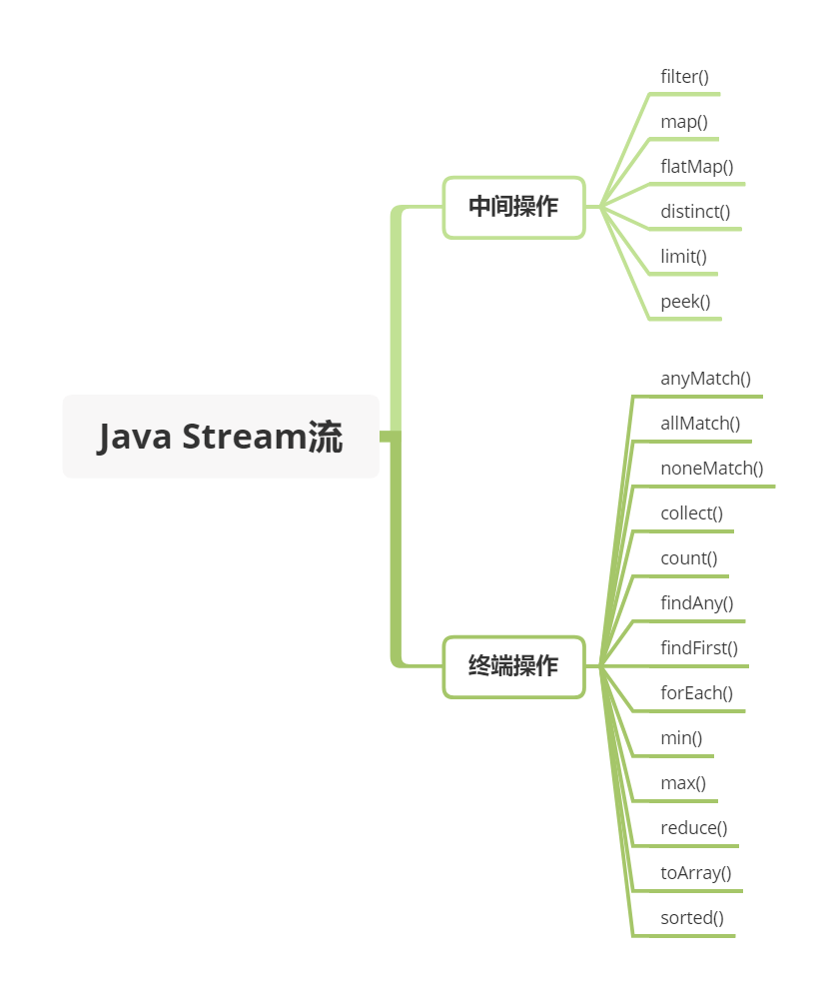
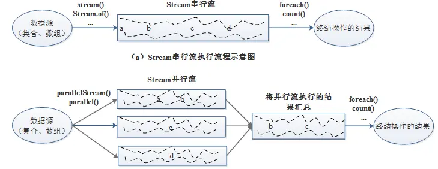

## Java 基础

### Java 8 新特性

| **特性名称** | **描述** | **示例或说明** |
| --- | --- | --- |
| **Lambda 表达式** | 简化匿名内部类，支持函数式编程 | `(a, b) -> a + b` 代替匿名类实现接口 |
| **函数式接口** | 仅含一个抽象方法的接口，可用 `@FunctionalInterface` 注解标记 | `Runnable`, `Comparator`, 或自定义接口 `@FunctionalInterface interface MyFunc { void run(); }` |
| **Stream API** | 提供链式操作处理集合数据，支持并行处理 | `list.stream().filter(x -> x > 0).collect(Collectors.toList())` |
| **Optional 类** | 封装可能为 `null` 的对象，减少空指针异常 | `Optional.ofNullable(value).orElse("default")` |
| **方法引用** | 简化 Lambda 表达式，直接引用现有方法 | `System.out::println` 等价于 `x -> System.out.println(x)` |
| **接口的默认方法与静态方法** | 接口可定义默认实现和静态方法，增强扩展性 | `interface A { default void print() { System.out.println("默认方法"); } }` |
| **并行数组排序** | 使用多线程加速数组排序 | `Arrays.parallelSort(array)` |
| **重复注解** | 允许同一位置多次使用相同注解 | `@Repeatable` 注解配合容器注解使用 |
| **类型注解** | 注解可应用于更多位置（如泛型、异常等） | `List<@NonNull String> list` |
| **CompletableFuture** | 增强异步编程能力，支持链式调用和组合操作 | `CompletableFuture.supplyAsync(() -> "result").thenAccept(System.out::println)` |

#### Lambda表达式

接口是一种完全抽象的类型，定义了一组方法规范，但不提供实现

抽象类是介于普通类和接口之间的类型，可以包含抽象方法和具体实现

Lambda 表达式它是一种简洁的语法，用于创建匿名函数，主要用于简化函数式接口（**只有一个抽象方法的接口**）的使用

- `(parameters) -> expression`：当 Lambda 体只有一个表达式时使用，表达式的结果会作为返回值
- `(parameters) -> { statements; }`：当 Lambda 体包含多条语句时，需要使用大括号将语句括起来，若有返回值则需要使用 return 语句

##### 类型推断

Lambda 表达式的类型推断是 Java 编译器自动完成的

```java
// 示例 1：编译器推断参数类型
List<String> list = Arrays.asList("a", "b", "c");

// Lambda 表达式（类型推断）
list.forEach(item -> System.out.println(item));
// 编译器知道：item 是 String 类型

// 等价于显式声明类型
list.forEach((String item) -> System.out.println(item));

// 等价于匿名内部类
list.forEach(new Consumer<String>() {
  @Override
  public void accept(String item) {
      System.out.println(item);
  }
});
```

原则：

```java
// 规则 1：从目标类型推断
Consumer<String> consumer = s -> System.out.println(s);
// 目标类型是 Consumer<String>，所以 s 是 String

// 规则 2：从方法参数推断
list.forEach(s -> System.out.println(s));
// forEach 需要 Consumer<String>，所以 s 是 String

// 规则 3：从泛型推断
List<Integer> numbers = Arrays.asList(1, 2, 3);
numbers.forEach(n -> System.out.println(n * 2));
// List<Integer>，所以 n 是 Integer

// 规则 4：从链式调用推断
list.stream()
    .filter(s -> s.length() > 3)  // s 是 String
    .map(s -> s.toUpperCase())    // s 是 String，返回 String
    .forEach(s -> System.out.println(s)); // s 是 String
```

##### 好处

传统的匿名内部类实现方式代码较为冗长，而 Lambda 表达式可以用更简洁的语法实现相同的功能。比如，使用匿名内部类实现 Runnable 接口

```java
public class LambdaExample {
  public static void main(String[] args) {
    Thread t1 = new Thread(() -> System.out.println("Running using lambda expression"));
    t1.start();
  }
}
```

还有，Lambda 表达式能够更清晰地表达代码的意图，尤其是在处理集合操作时，如过滤、映射等。比如，过滤出列表中所有偶数

```java
public class ReadabilityExample {
  public static void main(String[] args) {
    List<Integer> numbers = Arrays.asList(1, 2, 3, 4, 5, 6);
    // 使用 Lambda 表达式结合 Stream API 过滤偶数
    List<Integer> evenNumbers = numbers.stream()
                                        .filter(n -> n % 2 == 0)
                                        .collect(Collectors.toList());
    System.out.println(evenNumbers);
  }
}
```

虽然 Lambda 表达式优点蛮多的，不过也有一些缺点，比如会增加调试困难，因为 Lambda 表达式是匿名的，在调试时很难定位具体是哪个 Lambda 表达式出现了问题。尤其是当 Lambda 表达式嵌套使用或者比较复杂时，调试难度会进一步增加

#### 函数式接口

函数式接口是只包含一个抽象方法的接口，是 Java 8 引入的重要概念，主要用于支持 Lambda 表达式和方法引用

```java
@FunctionalInterface
public interface MyFunction {
  // 只能有一个抽象方法
  void execute();
  
  // 可以有默认方法
  default void defaultMethod() {
      System.out.println("Default method");
  }
  
  // 可以有静态方法
  static void staticMethod() {
      System.out.println("Static method");
  }
}
```

- @FunctionalInterface 注解（可选，但建议使用）
- 只能有一个抽象方法
- 可以有多个默认方法和静态方法
- 可以继承 Object 类的方法（如 equals、toString）

java 内置常用函数式接口：

##### `Consumer<T>` - 消费型接口

接收一个参数，无返回值

```java
@FunctionalInterface
public interface Consumer<T> {
    void accept(T t);
}

// 实际应用
List<String> list = Arrays.asList("a", "b", "c");
list.forEach(item -> System.out.println(item));
```

其中 Iterable 接口的 `forEach` 就是通过 `Consumer<T>` 实现的

```java
default void forEach(Consumer<? super T> action) {
  Objects.requireNonNull(action);
  for (T t : this) {
      action.accept(t);
  }
}
```

#### stream

Java 8引入了Stream API，它提供了一种高效且易于使用的数据处理方式，特别适合集合对象的操作，如过滤、映射、排序等

Stream API不仅可以提高代码的可读性和简洁性，还能利用多核处理器的优势进行并行处理

使用 java.util.Stream 对一个包含一个或多个元素的集合做各种操作

这些操作可能是 中间操作 亦或是 终端操作

```java
List<Integer> numbers = Arrays.asList(1, 2, 3, 4, 5, 6);

// 过滤出偶数
List<Integer> evenNumbers = numbers.stream()
    .filter(n -> n % 2 == 0)
    .collect(Collectors.toList());
// 结果: [2, 4, 6]

// 多个条件过滤
List<String> names = Arrays.asList("Alice", "Bob", "Charlie", "David");
List<String> result = names.stream()
    .filter(name -> name.length() > 3)
    .filter(name -> name.startsWith("C"))
    .collect(Collectors.toList());
// 结果: ["Charlie"]
```

终端操作会返回一个结果，而中间操作会返回一个 Stream 流



##### 并行API

并行流（ParallelStream）就是将源数据分为多个子流对象进行多线程操作，然后将处理的结果再汇总为一个流对象，底层是使用通用的 fork/join 池来实现，即将一个任务拆分成多个“小任务”并行计算，再把多个“小任务”的结果合并成总的计算结果



对CPU密集型的任务来说，并行流使用ForkJoinPool线程池，为每个CPU分配一个任务，这是非常有效率的，但是如果任务不是CPU密集的，而是I/O密集的，并且任务数相对线程数比较大，那么直接用ParallelStream并不是很好的选择

#### 集合对象

集合框架的核心接口：

- Collection：单列集合的根接口
  - List：有序、可重复
  - Set：无序、不可重复
  - Queue：队列
- Map：双列集合（键值对）

```plain
Collection (接口)
├── List (接口) - 有序、可重复
│   ├── ArrayList - 动态数组
│   ├── LinkedList - 双向链表
│   └── Vector - 线程安全的动态数组
│       └── Stack - 栈
│
├── Set (接口) - 无序、不可重复
│   ├── HashSet - 基于 HashMap
│   ├── LinkedHashSet - 保持插入顺序
│   └── TreeSet - 有序集合（红黑树）
│
└── Queue (接口) - 队列
    ├── PriorityQueue - 优先队列
    ├── Deque (接口) - 双端队列
    │   ├── ArrayDeque
    │   └── LinkedList
    └── BlockingQueue (接口) - 阻塞队列

Map (接口) - 键值对
├── HashMap - 哈希表
├── LinkedHashMap - 保持插入顺序
├── TreeMap - 有序 Map（红黑树）
├── Hashtable - 线程安全（已过时）
└── ConcurrentHashMap - 线程安全
```

#### Optional

Optional是用于防范NullPointerException

可以将 Optional 看做是包装对象（可能是 null, 也有可能非 null）的容器

当我们定义了 一个方法，这个方法返回的对象可能是空，也有可能非空的时候，我们就可以考虑用 Optional 来包装它，这也是在 Java 8 被推荐使用的做法

```java
Optional<String> optional = Optional.of("bam");

optional.isPresent();           // true
optional.get();                 // "bam"
optional.orElse("fallback");    // "bam"

optional.ifPresent((s) -> System.out.println(s.charAt(0)));     // "b"
```

> 为啥不直接用 obj == null 判断

```java
// 传统方式：容易忘记 null 检查
public String getUserEmail(Long userId) {
    User user = findUserById(userId);
    // 忘记检查 null，直接使用
    return user.getEmail(); // ❌ 可能抛出 NullPointerException
}

// 需要手动检查
public String getUserEmail(Long userId) {
    User user = findUserById(userId);
    if (user != null) {
        return user.getEmail();
    }
    return "default@email.com";
}

// 多层嵌套的噩梦
public String getUserCity(Long userId) {
    User user = findUserById(userId);
    if (user != null) {
        Address address = user.getAddress();
        if (address != null) {
            City city = address.getCity();
            if (city != null) {
                return city.getName();
            }
        }
    }
    return "Unknown";
}
```

使用 Optional 的优势:

- 明确表达"可能为空"的语义
- 强制调用者处理空值情况
- 链式调用，避免嵌套 if

### CompletableFuture

CompletableFuture 是 Java 8 引入的一个强大的异步编程工具，用于异步执行任务和处理异步结果，在Java8之前我们一般通过Future实现异步。

- Future用于表示异步计算的结果，只能通过阻塞或者轮询的方式获取结果，而且不支持设置回调方法，Java 8之前若要设置回调一般会使用guava的ListenableFuture，回调的引入又会导致臭名昭著的回调地狱（下面的例子会通过ListenableFuture的使用来具体进行展示）。
- CompletableFuture对Future进行了扩展，可以通过设置回调的方式处理计算结果，同时也支持组合操作，支持进一步的编排，同时一定程度解决了回调地狱的问题。

CompletableFuture 实现了 Future 和 CompletionStage 接口

#### 传统 Future 问题

```java
// 传统 Future 的缺点
ExecutorService executor = Executors.newFixedThreadPool(10);

Future<String> future = executor.submit(() -> {
    Thread.sleep(1000);
    return "Hello";
});

// 问题 1：只能通过 get() 阻塞获取结果
String result = future.get(); // 阻塞等待

// 问题 2：无法链式调用
// 问题 3：无法组合多个 Future
// 问题 4：异常处理不方便
```

#### CompletableFuture 优势

```java
// CompletableFuture 的优势
CompletableFuture<String> future = CompletableFuture.supplyAsync(() -> {
    return "Hello";
});

// 可以链式调用
future.thenApply(s -> s + " World")
      .thenApply(String::toUpperCase)
      .thenAccept(System.out::println); // 非阻塞

// 不需要显式的线程池管理
// 支持异常处理
// 支持多个任务组合
```

#### 使用例子

##### 创建 CompletableFuture

指定线程池：

```java
// 使用自定义线程池
ExecutorService executor = Executors.newFixedThreadPool(10);

CompletableFuture<String> future = CompletableFuture.supplyAsync(() -> {
    return "Hello";
}, executor); // 指定线程池

// 记得关闭线程池
executor.shutdown();
```

##### 任务链式调用

```java
// 转换结果
thenApply(Function)           // 同步
thenApplyAsync(Function)      // 异步

// 消费结果
thenAccept(Consumer)          // 同步
thenAcceptAsync(Consumer)     // 异步

// 执行操作
thenRun(Runnable)             // 同步
thenRunAsync(Runnable)        // 异步

// 扁平化
thenCompose(Function)         // 同步
thenComposeAsync(Function)    // 异步
```

##### 组合方法

```java
// 组合两个 Future
thenCombine(CompletableFuture, BiFunction)
thenAcceptBoth(CompletableFuture, BiConsumer)

// 等待所有完成
CompletableFuture.allOf(CompletableFuture...)

// 任意一个完成
CompletableFuture.anyOf(CompletableFuture...)
```

##### 获取结果

```java
// 阻塞获取
get()                         // 可能抛出异常
get(timeout, TimeUnit)        // 超时

// 阻塞获取（不抛检查异常）
join()

// 非阻塞获取
getNow(defaultValue)          // 立即返回，未完成返回默认值
```

#### 使用场景

- 并行调用多个接口
- 异步处理耗时任务
- 超时控制
- 缓存预热
- 重试机制
- 任务编排

##### 并行调用多个接口

```java
public class UserService {
    
    public CompletableFuture<User> getUserInfo(Long userId) {
        return CompletableFuture.supplyAsync(() -> {
            // 调用用户服务
            sleep(1000);
            return new User(userId, "Alice");
        });
    }
    
    public CompletableFuture<List<Order>> getUserOrders(Long userId) {
        return CompletableFuture.supplyAsync(() -> {
            // 调用订单服务
            sleep(1000);
            return Arrays.asList(new Order(1), new Order(2));
        });
    }
    
    public CompletableFuture<Integer> getUserPoints(Long userId) {
        return CompletableFuture.supplyAsync(() -> {
            // 调用积分服务
            sleep(1000);
            return 1000;
        });
    }
    
    // 并行获取用户所有信息
    public UserDetail getUserDetail(Long userId) throws Exception {
        CompletableFuture<User> userFuture = getUserInfo(userId);
        CompletableFuture<List<Order>> ordersFuture = getUserOrders(userId);
        CompletableFuture<Integer> pointsFuture = getUserPoints(userId);
        
        // 等待所有任务完成
        CompletableFuture.allOf(userFuture, ordersFuture, pointsFuture).get();
        
        // 组合结果
        UserDetail detail = new UserDetail();
        detail.setUser(userFuture.get());
        detail.setOrders(ordersFuture.get());
        detail.setPoints(pointsFuture.get());
        
        return detail;
        // 总耗时约 1 秒（并行执行），而不是 3 秒（串行执行）
    }
}
```

##### 异步处理订单

```java
public class OrderService {
    
  public void processOrder(Order order) {
      CompletableFuture.supplyAsync(() -> {
          // 1. 验证订单
          System.out.println("验证订单: " + order.getId());
          validateOrder(order);
          return order;
      }).thenApplyAsync(o -> {
          // 2. 扣减库存
          System.out.println("扣减库存");
          reduceStock(o);
          return o;
      }).thenApplyAsync(o -> {
          // 3. 创建支付订单
          System.out.println("创建支付订单");
          createPayment(o);
          return o;
      }).thenAcceptAsync(o -> {
          // 4. 发送通知
          System.out.println("发送通知");
          sendNotification(o);
      }).exceptionally(ex -> {
          // 异常处理
          System.err.println("订单处理失败: " + ex.getMessage());
          rollback(order);
          return null;
      });
      
      System.out.println("订单提交成功，正在异步处理");
  }
  
  private void validateOrder(Order order) { /* ... */ }
  private void reduceStock(Order order) { /* ... */ }
  private void createPayment(Order order) { /* ... */ }
  private void sendNotification(Order order) { /* ... */ }
  private void rollback(Order order) { /* ... */ }
}
```

##### 缓存预热

```java
public class CacheWarmer {
  private Map<String, String> cache = new ConcurrentHashMap<>();
  
  public void warmUpCache() {
    List<String> keys = Arrays.asList("key1", "key2", "key3", "key4", "key5");
    
    // 并行加载缓存
    List<CompletableFuture<Void>> futures = keys.stream()
        .map(key -> CompletableFuture.runAsync(() -> {
            System.out.println("加载缓存: " + key);
            String value = loadFromDatabase(key);
            cache.put(key, value);
        }))
        .collect(Collectors.toList());
    
    // 等待所有缓存加载完成
    CompletableFuture.allOf(futures.toArray(new CompletableFuture[0]))
        .thenRun(() -> System.out.println("缓存预热完成"))
        .join();
  }
  
  private String loadFromDatabase(String key) {
    sleep(1000);
    return "value_" + key;
  }
}
```
