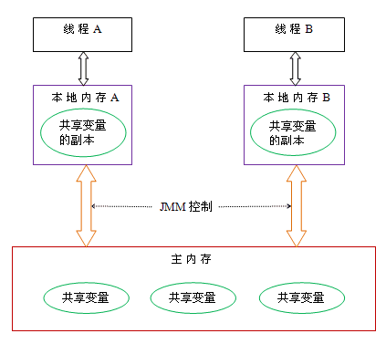

## JUC

### 我在主线程创建了一个锁对象，然后对应的子线程为什么可以得到这个锁

在主线程中通过 new 关键字（例如 new Object() 或 new ReentrantLock()）创建一个锁对象时，这个对象是被分配在 JVM 的**堆（Heap）**内存中的

在 Java 内存模型中，每个线程有自己私有的虚拟机栈（用于存储局部变量表、方法出口等），但堆内存是所有线程共享的。只要子线程能够拿到这个对象的内存地址（引用），它就可以访问这个对象。

#### 传递的是对象引用

当主线程启动子线程时，通常会将这个锁对象的引用（相当于这把锁在堆内存中的真实地址）通过某种方式传递给子线程：

- 作为参数传递： 通过构造函数传给 Runnable 或 Thread 类。
- 匿名内部类/Lambda 闭包捕获： 子线程的代码块直接引用了外部主线程的局部变量（该变量通常需要是 final 或事实上的 final）。
- 共享变量： 锁对象被定义为类的成员变量或静态变量，子线程直接访问该属性

#### 锁状态绑定在“对象”上，而不是“创建它的线程”上

锁机制（无论是 synchronized 还是 JUC 包下的 Lock）认的是“对象”，而不是“谁创建了对象”。

- 对于 synchronized： 锁的信息（如持有该锁的线程 ID、锁状态标志）记录在这个锁对象的**对象头（Object Header）**的 Mark Word 中。当子线程尝试进入 synchronized(lock) 块时，JVM 会去检查堆中这个 lock 对象的对象头状态。只要当前没有任何线程占用它，子线程就可以成功修改对象头，从而获取锁。

- 对于 ReentrantLock： 它是基于 AQS（AbstractQueuedSynchronizer）实现的。锁的状态保存在 AQS 内部的 volatile int state 变量中，而这个 AQS 实例本身就是 ReentrantLock 对象的内部组件，同样存在于堆内存中。子线程通过 CAS 操作去修改这个 state，修改成功即代表获取了锁

#### 示例

```java
public static void main(String[] args) {
    ReentrantLock lock = new ReentrantLock();  // 主线程创建
    
    new Thread(() -> {
        lock.lock();  // 子线程能用
        // ...
    }).start();
}
```

> Java 编译器在背后为你做了一层**变量捕获（Variable Capture）的魔法，也就是我们常说的闭包（Closure）**机制

##### 编译机制 (闭包)

当你在 Lambda 表达式（或匿名内部类）中使用了外部方法的局部变量时，编译器在**编译阶段会发现这件事**

为了让子线程能拿到这个变量，编译器会自动把这个局部变量作为参数，传递给 Lambda 表达式生成的那个类的实例中

如果你把上面的 Lambda 表达式还原成 JDK 1.8 之前的匿名内部类写法，底层逻辑其实等价于下面这样：

```java
// 你写的代码在 JVM 看来，逻辑上被转换成了类似这样的结构：

// 1. 编译器自动帮你生成了一个实现了 Runnable 的类
class SynthesizedRunnable implements Runnable {
    // 自动生成一个成员变量，用来保存外部传进来的锁引用
    private final ReentrantLock capturedLock; 

    // 自动生成一个构造函数，接收外部的锁
    public SynthesizedRunnable(ReentrantLock lock) {
        this.capturedLock = lock;
    }

    @Override
    public void run() {
        // 在这里使用的是内部保存的那个引用
        this.capturedLock.lock(); 
        // ...
    }
}

public static void main(String[] args) {
    ReentrantLock lock = new ReentrantLock(); // 主线程创建
    
    // 2. 启动线程时，实际上是把主线程的 lock 引用当做参数传了进去！
    new Thread(new SynthesizedRunnable(lock)).start(); 
}
```

子线程并不是直接去主线程的栈帧里“偷”变量，而是主线程在创建子线程任务时，把 lock 的引用（内存地址）偷偷“塞”给了子线程的任务对象

##### 捕获的条件：“事实上的 final” (Effectively Final)

ava 有一个严格的规定：被 Lambda 表达式捕获的局部变量，必须是 final 的，或者是“事实上的 final” (Effectively Final)

所谓“事实上的 final”，就是指这个变量在初始化之后，再也没有被重新赋值过。在你的代码中，lock 被 new ReentrantLock() 赋值后，再也没变过，所以它可以被合法捕获。

### 进程与线程

进程是操作系统分配资源的最小单位，每个进程都有自己独立的内存地址空间。一个进程崩溃通常不会直接影响到其他进程（除非耗尽了系统资源）

线程是进程中的独立执行单元，是CPU分配调度的最小单位, 是操作系统真正放在 CPU 核心上去执行的实体


#### 协程

协程被视为比线程更轻量级的并发单元，可以在单线程中实现并发执行，由我们开发者显式调度。

协程是在用户态进行调度的，避免了线程切换时的内核态开销

> 线程切换

线程 A 运行 → 系统调用/中断 → 切换到内核态 → 保存 A 的上下文 → 调度线程 B → 恢复 B 的上下文 → 返回用户态运行 B

#### JAVA里的线程

Java 底层会调用 pthread_create 来创建线程，所以本质上 java 程序创建的线程，就是和操作系统线程是一样的，是 1 对 1 的线程模型


#### JAVA中线程通信

原则上可以通过消息传递和共享内存两种方法来实现

Java 采用的是**共享内存的并发模型**

这个模型被称为 Java 内存模型，简写为 JMM，它决定了一个线程对共享变量的写入，何时对另外一个线程可见

JMM（Java Memory Model）内存模型规定如下：

- 所有的变量全部存储在主内存（注意这里包括下面提到的变量，指的都是会出现竞争的变量，包括成员变量、静态变量等，而局部变量这种属于线程私有，不包括在内）
- 每条线程有着自己的工作内存（可以类比CPU的高速缓存）线程对变量的所有操作，必须在工作内存中进行，不能直接操作主内存中的数据
- 不同线程之间的工作内存相互隔离，如果需要在线程之间传递内容，只能通过主内存完成，无法直接访问对方的工作内存

用一句话来概括就是：共享变量存储在主内存中，每个线程的私有本地内存，存储的是这个共享变量的副本



线程 A 与线程 B 之间如要通信，需要要经历 2 个步骤：

- 线程 A 把本地内存 A 中的共享变量副本刷新到主内存中。
- 线程 B 到主内存中读取线程 A 刷新过的共享变量，再同步到自己的共享变量副本中

> 实际实现

- 主内存：对应堆中存放对象的实例的部分
- 工作内存：对应**线程的虚拟机栈的部分区域**，虚拟机可能会对这部分内存进行优化，将其放在CPU的寄存器或是高速缓存中。比如在访问数组时，由于数组是一段连续的内存空间，所以可以将一部分连续空间放入到CPU高速缓存中，那么之后如果我们顺序读取这个数组，那么大概率会直接缓存命中

##### 8G内存系统最多能创建多少线程

理论上大约 8000 个

> 每个线程都需要独立的栈空间来执行方法

创建线程的时候，至少**需要分配一个虚拟机栈**，在 64 位操作系统中，默认大小为 1M，因此一个线程大约需要 1M 的内存

但 JVM、操作系统本身的运行就要占一定的内存空间，所以实际上可以创建的线程数远比 8000 少

### 线程安全

如果一段代码块或者一个方法被多个线程同时执行，还能够正确地处理共享数据，那么这段代码块或者这个方法就是线程安全的

三个特性：

#### 原子性

一个操作要么完全执行，要么完全不执行，不会出现中间状态

可以通过同步关键字 synchronized 或原子操作，如 AtomicInteger 来保证原子性

#### 可见性

当一个线程修改了共享变量，其他线程能够立即看到变化

可以通过 volatile 关键字来保证可见性

#### 有序性

要确保线程不会因为死锁、饥饿、活锁等问题导致无法继续执行

### 线程创建的方法

有三种，分别是继承 Thread 类、实现 Runnable 接口、实现 Callable 接口

#### 继承 Thread 类

第一种需要重写父类 Thread 的 run() 方法，并且调用 start() 方法启动线程

```java
class ThreadTask extends Thread {
    public void run() {
        System.out.println("1111");
    }

    public static void main(String[] args) {
        ThreadTask task = new ThreadTask();
        task.start();
    }
}
```

这种方法的缺点是，如果 ThreadTask 已经继承了另外一个类，就不能再继承 Thread 类了，因为 Java 不支持多重继承

#### 实现 Runnable 接口的 run() 方法

第二种需要重写 Runnable 接口的 run() 方法，并将实现类的对象作为参数传递给 Thread 对象的构造方法，最后调用 start() 方法启动线程

```java
class RunnableTask implements Runnable {
    public void run() {
        System.out.println("1111!");
    }

    public static void main(String[] args) {
        RunnableTask task = new RunnableTask();
        Thread thread = new Thread(task);
        thread.start();
    }
}
```

这种方法的优点是可以避免 Java 的单继承限制，并且更符合面向对象的编程思想，因为 Runnable 接口将任务代码和线程控制的代码解耦了

#### 实现 Callable 接口的 call() 方法 (异步获取)

第三种需要重写 Callable 接口的 call() 方法

然后创建 FutureTask 对象，参数为 Callable 实现类的对象

紧接着创建 Thread 对象，参数为 FutureTask 对象，最后调用 start() 方法启动线程

```java
class CallableTask implements Callable<String> {
    public String call() {
        return "111";
    }

    public static void main(String[] args) throws ExecutionException, InterruptedException {
        CallableTask task = new CallableTask();
        FutureTask<String> futureTask = new FutureTask<>(task);
        Thread thread = new Thread(futureTask);
        thread.start();
        System.out.println(futureTask.get());
    }
}
```

这种方法的优点是可以获取线程的执行结果

### Java 启动时的线程

首先是 **main **线程，这是程序执行的入口。

然后是**垃圾回收**线程，它是一个后台线程，负责回收不再使用的对象。

还有**编译器**线程，比如 JIT，负责把一部分热点代码编译后放到 codeCache 中

```java
class ThreadLister {
    public static void main(String[] args) {
        // 获取所有线程的堆栈跟踪
        Map<Thread, StackTraceElement[]> threads = Thread.getAllStackTraces();
        for (Thread thread : threads.keySet()) {
            System.out.println("Thread: " + thread.getName() + " (ID=" + thread.getId() + ")");
        }
    }
}
```

- Thread: main (ID=1) - 主线程，Java 程序启动时由 JVM 创建。
- Thread: Reference Handler (ID=2) - 这个线程是用来处理引用对象的，如软引用、弱引用和虚引用。负责清理被 JVM 回收的对象。
- Thread: Finalizer (ID=3) - 终结器线程，负责调用对象的 finalize 方法。对象在垃圾回收器标记为可回收之前，由该线程由该线程执行其 finalize 方法，用于执行特定的资源释放操作。
- Thread: Signal Dispatcher (ID=4) - 信号调度线程，处理来自操作系统的信号，将它们转发给 JVM 进行进一步处理，例如响应中断、停止等信号。
- Thread: Monitor Ctrl-Break (ID=5) - 监视器线程，通常由一些特定的 IDE 创建，用于在开发过程中监控和管理程序执行或者处理中断
