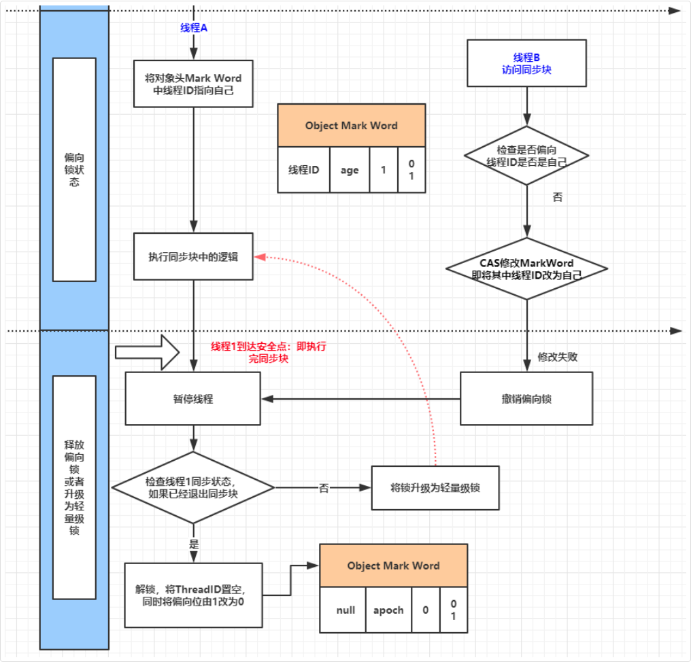
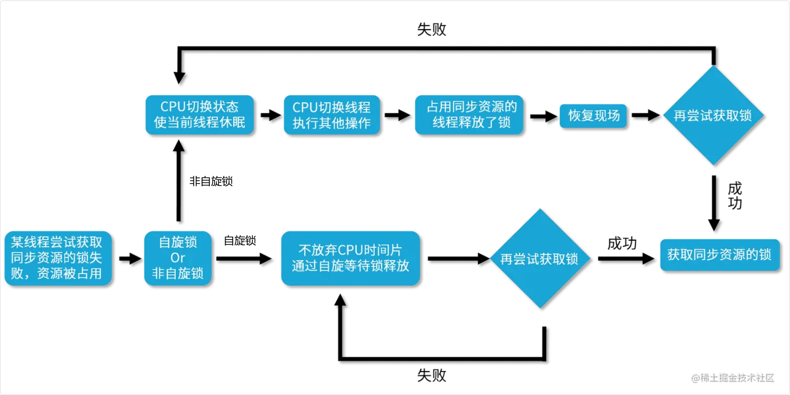
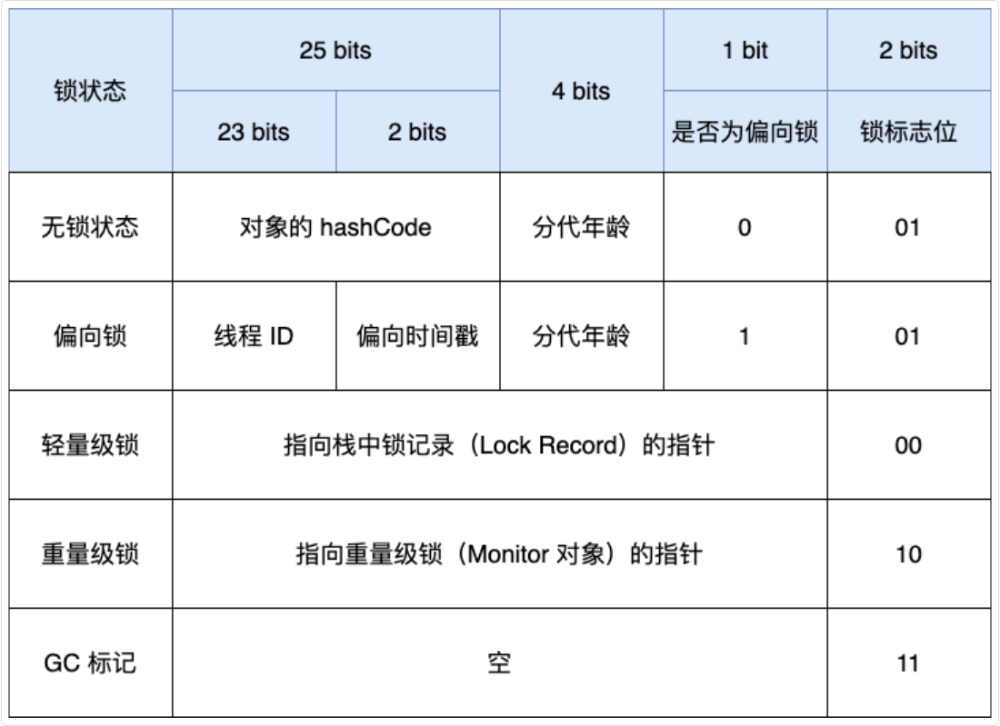

## 锁

### 怎么保障线程安全

synchronized | volatile | Lock 接口 | 原子类 | ThreadLocal | 并发集合 | JUC 工具类

- synchronized关键字: 可以使用synchronized关键字来同步代码块或方法，确保同一时刻只有一个线程可以访问这些代码。对象锁是通过synchronized关键字锁定对象的监视器（monitor）来实现的
- volatile关键字: volatile关键字用于变量，确保所有线程看到的是该变量的最新值，而不是可能存储在本地寄存器中的副本
- Lock接口和ReentrantLock类:java.util.concurrent.locks.Lock接口提供了比synchronized更强大的锁定机制，ReentrantLock是一个实现该接口的例子，提供了更灵活的锁管理和更高的性能
- 原子类：Java并发库（java.util.concurrent.atomic）提供了原子类，如AtomicInteger、AtomicLong等，这些类提供了原子操作，可以用于更新基本类型的变量而无需额外的同步
- 线程局部变量: ThreadLocal类可以为每个线程提供独立的变量副本，这样每个线程都拥有自己的变量，消除了竞争条件
- 并发集合:使用java.util.concurrent包中的线程安全集合，如ConcurrentHashMap、ConcurrentLinkedQueue等，这些集合内部已经实现了线程安全的逻辑
- JUC工具类: 使用java.util.concurrent包中的一些工具类可以用于控制线程间的同步和协作。例如：Semaphore和CyclicBarrier等

### 常用锁

Java中的锁是用于管理多线程并发访问共享资源的关键机制

锁可以确保在任意给定时间内只有一个线程可以访问特定的资源，从而避免数据竞争和不一致性

Java提供了多种锁机制，可以分为以下几类：

#### 内置锁 (synchronized)

Java中的synchronized关键字是内置锁机制的基础，可以用于方法或代码块

当一个线程进入synchronized代码块或方法时，它会获取关联对象的锁；

当线程离开该代码块或方法时，锁会被释放

如果其他线程尝试获取同一个对象的锁，它们将被阻塞，直到锁被释放

其中，syncronized加锁时有**无锁、偏向锁、轻量级锁和重量级锁**几个级别

- 偏向锁用于当一个线程进入同步块时，如果没有任何其他线程竞争，就会使用偏向锁，以减少锁的开销
- 轻量级锁使用线程栈上的数据结构，避免了操作系统级别的锁
- 重量级锁则涉及操作系统级的互斥锁

#### ReentrantLock

java.util.concurrent.locks.ReentrantLock是一个显式的锁类，提供了比synchronized更高级的功能，如可中断的锁等待、定时锁等待、公平锁选项等

ReentrantLock使用lock()和unlock()方法来获取和释放锁

其中，公平锁按照线程请求锁的顺序来分配锁，保证了锁分配的公平性，但可能增加锁的等待时间

非公平锁不保证锁分配的顺序，可以减少锁的竞争，提高性能，但可能造成某些线程的饥饿

#### 读写锁（ReadWriteLock）

java.util.concurrent.locks.ReadWriteLock接口定义了一种锁，允许多个读取者同时访问共享资源，但只允许一个写入者

读写锁通常用于**读取远多于写入的情况**，以提高并发性。

#### 乐观锁和悲观锁

悲观锁（Pessimistic Locking）通常指在访问数据前就锁定资源，假设最坏的情况，即数据很可能被其他线程修改

synchronized和ReentrantLock都是悲观锁的例子

乐观锁（Optimistic Locking）通常**不锁定资源**，而是**在更新数据时检查数据是否已被其他线程修改**

乐观锁常使用版本号或时间戳来实现

#### 自旋锁

自旋锁是一种锁机制，线程在等待锁时会持续循环检查锁是否可用，而不是放弃CPU并阻塞。通常可以使用CAS来实现

这在锁等待时间很短的情况下可以提高性能，但过度自旋会浪费CPU资源

## synchronized

Java 多线程的锁都是基于对象的，Java 中的每一个对象都可以作为一个锁

所以锁的信息是保存在每个对象里的，也是根据对应对象的信息判断当前锁的状态

### synchronized 锁升级

> 在 JDK 1.6 以前，所有的锁都是”重量级“锁，因为使用的是操作系统的互斥锁，当一个线程持有锁时，其他试图进入synchronized块的线程将被阻塞，直到锁被释放。涉及到了线程上下文切换和用户态与内核态的切换，因此效率较低。

JDK 1.6 的时候，为了提升 synchronized 的性能，引入了锁升级机制，从低开销的锁可以最大程度减少锁的竞争

在 JDK 1.6 及其以后，一个对象其实有四种锁状态，它们级别由低到高依次是：

- 无锁状态
- 偏向锁状态
- 轻量级锁状态
- 重量级锁状态

无锁就是没有对资源进行锁定，任何线程都可以尝试去修改它，很好理解。

几种锁会随着竞争情况逐渐升级，锁的升级很容易发生，但是锁降级发生的条件就比较苛刻了，锁降级发生在 Stop The World

没有线程竞争时，就使用低开销的“偏向锁”，此时没有额外的 CAS 操作；轻度竞争时，使用“轻量级锁”，采用 CAS 自旋，避免线程阻塞；只有在重度竞争时，才使用“重量级锁”，由 Monitor 机制实现，需要线程阻塞

#### 锁升级过程

- 偏向锁：当一个线程第一次获取锁时，JVM 会在对象头的 Mark Word 记录这个线程 ID，下次进入 synchronized 时，如果还是同一个线程，可以直接执行，无需额外加锁。
- 轻量级锁：当多个线程尝试获取锁但不是同一个时段，偏向锁会升级为轻量级锁，等待锁的线程通过 CAS 自旋避免进入阻塞状态。
- 重量级锁：如果自旋失败(超过一定次数)，锁会升级为重量级锁，等待锁的线程会进入阻塞状态，等待

### 对象锁存放位置 (对象头)

每个 Java 对象都有一个对象头

对象是存放在堆内存中的，而每个对象内部，都有一部分空间用于存储对象头信息，而对象头信息中，则包含了Mark Word用于存放hashCode和对象的锁信息，在不同状态下，它存储的数据结构有一些不同

如果是非数组类型，则用 2 个字宽来存储对象头，如果是数组，则会用 3 个字宽来存储对象头

在 32 位处理器中，一个字宽是 32 位；在 64 位虚拟机中，一个字宽是 64 位

对象头的内容如下表所示

| 长度 | 内容 | 说明 |
| --- | --- | --- |
| 32/64bit | Mark Word | 存储对象的 hashCode 或锁信息等 |
| 32/64bit | Class Metadata Address | 存储到对象类型数据的指针 |
| 32/64bit | Array length | 数组的长度（如果是数组） |

主要来看看 Mark Word 的格式：

| 锁状态 | 29 bit 或 61 bit | 1 bit 是否是偏向锁？ | 2 bit 锁标志位 |
| --- | --- | --- | --- |
| 无锁 |  | 0 | 01 |
| 偏向锁 | 线程 ID | 1 | 01 |
| 轻量级锁 | 指向栈中锁记录的指针 | 此时这一位不用于标识偏向锁 | 00 |
| 重量级锁 | 指向互斥量（重量级锁）的指针 | 此时这一位不用于标识偏向锁 | 10 |
| GC 标记 |  | 此时这一位不用于标识偏向锁 | 11 |

主要记录以下几类信息：

- 锁状态：你刚才问的 synchronized，锁到底存在哪？就存在这里
- GC 信息：对象活了多久（年龄）
- 身份信息：对象的 HashCode

### synchronized 四种锁状态

无锁状态，对象未被锁定，Mark Word 存储对象的哈希码等信息

#### 偏向锁 (跳过锁)

当线程第一次获取锁时，会进入偏向模式

Mark Word 会记录线程 ID，后续同一线程再次获取锁时，可以直接进入 synchronized 加锁的代码，无需额外加锁

一旦有第二个线程尝试获取锁，偏向锁就会撤销，升级为轻量级锁



#### 轻量级锁 (自旋等待，Lock record)

当多个线程在不同时段获取同一把锁，即不存在锁竞争的情况时，JVM 会采用轻量级锁来避免线程阻塞，未持有锁的线程通过CAS 自旋等待锁释放



> 场景: 线程 A 持有偏向锁 → 线程 B 尝试获取锁

此时 JVM 需要：

- 撤销线程 A 的偏向锁
- 让线程 B 尝试获取轻量级锁

首先，检查锁状态

```plain
线程 B 进入 synchronized 块
       ↓
检查 Mark Word，发现是偏向锁（锁标志位=01，偏向位=1）
       ↓
但 Mark Word 中的线程 ID 是线程 A，不是自己
       ↓
触发偏向锁撤销
```

然后，CAS 竞争

竞争线程在自己的栈帧创建 Lock Record，线程通过 CAS 尝试将 Mark Word 替换为指向 Lock Record 的指针

成功就执行同步代码块，失败继续**自旋等待**

CAS 成功后，Mark Word 锁标志位变为"00"，表示轻量级锁，CAS 失败的线程自旋等待

#### 重量级锁

如果自旋超过一定的次数，或者一个线程持有锁，一个自旋，又有第三个线程进入 synchronized 加锁的代码时，轻量级锁就会升级为重量级锁

此时，对象头的锁类型会更新为“10”，Mark Word 会存储指向 Monitor 对象的指针，其他等待锁的线程都会进入阻塞状态

> Monitor（监视器）是 JVM 中用于实现线程同步的一种机制，可以理解为一个"锁容器"
>
> 每个 Java 对象都可以关联一个 Monitor，当 Monitor 被某个线程持有时，其他线程就必须等待

| 特性 | 轻量级锁 | 重量级锁（Monitor） |
| --- | --- | --- |
| 实现 | CAS + 自旋 | 操作系统互斥量 |
| 线程阻塞 | 不阻塞（自旋） | 阻塞 |
| 开销 | 低 | 高（用户态↔内核态切换） |
| 适用场景 | 轻度竞争 | 重度竞争 |

### synchronized 上锁的对象是什么

synchronized 用在普通方法上时，上锁的是执行这个方法的对象

synchronized 用在静态方法上时，上锁的是这个类的 Class 对象

synchronized 用在代码块上时，上锁的是括号中指定的对象

### synchronized 的实现原理

synchronized 依赖 JVM 内部的 Monitor 对象来实现线程同步

使用的时候不用手动去 lock 和 unlock，JVM 会自动加锁和解锁

synchronized 加锁代码块时，JVM 会通过 monitorenter、monitorexit 两个指令来实现同步：

- 前者表示线程正在尝试获取 lock 对象的 Monitor；
- 后者表示线程执行完了同步代码块，正在释放锁。

### Monitor

Monitor 是 JVM 内置的同步机制，每个对象在内存中都有一个对象头——Mark Word，用于存储锁的状态，以及 Monitor 对象的指针



synchronized 依赖对象头的 Mark Word 进行状态管理，支持无锁、偏向锁、轻量级锁，以及重量级锁

> synchronized 升级为重量级锁时，依赖于操作系统的互斥量——mutex 来实现，mutex 用于保证任何给定时间内，只有一个线程可以执行某一段特定的代码段

### synchronized 可见性保证

通过两步操作：

- 加锁时，线程必须从主内存读取最新数据。
- 释放锁时，线程必须将修改的数据刷回主内存，这样其他线程获取锁后，就能看到最新的数据

### 有序性保证

synchronized 通过 JVM 指令 monitorenter 和 monitorexit，来确保加锁代码块内的指令不会被重排
