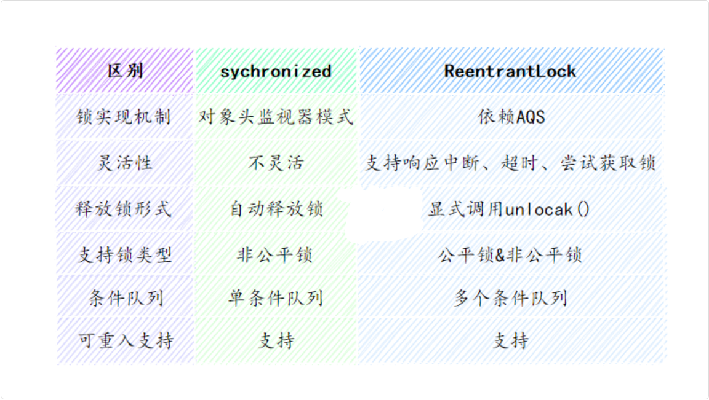
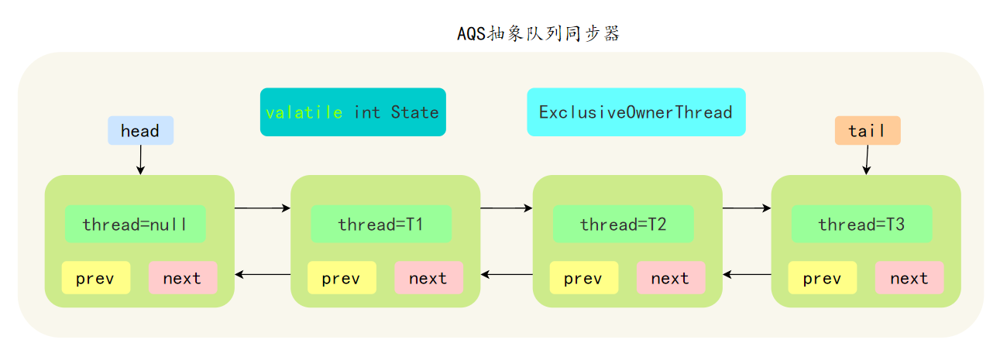
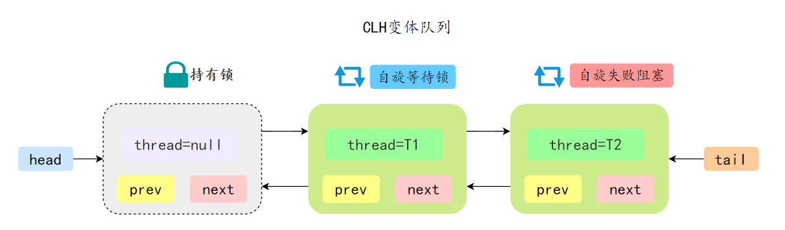
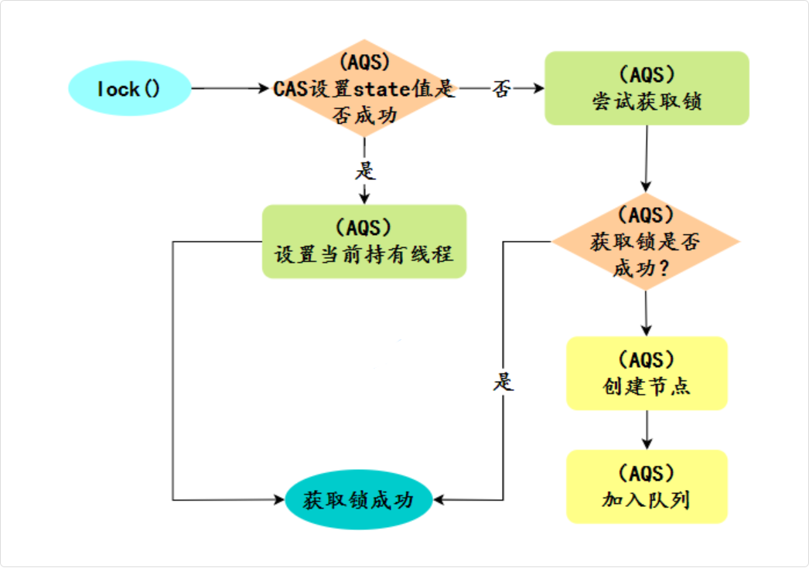

## ReentrantLock

### synchronized 和 ReentrantLock 的区别

synchronized 由 JVM 内部的 Monitor 机制实现，ReentrantLock基于 AQS 实现

synchronized 可以自动加锁和解锁，ReentrantLock 需要手动 lock() 和 unlock()



更详细点：

- ReentrantLock 可以实现多路选择通知，绑定多个 Condition，而 synchronized 只能通过 wait 和 notify 唤醒，属于单路通知
- synchronized 可以在方法和代码块上加锁，ReentrantLock 只能在代码块上加锁，但可以指定是公平锁还是非公平锁
- ReentrantLock 提供了一种能够中断等待锁的线程机制，通过 lock.lockInterruptibly() 来实现

### 并发量大的情况下，使用 synchronized 还是 ReentrantLock

更倾向于 ReentrantLock，因为：

- ReentrantLock 提供了超时和公平锁等特性，可以应对更复杂的并发场景。
- ReentrantLock 允许更细粒度的锁控制，能有效减少锁竞争。
- ReentrantLock 支持条件变量 Condition，可以实现比 synchronized 更友好的线程间通信机制。

### 源码分析

#### AQS 抽象类

AQS 是一个抽象类，它维护了一个共享变量 state 和一个线程等待队列，为 ReentrantLock 等类提供底层支持



AQS 的思想是，如果被请求的共享资源处于空闲状态，则当前线程成功获取锁；否则，将当前线程加入到等待队列中，当其他线程释放锁时，从等待队列中挑选一个线程，把锁分配给它

AQS 支持两种同步方式：

- 独占模式下：每次只能有一个线程持有锁，例如 ReentrantLock。
- 共享模式下：多个线程可以同时获取锁，例如 Semaphore 和 CountDownLatch

核心方法包括：

- acquire：获取锁，失败进入等待队列；
- release：释放锁，唤醒等待队列中的线程；
- acquireShared：共享模式获取锁；
- releaseShared：共享模式释放锁。

AQS 使用一个 CLH 队列来维护等待线程，CLH 是三个作者 Craig、Landin 和 Hagersten 的首字母缩写，是一种基于链表的自旋锁

在 CLH 中，当一个线程尝试获取锁失败后，会被添加到队列的尾部并自旋，等待前一个节点的线程释放锁



CLH 的优点是，假设有 100 个线程在等待锁，锁释放之后，只会通知队列中的第一个线程去竞争锁。避免同时唤醒大量线程，浪费 CPU 资源

##### 分析

同步队列由内部定义的 Node 类实现，每个 Node 包含了等待状态、前后节点、线程的引用等，是一个先进先出的双向链表

```java
static final class Node {
  static final int CANCELLED =  1;
  static final int SIGNAL    = -1;
  static final int CONDITION = -2;
  static final int PROPAGATE = -3;

  /** Marker to indicate a node is waiting in shared mode */
  static final Node SHARED = new Node();
  /** Marker to indicate a node is waiting in exclusive mode */
  static final Node EXCLUSIVE = null;

  // 记录下一个节点的状态
  volatile int waitStatus;

  volatile Node prev;

  volatile Node next;

  volatile Thread thread;

  Node nextWaiter;
}
```

##### 具有的属性

主要就是维护了这么一个 Node 的双向链表进行管理，所以必然有 `head` 和 `tail` 指针，还有一个状态记录 `status` (来跟踪锁的状态和持有次数)

```java
public abstract class AbstractQueuedSynchronizer
    extends AbstractOwnableSynchronizer
    implements java.io.Serializable {
    ...
    // Head of the wait queue, lazily initialized. 
    // Except for initialization, it is modified only via method setHead. 
    // Note: If head exists, its waitStatus is guaranteed not to be CANCELLED.
    private transient volatile Node head;

    /**
     * Tail of the wait queue, lazily initialized.  Modified only via
     * method enq to add new wait node.
     */
    private transient volatile Node tail;
    
    /**
    * The synchronization state.
    */
    private volatile int state;
    ...
}
```

##### CAS的初始化操作 Unsafe 类

不用担心双向链表不会进行初始化，初始化是在实际使用时才开始的，先不管，我们接着来看其他的初始化内容

在 AQS 中，需要保证对 state、head、tail 等关键变量的修改是原子性的，因为多线程环境下会有并发竞争

通过 Unsafe 类来直接操控对应的内存地址值，从而实现 CAS（Compare-And-Swap）原子操作

目的：

- 直接操作内存：通过计算字段在内存中的偏移地址（offset），可以直接读写内存，绕过 Java 的常规访问方式，性能更高
- 实现 CAS 原子操作：unsafe.compareAndSwapObject() 和 unsafe.compareAndSwapInt() 方法提供了底层的 CAS 支持，这是实现无锁并发和 AQS 的核心
- 避免 synchronized 开销：CAS 是一种乐观锁机制，比 synchronized 的悲观锁更轻量，适合高并发场景

```java
// 直接使用Unsafe类进行操作
private static final Unsafe unsafe = Unsafe.getUnsafe();
// 记录类中属性的在内存中的偏移地址，方便Unsafe类直接操作内存进行赋值等（直接修改对应地址的内存）

// 这里对应的就是AQS类中的state成员字段
private static final long stateOffset;
// 这里对应的就是AQS类中的head头结点成员字段
private static final long headOffset;
private static final long tailOffset;
private static final long waitStatusOffset;
private static final long nextOffset;

static {   
  // 静态代码块，在类加载的时候就会自动获取偏移地址
  try {
    // 先通过反射 AbstractQueuedSynchronizer.class.getDeclaredField("state") 得到对应的 Filed对象
    // 然后再基于此找到对应的属性偏移量
    stateOffset = unsafe.objectFieldOffset
        (AbstractQueuedSynchronizer.class.getDeclaredField("state"));
    headOffset = unsafe.objectFieldOffset
        (AbstractQueuedSynchronizer.class.getDeclaredField("head"));
    tailOffset = unsafe.objectFieldOffset
        (AbstractQueuedSynchronizer.class.getDeclaredField("tail"));
    waitStatusOffset = unsafe.objectFieldOffset
        (Node.class.getDeclaredField("waitStatus"));
    nextOffset = unsafe.objectFieldOffset
        (Node.class.getDeclaredField("next"));
  } catch (Exception ex) { throw new Error(ex); }
}

//通过CAS操作来修改头结点
private final boolean compareAndSetHead(Node update) {
  //调用的是Unsafe类的compareAndSwapObject方法，通过CAS算法比较对象并替换
  return unsafe.compareAndSwapObject(this, headOffset, null, update);
}

/**
 * CAS tail field. Used only by enq.
 */
private final boolean compareAndSetTail(Node expect, Node update) {
  return unsafe.compareAndSwapObject(this, tailOffset, expect, update);
}

/**
 * CAS waitStatus field of a node.
 */
private static final boolean compareAndSetWaitStatus(Node node,
  int expect,
  int update) {
  return unsafe.compareAndSwapInt(node, waitStatusOffset,
                                  expect, update);
}

/**
 * CAS next field of a node.
 */
private static final boolean compareAndSetNext(Node node,
  Node expect,
  Node update) {
  return unsafe.compareAndSwapObject(node, nextOffset, expect, update);
}
```

#### ReentrantLock 实现原理

ReentrantLock 是基于 AQS 实现的 可重入排他锁，使用 CAS 尝试获取锁，失败的话，会进入 CLH 阻塞队列，支持公平锁、非公平锁，可以中断、超时等待



内部通过一个计数器 state 来跟踪锁的状态和持有次数

当线程调用 lock() 方法获取锁时，ReentrantLock 会检查 state 的值，如果为 0，通过 CAS 修改为 1，表示成功加锁

否则根据当前线程的公平性策略，加入到等待队列中

线程首次获取锁时，state 值设为 1；如果同一个线程再次获取锁时，state 加 1；每释放一次锁，state 减 1

当线程调用 `unlock()` 方法时，ReentrantLock 会将持有锁的 state 减 1，如果 state = 0，则释放锁，并唤醒等待队列中的线程来竞争锁

##### ReentrantLock 公平锁与非公平锁

公平锁与非公平锁区分：新来线程的处理 + 释放锁的逻辑

- 公平锁
  - 新来的线程不会插队，如果发现队列中有其他线程在等待，会直接加入队列尾部
  - 释放锁后，**会唤醒**队列头部的线程（即等待时间最长的），让它优先获取锁
- 非公平锁
  - 新来的线程可以插队：即使队列中有其他线程在等待，新线程也会先尝试 CAS 抢锁，成功了就直接拿到，不需要排队
  - 释放锁后，**不会特意唤醒**队列中的线程，而是让所有线程（包括新来的和队列中的）一起竞争

`new ReentrantLock()` 默认创建的是非公平锁 `NonfairSync`

在非公平锁模式下，锁可能会授予刚刚请求它的线程，而不考虑等待时间。当切换到公平锁模式下，锁会授予等待时间最长的线程

对应的构造函数：

```java
public ReentrantLock() {
  sync = new NonfairSync();
}

/**
 * Creates an instance of {@code ReentrantLock} with the
 * given fairness policy.
 *
 * @param fair {@code true} if this lock should use a fair ordering policy
 */
public ReentrantLock(boolean fair) {
  sync = fair ? new FairSync() : new NonfairSync();
}
```

所以，ReentrantLock 会根据初始化的情况，决定是公平锁还是非公平锁，对应内部实现类 `NonfairSync` - `FairSync`
