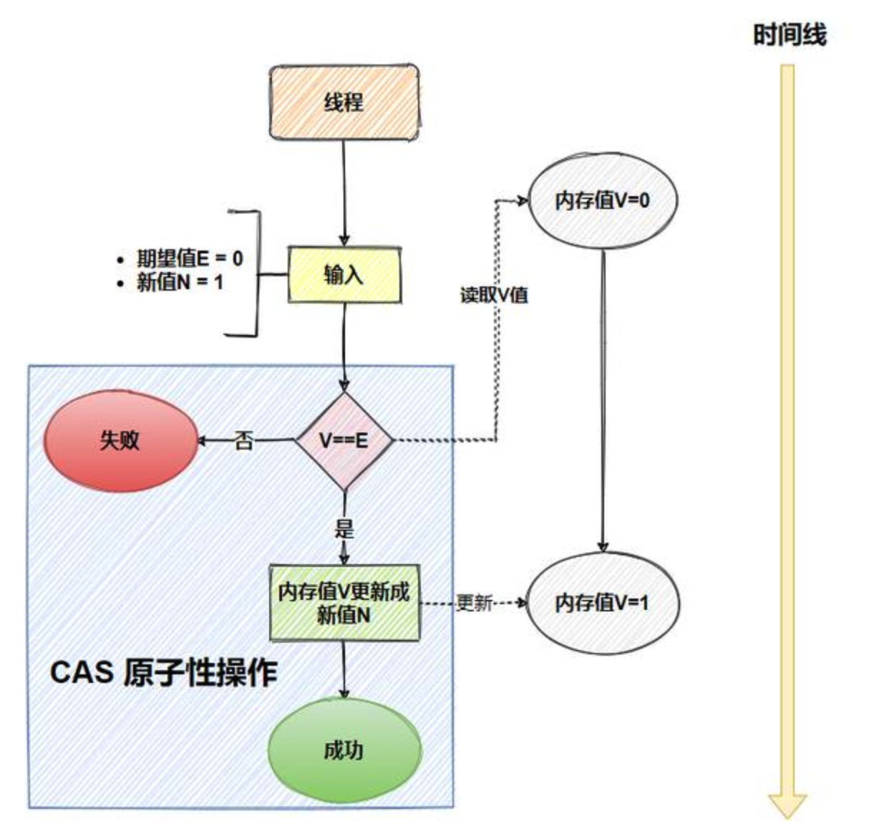

## CAS

CAS (compare-and-set) 是一种乐观锁，用于比较一个变量的当前值是否等于预期值，如果相等，则更新值，否则重试

比较和替换操作必须是原子性的



在 CAS 中，有三个值：

- V：要更新的变量(var)
- E：预期值(expected)
- N：新值(new)

先判断 V 是否等于 E，如果等于，将 V 的值设置为 N；如果不等，说明已经有其它线程更新了 V，当前线程就放弃更新

这个比较和替换的操作需要是原子的，不可中断的

### Unsafe

Java 中的 CAS 是由 Unsafe 类实现的

在 Java 中，有一个Unsafe类，它在sun.misc包中。它里面都是一些native方法，其中就有几个是关于 CAS 的

```java
boolean compareAndSwapObject(Object o, long offset,Object expected, Object x);
boolean compareAndSwapInt(Object o, long offset,int expected,int x);
boolean compareAndSwapLong(Object o, long offset,long expected,long x);
```

Unsafe 对 CAS 的实现是通过 C++ 实现的，它的具体实现和操作系统、CPU 都有关系

### CAS 的缺陷

CAS 存在三个经典问题，ABA 问题、自旋开销大、只能操作一个变量等

#### ABA 问题

ABA 问题指的是，一个值原来是 A，后来被改为 B，再后来又被改回 A，这时 CAS 会误认为这个值没有发生变化

```plain
线程 1：CAS(A → B)，修改变量 A → B
线程 2：CAS(B → A)，变量又变回 A
线程 3：CAS(A → C)，CAS 成功，但实际数据已被修改过！
```

可以使用版本号/时间戳的方式来解决 ABA 问题

比如说，每次变量更新时，不仅更新变量的值，还更新一个版本号。CAS 操作时，不仅比较变量的值，还比较版本号

```java
class OptimisticLockExample {
    private int version;
    private int value;

    public synchronized boolean updateValue(int newValue, int currentVersion) {
        if (this.version == currentVersion) {
            this.value = newValue;
            this.version++;
            return true;
        }
        return false;
    }
}
```

Java 的 AtomicStampedReference 就增加了版本号，它会同时检查引用值和 stamp 是否都相等

#### 自旋开销大怎么解决

CAS 失败时会不断自旋重试，如果一直不成功，会给 CPU 带来非常大的执行开销

可以加一个自旋次数的限制，超过一定次数，就切换到 synchronized 挂起线程

#### 涉及多个变量更新

可以将多个变量封装为一个对象，使用 AtomicReference 进行 CAS 更新

```java
class Account {
    static class Balance {
        final int money;
        final int points;

        Balance(int money, int points) {
            this.money = money;
            this.points = points;
        }
    }

    private AtomicReference<Balance> balance = new AtomicReference<>(new Balance(100, 10));

    public void update(int newMoney, int newPoints) {
        Balance oldBalance, newBalance;
        do {
            oldBalance = balance.get();
            newBalance = new Balance(newMoney, newPoints);
        } while (!balance.compareAndSet(oldBalance, newBalance));
    }
}
```

## 原子类

JUC为我们提供了原子类，底层依赖于 Unsafe 类, 采用CAS算法，它是一种用法简单、性能高效、线程安全地更新变量的方式

所有的原子类都位于 `java.util.concurrent.atomic` 包下

### 常用类型

#### 基本数据类

- `AtomicInteger`
- `AtomicLong`
- `AtomicBoolean`

自增操作、获取、设置值都是原子性的

#### 数组类型

- `AtomicIntegerArray`
- `AtomicLongArray`
- `AtomicReferenceArray`

这种以 Array 结尾的，还可以原子更新数组里的元素

```java
class AtomicArrayExample {
    public static void main(String[] args) {
        AtomicIntegerArray atomicArray = new AtomicIntegerArray(new int[]{1, 2, 3});

        atomicArray.incrementAndGet(1); // 对索引 1 进行自增
        System.out.println(atomicArray.get(1)); // 输出 3
    }
}
```

#### 引用类型

- `AtomicReference<>`

像 AtomicStampedReference 还可以通过版本号的方式解决 CAS 中的 ABA 问题

```java
class AtomicStampedReferenceExample {
    public static void main(String[] args) {
        AtomicStampedReference<Integer> ref = new AtomicStampedReference<>(100, 1);

        int stamp = ref.getStamp(); // 获取版本号
        ref.compareAndSet(100, 200, stamp, stamp + 1); // A → B
        ref.compareAndSet(200, 100, ref.getStamp(), ref.getStamp() + 1); // B → A
    }
}
```

### `AtomicInteger` 底层实现

AtomicInteger 是基于 volatile 和 CAS 实现的，底层依赖于 Unsafe 类

核心方法包括 getAndIncrement、compareAndSet 等。

#### 构造方法 volatile 保证可见性

本质上就是封装了一个volatile类型的int值，这样能够保证可见性 (对数据进行操作更新，其他有该数据的线程会立刻知道)，在CAS操作的时候不会出现问题

```java
public class AtomicInteger extends Number implements java.io.Serializable {
    private static final long serialVersionUID = 6214790243416807050L;

    // setup to use Unsafe.compareAndSwapInt for updates
    private static final Unsafe unsafe = Unsafe.getUnsafe();
    private static final long valueOffset;

    static {
        try {
            valueOffset = unsafe.objectFieldOffset
                (AtomicInteger.class.getDeclaredField("value"));
        } catch (Exception ex) { throw new Error(ex); }
    }

    private volatile int value;

    /**
     * Creates a new AtomicInteger with the given initial value.
     *
     * @param initialValue the initial value
     */
    public AtomicInteger(int initialValue) {
        value = initialValue;
    }

    /**
     * Creates a new AtomicInteger with initial value {@code 0}.
     */
    public AtomicInteger() {
    }
    ...
}
```

#### 静态代码块 Unsafe 记录 value 偏移地址

同样的静态代码块操作 `Unsafe` 类进行 CAS 原子性操作

```java
// setup to use Unsafe.compareAndSwapInt for updates
private static final Unsafe unsafe = Unsafe.getUnsafe();
private static final long valueOffset;

static {
try {
    valueOffset = unsafe.objectFieldOffset
        (AtomicInteger.class.getDeclaredField("value"));
} catch (Exception ex) { throw new Error(ex); }
}
```
