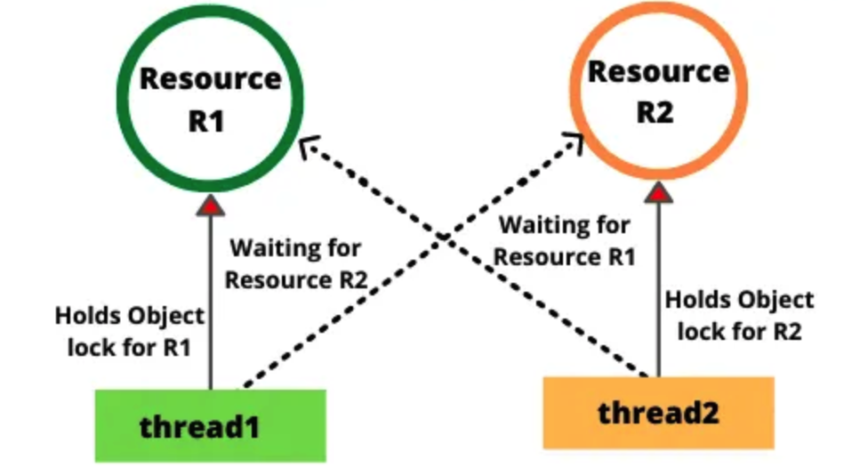

## 线程死锁

死锁发生在多个线程相互等待对方释放锁时

比如说线程 1 持有锁 R1，等待锁 R2；线程 2 持有锁 R2，等待锁 R1



### 排查死锁

首先从**系统级别上**排查，比如说在 Linux 生产环境中，可以先使用 `top ps` 等命令查看进程状态，看看是否有进程占用了过多的资源

接着，使用 JDK 自带的一些性能监控工具进行排查，比如说 使用 `jps -l` 查看当前进程，然后使用 `jstack` 进程号 查看当前进程的线程堆栈信息，看看是否有线程在等待锁资源

> 先用系统级别指令，看看哪个进程占用了过多的资源 `top ps`
>
> 然后，可以用 JDK 自带的命令
>
> `jps -l`: 查看当前进程； 然后用 `jstack 进程号` 查看对应进程的线程堆栈信息 

此外，编码时，尽量使用 tryLock() 代替 lock()，tryLock() 可以设置超时时间，避免线程一直等待

同时，尽量避免一个线程同时获取多个锁，如果需要多个锁，可以按照固定的顺序获取

### 死锁发生的四个条件

第一条件是**互斥**：资源不能被多个线程共享，一次只能由一个线程使用。如果一个线程已经占用了一个资源，其他请求该资源的线程必须等待，直到资源被释放。

第二个条件是**持有并等待**：一个线程已经持有一个资源，并且在等待获取其他线程持有的资源。

第三个条件是**不可抢占**：资源不能被强制从线程中夺走，必须等线程自己释放。

第四个条件是**循环等待**：存在一种线程等待链，线程 A 等待线程 B 持有的资源，线程 B 等待线程 C 持有的资源，直到线程 N 又等待线程 A 持有的资源。

### 如何避免死锁

第一，所有线程都按照固定的顺序来申请资源。例如，先申请 R1 再申请 R2。

第二，如果线程发现无法获取某个资源，可以先释放已经持有的资源，重新尝试申请。

## 悲观锁和乐观锁

悲观锁认为每次访问共享资源时都会发生冲突，所在在操作前一定要先加锁，防止其他线程修改数据

乐观锁认为冲突不会总是发生，所以在操作前不加锁，而是在更新数据时检查是否有其他线程修改了数据。如果发现数据被修改了，就会重试

### 乐观锁操作

乐观锁发现有线程过来修改了数据，那么就会重新读取数据，然后再基于乐观锁的逻辑去尝试更新，直到成功为止或达到最大重试次数

```plain
读取数据 -> 尝试更新 -> 成功（返回成功）
               |
               -> 失败 -> 重试 -> 达到最大次数 -> 返回失败
```
