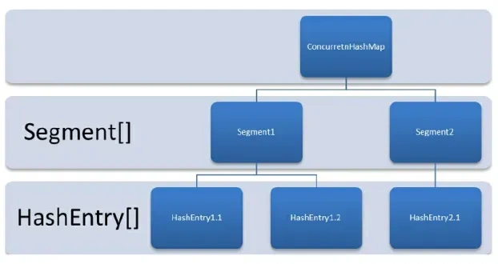
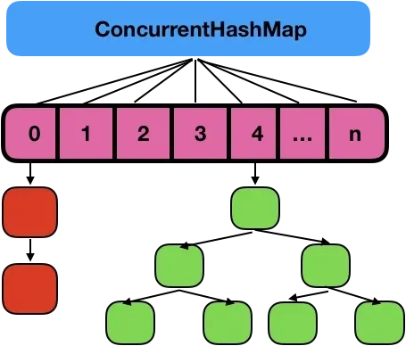
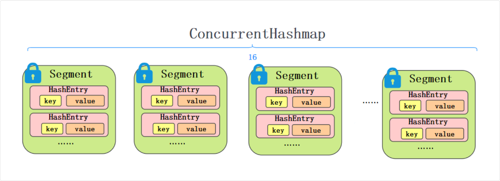
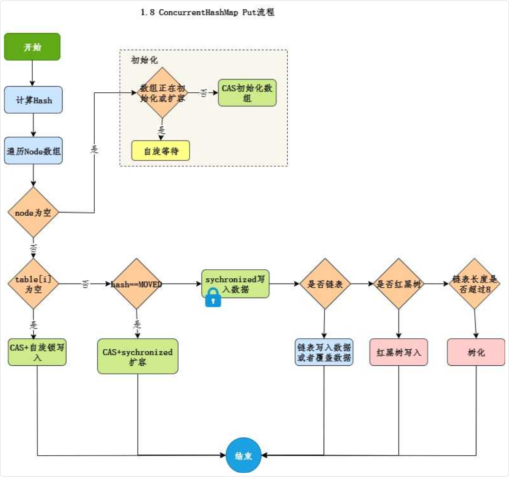

## 并发工具类

### ConcurrentHashMap

#### 简单版本

ConcurrentHashMap 是 HashMap 的线程安全版本

JDK 7 采用的是分段锁，整个 Map 会被分为若干段，每个段都可以独立加锁。不同的线程可以同时操作不同的段，从而实现并发

JDK 8 使用了一种更加细粒度的锁——桶锁，再配合 CAS + synchronized 代码块控制并发写入，以最大程度减少锁的竞争

> ConcurrentHashMap通过对头结点加锁来保证线程安全的, 不用再创一个 segment

对于读操作，ConcurrentHashMap 使用了 volatile 变量来保证内存可见性。

对于写操作，ConcurrentHashMap 优先使用 CAS 尝试插入，如果成功就直接返回；否则使用 synchronized 代码块进行加锁处理

#### 可见性保证

ConcurrentHashMap 中的 Node 节点中，value 和 next 都是 volatile 的，这样就可以保证对 value 或 next 的更新会被其他线程立即看到

#### 详细

在 JDK 1.7 中它使用的是**数组加链表**的形式实现的

而数组又分为：大数组 Segment 和小数组 HashEntry

Segment 是一种可重入锁（ReentrantLock），在 ConcurrentHashMap 里扮演锁的角色

HashEntry 则用于存储键值对数据

一个 ConcurrentHashMap 里包含一个 Segment 数组，一个 Segment 里包含一个 HashEntry 数组，每个 HashEntry 是一个链表结构的元素



JDK 1.7 ConcurrentHashMap 分段锁技术将数据分成一段一段的存储，然后给每一段数据配一把锁，当一个线程占用锁访问其中一个段数据的时候，其他段的数据也能被其他线程访问，能够实现真正的并发访问

> JDK 1.8 ConcurrentMap

在 JDK 1.7 中，ConcurrentHashMap 虽然是线程安全的，但因为它的底层实现是数组 + 链表的形式，所以在数据比较多的情况下访问是很慢的，因为要遍历整个链表

而 JDK 1.8 则使用了数组 + 链表/红黑树的方式优化了 ConcurrentHashMap 的实现，具体实现结构如下：



JDK 1.8 ConcurrentHashMap 主要通过 volatile + CAS 或者 synchronized 来实现的线程安全的

添加元素时首先会判断容器是否为空:

- 如果为空则使用 volatile 加 CAS 来初始化
- 如果容器不为空，则根据存储的元素计算该位置是否为空。
  - 如果根据存储的元素计算结果为空，则利用 CAS 设置该节点；
  - 如果根据存储的元素计算结果不为空，则使用 synchronized ，然后，遍历桶中的数据，并替换或新增节点到桶中，最后再判断是否需要转为红黑树，这样就能保证并发访问时的线程安全了。

相当于是ConcurrentHashMap通过对头结点加锁来保证线程安全的，锁的粒度相比 Segment 来说更小了，发生冲突和加锁的频率降低了，并发操作的性能就提高了

而且 JDK 1.8 使用的是红黑树优化了之前的固定链表，那么当数据量比较大的时候，查询性能也得到了很大的提升，从之前的 O(n) 优化到了 O(logn) 的时间复杂度

#### JDK 7 中 ConcurrentHashMap 的实现原理

JDK 7 的 ConcurrentHashMap 采用的是分段锁，整个 Map 会被分为若干段，每个段都可以独立加锁，每个段类似一个 Hashtable



每个段维护一个键值对数组 `HashEntry<K, V>[] table`

即一个段中可能包含多个 `HashEntry`

HashEntry 是一个单项链表 (对应一个hash值的映射位置)

```java
static final class HashEntry<K,V> {
  final int hash;
  final K key;
  volatile V value;
  final HashEntry<K,V> next;
}
```

段继承了 ReentrantLock，所以每个段都是一个可重入锁，不同的线程可以同时操作不同的段，从而实现并发

```java
static final class Segment<K,V> extends ReentrantLock {
  transient volatile HashEntry<K,V>[] table;
  transient int count;
}
```

##### put 流程

```java
public V put(K key, V value) {
  Segment<K,V> s;
  if (value == null)
      throw new NullPointerException();
  int hash = hash(key);
  int j = (hash >>> segmentShift) & segmentMask;
  if ((s = (Segment<K,V>)UNSAFE.getObject          // nonvolatile; recheck
        (segments, (j << SSHIFT) + SBASE)) == null) //  in ensureSegment
      s = ensureSegment(j);
  return s.put(key, hash, value, false);
}
```

put 流程和 HashMap 非常类似，只不过是先定位到具体的段，再通过 ReentrantLock 去操作而已

第一步，计算 key 的 hash，定位到段，段如果是空就先初始化；

第二步，使用 ReentrantLock 进行加锁，如果加锁失败就自旋，自旋超过次数就阻塞，保证一定能获取到锁；

第三步，遍历段中的键值对 HashEntry，key 相同直接替换，key 不存在就插入。

第四步，释放锁


##### get 流程

```java
public V get(Object key) {
  Segment<K,V> s; // manually integrate access methods to reduce overhead
  HashEntry<K,V>[] tab;
  int h = hash(key);
  long u = (((h >>> segmentShift) & segmentMask) << SSHIFT) + SBASE;
  if ((s = (Segment<K,V>)UNSAFE.getObjectVolatile(segments, u)) != null &&
      (tab = s.table) != null) {
      for (HashEntry<K,V> e = (HashEntry<K,V>) UNSAFE.getObjectVolatile
                (tab, ((long)(((tab.length - 1) & h)) << TSHIFT) + TBASE);
            e != null; e = e.next) {
          K k;
          if ((k = e.key) == key || (e.hash == h && key.equals(k)))
              return e.value;
      }
  }
  return null;
}
```

get 就更简单了，先计算 key 的 hash 找到段，再遍历段中的键值对，找到就直接返回 value

get 不用加锁，因为是 value 是 volatile 的，所以线程读取 value 时不会出现可见性问题

#### JDK 8 中 ConcurrentHashMap 的实现原理

JDK 8 中的 ConcurrentHashMap 取消了分段锁，采用 CAS + synchronized 来实现更细粒度的桶锁，并且使用红黑树来优化链表以提高哈希冲突时的查询效率，性能比 JDK 7 有了很大的提升

#### put 原理



```java
public V put(K key, V value) {
  return putVal(key, value, false);
}
```

##### 第一步，计算 key 的 hash，以确定桶在数组中的位置

如果数组为空，采用 CAS 的方式初始化，以确保只有一个线程在初始化数组。

```java
// 计算 hash
int hash = spread(key.hashCode());

// 初始化数组
if (tab == null || (n = tab.length) == 0)
  tab = initTable();

// 计算桶的位置
int i = (n - 1) & hash;
```

##### 第二步，如果桶为空，直接 CAS 插入节点

如果 CAS 操作失败，会退化为 synchronized 代码块来插入节点

```java
// CAS 插入节点
if (tabAt(tab, i) == null) {
    if (casTabAt(tab, i, null, new Node<K,V>(hash, key, value, null)))
        break;
}

// 否则，使用 synchronized 代码块插入节点
else {
  synchronized (f) {  // **只锁当前桶**
    if (tabAt(tab, i) == f) { // 确保未被其他线程修改
      if (f.hash >= 0) { // 链表处理
          for (Node<K,V> e = f;;) {
              K ek;
              if (e.hash == hash && ((ek = e.key) == key || (key != null && key.equals(ek)))) {
                  e.val = value;
                  break;
              }
              e = e.next;
          }
      } else if (f instanceof TreeBin) { // **红黑树处理**
          ((TreeBin<K,V>) f).putTreeVal(hash, key, value);
      }
    }
  }
}
```

插入的过程中会判断桶的哈希是否小于 0（f.hash >= 0），小于 0 说明是红黑树，大于等于 0 说明是链表

> 在 ConcurrentHashMap 的实现中，红黑树节点 TreeBin 的 hash 值固定为 -2

##### 第三步，如果链表长度超过 8，转换为红黑树

```java
if (binCount >= TREEIFY_THRESHOLD)
  treeifyBin(tab, i);
```

##### 第四步，在插入新节点后，会调用 addCount() 方法检查是否需要扩容

```java
addCount(1L, binCount);
```

#### get 流程

get 也是通过 key 的 hash 进行定位，如果该位置节点的哈希匹配且键相等，则直接返回值

如果节点的哈希为负数，说明是个特殊节点，比如说如树节点或者正在迁移的节点，就调用find方法查找

否则遍历链表查找匹配的键。如果都没找到，返回 null

```java
public V get(Object key) {
  Node<K,V>[] tab; Node<K,V> e, p; int n, eh; K ek;
  int h = spread(key.hashCode());
  if ((tab = table) != null && (n = tab.length) > 0 &&
    (e = tabAt(tab, (n - 1) & h)) != null) {
    if ((eh = e.hash) == h) {
        if ((ek = e.key) == key || (ek != null && key.equals(ek)))
            return e.val;
    }
    else if (eh < 0)
        return (p = e.find(h, key)) != null ? p.val : null;
    while ((e = e.next) != null) {
        if (e.hash == h &&
            ((ek = e.key) == key || (ek != null && key.equals(ek))))
            return e.val;
    }
}
  return null;
}
```

#### ConcurrentHashMap 的改进

##### 计算 hash - `spread` 保证非负

首先是 hash 的计算方法上，ConcurrentHashMap 的 spread 方法接收一个已经计算好的 hashCode，然后将这个哈希码的高 16 位与自身进行异或运算

```java
static final int spread(int h) {
  return (h ^ (h >>> 16)) & HASH_BITS;
}
```

比 HashMap 的 hash 计算多了一个 & HASH_BITS 的操作。

这里的 HASH_BITS 是一个常数，值为 0x7fffffff，它确保结果是一个非负整数

```java
// HashMap
static final int hash(Object key) {
  int h;
  return (key == null) ? 0 : (h = key.hashCode()) ^ (h >>> 16);
}
```

##### 为什么要保证 hash 为正

`hashmap` 并不要求节点的hash是正是负，只要保证你 `hash & n-1` 是非负数就ok了

因为 HashMap 是单线程使用的，不需要：

- 并发扩容协调
- 特殊节点类型标记
- 无锁读取的场景判断

但是对于 `ConcurrentHashMap` 来说，它需要用 hash 值的正负来区分节点类型

```java
// 特殊节点的 hash 值定义
static final int MOVED   = -1;  // 正在扩容迁移的 ForwardingNode
static final int TREEBIN = -2;  // 红黑树根节点
static final int RESERVED = -3; // 临时保留节点
```

> put 中

通过正负判断是链表还是红黑树

在 put 操作中：

```java
if (f.hash >= 0) {      // 链表处理
  // ...
} else if (f instanceof TreeBin) {  // 红黑树处理
  // ...
}
```

> get 中

在 ConcurrentHashMap 中，负的 hash 值被用来标识特殊节点：

```java
// get 中的判断
Node<K,V>[] tab; Node<K,V> e, p; int n, eh; K ek;
if ((eh = e.hash) == h) {
  // hash 相等，直接返回
} else if (eh < 0) {
  // 特殊节点，调用 find 方法处理
  return (p = e.find(h, key)) != null ? p.val : null;
}

```

当 `hash < 0` 时，说明是特殊节点：

- TreeBin（红黑树节点）：hash 固定为 -2
- ForwardingNode（迁移节点）：hash 固定为 -1（MOVED 常量）

##### Node 封装

另外，ConcurrentHashMap 对节点 Node 做了进一步的封装，比如说用 Forwarding Node 来表示正在进行扩容的节点

```java
static final class ForwardingNode<K,V> extends Node<K,V> {
  final Node<K,V>[] nextTable;
  ForwardingNode(Node<K,V>[] tab) {
      super(MOVED, null, null, null);
      this.nextTable = tab;
  }
}
```

最后就是 put 方法，通过 CAS + synchronized 代码块来进行并发写入

#### 为什么 ConcurrentHashMap 在 JDK 1.7 中要用 ReentrantLock，而在 JDK 1.8 要用 synchronized

JDK 1.7 中的 ConcurrentHashMap 使用了分段锁机制，每个 Segment 都继承了 ReentrantLock，这样可以保证每个 Segment 都可以独立地加锁。

而在 JDK 1.8 中，ConcurrentHashMap 取消了 Segment 分段锁，采用了更加精细化的锁——桶锁，以及 CAS 无锁算法，每个桶都可以独立地加锁，只有在 CAS 失败时才会使用 synchronized 代码块加锁，这样可以减少锁的竞争，提高并发性能。
