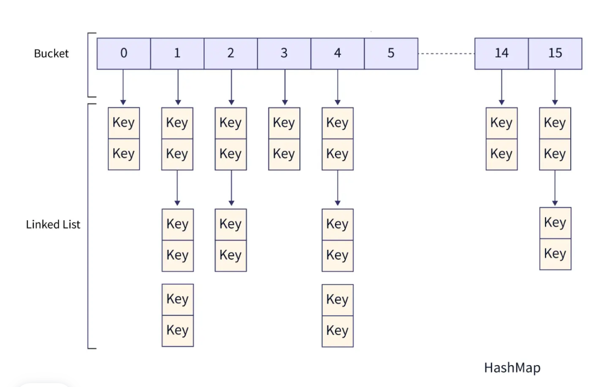
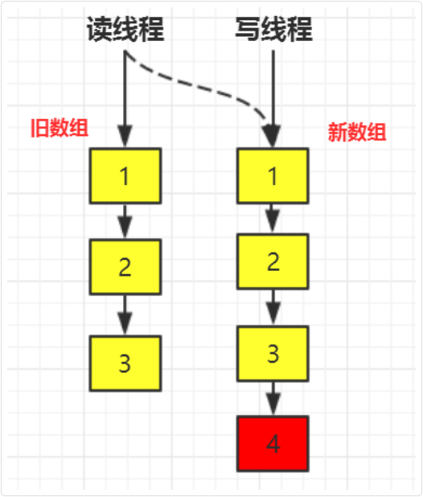

## 并发工具类

### HashTable



- Hashtable的底层数据结构主要是数组加上链表，数组是主体，链表是解决hash冲突存在的。

- HashTable是线程安全的，实现方式是Hashtable的所有公共方法均采用synchronized关键字，当一个线程访问同步方法，另一个线程也访问的时候，就会陷入阻塞或者轮询的状态。

#### 原理

本质就是构建了一个存储了 `Entry<?,?>` 对象的数组，数据就存放在具体的 `Entry` 对象里，对应的索引根据 `hash` 来算

```java
public class Hashtable<K,V>
  extends Dictionary<K,V>
  implements Map<K,V>, Cloneable, java.io.Serializable {

  /**
   * The hash table data.
   */
  private transient Entry<?,?>[] table;

  ...

  /**
   * Hashtable bucket collision list entry
   */
  private static class Entry<K,V> implements Map.Entry<K,V> {
    final int hash;
    final K key;
    V value;
    Entry<K,V> next;

    protected Entry(int hash, K key, V value, Entry<K,V> next) {
        this.hash = hash;
        this.key =  key;
        this.value = value;
        this.next = next;
    }

    @SuppressWarnings("unchecked")
    protected Object clone() {
        return new Entry<>(hash, key, value,
                              (next==null ? null : (Entry<K,V>) next.clone()));
    }

    // Map.Entry Ops
    public K getKey() {
        return key;
    }

    public V getValue() {
        return value;
    }

    public V setValue(V value) {
        if (value == null)
            throw new NullPointerException();

        V oldValue = this.value;
        this.value = value;
        return oldValue;
    }

    public boolean equals(Object o) {
        if (!(o instanceof Map.Entry<?, ?> e))
            return false;

        return (key==null ? e.getKey()==null : key.equals(e.getKey())) &&
            (value==null ? e.getValue()==null : value.equals(e.getValue()));
    }

    public int hashCode() {
        return hash ^ Objects.hashCode(value);
    }

    public String toString() {
        return key.toString()+"="+value.toString();
    }
  }
  ...
}
```

#### 保证线程安全的前提

因为它的put，get做成了同步方法，保证了Hashtable的线程安全性，每个操作数据的方法都进行同步控制之后，由此带来的问题任何一个时刻只能有一个线程可以操纵Hashtable，所以其效率比较低

Hashtable 的 put(K key, V value) 和 get(Object key) 方法的源码：

```java
public synchronized V put(K key, V value) {
  // Make sure the value is not null
  if (value == null) {
      throw new NullPointerException();
  }
  // Makes sure the key is not already in the hashtable.
  Entry<?,?> tab[] = table;
  int hash = key.hashCode();
  int index = (hash & 0x7FFFFFFF) % tab.length;
  @SuppressWarnings("unchecked")
  Entry<K,V> entry = (Entry<K,V>)tab[index];
  for(; entry != null ; entry = entry.next) {
      if ((entry.hash == hash) && entry.key.equals(key)) {
          V old = entry.value;
          entry.value = value;
          return old;
      }
  }
  addEntry(hash, key, value, index);
  return null;
}

public synchronized V get(Object key) {
  Entry<?,?> tab[] = table;
  int hash = key.hashCode();
  int index = (hash & 0x7FFFFFFF) % tab.length;
  for (Entry<?,?> e = tab[index] ; e != null ; e = e.next) {
      if ((e.hash == hash) && e.key.equals(key)) {
          return (V)e.value;
      }
  }
  return null;
}
```

可以看到，Hashtable是通过使用了 synchronized 关键字来保证其线程安全

##### 计算index

```java
int index = (hash & 0x7FFFFFFF) % tab.length;
```

因为 `hash` 是int类型，32位有符号整数，最高位是符号位

0x7fffffff = 0111 1111 1111 1111 1111 1111 1111 1111（31位全1）

hash & 0x7fffffff 会把最高位的符号位变成 0，结果永远是正数

这样可以避免负数索引导致的数组越界问题，因为数组索引必须是正数

> 在 hashmap 中是直接 `if ((p = tab[i = (n - 1) & hash]) == null)`
>
> hash 是通过扰动后的结果，把高位16位的与低位的异或了，但还是有可能是负的
>
> 而 (n-1) 因为确保了 n = 2^x, 所以 n-1 必然是全1，但32位下最高位肯定是 0
>
> 所以 0 & 1/0 == 0 必然不是负数，`(n - 1) & hash` 就是保留最低x位，之后的位都置0，这也保证了非负

##### put 逻辑

得到了放在 table 哪个位置后，就从头开始遍历里面的元素，如果找到了，那么就修改值为现在的

如果没找到，就往最后插入 `addEntry(hash, key, value, index);`

##### get 逻辑

与 put 一样，只不过找到了就返回；没找到就 null

#### HashTable 与 ConcurrentHashMap 区别

> 底层数据结构

- jdk7之前的ConcurrentHashMap底层采用的是分段的数组+链表实现，jdk8之后采用的是数组+链表/红黑树；(当数组长度大于8且总数大于64时转红黑树)

- HashTable采用的是数组+链表，数组是主体，链表是解决hash冲突存在的。

> 实现线程安全的方式

- jdk8以前，ConcurrentHashMap采用分段锁，对整个数组进行了分段分割，每一把锁只锁容器里的一部分数据，多线程访问不同数据段里的数据，就不会存在锁竞争，提高了并发访问；jdk8以后，直接采用数组+链表/红黑树，并发控制使用CAS和synchronized操作，更加提高了速度。
- HashTable：所有的方法都加了锁来保证线程安全，但是效率非常的低下，当一个线程访问同步方法，另一个线程也访问的时候，就会陷入阻塞或者轮询的状态。

#### 说一下 HashMap，HashTable 和 ConcurrentHashMap 区别

- HashMap
  - 线程不安全，效率高一点，可以存储null的key和value，null的key只能有一个，null的value可以有多个
  - 默认初始容量为16，每次扩充变为原来2倍。
  - 创建时如果给定了初始容量，则扩充为2的幂次方大小。
  - 底层数据结构为数组+链表，插入元素后如果链表长度大于阈值（默认为8），先判断数组长度是否小于64，如果小于，则扩充数组，反之将链表转化为红黑树，以减少搜索时间。
- HashTable
  - 线程安全，效率低一点，其内部方法基本都经过synchronized修饰
  - **不可以有null的key和value**
  - 默认初始容量为11，每次扩容变为原来的2n+1
  - 创建时给定了初始容量，会直接用给定的大小
  - 底层数据结构为数组+链表。它基本被淘汰了，要保证线程安全可以用ConcurrentHashMap
- ConcurrentHashMap
  - 是Java中的一个线程安全的哈希表实现，它可以在多线程环境下并发地进行读写操作，而不需要像传统的HashTable那样在读写时加锁
  - 实现原理主要基于分段锁和CAS操作。
  - 它将整个哈希表分成了多Segment（段），每个Segment都类似于一个小的HashMap，它拥有自己的数组和一个独立的锁。
  - 在ConcurrentHashMap中，读操作不需要锁，可以直接对Segment进行读取，而写操作则只需要锁定对应的Segment，而不是整个哈希表，这样可以大大提高并发性能。

### CopyOnWriteArrayList

CopyOnWriteArrayList 是 ArrayList 的线程安全版本，适用于读多写少的场景

CopyOnWrite 的核心思想是**写操作时创建一个新数组**，修改后再替换原数组，这样就能够确保读操作无锁，从而提高并发性能

> 保证最终一致性



内部使用 volatile 变量来修饰数组 array，以确保读操作的内存可见性

```java
private transient volatile Object[] array;
```

写操作的时候使用 ReentrantLock 来保证线程安全

```java
public boolean add(E e) {
    final ReentrantLock lock = this.lock;
    // 加锁
    lock.lock();
    try {
        Object[] elements = getArray();
        int len = elements.length;
        // 创建一个新数组
        Object[] newElements = Arrays.copyOf(elements, len + 1);
        newElements[len] = e;
        // 替换原数组
        setArray(newElements);
        return true;
    } finally {
        // 释放锁
        lock.unlock();
    }
}
```

缺点就是写操作的时候会复制一个新数组，如果数组很大，写操作的性能会受到影响

### BlockingQueue

BlockingQueue 是 JUC 包下的一个线程安全队列，支持阻塞式的“生产者-消费者”模型。

当队列容器已满，生产者线程会被阻塞，直到消费者线程取走元素后为止；当队列容器为空时，消费者线程会被阻塞，直至队列非空时为止。

BlockingQueue 的实现类有很多，比如说 ArrayBlockingQueue、PriorityBlockingQueue 等

| 实现类 | 数据结构 | 是否有界 | 特点 |
| --- | --- | --- | --- |
| ArrayBlockingQueue | 数组 | ✅ 有界 | 基于数组，固定容量，FIFO |
| LinkedBlockingQueue | 链表 | ✅ 可有界（默认 Integer.MAX_VALUE） | 基于链表，吞吐量比 ArrayBlockingQueue 高 |
| PriorityBlockingQueue | 堆（优先队列） | ❌ 无界 | 元素按优先级排序（非 FIFO） |
| DelayQueue | 优先队列（基于 Delayed 接口） | ❌ 无界 | 元素到期后才能被取出 |
| SynchronousQueue | 无缓冲 | ✅ 容量为 0 | 必须一对一交换数据，适用于高吞吐的任务提交 |
| LinkedTransferQueue | 链表 | ❌ 无界 | 支持 tryTransfer()，数据立即交给消费者 |
