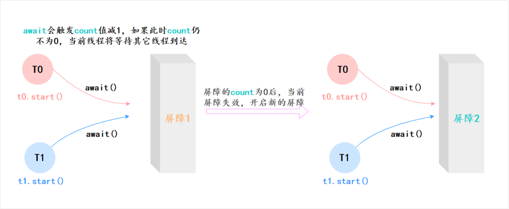

## 并发工具类

| 类 | 作用 |
| --- | --- |
| Semaphore | 限制线程的数量 |
| Exchanger | 两个线程交换数据 |
| CountDownLatch | 线程等待直到计数器减为 0 时开始工作 |
| CyclicBarrier | 作用跟 CountDownLatch 类似，但是可以重复使用 |
| Phaser | 增强的 CyclicBarrier |

### CountDownLatch

CountDownLatch 是 JUC 中的一个同步工具类，用于协调多个线程之间的同步，确保主线程在多个子线程完成任务后继续执行

它的核心思想是通过一个倒计时计数器来控制多个线程的执行顺序

#### 核心思想

利用共享锁实现，内部同样实现了一个内部类继承 AQS, 在一开始的时候就是已经上了count层锁的状态，也就是state = count

- countDown()就是解1层锁，也就是靠这个方法一点一点把state的值减到0
- await()就是(加)获取共享锁，但是必须state为0才能(加)获取锁成功，否则按照AQS的机制，会进入等待队列阻塞，(加)获取锁成功后结束阻塞

#### 简单使用

在使用的时候，我们需要先初始化一个 CountDownLatch 对象，指定一个计数器的初始值，表示需要等待的线程数量

然后在每个子线程执行完任务后，调用 countDown() 方法，计数器减 1

接着主线程调用 await() 方法进入阻塞状态，直到计数器为 0，也就是所有子线程都执行完任务后，主线程才会继续执行

```java
class CountDownLatchExample {
  public static void main(String[] args) throws InterruptedException {
    int threadCount = 3;
    CountDownLatch latch = new CountDownLatch(threadCount);

    for (int i = 0; i < threadCount; i++) {
        new Thread(() -> {
            try {
                Thread.sleep((long) (Math.random() * 1000)); // 模拟任务执行
                System.out.println(Thread.currentThread().getName() + " 执行完毕");
            } catch (InterruptedException e) {
                e.printStackTrace();
            } finally {
                latch.countDown(); // 线程完成后，计数器 -1
            }
        }).start();
    }

    latch.await(); // 主线程等待
    System.out.println("所有子线程执行完毕，主线程继续执行");
  }
}
```

### CyclicBarrier

CyclicBarrier /ˈsaɪklɪk ˈbæriər/ 的字面意思是可循环使用的屏障，用于多个线程相互等待，直到所有线程都到达屏障后再同时执行



在使用的时候，我们需要先初始化一个 CyclicBarrier 对象，指定一个屏障值 N，表示需要等待的线程数量。

然后每个线程执行 await() 方法，表示自己已经到达屏障，等待其他线程，此时屏障值会减 1。

当所有线程都到达屏障后，也就是屏障值为 0 时，所有线程会继续执行。

#### 与 CountDownLatch 的区别

CyclicBarrier 让所有线程相互等待，全部到达后再继续；CountDownLatch 让主线程等待所有子线程执行完再继续

| 对比项 | CyclicBarrier | CountDownLatch |
| --- | --- | --- |
| 主要用途 | 让所有线程相互等待，全部到达后再继续 | 让主线程等待所有子线程执行完 |
| 可重用性 | ✅ 可重复使用，每次屏障打开后自动重置 | ❌ 不可重复使用，计数器归零后不能恢复 |
| 是否可执行回调 | ✅ 可以，所有线程到达屏障后可执行 barrierAction | ❌ 不能 |
| 线程等待情况 | 所有线程互相等待，一个线程未到达，其他线程都会阻塞 | 主线程等待所有子线程完成，子线程执行完后可继续运行 |
| 适用场景 | 线程相互依赖，需要同步执行 | 主线程等待子线程完成 |
| 示例场景 | 计算任务拆分，所有线程都到达后才能继续 | 主线程等多个任务初始化完成 |

### Semaphore

Semaphore /ˈsɛməˌfɔːr/ —— 信号量，用于控制同时访问某个资源的线程数量，类似限流器，确保最多只有指定数量的线程能够访问某个资源，超过的必须等待

在使用 Semaphore 时，首先需要初始化一个 Semaphore 对象，指定许可证数量，表示最多允许多少个线程同时访问资源。

然后在每个线程访问资源前，调用 acquire() 方法获取许可证，如果没有可用许可证，则阻塞等待。

需要注意的是，访问完资源后，要调用 release() 方法释放许可证

```java
class SemaphoreExample {
  private static final int THREAD_COUNT = 5;
  private static final Semaphore semaphore = new Semaphore(2); // 最多允许 2 个线程访问

  public static void main(String[] args) {
      for (int i = 0; i < THREAD_COUNT; i++) {
          new Thread(() -> {
              try {
                  semaphore.acquire(); // 获取许可（如果没有可用许可，则阻塞）
                  System.out.println(Thread.currentThread().getName() + " 访问资源...");
                  Thread.sleep(2000); // 模拟任务执行
              } catch (InterruptedException e) {
                  e.printStackTrace();
              } finally {
                  semaphore.release(); // 释放许可
              }
          }).start();
      }
  }
}
```

Semaphore 可以用于流量控制，比如数据库连接池、网络连接池等。

假如有这样一个需求，要读取几万个文件的数据，因为都是 IO 密集型任务，我们可以启动几十个线程并发地读取。

但是在读到内存后，需要存储到数据库，而数据库连接数是有限的，比如说只有 10 个，那我们就必须控制线程的数量，保证同时只有 10 个线程在使用数据库连接。

用 Semaphore 控制并发数

```java
// 信号量，只允许 10 个线程同时访问数据库
Semaphore semaphore = new Semaphore(10);

for (int i = 0; i < 30; i++) {
  new Thread(() -> {
    String data = readFile();  // 30 个线程可以同时读
    
    try {
      semaphore.acquire();   // 获取许可，最多 10 个能通过
      saveToDatabase(data);  // 同时只有 10 个线程在写数据库
    } finally {
      semaphore.release();   // 释放许可，其他等待的线程可以进来
    }
  }).start();
}
```

### Exchanger

Exchanger——交换者，用于在两个线程之间进行数据交换

支持双向数据交换，比如说线程 A 调用 exchange(dataA)，线程 B 调用 exchange(dataB)，它们会在同步点交换数据，即 A 得到 B 的数据，B 得到 A 的数据。

如果一个线程先调用 exchange()，它会阻塞等待，直到另一个线程也调用 exchange()。

使用 Exchanger 的时候，需要先创建一个 Exchanger 对象，然后在两个线程中调用 e
