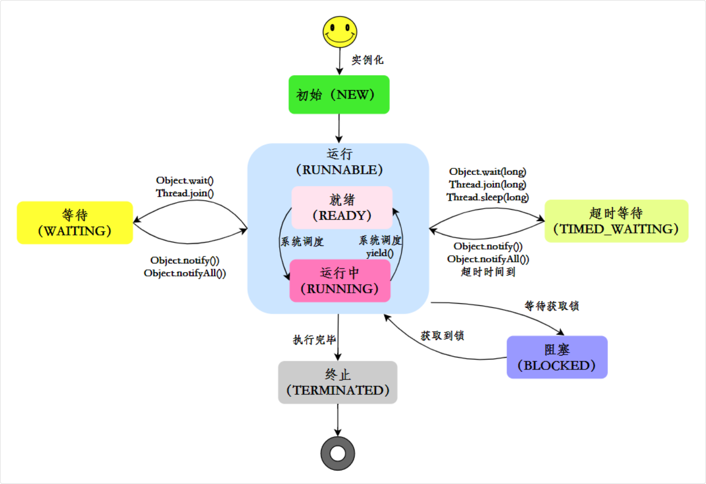

## JUC

### 调用 start 方法时会执行 run 方法，那怎么不直接调用 run方法

调用 start() 会创建一个新的线程，并异步执行 run() 方法中的代码

直接调用 run() 方法只是一个普通的同步方法调用，所有代码都在当前线程中执行，不会创建新线程。没有新的线程创建，也就达不到多线程并发的目的

调用 start()

```plain
main 线程
    ↓
调用 task.start()
    ↓
JVM 创建新线程
    ↓
新线程执行 task.run()    ← 在新线程中运行
    ↓
main 线程继续执行其他代码  ← 并发执行
```

调用 run()

```plain
main 线程
    ↓
调用 task.run()
    ↓
在 main 线程中执行 run() 方法体  ← 没有新线程
    ↓
run() 执行完，main 线程继续  ← 串行执行
```

#### 源码分析

```java
// Thread.java
public void start() {
    // ... 状态检查 ...
    
    start0();  // native 方法，通知 JVM 创建新线程
}

private native void start0();

// 而 run() 方法：
public void run() {
    if (target != null) {
        target.run();  // 只是普通的方法调用
    }
}
```

调用 start() 方法会通知 JVM，去调用底层的线程调度机制来启动新线程

调用 start() 后，线程进入就绪状态，等待操作系统调度；一旦调度执行，线程会执行其 run() 方法中的代码

### Java 线程的状态



共有6种

- new 代表线程被创建但未启动；
- runnable 代表线程处于就绪或正在运行状态，由操作系统调度；
- blocked 代表线程被阻塞，等待获取锁；
- waiting 代表线程等待其他线程的通知或中断；
- timed_waiting 代表线程会等待一段时间，超时后自动恢复；
- terminated 代表线程执行完毕，生命周期结束。

| 线程状态 | 解释 |
| --- | --- |
| NEW | 当线程被创建后，如通过new Thread()，它处于新建状态。此时，线程已经被分配了必要的资源，但还没有开始执行。 |
| RUNNABLE | 当调用线程的start()方法后，线程进入可运行状态。在这个状态下，线程可能正在运行也可能正在等待获取 CPU 时间片，具体取决于线程调度器的调度策略。 |
| BLOCKED | 线程在试图获取一个锁以进入同步块/方法时，如果锁被其他线程持有，线程将进入阻塞状态，直到它获取到锁。 |
| WAITING | 线程进入等待状态是因为调用了如下方法之一：Object.wait()或LockSupport.park()。在等待状态下，线程需要其他线程显式地唤醒，否则不会自动执行。 |
| TIMED_WAITING | 当线程调用带有超时参数的方法时，如Thread.sleep(long millis)、Object.wait(long timeout) 或LockSupport.parkNanos()，它将进入超时等待状态。线程在指定的等待时间过后会自动返回可运行状态。 |
| TERMINATED | 当线程的run()方法执行完毕后，或者因为一个未捕获的异常终止了执行，线程进入终止状态。一旦线程终止，它的生命周期结束，不能再被重新启动。 |

线程的生命周期可以分为五个主要阶段：新建、就绪、运行、阻塞和终止

线程在运行过程中会根据状态的变化在这些阶段之间切换

```java
class ThreadStateExample {
    public static void main(String[] args) throws InterruptedException {
        Thread thread = new Thread(() -> {
            try {
                Thread.sleep(2000); // TIMED_WAITING
                synchronized (ThreadStateExample.class) {
                    ThreadStateExample.class.wait(); // WAITING
                }
            } catch (InterruptedException e) {
                Thread.currentThread().interrupt();
            }
        });

        System.out.println("State after creation: " + thread.getState()); // NEW

        thread.start();
        System.out.println("State after start: " + thread.getState()); // RUNNABLE

        Thread.sleep(500);
        System.out.println("State while sleeping: " + thread.getState()); // TIMED_WAITING

        synchronized (ThreadStateExample.class) {
            ThreadStateExample.class.notify(); // 唤醒线程
        }

        thread.join();
        System.out.println("State after termination: " + thread.getState()); // TERMINATED
    }
}
```

#### 如何强制终止线程

第一步，调用线程的 interrupt() 方法，请求终止线程

第二步，在线程的 run() 方法中检查中断状态，如果线程被中断，就退出线程

```java
class MyTask implements Runnable {
    @Override
    public void run() {
        while (!Thread.currentThread().isInterrupted()) {
            try {
                System.out.println("Running...");
                Thread.sleep(1000); // 模拟工作
            } catch (InterruptedException e) {
                // 捕获中断异常后，重置中断状态
                Thread.currentThread().interrupt();
                System.out.println("Thread interrupted, exiting...");
                break;
            }
        }
    }
}

public class Main {
    public static void main(String[] args) throws InterruptedException {
        Thread thread = new Thread(new MyTask());
        thread.start();
        Thread.sleep(3000); // 主线程等待3秒
        thread.interrupt(); // 请求终止线程
    }
}
```

### 线程的调度方法

主要有6个方面：

- 等待
  - wait()
  - wait(long timeout)
  - wait(long timeout, int nanos)
  - join()
- 通知
  - notify()
  - notifyAll()
- 让出优先权
  - yield()
- 中断
  - interrupt()
  - isinterrupted()
  - interrupted()
- 休眠
  - sleep()

#### wait() 和 notify() 方法

当线程 A 调用共享对象的 `wait()` 方法时，线程 A 会被阻塞挂起，直到：

- 线程 B 调用了共享对象的 `notify()` 方法或者 `notifyAll()` 方法；
- 其他线程调用线程 A 的 `interrupt()` 方法，导致线程 A 抛出 `InterruptedException` 异常。

线程 A 调用共享对象的 `wait(timeout)`方法后，没有在指定的 timeout 时间内被其它线程唤醒，那么这个方法会因为超时而返回。

当线程 A 调用共享对象的 `notify()` 方法后，会唤醒一个在这个共享对象上调用 wait 系列方法被挂起的线程。

共享对象上可能会有多个线程在等待，具体唤醒哪个线程是随机的

如果调用的是 `notifyAll` 方法，会唤醒所有在这个共享变量上调用 wait 系列方法而被挂起的线程

#### sleep() 方法

当线程 A 调用了 Thread 的 sleep 方法后，线程 A 会暂时让出指定时间的执行权。

指定的睡眠时间到了后该方法会正常返回，接着参与 CPU 调度，获取到 CPU 资源后可以继续执行。

#### sleep 和 wait 的区别

sleep 会让当前线程休眠，不需要获取对象锁，属于 Thread 类的方法

wait 会让获得对象锁的线程等待，要提前获得对象锁，属于 Object 类的方法

此外，锁行为也不同

- 如果一个线程在持有某个对象锁时调用了 sleep 方法，它在睡眠期间仍然会持有这个锁
- 而当线程执行 wait 方法时，它会释放持有的对象锁，因此其他线程也有机会获取该对象的锁

使用条件上：

- sleep() 方法可以在任何地方被调用。
- wait() 方法必须在同步代码块或同步方法中被调用，这是因为调用 wait() 方法的前提是当前线程必须持有对象的锁。否则会抛出 IllegalMonitorStateException 异常

唤醒方式上：

- 调用 sleep 方法后，线程会进入 TIMED_WAITING 状态，即在指定的时间内暂停执行。当指定的时间结束后，线程会自动恢复到 RUNNABLE 状态，等待 CPU 调度再次执行。
- 调用 wait 方法后，线程会进入 WAITING 状态，直到有其他线程在同一对象上调用 notify 或 notifyAll 方法，线程才会从 WAITING 状态转变为 RUNNABLE 状态，准备再次获得

> wait() 是线程间通信机制，本质是：当前线程进入对象的等待队列，并释放锁，等待其他线程唤醒它

### 如何保证线程安全
