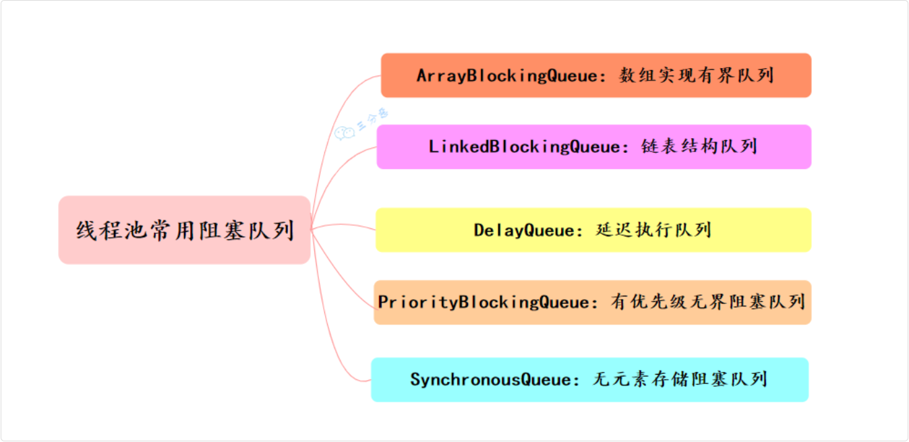

## 线程池

### 阻塞队列

常用的有五种

- 有界队列 ArrayBlockingQueue；
- 无界队列 LinkedBlockingQueue；
- 优先级队列 PriorityBlockingQueue；
- 延迟队列 DelayQueue；
- 同步队列 SynchronousQueue



#### 阻塞队列接口 `BlockingQueue<E>`

阻塞队列本身也是队列, 继承于 Queue，但是它是适用于多线程环境下的，基于ReentrantLock实现的

```java
public interface BlockingQueue<E> extends Queue<E> {
  boolean add(E e);

  // 入队，如果队列已满，返回false否则返回true（非阻塞）
  boolean offer(E e);

  // 入队，如果队列已满，该线程会被阻塞，直到能入队为止
  void put(E e) throws InterruptedException;

  // 入队，如果队列已满，阻塞线程直到能入队或超时、中断为止
  // 入队成功返回true否则false
  boolean offer(E e, long timeout, TimeUnit unit)
      throws InterruptedException;

  // 出队，如果队列为空，该线程被阻塞，直到能出队为止
  E take() throws InterruptedException;

  // 出队，如果队列为空，阻塞线程直到能出队超时、中断为止
  // 出队成功正常返回，否则返回null
  E poll(long timeout, TimeUnit unit)
      throws InterruptedException;

  // 返回此队列理想情况下（在没有内存或资源限制的情况下）可以不阻塞地入队的数量
  // 如果没有限制，则返回 Integer.MAX_VALUE
  int remainingCapacity();

  boolean remove(Object o);

  public boolean contains(Object o);

  // 一次性从BlockingQueue中获取所有可用的数据对象
  // （还可以指定获取数据的个数）
  int drainTo(Collection<? super E> c);

  int drainTo(Collection<? super E> c, int maxElements);
}
```

#### 实现方式

阻塞队列使用 ReentrantLock + Condition 来确保并发安全

以 ArrayBlockingQueue 为例，它内部维护了一个数组，使用两个指针分别指向队头和队尾。

put 的时候先用 ReentrantLock 加锁，然后判断队列是否已满，如果已满就阻塞等待，否则插入元素。

```java
final ReentrantLock lock;
private final Condition notEmpty;
private final Condition notFull;

public void put(E e) throws InterruptedException {
  final ReentrantLock lock = this.lock;
  lock.lockInterruptibly(); // 🔹 加锁，确保线程安全
  try {
      while (count == items.length) { // 🔹 队列满，阻塞
          notFull.await();
      }
      enqueue(e); // 🔹 插入元素
  } finally {
      lock.unlock(); // 🔹 释放锁
  }
}
```

#### ArrayBlockingQueue

一个有界的先进先出的阻塞队列，底层是一个数组，适合固定大小的线程池

```java
ArrayBlockingQueue<Integer> blockingQueue = new ArrayBlockingQueue<Integer>(10, true);
```

#### LinkedBlockingQueue

底层是链表，如果不指定大小，默认大小是 Integer.MAX_VALUE，几乎相当于一个无界队列

```java
BlockingQueue<Integer> pool = new LinkedBlockingQueue<>(poolSize);
```

#### PriorityBlockingQueue

一个支持优先级排序的无界阻塞队列。任务按照其自然顺序或 Comparator 来排序

适用于需要按照给定优先级处理任务的场景，比如优先处理紧急任务

#### DelayQueue

类似于 PriorityBlockingQueue，由二叉堆实现的无界优先级阻塞队列

#### SynchronousQueue

每个插入操作必须等待另一个线程的移除操作，同样，任何一个移除操作都必须等待另一个线程的插入操作
