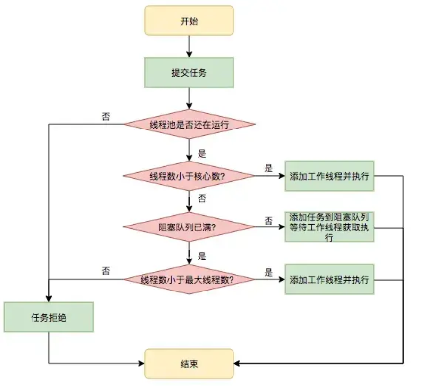

## 线程池

线程池是用来管理和复用线程的工具，它可以减少线程的创建和销毁开销

在 Java 中，ThreadPoolExecutor 是线程池的核心实现，它通过核心线程数、最大线程数、任务队列和拒绝策略来控制线程的创建和执行



任务执行流程如下：

任务提交 → 核心线程执行 → 任务队列缓存 → 非核心线程执行 → 拒绝策略处理

```plain
提交任务 → 核心线程是否已满？
  ├─ 未满 → 创建核心线程执行
  └─ 已满 → 任务入队
      ├─ 队列未满 → 等待执行
      └─ 队列已满 → 创建非核心线程
          ├─ 未达最大线程数 → 执行任务
          └─ 已达最大线程数 → 执行拒绝策略
```

> 主要的逻辑是：提交任务后，如果核心线程数量还没满，那么直接创建一个线程为核心线程，并执行任务
>
> 如果满了，那么就要放到队列里等着(等核心线程来取任务按顺序消费)，如果这个队列都满了，那么就要创建非核心线程
>
> 如果这个线程池已经达到了最大线程数量，那么对于新来的任务，就采用拒绝策略

### 解决核心问题

线程池解决的核心问题就是资源管理问题

在并发环境下，系统不能够确定在任意时刻中，有多少任务需要执行，有多少资源需要投入。这种不确定性将带来以下若干问题：

- 频繁申请/销毁资源和调度资源，将带来额外的消耗，可能会非常巨大。
- 对资源无限申请缺少抑制手段，易引发系统资源耗尽的风险。
- 系统无法合理管理内部的资源分布，会降低系统的稳定性。

为解决资源分配这个问题，线程池采用了“池化”（Pooling）思想。池化，顾名思义，是为了最大化收益并最小化风险，而将资源统一在一起管理的一种思想

### 主要参数

线程池的构造函数有7个参数, 需要重点关注的有核心线程数、最大线程数、等待队列、拒绝策略

```java
public ThreadPoolExecutor(int corePoolSize,
                          int maximumPoolSize,
                          long keepAliveTime,
                          TimeUnit unit,
                          BlockingQueue<Runnable> workQueue,
                          ThreadFactory threadFactory,
                          RejectedExecutionHandler handler)
```

- corePoolSize：核心线程数，长期存活，执行任务的主力。
- maximumPoolSize：线程池允许的最大线程数。
- workQueue：任务队列，存储等待执行的任务。
- handler：拒绝策略，任务超载时的处理方式。也就是线程数达到 maximumPoolSize，任务队列也满了的时候，就会触发拒绝策略。
- threadFactory：线程工厂，用于创建线程，可自定义线程名。
- keepAliveTime：非核心线程的存活时间，空闲时间超过该值就销毁。
- unit：keepAliveTime 参数的时间单位

任务优先使用核心线程执行，满了进入等待队列，队列满了启用非核心线程备用，线程池达到最大线程数量后触发拒绝策略，非核心线程的空闲时间超过存活时间就被回收

> 核心线程数量，最大线程数量，工作队列，拒绝策略，线程工厂，非核心存活时间，非核心存活单位

#### 关闭线程池

可以调用线程池的 shutdown 或 shutdownNow 方法来关闭线程池

shutdown 不会立即停止线程池，而是等待所有任务执行完毕后再关闭线程池

shutdownNow 会尝试通过一系列动作来停止线程池，包括停止接收外部提交的任务、忽略队列里等待的任务、尝试将正在跑的任务 interrupt 中断

#### 线程池的线程数量怎么配置

从理论上，先会分析线程池中执行的任务类型是 CPU 密集型还是 IO 密集型

- 对于 CPU 密集型任务，我的目标是尽量减少线程上下文切换，以优化 CPU 使用率。一般来说，核心线程数设置为处理器的核心数或核心数加一是较理想的选择
- 对于 IO 密集型任务，由于线程经常处于等待状态，等待 IO 操作完成，所以可以设置更多的线程来提高并发，比如说 CPU 核心数的两倍

> 实际项目中大部分业务代码是 IO 密集型（查数据库、调接口、写日志），线程数可以适当多设一些

最后，我会根据业务需求和系统资源来调整线程池的其他参数，比如最大线程数、任务队列容量、非核心线程的空闲存活时间等

### 工作队列满了有哪些拒绝策略

当线程池的任务队列满了之后，线程池会执行指定的拒绝策略来应对

(直接抛异常，让提交的线程自己执行，丢弃等待队列最老的任务执行该任务，丢弃该任务)

常用的四种拒绝策略包括：CallerRunsPolicy、AbortPolicy、DiscardPolicy、DiscardOldestPolicy

此外，还可以通过实现 `RejectedExecutionHandler` 接口来自定义拒绝策略

四种预置的拒绝策略：

- `AbortPolicy`，默认的拒绝策略，会抛 RejectedExecutionException 异常
- `CallerRunsPolicy`：让提交任务的线程自己来执行这个任务，也就是调用 execute 方法的线程
- `DiscardOldestPolicy`：等待队列会丢弃队列中最老的一个任务，也就是队列中等待最久的任务，然后尝试重新提交被拒绝的任务
- `DiscardPolicy`：丢弃被拒绝的任务，不做任何处理也不抛出异常
- 自定义拒绝策略，通过实现接口可以自定义任务拒绝策略

```java
class CustomRejectedHandler {
  public static void main(String[] args) {
      // 自定义拒绝策略
      // 记录
      RejectedExecutionHandler rejectedHandler = (r, executor) -> {
          System.out.println("Task " + r.toString() + " rejected. Queue size: " 
                              + executor.getQueue().size());
      };

      // 自定义线程池
      ThreadPoolExecutor executor = new ThreadPoolExecutor(
          2,                      // 核心线程数
          4,                      // 最大线程数
          10,                     // 空闲线程存活时间
          TimeUnit.SECONDS,
          new ArrayBlockingQueue<>(2),  // 阻塞队列容量
          Executors.defaultThreadFactory(),
          rejectedHandler          // 自定义拒绝策略
      );

      for (int i = 0; i < 10; i++) {
          final int taskNumber = i;
          executor.execute(() -> {
              System.out.println("Executing task " + taskNumber);
              try {
                  Thread.sleep(1000); // 模拟任务耗时
              } catch (InterruptedException e) {
                  e.printStackTrace();
              }
          });
      }

      executor.shutdown();
  }
}
```

### 线程池提交 execute 和 submit 区别

execute 方法没有返回值，适用于不关心结果和异常的简单任务

```java
threadsPool.execute(new Runnable() {
    @Override public void run() {
        System.out.println("execute() 方法提交的任务");
    }
});
```

submit 有返回值，适用于需要获取结果或处理异常的场景

```java
Future<Object> future = executor.submit(harReturnValuetask);
try { Object s = future.get(); } 
catch (InterruptedException e | ExecutionException e) {
  // 处理无法执行任务异常
} finally {
  // 关闭线程池 executor.shutdown();
}
```

### 常见的线程池

4 种

- 固定大小的线程池 Executors.newFixedThreadPool(int nThreads);，适合用于任务数量确定，且对线程数有明确要求的场景。例如，IO 密集型任务、数据库连接池等。
- 缓存线程池 Executors.newCachedThreadPool();，适用于短时间内任务量波动较大的场景。例如，短时间内有大量的文件处理任务或网络请求
- 定时任务线程池 Executors.newScheduledThreadPool(int corePoolSize);，适用于需要定时执行任务的场景。例如，定时发送邮件、定时备份数据等
- 单线程线程池 Executors.newSingleThreadExecutor();，适用于需要按顺序执行任务的场景。例如，日志记录、文件处理等

#### 原理分析

不管是 FixedThreadPool、CachedThreadPool，还是 SingleThreadExecutor 和 ScheduledThreadPoolExecutor，它们本质上都是 ThreadPoolExecutor 的不同配置
