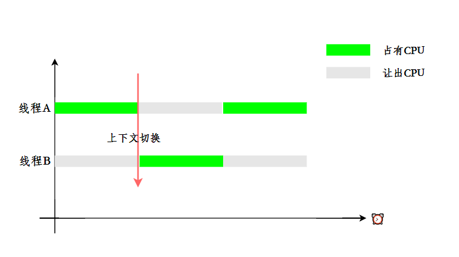

## JUC

### 如何保证线程安全

线程安全是指在并发环境下，**多个线程访问共享资源时，程序能够正确地执行**，而**不会出现数据不一致**的问题

为了保证线程安全，可以使用 synchronized 关键字对方法加锁，对代码块加锁。线程在执行同步方法、同步代码块时，会获取类锁或者对象锁，其他线程就会阻塞并等待锁

如果需要更细粒度的锁，可以使用 ReentrantLock 并发重入锁等。

如果需要保证变量的内存可见性，可以使用 volatile 关键字。

对于简单的原子变量操作，还可以使用 Atomic 原子类。

对于线程独立的数据，可以使用 ThreadLocal 来为每个线程提供专属的变量副本。

对于需要并发容器的地方，可以使用 ConcurrentHashMap、CopyOnWriteArrayList 等。

"锁、volatile、原子类、ThreadLocal、并发容器"

> 首先说什么是线程安全：
>
> 线程安全是指多个线程访问共享资源时，程序能正确执行，不会出现数据不一致的问题。
>
> 然后说解决方案（分点回答）：
>
> 1. 互斥同步：使用 `synchronized` 关键字或 `ReentrantLock` 对共享资源加锁，保证同一时刻只有一个线程访问
> 2. 可见性保证：使用 `volatile` 关键字，保证变量在多线程间的可见性
> 3. 原子操作：使用 `Atomic` 原子类（如 AtomicInteger），利用 CAS 保证操作的原子性
> 4. 线程隔离：使用 `ThreadLocal` 为每个线程提供独立的变量副本，避免共享
> 5. 并发容器：使用线程安全的集合类，如 `ConcurrentHashMap`、`CopyOnWriteArrayList` 等

#### 确保原子性

- 在单节点环境中，可以使用 synchronized 关键字或 ReentrantLock 来保证对 key 的修改操作是原子的

- 在多节点环境中，可以使用分布式锁 Redisson 来保证对 key 的修改操作是原子的

#### 线程安全的场景

单例模式

在多线程环境下，如果多个线程同时尝试创建实例，单例类必须确保只创建一个实例，并提供一个全局访问点

> 饿汉式是一种比较直接的实现方式，它通过**在类加载时就立即初始化单例对象**来保证线程安全

```java
class Singleton {
    private static final Singleton instance = new Singleton();

    private Singleton() {
    }

    public static Singleton getInstance() {
        return instance;
    }
}
```

懒汉式单例则在第一次使用时初始化单例对象，这种方式需要使用**双重检查锁定**来确保线程安全，volatile 关键字用来保证可见性，syncronized 关键字用来保证同步

```java
class LazySingleton {
    private static volatile LazySingleton instance;

    private LazySingleton() {}

    public static LazySingleton getInstance() {
        // 第一次检查
        // 可能有多个线程同时发现为null
        if (instance == null) { 
            // 加锁
            synchronized (LazySingleton.class) {
                // 第二次检查
                // 有可能上面第一次跑来好几个，但第一个已经创建成功了
                // 结果下一个获取锁的如果没有检查就又创一个
                if (instance == null) { 
                    instance = new LazySingleton();
                }
            }
        }
        return instance;
    }
}
```

### 线程上下文切换

上下文 = 线程的"快照"，保存了线程执行所需的所有关键信息，使得线程切换后可以"无缝"继续执行

线程上下文切换是指 CPU 从一个线程切换到另一个线程执行时的过程

在线程切换的过程中，CPU 需要保存当前线程的执行状态，并加载下一个线程的上下文

之所以要这样，是因为 CPU 在同一时刻只能执行一个线程，为了实现多线程并发执行，需要不断地在多个线程之间切换

为了让用户感觉多个线程是在同时执行的， CPU 资源的分配采用了时间片轮转的方式，线程在时间片内占用 CPU 执行任务。当线程使用完时间片后，就会让出 CPU 让其他线程占用



线程 A 切换到线程 B

```plain
1. 保存线程 A 的上下文
   - PC 寄存器值
   - 通用寄存器值
   - 栈指针位置
   - 当前状态
   ↓ 存入 PCB (进程控制块)

2. 加载线程 B 的上下文
   - 从 PCB 读取寄存器值
   - 恢复栈指针
   - 设置 PC 指针
   ↓ 线程 B 继续执行
```

#### 线程可以多核调度吗

多核处理器提供了并行执行多个线程的能力。每个核心可以独立执行一个或多个线程，操作系统的任务调度器会根据策略和算法，如优先级调度、轮转调度等，决定哪个线程何时在哪个核心上运行

### 守护线程 daemon

守护线程是一种特殊的线程，它的作用是为其他线程提供服务

守护线程 = 后台服务线程，为用户线程提供服务，随用户线程结束而结束

Java 中的线程分为两类，一种是守护线程，另外一种是用户线程

JVM 启动时会调用 main 方法，main 方法所在的线程就是一个用户线程

在 JVM 内部，同时还启动了很多守护线程，比如垃圾回收线程

在线程 `start()` 之前设置 `t.setDaemon(true);` 即可将其设置为守护线程

- 守护线程中产生的新线程也是守护线程
- 守护线程适合做后台任务，不适合做重要业务逻辑（可能突然被终止）
- finally 块可能不执行 - 守护线程结束时，finally 块可能不会执行

#### 守护线程和用户线程的区别

区别之一是当最后一个非守护线程束时， JVM 会正常退出，不管当前是否存在守护线程，也就是说守护线程是否结束并不影响 JVM 退出。

换而言之，只要有一个用户线程还没结束，正常情况下 JVM 就不会退出
