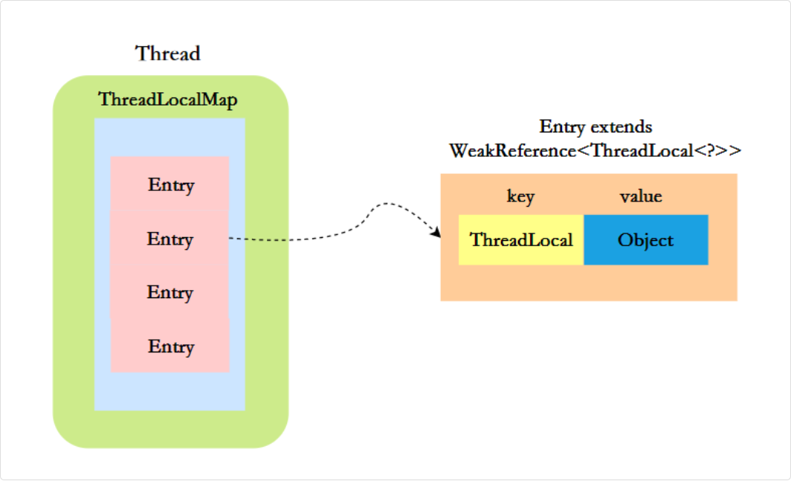

## ThreadLocal

ThreadLocal 是一种用于实现线程局部变量的工具类。它允许每个线程都拥有自己的独立副本，从而实现线程隔离

作用是：提供线程内的局部变量，不同的线程之间不会相互干扰，这种变量在线程的生命周期内起作用，减少同一个线程内多个函数或组件之间一些公共变量传递的复杂度

### 简介

> 简版回答

ThreadLocal 的实现原理是，每个线程维护一个 Map，key 为 ThreadLocal 对象，value 为想要实现线程隔离的对象。

1、通过 ThreadLocal 的 set 方法将对象存入 Map 中。
2、通过 ThreadLocal 的 get 方法从 Map 中取出对象。
3、Map 的大小由 ThreadLocal 对象的多少决定。

#### 使用示例

创建 ThreadLocal

```java
//创建一个ThreadLocal变量
public static ThreadLocal<String> localVariable = new ThreadLocal<>();
```

设置 ThreadLocal 的值

```java
//设置ThreadLocal变量的值
localVariable.set("沉默王二是沙雕");
```

获取 ThreadLocal 的值

```java
//获取ThreadLocal变量的值
String value = localVariable.get();
```

删除 ThreadLocal 的值

```java
//删除ThreadLocal变量的值
localVariable.remove();
```

在 Web 应用中，可以使用 ThreadLocal 存储用户会话信息，这样每个线程在处理用户请求时都能方便地访问当前用户的会话信息。

在数据库操作中，可以使用 ThreadLocal 存储数据库连接对象，每个线程有自己独立的数据库连接，从而避免了多线程竞争同一数据库连接的问题

#### 优点

每个线程访问的变量副本都是独立的，避免了共享变量引起的线程安全问题。由于 ThreadLocal 实现了变量的线程独占，使得变量不需要同步处理，因此能够避免资源竞争。

ThreadLocal 可用于跨方法、跨类时传递上下文数据，不需要在方法间传递参数。

比如我在一个对象中创建了一个 `public static` 的 threadLocals 变量

那么不同的线程来调用这个变量获取值时，会以该线程的 Thread 对象作为键去查找相应的 value，从而实现不同线程变量的独立

### 底层实现

当我们创建一个 ThreadLocal 对象并调用 set 方法时，其实是在当前线程中初始化了一个 ThreadLocalMap

值不是存在 ThreadLocal 实例里

- localVariable 本身只是一个"钥匙"
  - 它没有 value 字段来存数据
  - 值存在线程的 ThreadLocalMap 里

- 每个线程有自己的 threadLocals 属性
  - ThreadLocalMap 是一个自定义的 Map
  - 以 ThreadLocal 实例为 key，实际值为 value

#### set 方法

```java
// ThreadLocal.java
public void set(T value) {
    Thread t = Thread.currentThread();
    ThreadLocalMap map = getMap(t);
    if (map != null) {
        map.set(this, value);
    } else {
        createMap(t, value);
    }
}

ThreadLocalMap getMap(Thread t) {
    return t.threadLocals;
}

/**
 * Create the map associated with a ThreadLocal. Overridden in
 * InheritableThreadLocal.
 *
 * @param t the current thread
 * @param firstValue value for the initial entry of the map
 */
void createMap(Thread t, T firstValue) {
    t.threadLocals = new ThreadLocalMap(this, firstValue);
}
```

在调用 set 方法后，会先获取当前线程对象，去找对应线程的 `threadLocals` 变量，这个变量 是一个 `Map` 来存储该线程的保存在不同 `threadLocal` 实例中的本地变量

那如果发现该线程的 `threadLocals` 为null，说明之前没用过任何的 `threadLocal`，那么需要创建一个

其中 `threadLocals` 的 key 就是不同的 `ThreadLocal` 实例对象，而 value 则是对应存入的值

```java
public class Thread implements Runnable {
    ...
    /* ThreadLocal values pertaining to this thread. This map is maintained
    * by the ThreadLocal class. */
    ThreadLocal.ThreadLocalMap threadLocals = null;
    ...
}
```

> 所以调用某个 ThreadLocal 的实例对象，并不是存到这个实例对象里，而是间接放到我们这个线程里的一个变量中来保存
>
> 查找时，必然是根据 ThreadLocal 对象作为key去查找

#### get 方法

```java
 public T get() {
    Thread t = Thread.currentThread();
    ThreadLocalMap map = getMap(t);
    if (map != null) {
        ThreadLocalMap.Entry e = map.getEntry(this);
        if (e != null) {
            @SuppressWarnings("unchecked")
            T result = (T)e.value;
            return result;
        }
    }
    return setInitialValue();
}
```

同样的，get 方法就是通过当前线程，先获取当前线程的属性 `ThreadLocals`，如果这个是 null，那么必然没东西；如果不是null，那么就查下有没有 key 是当前这个 `ThreadLocal` 对象的值

找到的话就返回，没有就 `setInitialValue()` 设置一个 null 值，并帮助初始化下当前线程的 `ThreadLocals`

```java
private T setInitialValue() {
    T value = initialValue();
    Thread t = Thread.currentThread();
    ThreadLocalMap map = getMap(t);
    if (map != null) {
        map.set(this, value);
    } else {
        createMap(t, value);
    }
    // 检查当前这个 ThreadLocal 实例是不是 TerminatingThreadLocal 类型
    if (this instanceof TerminatingThreadLocal) {
        // 当线程结束时，JDK 可以通过这个注册表找到所有 TerminatingThreadLocal 实例，并调用它们的清理方法
        TerminatingThreadLocal.register((TerminatingThreadLocal<?>) this);
    }
    return value;
}

protected T initialValue() {
    return null;
}
```

#### `ThreadLocalMap`

> 从 ThreadLocal 的对象取值，并不是从它获取值，而是间接根据当前的 Thread 来获取值

ThreadLocalMap 是 ThreadLocal 的一个静态内部类，它内部维护了一个 Entry 数组

key 是 ThreadLocal 对象，value 是线程的局部变量，这样就相当于为每个线程维护了一个变量副本



Entry 继承了 WeakReference，它限定了 key 是一个**弱引用**，弱引用的好处是当内存不足时，JVM 会回收 ThreadLocal 对象，并且将其对应的 Entry.value 设置为 null，这样可以在很大程度上避免内存泄漏

### 弱引用和强引用

| 引用类型 | 垃圾回收行为 |
| --- | --- |
| **强引用** | 只要有强引用指向对象，**绝不会回收**（宁愿 OOM） |
| **弱引用** | 只要发生 GC，**无论内存够不够，都会回收**弱引用对象 |

强引用，比如 `User user = new User("111")` 中，user 就是一个强引用，`new User("111")` 就是强引用对象

当 user 被置为 null 时（user = null），`new User("111")`对象就会被垃圾回收；否则即便是内存空间不足，JVM 也不会回收 `new User("111")` 这个强引用对象，宁愿抛出 OutOfMemoryError

弱引用，比如说在使用 ThreadLocal 中，Entry 的 key 就是一个弱引用对象

```java
ThreadLocal<User> userThreadLocal = new ThreadLocal<>();
userThreadLocal.set(new User("111"));
```

userThreadLocal 是一个强引用，new ThreadLocal<>() 是一个强引用对象

调用 set 方法后，会将 `key = new ThreadLocal<>()` 放入当前线程对象的 ThreadLocalMap 中，此时的 key 是一个弱引用对象

当 JVM 进行垃圾回收时，如果发现了弱引用对象，就会将其回收

### 为什么要弱引用 (避免内存泄露)

在 ThreadLocalMap 中，Entry 的结构是这样的

```java
static class Entry extends WeakReference<ThreadLocal<?>> {
    Object value;
    
    Entry(ThreadLocal<?> k, Object v) {
        super(k);  // key 是弱引用
        value = v; // value 是强引用
    }
}
```

如果有这样的情况

```java
ThreadLocal<User> userThreadLocal = new ThreadLocal<>();
userThreadLocal.set(new User("111"));

// 假设外部把 userThreadLocal 置为 null
userThreadLocal = null;
```

但是会有一个 thread 对象的 `threadlocals` 的map对象的一个 `Entry` 的 value 是指向 `userThreadLocal`

- 如果 key 是强引用：ThreadLocalMap 还指着这个 ThreadLocal 对象，它永远无法被回收 → 内存泄漏
- key 是弱引用：GC 时发现这个 ThreadLocal 只有 Entry 的弱引用指着它，直接回收

#### value 还存在内存泄露

```plain
Entry {
    key: WeakReference<ThreadLocal>  // 弱引用，GC 可回收
    value: Object                     // 强引用，不会被自动回收！
}
```

所以 value 仍然可能泄漏！需要手动调用 remove()：

```java
userThreadLocal.remove();  // 清理 Entry
```

```java
// ThreadLocal.java
public void remove() {
    ThreadLocalMap m = getMap(Thread.currentThread());
    if (m != null) {
        m.remove(this);
    }
}
```
