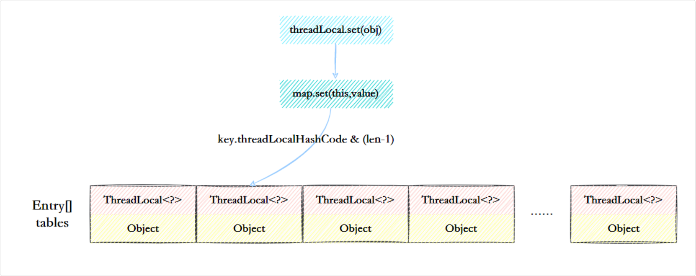

## ThreadLocal3

### ThreadLocalMap

每个 Thread 实例都有这么一个 `ThreadLocalMap threadlocals` 属性

ThreadLocalMap 虽然被叫做 Map，但它并没有实现 Map 接口，是一个简单的线性探测哈希表

```java
static class ThreadLocalMap {
    static class Entry extends WeakReference<ThreadLocal<?>> {
        Object value;

        Entry(ThreadLocal<?> k, Object v) {
            super(k);  // 这里的 Key 是 WeakReference
            value = v;
        }
    }

    private Entry[] table;  // 存储 ThreadLocal 变量的数组
    private int size;       // 当前 Entry 数量
    private int threshold;  // 触发扩容的阈值
}
```

底层的数据结构也是数组，数组中的每个元素是一个 Entry 对象，Entry 对象继承了 WeakReference，key 是 ThreadLocal 对象，value 是线程的局部变量



#### set方法

当调用 ThreadLocal.set(value) 时，会将 value 存入当前线程的 ThreadLocalMap

set() 方法是 ThreadLocalMap 的核心方法，通过 key 的哈希码与数组长度取模，计算出 key 在数组中的位置，这一点和 HashMap 的实现类似

```java
private void set(ThreadLocal<?> key, Object value) {
    Entry[] tab = table;
    int len = tab.length;
    int i = key.threadLocalHashCode & (len - 1); // 计算索引

    for (Entry e = tab[i]; e != null; e = tab[nextIndex(i, len)]) {
        ThreadLocal<?> k = e.get();
        if (k == key) { // 如果 key 已存在，更新 value
            e.value = value;
            return;
        }
        if (k == null) { // Key 为 null，清理无效 Entry
            replaceStaleEntry(key, value, i);
            return;
        }
    }
    
    tab[i] = new Entry(key, value); // 直接插入 Entry
    size++;
    if (size >= threshold) {
        rehash();
    }
}
```

#### ThreadLocalHashCode 计算

threadLocalHashCode 的计算有点东西，每创建一个 ThreadLocal 对象，它就会新增一个黄金分割数，可以让哈希码分布的非常均匀

```java
private static final int HASH_INCREMENT = 0x61c88647;

private static int nextHashCode() {
    return nextHashCode.getAndAdd(HASH_INCREMENT);
}
```

#### remove 方法

当调用 ThreadLocal.remove() 时，会调用 ThreadLocalMap 的 remove() 方法，根据 key 的哈希码找到对应的线程局部变量，将其清除，防止内存泄漏

#### ThreadLocalMap 怎么解决 Hash 冲突

开放定址法

如果计算得到的槽位 i 已经被占用，ThreadLocalMap 会采用开放地址法中的线性探测来寻找下一个空闲槽位：

如果 i 位置被占用，尝试 i+1。

如果 i+1 也被占用，继续探测 i+2，直到找到一个空位

如果到达数组末尾，则回到数组头部，继续寻找空位

```java
private static int nextIndex(int i, int len) {
    return ((i + 1 < len) ? i + 1 : 0);
}
```

##### 为什么要用线性探测法而不是HashMap 的拉链法来解决哈希冲突

ThreadLocalMap 设计的目的是存储线程私有数据，不会有大量的 Key，所以采用线性探测更节省空间。

拉链法还需要单独维护一个链表，甚至红黑树，不适合 ThreadLocal 这种场景

#### 扩容机制

> 一句话：ThreadLocalMap 采用的是“先清理再扩容”的策略，扩容时，数组长度翻倍，并重新计算索引，如果发生哈希冲突，采用线性探测法来解决

与 HashMap 不同，ThreadLocalMap 并不会直接在元素数量达到阈值时立即扩容，而是先清理被 GC 回收的 key，然后在填充率达到四分之三时进行扩容

阈值 threshold 的默认值是数组长度的三分之二

```java
private void setThreshold(int len) {
    threshold = len * 2 / 3;
}

private void rehash() {
    // 清理被 GC 回收的 key
    expungeStaleEntries();

    //扩容
    if (size >= threshold - threshold / 4)
        resize();
}
```

清理过程会遍历整个数组，将 key 为 null 的 Entry 清除

```java
private void expungeStaleEntries() {
    Entry[] tab = table;
    int len = tab.length;
    for (int j = 0; j < len; j++) {
        Entry e = tab[j];
        // 如果 key 为 null，清理 Entry
        if (e != null && e.get() == null)
            expungeStaleEntry(j);
    }
}
```

扩容时，会将数组长度翻倍，然后重新计算每个 Entry 的位置，采用线性探测法来寻找新的空位，然后将 Entry 放入新的数组中

```java
private void resize() {
    Entry[] oldTab = table;
    int oldLen = oldTab.length;
    // 扩容为原来的两倍
    int newLen = oldLen * 2;
    Entry[] newTab = new Entry[newLen];
    
    int count = 0;
    // 遍历老数组
    for (int j = 0; j < oldLen; ++j) {
        Entry e = oldTab[j];
        if (e != null) {
            ThreadLocal<?> k = e.get();
            if (k == null) {
                e.value = null; // 释放 Value，防止内存泄漏
            } else {
                // 重新计算位置
                int h = k.threadLocalHashCode & (newLen - 1);
                while (newTab[h] != null) {
                    // 线性探测寻找新位置
                    h = nextIndex(h, newLen);
                }
                // 放入新数组
                newTab[h] = e;
                count++;
            }
        }
    }
    table = newTab;
    size = count;
    threshold = newLen * 2 / 3; // 重新计算扩容阈值
}
```

#### 父线程能用 ThreadLocal 给子线程传值吗

不能

因为 ThreadLocal 变量存储在每个线程的 ThreadLocalMap 中，而子线程不会继承父线程的 ThreadLocalMap。

可以使用 `InheritableThreadLocal` 来解决这个问题

子线程在创建的时候会拷贝父线程的 InheritableThreadLocal 变量

##### `InheritableThreadLocal` 原理

在 Thread 类的定义中，每个线程都有两个 ThreadLocalMap：

```java
public class Thread {
    /* 普通 ThreadLocal 变量存储的地方 */
    ThreadLocal.ThreadLocalMap threadLocals = null;

    /* InheritableThreadLocal 变量存储的地方 */
    ThreadLocal.ThreadLocalMap inheritableThreadLocals = null;
}
```

普通 ThreadLocal 变量存储在 threadLocals 中，不会被子线程继承。

InheritableThreadLocal 变量存储在 inheritableThreadLocals 中，当 new Thread() 创建一个子线程时，Thread 的 init() 方法会检查父线程是否有 inheritableThreadLocals，如果有，就会拷贝 InheritableTh
