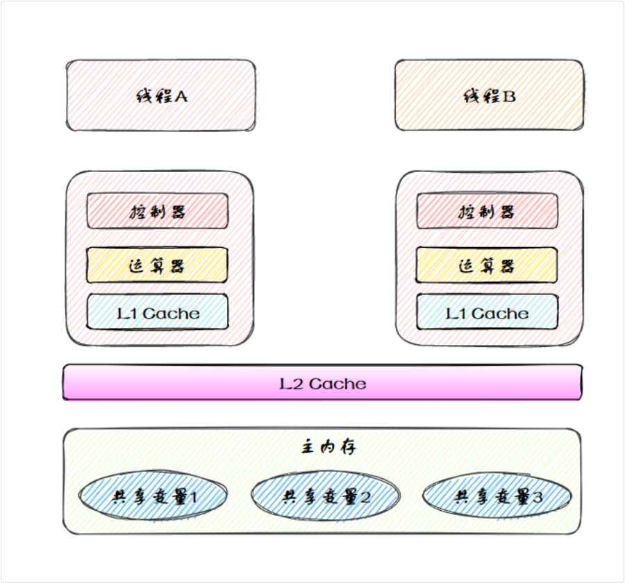
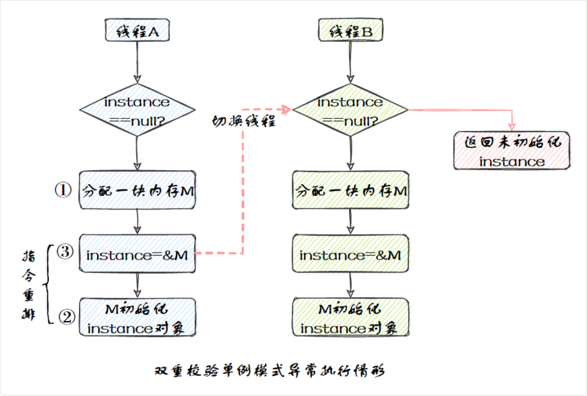

## 内存模型

Java 内存模型是 Java 虚拟机规范中定义的一个抽象模型，用来描述多线程环境中共享变量的内存可见性

共享变量存储在主内存中，每个线程都有一个私有的本地内存，存储了共享变量的副本。

- 当一个线程更改了本地内存中共享变量的副本，它需要 JVM 刷新到主内存中，以确保其他线程可以看到这些更改。
- 当一个线程需要读取共享变量时，它一半会从本地内存中读取。如果本地内存中的副本是过时的，JVM 会将主内存中的共享变量最新值刷新到本地内存中。



### 为什么线程要用自己的内存

线程从主内存拷贝变量到工作内存，可以减少 CPU 访问 RAM 的开销。

每个线程都有自己的变量副本，可以避免多个线程同时修改共享变量导致的数据冲突

### i++ 是原子操作吗

不是

包括三个步骤：

- 从内存中读取 i 的值。
- 对 i 进行加 1 操作。
- 将新的值写回内存。

### 三个特性

> 原子性要求一个操作是不可分割的，要么全部执行成功，要么完全不执行

就比如说 count++ 就不是一个原子操作，它包括读取 count 的值、加 1、写回 count 三个步骤，所以需要加锁或者使用AtomicInteger代替 int 来保证原子性

> 可见性要求一个线程对共享变量的修改，能够被其他线程及时看见

```java
private static boolean flag = true;

public static void main(String[] args) {
    new Thread(() -> {
        while (flag) {} // 线程 A 可能一直看不到 flag=false
        System.out.println("线程 A 退出");
    }).start();

    try { Thread.sleep(1000); } catch (InterruptedException e) {}

    flag = false; // 线程 B 修改 flag
}
```

线程 A 会在本地内存中缓存 flag=true，虽然线程 B 修改了 flag=false，但不会立即同步到主内存以及线程 A 的本地内存，因此线程 A 会一直处于死循环

解决办法就是通过 volatile 关键字来保证可见性

> 有序性是指程序执行的顺序是否按照代码编写的顺序执行

在单线程环境下，代码能够准确无误地按照编写顺序执行。但在多线程环境下，CPU 和编译器可能会进行指令重排，代码的执行顺序因此会发生变化

简要回答：

原子性保证操作不可中断，可见性保证变量修改后线程能看到最新值，有序性保证代码执行顺序一致，可以通过 volatile、synchronized 和 CAS 机制来保证这些特性

### 指令重排

指令重排是指 CPU 或编译器为了提高程序的执行效率，改变代码执行顺序的一种优化技术。

从 Java 源代码到最终执行的指令序列，会经历 3 种重排序：编译器重排序、指令并行重排序、内存系统重排序。

指令重排可能会导致双重检查锁失效，比如下面的单例模式代码：

```java
public class Singleton {
    private static Singleton instance;

    public static Singleton getInstance() {
        if (instance == null) { // 第一次检查
            synchronized (Singleton.class) {
                if (instance == null) { // 第二次检查
                    instance = new Singleton(); // 可能发生指令重排
                }
            }
        }
        return instance;
    }
}
```

如果线程 A 执行了 `instance = new Singleton();`，但构造方法还没执行完，线程 B 可能会读取到一个未初始化的对象，导致出现空指针异常



正确的方式是给 instance 变量加上 volatile 关键字，禁止指令重排

```java
class Singleton {
    private static volatile Singleton instance;

    public static Singleton getInstance() {
        if (instance == null) {
            synchronized (Singleton.class) {
                if (instance == null) {
                    instance = new Singleton(); // 由于 volatile，禁止指令重排
                }
            }
        }
        return instance;
    }
}
```

### happens-before

Happens-Before 是 Java 内存模型定义的一种保证线程间可见性和有序性的规则

如果操作 A Happens-Before 操作 B，那么：

- 操作 A 的结果对操作 B 可见。
- 操作 A 在时间上先于操作 B 执行。

换句话说，如果 A Happens-Before B，那么 A 的修改必须对 B 可见，并且 B 不能重排序到 A 之前
