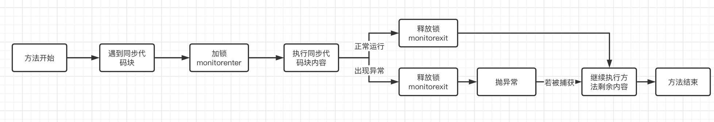
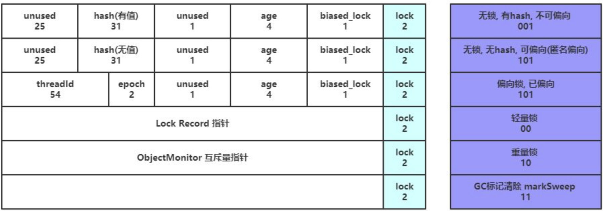

## JUC1

### 进程与线程

### 并发与并行

#### 顺序执行

顺序执行其实很好理解，就是我们依次去将这些任务完成了

#### 并发执行

并发执行也是我们同一时间只能处理一个任务，但是我们可以每个任务轮着做（时间片轮转）

只要我们单次处理分配的时间足够的短，在宏观看来，就是三个任务在同时进行。

而我们Java中的线程，正是这种机制，当我们需要同时处理上百个上千个任务时，很明显CPU的数量是不可能赶得上我们的线程数的，所以说这时就要求我们的程序有良好的并发性能，来应对同一时间大量的任务处理。学习Java并发编程，能够让我们在以后的实际场景中，知道该如何应对高并发的情况

#### 并行执行

并行执行就突破了同一时间只能处理一个任务的限制，我们同一时间可以做多个任务

比如我们要进行一些排序操作，就可以用到并行计算，只需要等待所有子任务完成，最后将结果汇总即可。包括分布式计算模型MapReduce，也是采用的并行计算思路

### 锁机制

通过 `synchronized` 关键字，可以实现加锁功能，这样就能够很好地解决线程之间争抢资源的情况

使用 `synchronized`，一定是和某个对象相关联的，比如我们要对某一段代码加锁，那么我们就需要提供一个对象来作为锁本身：

```java
public static void main(String[] args) {
  synchronized (Main.class) {
      //这里使用的是Main类的Class对象作为锁
  }
}
```

对应的字节码为：

```java
 0 ldc #7 <com/ekko/Main>
 2 dup
 3 astore_1
 4 monitorenter
 5 aload_1
 6 monitorexit
 7 goto 15 (+8)
10 astore_2
11 aload_1
12 monitorexit
13 aload_2
14 athrow
15 return
```

#### 1. 准备锁对象

- `0: ldc #7 <com/ekko/Main>`
  - **动作**：从常量池加载 `com.ekko.Main` 的类对象（Class Object）
  - **栈**：`[ ClassRef ]`
  - **说明**：我们要对这个类对象加锁

- `2: dup`
  - **动作**：复印栈顶的 Class 引用
  - **栈**：`[ ClassRef, ClassRef ]`
  - 一份引用要马上被 `monitorenter` 吃掉用来加锁。
  - 另一份引用必须保存起来（存入局部变量），以备将来 **解锁（monitorexit）** 时使用

#### 2. 加锁并执行

每个对象都有一个`monitor`监视器与之对应，而这里正是去获取对象监视器的所有权，一旦`monitor`所有权被某个线程持有，那么其他线程将无法获得（管程模型的一种实现）

- `3: astore_1`
  - **动作**：把栈顶的一份引用弹出，存入局部变量表 Slot 1
  - **栈**：`[ ClassRef ]`
  - **说明**：Slot 1 里的这个变量就是我们备份的“锁对象”

- `4: monitorenter`
  - **动作**：弹出栈顶剩下的那个 Class 引用，尝试获取它的 Monitor 锁
  - **栈**：`[ ]`
  - **说明**：代码执行到这，线程就持有了锁

- **`5: aload_1`**
  - **动作**：从 Slot 1 把刚才备份的 Class 引用拿出来，压入栈顶
  - **栈**：`[ ClassRef ]`
  - **说明**：因为同步块里是空的，没有任何业务逻辑，所以直接准备解锁了。为了解锁，必须先把锁对象拿回栈上

- **`6: monitorexit`**
  - **动作**：弹出栈顶引用，释放锁。
  - **栈**：`[ ]`
  - **说明**：正常执行结束，释放锁。
- **`7: goto 15`**
  - **动作**：跳到第 15 行（return），结束方法。

#### 3. 捕获异常

在 10 - 14 行是编译器自动生成的**异常处理逻辑**

JVM 必须保证：**即使同步块里抛出了异常，锁也必须被释放，否则会造成死锁**

- `10: astore_2`
  - **触发场景**：如果在第 4 行 (`monitorenter`) 到第 6 行 (`monitorexit`) 之间发生了异常，程序会跳到这里（通过异常表跳转）
  - **动作**：把捕获到的**异常对象**保存到 Slot 2
  
- `11: aload_1`
  - **动作**：赶紧把 Slot 1 里备份的锁对象拿出来。
  - **说明**：这时候你就明白为什么最开始需要 `dup` 和 `astore_1` 了吧？就是为了这种危急时刻能找到锁对象

- `12: monitorexit`
  - **动作**：释放锁。
  - **说明**：确保锁被释放

- `13: aload_2`
  - **动作**：把刚才存起来的异常对象拿回栈顶

- `14: athrow`
  - **动作**：把异常重新抛出去，让外层代码处理



#### 对象头

对象是存放在堆内存中的，而每个对象内部，都有一部分空间用于存储对象头信息，而对象头信息中，则包含了Mark Word用于存放hashCode和对象的锁信息，在不同状态下，它存储的数据结构有一些不同

##### 对象头的组成结构

在 64 位 JVM（开启指针压缩）中，普通对象的对象头通常占用 **12 字节**。它主要包含三个部分（如果是数组则是三个）：

| **组成部分** | **英文名称** | **大小 (64位 JVM)** | **作用描述** |
| --- | --- | --- | --- |
| **标记字段** | **Mark Word** | 8 字节 (64 bit) | **核心** 存储对象的运行时数据：哈希码、GC分代年龄、锁状态标志等。 |
| **类型指针** | **Klass Pointer** | 4 字节 (开启压缩) | 指向方法区中该类的元数据（Class 对象），JVM 通过它知道“我是谁”。 |
| **数组长度** | **Array Length** | 4 字节 | **仅数组对象才有** 记录数组的长度|

##### Mark Word

这是对象头里最复杂、最动态的部分

为了节省内存，Mark Word 的格式是不固定的，它会随着对象状态的变化而“复用”这 64 个 bit



它主要记录以下几类信息：

- 锁状态：你刚才问的 synchronized，锁到底存在哪？就存在这里

- GC 信息：对象活了多久（年龄）

- 身份信息：对象的 HashCode

| **锁状态** | **存储内容** | **锁标志位 (最后2bit)** |
| --- | --- | --- |
| **无锁 (Normal)** | `Unused` (25bit) + `HashCode` (31bit) + `GC年龄` (4bit) | `01` |
| **偏向锁 (Biased)** | `Thread ID` (线程ID) + `Epoch` + `GC年龄` (4bit) | `01` (偏向位 1) |
| **轻量级锁 (Lightweight)** | 指向栈中**锁记录 (Lock Record)** 的指针 | `00` |
| **重量级锁 (Heavyweight)** | 指向堆中 **Monitor (互斥量)** 的指针 | `10` |
| **GC 标记** | 空 | `11` |

##### 内存示例

假设你写了一个简单的类：

```java
class Hero {
    int hp; // 4 bytes
}
Hero h = new Hero();
```

这个对象 h 在内存里长这样（开启指针压缩）：

```
|----------------------------------------------------------|
|                     Object Header (12 Bytes)             |
|----------------------------------------------------------|
|  Mark Word (8 Bytes)   |  Klass Pointer (4 Bytes)        |
|  (锁/Hash/Age)         |  (指向 Hero.class)               |
|----------------------------------------------------------|
|                     Instance Data (4 Bytes)              |
|----------------------------------------------------------|
|  int hp (4 Bytes)                                        |
|----------------------------------------------------------|
|                     Padding (对齐填充)                    |
|----------------------------------------------------------|
|  JVM 要求对象大小必须是 8 的倍数。                        |
|  12 + 4 = 16，正好是 8 的倍数，所以这里不需要 Padding。      |
|----------------------------------------------------------|
```
