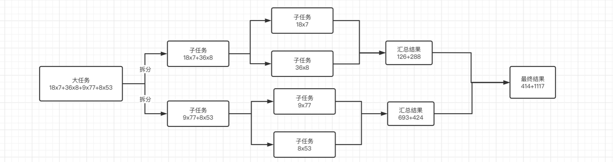
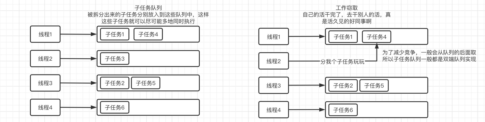

## 并发工具类2

### 信号量 Semaphore

信号量机制在解决进程之间的同步问题中起着非常大的作用。

> 信号量(Semaphore)，有时被称为信号灯，是在多线程环境下使用的一种设施，是可以用来保证两个或多个关键代码段不被并发调用。在进入一个关键代码段之前，线程必须获取一个信号量；一旦该关键代码段完成了，那么该线程必须释放信号量。其它想进入该关键代码段的线程必须等待直到第一个线程释放信号量。

通过使用信号量，我们可以决定某个资源同一时间能够被访问的最大线程数，它相当于对某个资源的访问进行了流量控制。

简单来说，它就是一个可以被N个线程占用的排它锁（因此也支持公平和非公平模式）

我们可以在最开始设定Semaphore的许可证数量

每个线程都可以获得1个或n个许可证

当许可证耗尽或不足以供其他线程获取时，其他线程将被阻塞。

```java
public static void main(String[] args) throws ExecutionException, InterruptedException {
    // 每一个Semaphore都会在一开始获得指定的许可证数数量，也就是许可证配额
    Semaphore semaphore = new Semaphore(2);   //许可证配额设定为2

    for (int i = 0; i < 3; i++) {
        new Thread(() -> {
            try {
                // 申请一个许可证
                // 没参数默认一个 | 可以指定数量
                semaphore.acquire();
                System.out.println("许可证申请成功！");
                semaphore.release();   // 归还一个许可证
            } catch (InterruptedException e) {
                e.printStackTrace();
            }
        }).start();
    }
}
```

#### 获取信息

我们也可以通过Semaphore获取一些常规信息：

```java
public static void main(String[] args) throws InterruptedException {
    // 只配置一个许可证，5个线程进行争抢，不内卷还想要许可证？
    Semaphore semaphore = new Semaphore(3);
    for (int i = 0; i < 5; i++)
        new Thread(semaphore::acquireUninterruptibly).start();   
        // 可以以不响应中断（主要是能简写一行，方便）
    Thread.sleep(500);
    System.out.println("剩余许可证数量："+semaphore.availablePermits());
    System.out.println("是否存在线程等待许可证："+(semaphore.hasQueuedThreads() ? "是" : "否"));
    System.out.println("等待许可证线程数量："+semaphore.getQueueLength());
}
```

#### 手动回收剩下的许可证

我们可以手动回收掉所有的许可证：

```java
public static void main(String[] args) throws InterruptedException {
    Semaphore semaphore = new Semaphore(3);
    new Thread(semaphore::acquireUninterruptibly).start();
    Thread.sleep(500);
    System.out.println("收回剩余许可数量："+semaphore.drainPermits());   
    //直接回收掉剩余的许可证
}
```

这里我们模拟一下，比如现在有10个线程同时进行任务，任务要求是执行某个方法，但是这个方法最多同时只能由5个线程执行，这里我们使用信号量就非常合适。

### 数据交换 Exchanger

线程之间的数据传递也可以这么简单。

使用`Exchanger`，它能够实现线程之间的数据交换：

```java
public static void main(String[] args) throws InterruptedException {
    Exchanger<String> exchanger = new Exchanger<>();
    new Thread(() -> {
        try {
            System.out.println("收到主线程传递的交换数据："+exchanger.exchange("AAAA"));
        } catch (InterruptedException e) {
            e.printStackTrace();
        }
    }).start();
    System.out.println("收到子线程传递的交换数据："+exchanger.exchange("BBBB"));
}
```

在调用`exchange`方法后，当前线程会等待其他线程调用同一个exchanger对象的`exchange`方法，当另一个线程也调用之后，方法会返回对方线程传入的参数。

当然这里的 `exchange` 是要一个对象，如果一个线程 `exchanger.exchange("BBBB")`, 另一个没有，会一直阻塞等待

可见功能还是比较简单的。

### Fork/Join框架

在JDK7时，出现了一个新的框架用于并行执行任务，它的目的是为了把大型任务拆分为多个小任务，最后汇总多个小任务的结果，得到整大任务的结果，并且这些小任务都是同时在进行，大大提高运算效率。

Fork就是拆分，Join就是合并。

我们来演示一下实际的情况，比如一个算式：18x7+36x8+9x77+8x53，可以拆分为四个小任务：18x7、36x8、9x77、8x53，最后我们只需要将这四个任务的结果加起来，就是我们原本算式的结果了，有点归并排序的味道。



它不仅仅只是拆分任务并使用多线程，而且还可以利用工作窃取算法，提高线程的利用率。

> **工作窃取算法：** 是指某个线程从其他队列里窃取任务来执行。一个大任务分割为若干个互不依赖的子任务，为了减少线程间的竞争，把这些子任务分别放到不同的队列里，并为每个队列创建一个单独的线程来执行队列里的任务，线程和队列一一对应。但是有的线程会先把自己队列里的任务干完，而其他线程对应的队列里还有任务待处理。干完活的线程与其等着，不如帮其他线程干活，于是它就去其他线程的队列里窃取一个任务来执行。



#### 简单示例

现在我们来看看如何使用它，这里以计算1-1000的和为例，我们可以将其拆分为8个小段的数相加，比如1-125、126-250... ，最后再汇总即可，它也是依靠线程池来实现的

只需要先new一个 `ForkJoinPool` 对象

然后建立一个继承于 `RecursiveTask<?>` 的 子任务类

之后再new子任务并提交到 `ForkJoinPool` 对象

```java
public class Main {
    public static void main(String[] args) throws InterruptedException, ExecutionException {
        ForkJoinPool pool = new ForkJoinPool();
        System.out.println(pool.submit(new SubTask(1, 1000)).get());
    }


    // 继承RecursiveTask，这样才可以作为一个任务，泛型就是计算结果类型
    // 需要实现 compute() 方法
    // 即子任务的处理逻辑
    private static class SubTask extends RecursiveTask<Integer> {
        
        // 比如我们要计算一个范围内所有数的和，那么就需要限定一下范围
        // 这里用了两个int存放
        private final int start;
        private final int end;

        public SubTask(int start, int end) {
            this.start = start;
            this.end = end;
        }

        @Override
        protected Integer compute() {
            if(end - start > 125) {    
                // 每个任务最多计算125个数的和
                // 如果大于继续拆分，小于就可以开始算了
                SubTask subTask1 = new SubTask(start, (end + start) / 2);
                // 会继续划分子任务执行
                subTask1.fork();
                SubTask subTask2 = new SubTask((end + start) / 2 + 1, end);
                // 会继续划分子任务执行
                subTask2.fork();   

                // 返回这两个子任务结果
                return subTask1.join() + subTask2.join();
            } else {
                System.out.println(Thread.currentThread().getName()+" 开始计算 "+start+"-"+end+" 的值!");
                int res = 0;
                for (int i = start; i <= end; i++) {
                    res += i;
                }
                return res;   //返回的结果会作为join的结果
            }
        }
    }
}
```

```
ForkJoinPool-1-worker-2 开始计算 1-125 的值!
ForkJoinPool-1-worker-2 开始计算 126-250 的值!
ForkJoinPool-1-worker-0 开始计算 376-500 的值!
ForkJoinPool-1-worker-6 开始计算 751-875 的值!
ForkJoinPool-1-worker-3 开始计算 626-750 的值!
ForkJoinPool-1-worker-5 开始计算 501-625 的值!
ForkJoinPool-1-worker-4 开始计算 251-375 的值!
ForkJoinPool-1-worker-7 开始计算 876-1000 的值!
500500
```

可以看到，结果非常正确，但是整个计算任务实际上是拆分为了8个子任务同时完成的，结合多线程，原本的单线程任务，在多线程的加持下速度成倍提升。

包括Arrays工具类提供的并行排序也是利用了`ForkJoinPool`来实现：

```java
public static void parallelSort(byte[] a) {
    int n = a.length, p, g;
    if (n <= MIN_ARRAY_SORT_GRAN ||
        (p = ForkJoinPool.getCommonPoolParallelism()) == 1)
        DualPivotQuicksort.sort(a, 0, n - 1);
    else
        new ArraysParallelSortHelpers.FJByte.Sorter
            (null, a, new byte[n], 0, n, 0,
             ((g = n / (p << 2)) <= MIN_ARRAY_SORT_GRAN) ?
             MIN_ARRAY_SORT_GRAN : g).invoke();
}
```

并行排序的性能在多核心CPU环境下，肯定是优于普通排序的，并且排序规模越大优势越显著。

至此，并发编程篇完结
