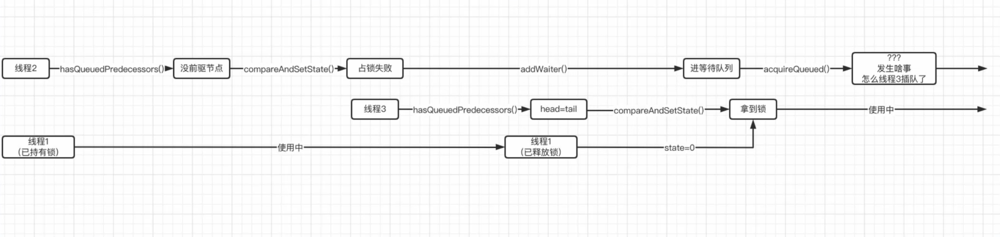
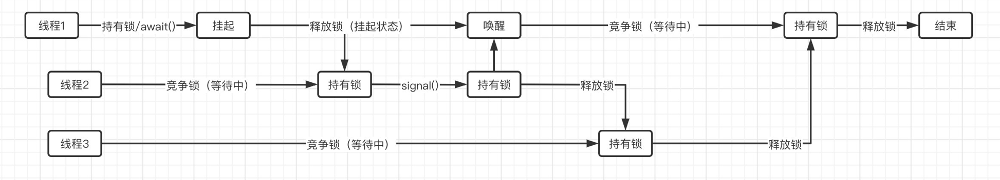

## JUC5

### 公平锁一定公平吗？

前面我们讲解了公平锁的实现原理，那么，我们尝试分析一下，在并发的情况下，公平锁一定公平吗？

我们再次来回顾一下`tryAcquire()`方法的实现：

```java
@ReservedStackAccess
protected final boolean tryAcquire(int acquires) {
    final Thread current = Thread.currentThread();
    int c = getState();
    if (c == 0) {
        // 注意这里，公平锁的机制是，一开始会查看是否有节点处于等待
        // 通过 hasQueuedPredecessors() 判断是否有等待队列 没有说明可以抢锁
        if (!hasQueuedPredecessors() &&
            compareAndSetState(0, acquires)) {   
            // 如果前面的方法执行后发现没有等待节点，就直接进入占锁环节了
            setExclusiveOwnerThread(current);
            return true;
        }
    }
    else if (current == getExclusiveOwnerThread()) {
        int nextc = c + acquires;
        if (nextc < 0)
            throw new Error("Maximum lock count exceeded");
        setState(nextc);
        return true;
    }
    return false;
}
```

所以`hasQueuedPredecessors()`这个环节容不得半点闪失，否则会直接破坏掉公平性，假如现在出现了这样的情况：

```java
public final void acquire(int arg) {
    // tryAcquire 尝试获取锁
    // 如果未成功 
    // addWaiter(Node.EXCLUSIVE)
    // 然后 acquireQueued()
    if (!tryAcquire(arg) &&
        acquireQueued(addWaiter(Node.EXCLUSIVE), arg))   
        // 节点为独占模式Node.EXCLUSIVE
        selfInterrupt();
}
```

线程1已经持有锁了 (线程1 获取锁的时候因为没有竞争，所以就直接得到锁，并不需要初始化AQS队列)

这时线程2来争抢这把锁，`tryAcquire()` 必然返回 `false`，因此线程2就会进入到等待队列中, 也就是 `acquireQueued(addWaiter(Node.EXCLUSIVE), arg)`

假设线程2是第二个来获取锁的，那么AQS显然还没有队列

```java
private Node addWaiter(Node mode) {
    Node node = new Node(Thread.currentThread(), mode);
    Node pred = tail;
    if (pred != null) {   
        // 由于一开始head和tail都是null，所以线程2直接就进enq()了
        node.prev = pred;
        if (compareAndSetTail(pred, node)) {
            pred.next = node;
            return node;
        }
    }
    enq(node);   //请看上面
    return node;
}
```

因此就直接进入 `enq` 方法，自旋尝试获取锁：

```java
private Node enq(final Node node) {
    for (;;) {
        Node t = tail;
        if (t == null) { 
            // 线程2进来之后，肯定是要先走这里的，因为head和tail都是null
            // 建立一个虚拟头结点
            if (compareAndSetHead(new Node()))
                tail = head;   
                // 这里就将tail直接等于head了，注意这里完了之后还没完，这里只是初始化过程
        } else {
            node.prev = t;
            if (compareAndSetTail(t, node)) {
                t.next = node;
                return t;
            }
        }
    }
}
```

此时线程2 刚好完成 `compareAndSetHead(new Node())` 把头结点设置了一个虚拟节点，但还没有执行到 `tail = head;` 因此此时 `head != tail`

而碰巧不巧，这个时候线程3也来抢锁了，这时刚好线程1释放锁，这样 `state == 0` 然后按照正常流程就走到了`hasQueuedPredecessors()`方法，而在此方法中：

```java
public final boolean hasQueuedPredecessors() {
    Node t = tail; // Read fields in reverse initialization order
    Node h = head;
    Node s;
    // 这里直接判断h != t，而此时线程2才刚刚执行完 tail = head，所以直接就返回false了
    return h != t &&
        ((s = h.next) == null || s.thread != Thread.currentThread());
}
```

因此，线程3这时就紧接着准备开始CAS操作了，来抢锁了

现在的情况就是，线程3直接开始CAS判断，而线程2还在插入节点状态，结果可想而知，居然是线程3先拿到了锁，这显然是违背了公平锁的公平机制。

一张图就是：



因此公不公平全看`hasQueuedPredecessors()`，而此方法只有在等待队列中存在节点时才能保证不会出现问题。

所以公平锁，只有在等待队列存在节点时，才是真正公平的。

### Condition实现原理

`Condition`类实际上就是用于代替传统对象的wait/notify操作的，同样可以实现等待/通知模式，并且同一把锁下可以创建多个Condition对象

先从单个`Condition`对象进行分析：

#### `ConditionObject`

`ConditionObject` 是 `Condition` 的实现类，是在 `AQS` 类的内部类

在AQS中，`Condition`有一个实现类`ConditionObject`，而这里也是使用了链表实现了条件队列

这里实现的是一个单向队列，`ConditionObject` 记录队列的头结点和尾节点

```java
public class ConditionObject implements Condition, java.io.Serializable {
    private static final long serialVersionUID = 1173984872572414699L;
    /** 条件队列的头结点 */
    private transient Node firstWaiter;
    /** 条件队列的尾结点 */
    private transient Node lastWaiter;
  
    //...
}
```

这里是直接使用了`AQS`中的`Node`类，但是使用的是`Node`类中的`nextWaiter`字段连接节点，并且Node的status为`CONDITION`

也就是，如果你这个线程对应节点被放到了条件队列里，那么此时看的就是对应的 `nextWaiter`字段，在等待队列那些 `prev` 以及 `next` 就没啥用了


我们知道，当一个线程调用`await()`方法时，会进入等待状态，直到其他线程调用`signal()`方法将其唤醒，而这里的条件队列，正是用于存储这些处于等待状态的线程

##### `await()`源码分析

我们先来看看最关键的`await()`方法是如何实现的

先明确此方法的目标：

- 只有已**经持有锁的线程才可以使用此方法**

- 当调用此方法后，**会直接释放锁**，无论加了多少次锁

- 只有其他线程调用`signal()`或是被中断时才会唤醒等待中的线程

- 被唤醒后，需要等待其他线程释放锁，拿到锁之后才可以继续执行，并且会恢复到之前的状态（await之前加了几层锁唤醒后依然是几层锁）

具体源码

```java
public final void await() throws InterruptedException {
    // 如果在调用await之前就被添加了中断标记，那么会直接抛出中断异常
    if (Thread.interrupted())
        throw new InterruptedException();   
    
    // 为当前线程创建一个新的节点，并将其加入到条件队列中
    // Node node = new Node(Thread.currentThread(), Node.CONDITION);
    // 对应线程id + 状态为 CONDITION -2
    Node node = addConditionWaiter();

    // 完全释放当前线程持有的锁，并且保存一下state值，因为唤醒之后还得恢复
    int savedState = fullyRelease(node);
    // 用于保存中断状态
    int interruptMode = 0;

    // 循环判断是否位于同步队列中
    // 如果等待状态下的线程被其他线程唤醒，那么会正常进入到AQS的等待队列中
    while (!isOnSyncQueue(node)) {
        // SyncQueue 就是等待队列 看 node 是否在等待队列
        // 不在 说明还是 await 状态
        // 需要挂起

        // 如果依然处于等待状态，那么继续挂起
        LockSupport.park(this);
        if ((interruptMode = checkInterruptWhileWaiting(node)) != 0)   //看看等待的时候是不是被中断了
            break;
    }

    // 只有被其他线程唤醒，送到了等待队列里了
    // 出了循环之后，那线程肯定是已经醒了，这时就差拿到锁就可以恢复运行了
    // 正常排队尝试获取锁

    // acquireQueued 自旋不断尝试获取锁，savedState 直接锁几层
    if (acquireQueued(node, savedState) && interruptMode != THROW_IE)  
        // 直接开始acquireQueued尝试拿锁（之前已经讲过了）从这里开始基本就和一个线程去抢锁是一样的了
        interruptMode = REINTERRUPT;
    
    // 已经拿到锁了，基本可以开始继续运行了，这里再进行一下后期清理工作
    if (node.nextWaiter != null) 
        unlinkCancelledWaiters();  
        // 将等待队列中，不是Node.CONDITION状态的节点移除
    
    if (interruptMode != 0)   // 依然是响应中断
        reportInterruptAfterWait(interruptMode);
   //OK，接着该干嘛干嘛
}


/**
 * Adds a new waiter to wait queue.
 * @return its new wait node
 */
// 把新节点挂到链表尾部
private Node addConditionWaiter() {
    Node t = lastWaiter;
    // If lastWaiter is cancelled, clean out.
    if (t != null && t.waitStatus != Node.CONDITION) {
        unlinkCancelledWaiters();
        t = lastWaiter;
    }
    Node node = new Node(Thread.currentThread(), Node.CONDITION);
    if (t == null)
        firstWaiter = node;
    else
        t.nextWaiter = node;
    lastWaiter = node;
    return node;
}

// 从单向等待队列中剔除所有“已取消”的节点，回收内存并保持队列整洁
private void unlinkCancelledWaiters() {
    Node t = firstWaiter;
    // 记录t的前一个节点
    Node trail = null;
    while (t != null) {
        Node next = t.nextWaiter;
        if (t.waitStatus != Node.CONDITION) {
            // 说明该节点已失效（被取消或中断）
            t.nextWaiter = null;
            if (trail == null)
                // 表明失效的头结点，那么 firstWaiter = next
                firstWaiter = next;
            else
                trail.nextWaiter = next;
            if (next == null)
                // 失效的是尾节点 lastWaiter = trail;
                lastWaiter = trail;
        }
        else
            trail = t;
        t = next;
    }
}
```

##### `signal()`源码分析

接着来看`signal()`方法是如何实现的

同样的，先明确signal的目标：

- 只有持有锁的线程才能唤醒锁所属的Condition等待的线程

- 优先唤醒条件队列中的第一个，如果唤醒过程中出现问题，接着找往下找，直到找到一个可以唤醒的

- 唤醒操作本质上是**将条件队列中的结点直接丢进AQS等待队列**中，让其参与到锁的竞争中

- 拿到锁之后，线程才能恢复运行


对应源码：

```java
public final void signal() {
    // 先看看当前线程是不是持有锁的状态
    if (!isHeldExclusively())
        // 不是？那你不配唤醒别人
        throw new IllegalMonitorStateException();

    // 获取条件队列的第一个结点
    Node first = firstWaiter;
    if (first != null)    
        // 如果队列不为空，获取到了，那么就可以开始唤醒操作
        doSignal(first);
}
```

对应的 `doSignal(first)`

```java
private void doSignal(Node first) {
    do {
        // 如果当前节点在本轮循环没有后继节点了，条件队列就为空了
        if ( (firstWaiter = first.nextWaiter) == null)   
            lastWaiter = null;   // 所以这里相当于是直接清空
        
        // 将这个被唤醒节点的下一个nextWaiter设置为null
        // 因为当前结点马上就会离开条件队列了
        first.nextWaiter = null;   
    } while (!transferForSignal(first) &&   // 将该节点唤醒到等待队列
             (first = firstWaiter) != null);   // 能走到这里只能说明给定节点被设定为取消状态，那就继续看下一个结点
}
```

```java
final boolean transferForSignal(Node node) {
    /*
     * 如果这里CAS失败，那有可能此节点被设定为了取消状态
     */
    if (!compareAndSetWaitStatus(node, Node.CONDITION, 0))
        return false;

    // CAS成功之后，结点的等待状态就变成了默认值0
    // 接着通过enq方法直接将节点丢进AQS的等待队列中，相当于唤醒并且可以等待获取锁了
    // 这里enq方法返回的是加入之后等待队列队尾的前驱节点，就是原来的tail
    Node p = enq(node);
    int ws = p.waitStatus;   // 保存前驱结点的等待状态
    
    //如果上一个节点的状态为取消, 或者尝试设置上一个节点的状态为SIGNAL失败（可能是在ws>0判断完之后马上变成了取消状态，导致CAS失败）
    // 如果前驱节点已经不可靠（取消了）或者设置前驱状态失败，为了保险起见，立刻唤醒当前线程
    // Node.SIGNAL 表示该节点的下一个节点要被唤醒
    if (ws > 0 || !compareAndSetWaitStatus(p, ws, Node.SIGNAL))
        LockSupport.unpark(node.thread);  
        // 直接唤醒线程
    return true;
}
```

> 其实最让人不理解的就是倒数第二行，明明上面都正常进入到AQS等待队列了，应该是可以开始走正常流程了，那么这里为什么还要提前来一次unpark呢？
>
> 这里其实是为了进行优化而编写，直接unpark会有两种情况：
>
> - 如果插入结点前，AQS等待队列的队尾节点就已经被取消，则满足wc > 0
> - 如果插入node后，AQS内部等待队列的队尾节点已经稳定，满足`tail.waitStatus == 0`，但在执行`ws > 0`之后`!compareAndSetWaitStatus(p, ws, Node.SIGNAL)`之前被取消，则CAS也会失败，满足`compareAndSetWaitStatus(p, ws, Node.SIGNAL) == false`
>
> 如果这里被提前unpark，那么在`await()`方法中将可以被直接唤醒，并跳出while循环，直接开始争抢锁，因为前一个等待结点是被取消的状态，没有必要再等它了。

所以，大致流程下：



### 自行实现锁类

既然前面了解了那么多AQS的功能，那么我就仿照着这些锁类来实现一个简单的锁：

- 要求：同一时间只能有一个线程持有锁，不要求可重入（反复加锁无视即可）

```java
public class Main {
    public static void main(String[] args) throws InterruptedException {
        
    }

    /**
     * 自行实现一个最普通的独占锁
     * 要求：同一时间只能有一个线程持有锁，不要求可重入
     */
    private static class MyLock implements Lock {

        /**
         * 设计思路：
         * 1. 锁被占用，那么exclusiveOwnerThread应该被记录，并且state = 1
         * 2. 锁没有被占用，那么exclusiveOwnerThread为null，并且state = 0
         */
        private static class Sync extends AbstractQueuedSynchronizer {
            @Override
            protected boolean tryAcquire(int arg) {
                if(isHeldExclusively()) return true;     //无需可重入功能，如果是当前线程直接返回true
                if(compareAndSetState(0, arg)){    //CAS操作进行状态替换
                    setExclusiveOwnerThread(Thread.currentThread());    //成功后设置当前的所有者线程
                    return true;
                }
                return false;
            }

            @Override
            protected boolean tryRelease(int arg) {
                if(getState() == 0)
                    throw new IllegalMonitorStateException();   //没加锁情况下是不能直接解锁的
                if(isHeldExclusively()){     //只有持有锁的线程才能解锁
                    setExclusiveOwnerThread(null);    //设置所有者线程为null
                    setState(0);    //状态变为0
                    return true;
                }
                return false;
            }

            @Override
            protected boolean isHeldExclusively() {
                return getExclusiveOwnerThread() == Thread.currentThread();
            }

            protected Condition newCondition(){
                return new ConditionObject();    //直接用现成的
            }
        }

        private final Sync sync = new Sync();

        @Override
        public void lock() {
            sync.acquire(1);
        }

        @Override
        public void lockInterruptibly() throws InterruptedException {
            sync.acquireInterruptibly(1);
        }

        @Override
        public boolean tryLock() {
            return sync.tryAcquire(1);
        }

        @Override
        public boolean tryLock(long time, TimeUnit unit) throws InterruptedException {
            return sync.tryAcquireNanos(1, unit.toNanos(time));
        }

        @Override
        public void unlock() {
            sync.release(1);
        }

        @Override
        public Condition newCondition() {
            return sync.newCondition();
        }
    }
}
```

到这里，我们对应队列同步器AQS的讲解就先到此为止了，当然，AQS的全部机制并非仅仅只有我们讲解的内容，一些我们没有提到的内容，还请各位观众自行探索，会有满满的成就感哦
