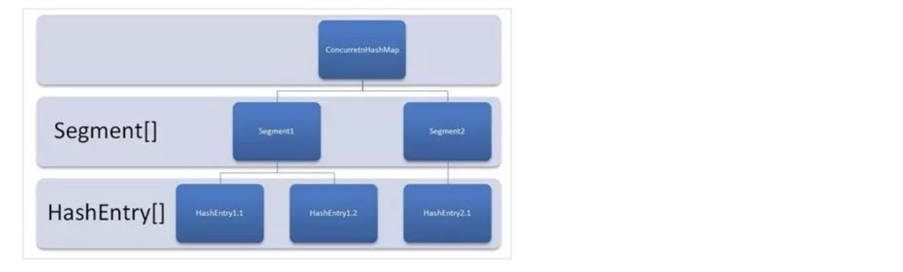
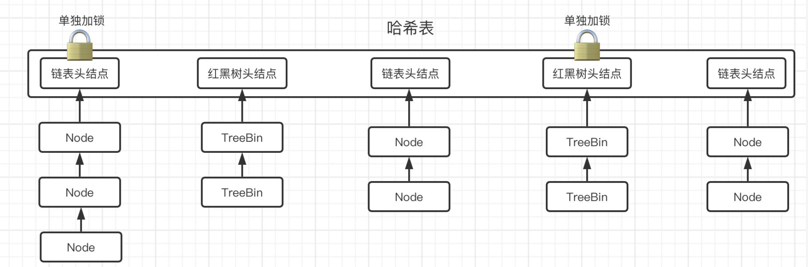

## JUC7

### 并发容器

重点在于探究并发容器是如何利用锁机制和算法实现各种丰富功能的，会忽略一些常规功能的实现细节（比如链表如何插入元素删除元素），而更关注并发容器应对并发场景算法上的实现（比如在多线程环境下的插入操作是按照什么规则进行的）

在单线程模式下，集合类提供的容器可以说是非常方便了，但在多线程环境下，这些数据结构还能正常工作吗

#### 传统容器线程安全问题

测试一下，100个线程同时向ArrayList中添加元素：

```java
public class Main {
    public static void main(String[] args) {
        List<String> list = new ArrayList<>();
        Runnable r = () -> {
            for (int i = 0; i < 100; i++)
                list.add("1");
        };
        for (int i = 0; i < 100; i++)
            new Thread(r).start();
        TimeUnit.SECONDS.sleep(1);
        System.out.println(list.size());
    }
}
```

不出意外的话，肯定是会报错的：

```
Exception in thread "Thread-1" java.lang.ArrayIndexOutOfBoundsException: 49
    at java.util.ArrayList.add(ArrayList.java:465)
    at com.ekko.Main.lambda$main$0(Main.java:16)
    at java.lang.Thread.run(Thread.java:750)
```

那么我们来看看报的什么错，从栈追踪信息可以看出，是add方法出现了问题：

```java
public boolean add(E e) {
    ensureCapacityInternal(size + 1);  // Increments modCount!!
    elementData[size++] = e;   
    // 这一句出现了数组越界
    return true;
}
```

也就是说，同一时间其他线程也在疯狂向数组中添加元素，那么这个时候有可能在`ensureCapacityInternal`（确认容量足够）执行之后，`elementData[size++] = e;`执行之前，其他线程插入了元素，导致size的值超出了数组容量。

这些在单线程的情况下不可能发生的问题，在多线程下就慢慢出现了。

我们再来看看比较常用的HashMap呢？

```java
public static void main(String[] args) throws InterruptedException {
    Map<Integer, String> map = new HashMap<>();
    for (int i = 0; i < 100; i++) {
        int finalI = i;
        new Thread(() -> {
            for (int j = 0; j < 100; j++)
                map.put(finalI * 1000 + j, "lbwnb");
        }).start();
    }
    TimeUnit.SECONDS.sleep(2);
    System.out.println(map.size());
}
```

经过测试发现，虽然没有报错，但是最后的键值对的数量没有达到预期

实际上它还有可能导致Entry对象出现环状数据结构，引起死循环。

#### 并发容器介绍

怎么才能解决并发情况下的容器问题呢？

首先想到的肯定是给方法前面加个`synchronzed`关键字，这样总不会抢了吧，在之前我们可以使用Vector或是Hashtable来解决，但是它们的效率实在是太低了，完全依靠锁来解决问题，因此现在已经很少再使用它们。

JUC提供了专用于并发场景下的容器

##### 并发实现类 —— `CopyOnWriteArrayList`

比如我们刚刚使用的ArrayList，在多线程环境下是没办法使用的，我们可以将其替换为JUC提供的多线程专用集合类：

```java
public static void main(String[] args) throws InterruptedException {
    List<String> list = new CopyOnWriteArrayList<>();  
    // 这里使用CopyOnWriteArrayList来保证线程安全
    Runnable r = () -> {
        for (int i = 0; i < 100; i++)
            list.add("111");
    };
    for (int i = 0; i < 100; i++)
        new Thread(r).start();
    TimeUnit.SECONDS.sleep(1);
    System.out.println(list.size());
}
```

###### `add()`源码分析

先看它是如何进行`add()`操作的：

```java
public boolean add(E e) {
    final ReentrantLock lock = this.lock;
    lock.lock();   
    // 直接加锁，保证同一时间只有一个线程进行添加操作
    try {
        // 获取当前存储元素的数组
        Object[] elements = getArray();
        int len = elements.length;
        // 直接复制一份数组
        Object[] newElements = Arrays.copyOf(elements, len + 1);
        // 修改复制出来的数组
        newElements[len] = e;
        // 将元素数组设定为复制出来的数组
        setArray(newElements);
        return true;
    } finally {
        lock.unlock();
    }
}
```

可以看到添加操作是直接上锁，并且会先拷贝一份当前存放元素的数组，然后对数组进行修改，再将此数组替换（CopyOnWrite）

###### `get()`源码分析

接着我们来看读操作：

```java
public E get(int index) {
    return get(getArray(), index);
}

private E get(Object[] a, int index) {
    return (E) a[index];
}
```

因此，`CopyOnWriteArrayList`对于读操作不加锁，而对于写操作是加锁的，类似于前面的读写锁机制，这样就可以保证不丢失读性能的情况下，写操作不会出现问题。

##### 并发实现类 —— `ConcurrentHashMap`

HashMap的并发容器`ConcurrentHashMap`：

```java
public static void main(String[] args) throws InterruptedException {
    Map<Integer, String> map = new ConcurrentHashMap<>();
    for (int i = 0; i < 100; i++) {
        int finalI = i;
        new Thread(() -> {
            for (int j = 0; j < 100; j++)
                map.put(finalI * 100 + j, "111");
        }).start();
    }
    TimeUnit.SECONDS.sleep(1);
    System.out.println(map.size());
}
```

可以看到这里的`ConcurrentHashMap`就没有出现之前HashMap的问题了。

因为线程之间会争抢同一把锁，在`LongAdder`的时候有一种压力分散思想，既然每个线程都想抢锁，那我就干脆多搞几把锁，让你们每个人都能拿到，这样就不会存在等待的问题了

而JDK7之前，`ConcurrentHashMap`的原理也比较类似，它将所有数据分为一段一段地存储，先分很多段出来，每一段都给一把锁，当一个线程占锁访问时，只会占用其中一把锁，也就是仅仅锁了一小段数据，而其他段的数据依然可以被其他线程正常访问。



###### 具体实现

这里我们重点讲解JDK8之后它是怎么实现的，它采用了CAS算法配合锁机制实现，

在JDK8下的HashMap是的结构：


HashMap就是利用了哈希表，哈希表的本质其实就是一个用于存放后续节点的头结点的数组

数组里面的每一个元素都是一个头结点（也可以说就是一个链表）

当要新插入一个数据时，会先计算该数据的哈希值，找到数组下标，然后创建一个新的节点，添加到对应的链表后面。

当链表的长度达到8时，会自动将链表转换为红黑树，这样能使得原有的查询效率大幅度降低！

当使用红黑树之后，我们就可以利用二分搜索的思想，快速地去寻找我们想要的结果，而不是像链表一样挨个去看。

###### 构造方法分析

由于ConcurrentHashMap的源码比较复杂，所以我们先从最简单的构造方法开始下手：

```java
/**
 * Creates a new, empty map with the default initial table size (16).
 */
public ConcurrentHashMap() {
}

/**
 * Creates a new, empty map with an initial table size
 * accommodating the specified number of elements without the need
 * to dynamically resize.
 *
 * @param initialCapacity The implementation performs internal
 * sizing to accommodate this many elements.
 * @throws IllegalArgumentException if the initial capacity of
 * elements is negative
 */
public ConcurrentHashMap(int initialCapacity) {
    if (initialCapacity < 0)
        throw new IllegalArgumentException();
    int cap = ((initialCapacity >= (MAXIMUM_CAPACITY >>> 1)) ?
                MAXIMUM_CAPACITY :
                tableSizeFor(initialCapacity + (initialCapacity >>> 1) + 1));
    this.sizeCtl = cap;
}

/**
 * Creates a new map with the same mappings as the given map.
 *
 * @param m the map
 */
public ConcurrentHashMap(Map<? extends K, ? extends V> m) {
    this.sizeCtl = DEFAULT_CAPACITY;
    putAll(m);
}
```

而 HashMap

```java
public HashMap(int initialCapacity, float loadFactor) {
    if (initialCapacity < 0)
        throw new IllegalArgumentException("Illegal initial capacity: " +
                                            initialCapacity);
    if (initialCapacity > MAXIMUM_CAPACITY)
        initialCapacity = MAXIMUM_CAPACITY;
    if (loadFactor <= 0 || Float.isNaN(loadFactor))
        throw new IllegalArgumentException("Illegal load factor: " +
                                            loadFactor);
    this.loadFactor = loadFactor;
    this.threshold = tableSizeFor(initialCapacity);
}

/**
 * Constructs an empty <tt>HashMap</tt> with the specified initial
 * capacity and the default load factor (0.75).
 *
 * @param  initialCapacity the initial capacity.
 * @throws IllegalArgumentException if the initial capacity is negative.
 */
public HashMap(int initialCapacity) {
    this(initialCapacity, DEFAULT_LOAD_FACTOR);
}
```

它的构造方法和HashMap的构造方法有很大的出入，但是大体的结构和HashMap是差不多的，也是维护了一个哈希表，并且哈希表中存放的是链表或是红黑树

###### `put()`源码分析

直接来看`put()`操作是如何实现的，只要看明白这个，基本上就懂了：

```java

/**
 * The array of bins. Lazily initialized upon first insertion.
 * Size is always a power of two. Accessed directly by iterators.
 */
transient volatile Node<K,V>[] table;

public V put(K key, V value) {
    return putVal(key, value, false);
}

static final int spread(int h) {
    return (h ^ (h >>> 16)) & HASH_BITS;
}

// 有点小乱，如果看着太乱，可以在IDEA中折叠一下代码块，不然有点难受
final V putVal(K key, V value, boolean onlyIfAbsent) {
    // 键值不能为空，基操
    if (key == null || value == null) throw new NullPointerException(); 
    
    // 计算键的hash值，用于确定在哈希表中的位置
    int hash = spread(key.hashCode());
    //一会用来记录链表长度的
    int binCount = 0;

    // 无限循环，而且还是并发包中的类，盲猜一波CAS自旋锁
    // table: The array of bins
    for (Node<K,V>[] tab = table;;) {
        Node<K,V> f; int n, i, fh;
        
        // 如果数组（哈希表）为空肯定是要进行初始化的，然后再重新进下一轮循环
        if (tab == null || (n = tab.length) == 0)
            tab = initTable();

        // n 表示该哈希表的长度, HashMap 的容量，且必须是 2 的幂，如 16, 32
        // (n - 1) & hash
        // 当 n 是 2 的幂时，(n - 1) & hash 的效果等同于 hash % n，但位运算 & 的性能比 % 高得多
        // i = (n - 1) & hash (记录索引)
        // f = tabAt(tab, i) 获取节点并赋值
        else if ((f = tabAt(tab, i = (n - 1) & hash)) == null) {
            // 如果哈希表该位置为null
            // 没有任何元素
            // 直接CAS插入结点作为头结即可
            // 注意这里会将f设置当前哈希表位置上的头结点
            if (casTabAt(tab, i, null,
                         new Node<K,V>(hash, key, value, null)))  
                break;                   
                // 如果CAS成功，直接break结束put方法，失败那就继续下一轮循环
        } 
        
        else if ((fh = f.hash) == MOVED)
            // MOVER == -1
            // 头结点哈希值为-1，这里只需要知道是因为正在扩容即可
            // 帮助进行迁移，完事之后再来下一次循环
            tab = helpTransfer(tab, f);   
        
        // 特殊情况都完了，这里就该是正常情况了
        else {
            // f 当前 bin 的头结点
            V oldVal = null;
            // 分 bin 加锁
            synchronized (f) {   
                // 在前面的循环中f肯定是被设定为了哈希表某个位置上的头结点
                // 这里直接把它作为锁加锁了
                // 防止同一时间其他线程也在操作哈希表中这个位置上的链表或是红黑树
                if (tabAt(tab, i) == f) {
                    if (fh >= 0) {    
                        // 头结点的哈希值大于等于0说明是链表，下面就是针对链表的一些列操作
                        ...实现细节略
                    } else if (f instanceof TreeBin) {   
                        // 肯定不大于0，肯定也不是-1，还判断是不是TreeBin，所以不用猜了，肯定是红黑树，下面就是针对红黑树的情况进行操作
                        // 在ConcurrentHashMap并不是直接存储的TreeNode，而是TreeBin
                        ...实现细节略
                    }
                }
            }

           // 根据链表长度决定是否要进化为红黑树
            if (binCount != 0) {
                if (binCount >= TREEIFY_THRESHOLD)
                    treeifyBin(tab, i);   
                    // 注意这里只是可能会进化为红黑树，如果当前哈希表的长度小于64，它会优先考虑对哈希表进行扩容
                if (oldVal != null)
                    return oldVal;
                break;
            }
        }
    }
    addCount(1L, binCount);
    return null;
}
```

怎么样，是不是感觉看着挺复杂，其实也还好，总结一下就是：



###### `get()`源码分析

我们接着来看看`get()`操作：

```java
public V get(Object key) {
    Node<K,V>[] tab; Node<K,V> e, p; int n, eh; K ek;
    int h = spread(key.hashCode());   // 计算哈希值
    
    // table 是 bin的总数
    // (tab = table) != null 判断bins是否为空
    // (n = tab.length) > 0 赋值n为bins的长度，并判断是否为空
    // (e = tabAt(tab, (n - 1) & h)) != null
    // 与运算代替取模哈希 找对应的 bin 的头结点是否存在
    if ((tab = table) != null && (n = tab.length) > 0 &&
        (e = tabAt(tab, (n - 1) & h)) != null) {
        
        // 如果头结点就是我们要找的，那直接返回值就行了
        if ((eh = e.hash) == h) {
            if ((ek = e.key) == key || (ek != null && key.equals(ek)))
                return e.val;
        }

       // 要么是正在扩容，要么就是红黑树，负数只有这两种情况
        else if (eh < 0)
            return (p = e.find(h, key)) != null ? p.val : null;
       
       // 确认无误，肯定在列表里，开找
        while ((e = e.next) != null) {
            if (e.hash == h &&
                ((ek = e.key) == key || (ek != null && key.equals(ek))))
                return e.val;
        }
    }

   //没找到只能null了
    return null;
}
```

###### 总结

综上，ConcurrentHashMap的put操作，实际上是对哈希表上的所有头结点元素分别加锁，理论上来说哈希表的长度很大程度上决定了ConcurrentHashMap在同一时间能够处理的线程数量，这也是为什么`treeifyBin()`会优先考虑为哈希表进行扩容的原因。显然，这种加锁方式比JDK7的分段锁机制性能更好。

其实这里也只是简单地介绍了一下它的运行机制，ConcurrentHashMap真正的难点在于扩容和迁移操作，我们主要了解的是他的并发执行机制，有关它的其他实现细节，这里暂时不进行讲解
