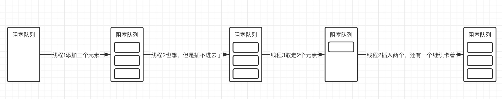

## JUC8

### 阻塞队列

除了我们常用的容器类之外，JUC还提供了各种各样的阻塞队列，用于不同的工作场景。

#### `BlockingQueue<E>`接口

阻塞队列本身也是队列, 继承于 `Queue`，但是它是适用于多线程环境下的，基于`ReentrantLock`实现的

它的接口定义如下：

```java
public interface BlockingQueue<E> extends Queue<E> {
    boolean add(E e);

    // 入队，如果队列已满，返回false否则返回true（非阻塞）
    boolean offer(E e);

    // 入队，如果队列已满，该线程会被阻塞，直到能入队为止
    void put(E e) throws InterruptedException;

    // 入队，如果队列已满，阻塞线程直到能入队或超时、中断为止
    // 入队成功返回true否则false
    boolean offer(E e, long timeout, TimeUnit unit)
        throws InterruptedException;

    // 出队，如果队列为空，该线程被阻塞，直到能出队为止
    E take() throws InterruptedException;

    // 出队，如果队列为空，阻塞线程直到能出队超时、中断为止
    // 出队成功正常返回，否则返回null
    E poll(long timeout, TimeUnit unit)
        throws InterruptedException;

    // 返回此队列理想情况下（在没有内存或资源限制的情况下）可以不阻塞地入队的数量
    // 如果没有限制，则返回 Integer.MAX_VALUE
    int remainingCapacity();

    boolean remove(Object o);

    public boolean contains(Object o);

    // 一次性从BlockingQueue中获取所有可用的数据对象
    // （还可以指定获取数据的个数）
    int drainTo(Collection<? super E> c);

    int drainTo(Collection<? super E> c, int maxElements);
}
```

比如现在有一个容量为3的阻塞队列，这个时候一个线程`put`向其添加了三个元素，第二个线程接着`put`向其添加三个元素，那么这个时候由于容量已满，会直接被阻塞，而这时第三个线程从队列中取走2个元素，线程二停止阻塞，先丢两个进去，还有一个还是进不去，所以说继续阻塞。



##### 实现消费者和生产者模式

利用阻塞队列，可以轻松地实现消费者和生产者模式

> 所谓的生产者消费者模型，是通过一个容器来解决生产者和消费者的强耦合问题。
>
> 通俗的讲，就是生产者在不断的生产，消费者也在不断的消费
>
> 可是消费者消费的产品是生产者生产的，这就必然存在一个中间容器，我们可以把这个容器想象成是一个货架，当货架空的时候，生产者要生产产品，此时消费者在等待生产者往货架上生产产品，而当货架有货物的时候，消费者可以从货架上拿走商品，生产者此时等待货架出现空位，进而补货，这样不断的循环。

通过多线程编程，来模拟一个餐厅的2个厨师和3个顾客，假设厨师炒出一个菜的时间为3秒，顾客吃掉菜品的时间为4秒，窗口上只能放一个菜。

我们来看看，使用阻塞队列如何实现，这里我们就使用`ArrayBlockingQueue`实现类：

```java
public class Main {
    public static void main(String[] args) throws InterruptedException {
        // 模拟货架
        BlockingQueue<Object> queue = new ArrayBlockingQueue<>(1);
        Runnable supplier = () -> {
            while (true){
                try {
                    String name = Thread.currentThread().getName();
                    System.err.println(time()+"生产者 "+name+" 正在准备餐品...");
                    TimeUnit.SECONDS.sleep(3);
                    System.err.println(time()+"生产者 "+name+" 已出餐！");
                    queue.put(new Object());
                } catch (InterruptedException e) {
                    e.printStackTrace();
                    break;
                }
            }
        };
        Runnable consumer = () -> {
            while (true){
                try {
                    String name = Thread.currentThread().getName();
                    System.out.println(time()+"消费者 "+name+" 正在等待出餐...");
                    queue.take();
                    System.out.println(time()+"消费者 "+name+" 取到了餐品。");
                    TimeUnit.SECONDS.sleep(4);
                    System.out.println(time()+"消费者 "+name+" 已经将饭菜吃完了！");
                } catch (InterruptedException e) {
                    e.printStackTrace();
                    break;
                }
            }
        };
        for (int i = 0; i < 2; i++) new Thread(supplier, "Supplier-"+i).start();
        for (int i = 0; i < 3; i++) new Thread(consumer, "Consumer-"+i).start();
    }

    private static String time(){
        SimpleDateFormat format = new SimpleDateFormat("HH:mm:ss");
        return "["+format.format(new Date()) + "] ";
    }
}
```

#### 实现类

可以看到，阻塞队列在多线程环境下的作用是非常明显的，算上ArrayBlockingQueue，一共有三种常用的阻塞队列：

- `ArrayBlockingQueue`：有界带缓冲阻塞队列（就是队列是有容量限制的，装满了肯定是不能再装的，只能阻塞，数组实现）
- `SynchronousQueue`：无缓冲阻塞队列（相当于没有容量的ArrayBlockingQueue，因此只有阻塞的情况）
- `LinkedBlockingQueue`：无界带缓冲阻塞队列（没有容量限制，也可以限制容量，也会阻塞，链表实现）

#### `ArrayBlockingQueue`源码分析

以`ArrayBlockingQueue`为例，先看构造方法：

```java
final ReentrantLock lock;

private final Condition notEmpty;

private final Condition notFull;

public ArrayBlockingQueue(int capacity, boolean fair) {
    // 显然队列长度不能为负数
    if (capacity <= 0)
        throw new IllegalArgumentException();
    
    // items 来作为 array数组进行存储
    this.items = new Object[capacity];

    // 底层采用锁机制保证线程安全性
    // 这里我们可以选择使用公平锁或是非公平锁
    lock = new ReentrantLock(fair);

    // 这里创建了两个Condition（都属于lock）
    // 一会用于入队和出队的线程阻塞控制

    // 控制队列空时有入队时 通知 消费者队列
    notEmpty = lock.newCondition();

    // 控制队列满时出队来通知 生产者队列
    notFull =  lock.newCondition();
}
```

##### `put` (入队且不阻塞)源码

```java
// 入队且不阻塞，队满了就返回false
public boolean offer(E e) {
    checkNotNull(e);
    // 可以看到这里也是使用了类里面的ReentrantLock进行加锁操作
    final ReentrantLock lock = this.lock;
    // 保证同一时间只有一个线程进入
    lock.lock();    
    try {
        // 直接看看队列是否已满，如果没满则直接入队，如果已满则返回false
        // count是来记录当前队列的元素
        if (count == items.length)
            return false;
        else {
            // 队列空的，那么就入队 enqueue
            enqueue(e);
            return true;
        }
    } finally {
        lock.unlock();
    }
}
```

##### `offer` (入队且阻塞)源码

```java
// 入队且阻塞，如果队伍满了，就将该线程挂起，直到被唤醒再 enqueue
public void put(E e) throws InterruptedException {
    checkNotNull(e);
    // 同样的，需要进行加锁操作
    final ReentrantLock lock = this.lock;
    // 注意这里是可以响应中断的
    // 表示我要加锁，但如果在等锁的过程中有人打断（Interrupt）我，我愿意放弃加锁并跳出来处理异常
    lock.lockInterruptibly();
    try {
        while (count == items.length)
            // 可以看到当队列已满时会直接挂起当前线程，在其他线程出队操作时会被唤醒
            // 是被放到了 notFull 的条件队列里等待被唤醒
            notFull.await();    
        enqueue(e);   // 直到队列有空位才将线程入队
    } finally {
        lock.unlock();
    }
}
```

##### `enqueue`源码

```java
private void enqueue(E x) {
    // assert lock.getHoldCount() == 1;
    // assert items[putIndex] == null;
    final Object[] items = this.items;
    items[putIndex] = x;
    if (++putIndex == items.length)
        putIndex = 0;
    count++;

    // 已经把元素入队了，那么必然队里有元素
    // 就可以唤醒 notEmpty 的条件队列里等的线程了
    notEmpty.signal();    //对notEmpty的signal唤醒操作
}
```

##### `poll()`(出队且不阻塞)源码

```java
public E poll() {
    // 有元素就出队，没元素不阻塞，直接返回null
    final ReentrantLock lock = this.lock;
    lock.lock();    
    //出队同样进行加锁操作，保证同一时间只能有一个线程执行
    try {
        return (count == 0) ? null : dequeue();   //如果队列不为空则出队，否则返回null
    } finally {
        lock.unlock();
    }
}
```

##### `take()`(出队且阻塞)源码

```java
public E take() throws InterruptedException {
    final ReentrantLock lock = this.lock;
    lock.lockInterruptibly();    
    // 可以响应中断进行加锁
    try {
        while (count == 0)
            notEmpty.await();    
            // 和入队相反，也是一直等直到队列中有元素之后才可以出队，在入队时会唤醒此线程
        return dequeue();
    } finally {
        lock.unlock();
    }
}
```

##### `dequeue`出队源码

```java
private E dequeue() {
    // assert lock.getHoldCount() == 1;
    // assert items[takeIndex] != null;
    final Object[] items = this.items;
    @SuppressWarnings("unchecked")
    E x = (E) items[takeIndex];
    items[takeIndex] = null;
    if (++takeIndex == items.length)
        takeIndex = 0;
    count--;
    if (itrs != null)
        itrs.elementDequeued();
    notFull.signal();    
    // 出队操作会调用notFull的signal方法唤醒被挂起处于等待状态的线程
    return x;
}
```

- 每有一个元素成功入队，那么在 `enqueue()` 中就会向 `notNull`的条件队列唤醒线程

- 每有一个元素成功出队，那么在 `dequeue()` 中就会向 `notFull`的条件队列唤醒线程

#### `SynchronousQueue`

比较特殊的队列`SynchronousQueue`，没有任何容量

也就是说正常情况下出队必须和入队操作成对出现

即如果一个线程调用 `take()` 出队那就会阻塞，等到另一个线程 `put`

```java
public static void main(String[] args) throws InterruptedException {
    SynchronousQueue<String> queue = new SynchronousQueue<>();
    new Thread(() -> {
        try {
            String take = queue.take();
            System.out.println(take);
        } catch (InterruptedException e) {
            throw new RuntimeException(e);
        }
    }).start();
    System.out.println(Thread.currentThread().getName() + "开始放东西");
    queue.put("hello");
}
```

##### 抽象类`Transferer`

在 `SynchronousQueue` 内部，首先有一个抽象类`Transferer`，它定义了一个`transfer`方法：

```java
public class SynchronousQueue<E> extends AbstractQueue<E>
    implements BlockingQueue<E>, java.io.Serializable {
        ...
    abstract static class Transferer<E> {
        /**
         * 可以是put也可以是take操作
         *
         * @param e 如果不是空，即作为生产者，那么表示会将传入参数元素e交给消费者
         *          如果为空，即作为消费者，那么表示会从生产者那里得到一个元素e并返回
         * @param 是否可以超时
         * @param 超时时间
         * @return 不为空就是从生产者那里返回的，为空表示要么被中断要么超时。
         */
        abstract E transfer(E e, boolean timed, long nanos);
    }
}
```

乍一看，有点迷惑，难不成还要靠这玩意去实现put和take操作吗？

实际上它是直接以生产者消费者模式进行的, 根据第一个元素来判断是消费者还是生产者

由于不需要依靠任何容器结构来暂时存放数据，所以我们可以直接通过`transfer`方法来对生产者和消费者之间的数据进行传递。

比如一个线程put一个新的元素进入，这时如果没有其他线程调用take方法获取元素，那么会持续被阻塞，直到有线程取出元素，而`transfer`正是需要等生产者消费者双方都到齐了才能进行交接工作，单独只有其中一方都需要进行等待。

如 `SynchronousQueue` 中 `put` 操作的源码：

```java
public void put(E e) throws InterruptedException {
    if (e == null) throw new NullPointerException();  // 判空
    // 直接使用transfer方法进行数据传递
    if (transferer.transfer(e, false, 0) == null) {
        Thread.interrupted();    
        // 为空表示要么被中断要么超时
        throw new InterruptedException();
    }
}
```

##### 构造方法

在 `SynchronousQueue` 源码里，除了有一个抽象类 `Transferer`，还有两个对应公平和非公平模式下的实现类

`TransferQueue<E>` —— 公平模式      `TransferStack<E>` —— 非公平模式

在`SynchronousQueue`构造方法里，他会默认选择是非公平模式的

```java
/**
 * Creates a {@code SynchronousQueue} with nonfair access policy.
 */
public SynchronousQueue() {
    this(false);
}

/**
 * Creates a {@code SynchronousQueue} with the specified fairness policy.
 *
 * @param fair if true, waiting threads contend in FIFO order for
 *        access; otherwise the order is unspecified.
 */
public SynchronousQueue(boolean fair) {
    transferer = fair ? new TransferQueue<E>() : new TransferStack<E>();
}
```

##### `Transferer`实现类 —— `TransferQueue<E>`

在`SynchronousQueue`源码中，如何实现 `TransferQueue<E>` (公平模式)：

```java
static final class TransferQueue<E> extends Transferer<E> {
     // 头结点
     // 头结点仅作为头结点，后续节点才是真正等待的线程节点
     transient volatile QNode head;
     // 尾结点
     transient volatile QNode tail;

    /** 节点有生产者和消费者角色之分 */
    // 跟前面的AQS一样，用 Node 来记录线程
    // 区分是放元素的 生产者线程
    // 还是取元素的 消费者线程
    static final class QNode {
        volatile QNode next;          // 后继节点
        volatile Object item;         // 存储的元素
        volatile Thread waiter;       // 处于等待的线程，和之前的AQS一样的思路，每个线程等待的时候都会被封装为节点
        final boolean isData;         // 是生产者节点还是消费者节点
    }
    
    ...
    
    也有 Unsafe 来记录Qnode中item 和 next字段的内存偏移
}
```

公平模式下，Transferer的实现是TransferQueue，是以先进先出的规则的进行的，内部有一个QNode类来保存等待的线程。

（多线程环境下的源码分析和单线程的分析不同，需要时刻关注当前代码块的加锁状态，如果没有加锁，一定要具有多线程可能会同时运行的意识，这个意识在以后你自己处理多线程问题伴随着你，才能保证你的思路在多线程环境下是正确的）

对应`transfer()`方法的实现：

```java
TransferQueue() {
    // 虚拟头结点
    QNode h = new QNode(null, false); // initialize to dummy node.
    head = h;
    tail = h;
}

E transfer(E e, boolean timed, long nanos) {   
    // 注意这里面没加锁，肯定会多个线程之间竞争
    QNode s = null;
    boolean isData = (e != null);   //e为空表示消费者，不为空表示生产者

    // 自旋！
    for (;;) {
        // 因为没有加锁，所以每一步都需要考虑多线程的一个情况
        QNode t = tail;
        QNode h = head;
        if (t == null || h == null)         
            // 头结点尾结点任意为空（但是在构造的时候就已经不是空了）
            continue;

        // 发生阻塞的情况
        // 没有其他线程等 || 大家线程的类型都一样
        // 那么阻塞
        if (h == t || t.isData == isData) { 
            // 头结点等于尾结点表示队列中只有一个头结点，肯定是空
            // 或者尾结点角色和当前节点一样 (说明都是 put 或者都是 take)
            // 这两种情况下，都需要进行入队操作
            QNode tn = t.next;

            // 因为没有加锁 需要时刻考虑多线程的情况
            if (t != tail)                  
                // 如果这段时间内tail被修改了
                // 其他线程插进来，或者队列消耗了
                // 那么说明不对
                // 如果是就进下一轮循环重新来
                continue;
            if (tn != null) {               
                // 继续校验是否为队尾
                // 如果tn不为null，那肯定是其他线程改了队尾
                // 可以进下一轮循环重新来了
                advanceTail(t, tn);     
                // CAS将新的队尾节点设置为tn，成不成功都无所谓
                // 反正这一轮肯定没戏了
                continue;
            }
            // 超时返回null
            if (timed && nanos <= 0)
                return null;

            // 接下来就准备当前节点塞进去了
            // 如果是第一次来 s 还没初始化
            if (s == null)
                // 构造当前结点，准备加入等待队列
                s = new QNode(e, isData);
            if (!t.casNext(null, s))        
                // CAS添加当前节点为尾结点的next
                // 如果失败肯定其他线程又抢先做了，直接进下一轮循环重新来
                continue;

            // 上面的操作成功 旧tail的next指向了s
            // 那么新的队尾元素就修改为s
            advanceTail(t, s);

            // 然后这个线程就会准备阻塞了，直到被消耗
            Object x = awaitFulfill(s, e, timed, nanos);
            // 开始等待s所对应的消费者或是生产者进行交接
            // 比如s现在是生产者，那么它就需要等到一个消费者的到来才会继续
            // 这个方法会先进行自旋等待匹配，如果自旋一定次数后还是没有匹配成功，那么就挂起）
            if (x == s) {                   
                // 如果返回s本身说明等待状态下被取消
                clean(t, s);
                return null;
            }

            if (!s.isOffList()) {           
                // 如果s操作完成之后没有离开队列，那么这里将其手动丢弃
                advanceHead(t, s);
                // 将s设定为新的首节点
                // 注意头节点仅作为头结点，并非处于等待的线程节点

                // s被消耗，因为是公平，只有一种可能，他是队列head的next元素
                // 那么它被消耗了，只需要把它移到 head，自然下一个元素变成第一个
                if (x != null)              // 删除s内的其他信息
                    // item 指向节点自身
                    // 通常表示该节点已经被取消或已经匹配成功并从队列中逻辑移除
                    s.item = s;

                // 断开对线程对象的引用
                s.waiter = null;
            }
            return (x != null) ? (E)x : e;   
            // 假如当前是消费者，直接返回x即可
            // 生产者，就返回put的元素
        } 
        // 不阻塞，成功匹配，并唤醒某个对应的线程
        else {                            
            // 这种情况下就是与队列中结点类型匹配的情况了
            // 注意队列要么为空要么只会存在一种类型的节点，因为一旦出现不同类型的节点马上会被交接掉

            // 获取头结点的下一个接口，准备进行交接工作
            // 也就是与自己匹配的节点
            QNode m = h.next;

            // 判断是不是被别的线程偷鸡了
            // 判断其他线程是否先修改，如果修改过那么开下一轮
            if (t != tail || m == null || h != head)
                continue;                   

            // 没被修改
            // 得到队列第一个元素的 item
            Object x = m.item;
            
            // isData == (x != null)
            // 先判断队列第一个节点的类型，然后与自己类型潘安
            // 如果是相同的操作，那肯定也是有问题的
            // x == m
            // 表示这个队列第一个元素被取消了，也有问题
            // 上面都不是？
            // 那么最后再进行CAS替换m中的元素，成功表示交接成功，失败就老老实实重开吧
            if (isData == (x != null) ||    
                x == m ||
                !m.casItem(x, e)) {
                // 排在最前面的节点 m 无法正常完成交易
                // 我们就必须把它踢出队列
                advanceHead(h, m);          // dequeue and retry
                continue;
            }

            // 成功交接，新的头结点可以改为m了，原有的头结点直接不要了
            advanceHead(h, m);
            LockSupport.unpark(m.waiter);   
            // m中的等待交接的线程可以继续了，已经交接完成
            return (x != null) ? (E)x : e;  // 同上，该返回什么就返回什么
        }
    }
}
```

所以，总结为以下流程：


对于非公平模式下的SynchronousQueue，则是采用的栈结构来存储等待节点，但是思路也是与这里的一致，需要等待并进行匹配操作，感兴趣可以继续了解一下非公平模式下的SynchronousQueue实现。

##### `LinkedTransferQueue`

在JDK7的时候，基于SynchronousQueue产生了一个更强大的TransferQueue，它保留了SynchronousQueue的匹配交接机制，并且与等待队列进行融合。

我们知道，SynchronousQueue并没有使用锁，而是采用CAS操作保证生产者与消费者的协调，但是它没有容量，而LinkedBlockingQueue虽然是有容量且无界的，但是内部基本都是基于锁实现的，性能并不是很好，这时，我们就可以将它们各自的优点单独拿出来，揉在一起，就成了性能更高的`LinkedTransferQueue`

```java
public static void main(String[] args) throws InterruptedException {
    LinkedTransferQueue<String> queue = new LinkedTransferQueue<>();
    queue.put("1");  //插入时，会先检查是否有其他线程等待获取，如果是，直接进行交接，否则插入到存储队列中
    queue.put("2");  //不会像SynchronousQueue那样必须等一个匹配的才可以
    queue.forEach(System.out::println);   //直接打印所有的元素，这在SynchronousQueue下只能是空，因为单独的入队或出队操作都会被阻塞
}
```

相比 `SynchronousQueue` ，它多了一个可以存储的队列，我们依然可以像阻塞队列那样获取队列中所有元素的值，简单来说，`LinkedTransferQueue`其实就是一个多了存储队列的`SynchronousQueue`。

#### 其他阻塞队列

接着我们来了解一些其他的队列：

- PriorityBlockingQueue - 是一个支持优先级的阻塞队列，元素的获取顺序按优先级决定。
- DelayQueue - 它能够实现延迟获取元素，同样支持优先级。

##### `PriorityBlockingQueue`

支持优先级的阻塞队列，元素的获取顺序按优先级决定。

```java
public static void main(String[] args) throws InterruptedException {
    PriorityBlockingQueue<Integer> queue =
            new PriorityBlockingQueue<>(10, Integer::compare);   
            // 可以指定初始容量（可扩容）和优先级比较规则，这里我们使用升序
    queue.add(3);
    queue.add(1);
    queue.add(2);
    System.out.println(queue);    
    // 注意保存顺序并不会按照优先级排列，所以可以看到结果并不是排序后的结果
    System.out.println(queue.poll());   
    // 但是出队顺序一定是按照优先级进行的
    System.out.println(queue.poll());
    System.out.println(queue.poll());
}
```

##### `DelayQueue`

重点是`DelayQueue`，它能实现延时出队

也就是说当一个元素插入后，如果没有超过一定时间，那么是无法让此元素出队的。

```java
public class DelayQueue<E extends Delayed> extends AbstractQueue<E>
    implements BlockingQueue<E> {
        ...
    }
```

###### `Delayed`接口

可以看到此类只接受Delayed的实现类作为元素：

```java
public interface Delayed extends Comparable<Delayed> {  
    // 注意这里继承了Comparable，它支持优先级

    // 获取剩余等待时间，正数表示还需要进行等待，0或负数表示等待结束
    long getDelay(TimeUnit unit);
}
```

###### 手动实现一个`Delayed`实现类

这里我们手动实现一个：

```java
private static class Test implements Delayed {
    private final long time;   
    // 延迟时间，这里以毫秒为单位
    private final int priority;
    private final long startTime;
    private final String data;

    private Test(long time, int priority, String data) {
        this.time = TimeUnit.SECONDS.toMillis(time);
        // 秒转换为毫秒
        this.priority = priority;
        this.startTime = System.currentTimeMillis();
        // 这里我们以毫秒为单位
        this.data = data;
    }

    @Override
    public long getDelay(TimeUnit unit) {
        long leftTime = time - (System.currentTimeMillis() - startTime); 
        // 计算剩余时间 = 设定时间 - 已度过时间(= 当前时间 - 开始时间)
        return unit.convert(leftTime, TimeUnit.MILLISECONDS);   
        // 注意进行单位转换，单位由队列指定（默认是纳秒单位）
    }

    @Override
    public int compareTo(Delayed o) {
        if(o instanceof Test)
            return priority - ((Test) o).priority;   
            // 优先级越小越优先
        return 0;
    }

    @Override
    public String toString() {
        return data;
    }
}
```

接着我们在主方法中尝试使用：

```java
public static void main(String[] args) throws InterruptedException {
    DelayQueue<Test> queue = new DelayQueue<>();
    queue.add(new Test(1, 2, "2号"));   //1秒钟延时
    queue.add(new Test(3, 1, "1号"));   //1秒钟延时，优先级最高

    System.out.println(queue.take());    //注意出队顺序是依照优先级来的，即使一个元素已经可以出队了，依然需要等待优先级更高的元素到期
    System.out.println(queue.take());
}
```

##### `DelayQueue`源码分析

```java
public class DelayQueue<E extends Delayed> extends AbstractQueue<E>
    implements BlockingQueue<E> {

    private final transient ReentrantLock lock = new ReentrantLock();
    private final PriorityQueue<E> q = new PriorityQueue<E>();

    private Thread leader = null;
    private final Condition available = lock.newCondition();

    ...
}
```

内部维护了一个优先级队列

###### `add()`入队

我们来研究一下DelayQueue是如何实现的，首先来看`add()`方法：

```java
public boolean add(E e) {
    return offer(e);
}

public boolean offer(E e) {
    // 加锁
    final ReentrantLock lock = this.lock;
    lock.lock();
    try {
        q.offer(e);   
        // 注意这里是向内部维护的一个优先级队列添加元素，并不是DelayQueue本身存储元素
        if (q.peek() == e) {
            // 如果入队后队首就是当前元素，那么直接进行一次唤醒操作
            // 因为可能之前队列时空的，但是有线程在 take了
            leader = null;
            available.signal();
        }
        return true;
    } finally {
        lock.unlock();
    }
}

public void put(E e) {
    offer(e);
}
```

可以看到无论是哪种入队操作，都会加锁进行，属于常规操作。

###### `take()`出队

接着来看`take()`方法：

```java
public E take() throws InterruptedException {
    // 出队也要先加锁
    final ReentrantLock lock = this.lock;
    lock.lockInterruptibly();
    try {
        // 无限循环，常规操作
        for (;;) {
            E first = q.peek();    
            // 获取队首元素
            if (first == null)     
                // 如果为空那肯定队列为空，先等着吧，等有元素进来
                available.await();
            else {
                long delay = first.getDelay(NANOSECONDS);
                // 获取延迟，这里传入的时间单位是纳秒
                // 直接就是当前还需要等多久
                if (delay <= 0)
                    return q.poll();     
                    // 如果获取到延迟时间已经小于0了，那说明ok，可以直接出队返回
                first = null;
                if (leader != null)   
                    // 这里用leader来减少不必要的等待时间
                    // 如果不是null那说明有线程在等待，为null说明没有线程等待
                    available.await();   
                    // 如果其他线程已经在等元素了，那么当前线程直接进永久等待状态
                    // 因为有别的线程老早在排队等队列元素了
                else {
                    Thread thisThread = Thread.currentThread();
                    leader = thisThread;    
                    // 没有线程等待就将leader设定为当前线程
                    try {
                        available.awaitNanos(delay);     
                        // 获取到的延迟大于0，那么就需要等待延迟时间，再开始下一次获取
                    } finally {
                        if (leader == thisThread)
                            leader = null;
                    }
                }
            }
        }
    } finally {
        if (leader == null && q.peek() != null)
            available.signal();   
            // 当前take结束之后唤醒一个其他永久等待状态下的线程
        lock.unlock();   //解锁，完事
    }
}
```
