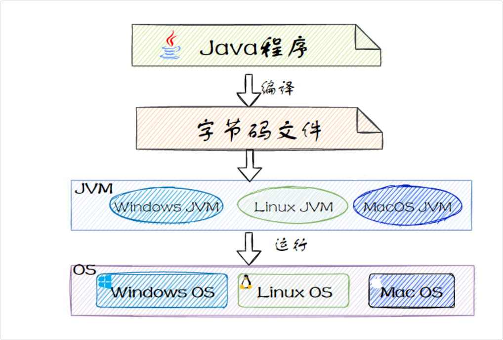
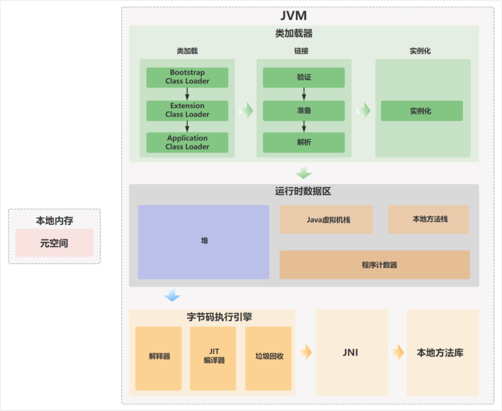

## JVM

学习 JVM 可以帮助我们开发者更好地优化程序性能、避免内存问题

- 了解 JVM 的内存模型和垃圾回收机制，可以帮助我们更合理地配置内存、减少 GC 停顿
- 掌握 JVM 的类加载机制可以帮助我们排查类加载冲突或异常
- JVM 还提供了很多调试和监控工具，可以帮助我们分析内存和线程的使用情况，从而解决内存溢出内存泄露等问题

> 所以主要内容：内存模型、垃圾回收机制、类加载机制、JVM 调试/监控 工具

### 什么是 JVM

JVM，也就是 Java 虚拟机，它是 Java 实现跨平台的基石

程序运行之前，需要先通过编译器将 Java 源代码文件编译成 Java 字节码文件；

程序运行时，JVM 会对字节码文件进行逐行解释，翻译成机器码指令，并交给对应的操作系统去执行



这样就实现了 Java 一次编译，处处运行的特性

#### 执行 Hello world 的流程

当我们写好一个 HelloWorld 程序，编译成 .class 文件后，执行 `java HelloWorld` 这条命令时

操作系统会创建一个 JVM 进程，JVM 进程启动起来后，会先初始化运行环境，包括**创建类加载器**、**初始化内存空间**、**启动垃圾回收线程**等等

接下来，JVM 的类加载器会去找 `HelloWorld.class` 这个文件，读取它的字节码内容

JVM 的执行引擎会将这些字节码翻译成机器码，有两种方式

- 第一种是解释执行
  - JVM 的解释器会逐条读取字节码指令，然后把它翻译成机器码执行
  - 这个过程是动态的，每次执行都要翻译一遍。所以解释执行的速度相对较慢
- 第二种是即时编译
  - JVM 里有一个 JIT 编译器，他发现某段代码被频繁执行（比如循环里的代码或者热点方法）时，JIT 编译器就会把这段字节码**直接编译成本地机器码**并缓存到 codeCache 中
  - 下次执行的时候不用再一行一行的解释，而是直接执行缓存后的机器码，执行效率会大幅提高

至于执行的时机

解释器的执行是立即的，当 JVM 启动后，就开始解释执行字节码了

JIT 编译器的执行时机是延后的，它**需要先监控哪些代码是热点代码**（通常需要执行数千次或者数万次），然后才会启动编译

> 操作系统层面，JVM 进程是一个执行单元，由操作系统调度执行

#### JVM 特性

- JVM 可以自动管理内存，通过垃圾回收器回收不再使用的对象并释放内存空间
- JVM 包含一个即时编译器 JIT，它可以在运行时将热点代码缓存到 codeCache 中，下次执行的时候不用再一行一行的解释，而是直接执行缓存后的机器码，执行效率会大幅提高
- 任何可以通过 Java 编译的语言，比如说 Groovy、Kotlin、Scala 等，都可以在 JVM 上运行

#### JAVA 是解释性语言还是编译性语言

| **特性** | **编译型语言（如C/C++）** | **解释型语言（如Python、JavaScript）** |
| --- | --- | --- |
| **执行方式** | 直接编译成机器码，由CPU执行 | 逐行解释执行，依赖解释器 |
| **运行速度** | 快（直接运行机器码） | 较慢（需要实时解释） |
| **跨平台性** | 差（需针对不同平台编译） | 好（解释器适配不同系统） |
| **典型代表** | C、C++、Go | Python、Ruby、JavaScript |

Java 兼具编译和解释的特性，属于“半编译半解释”的语言

Java程序的执行过程可以分为两个关键阶段：

- 编译阶段（javac）：将.java源码编译成.class字节码（Bytecode）
- 解释/编译执行阶段（JVM）：JVM加载字节码，解释执行或JIT编译优化

### JVM 整体结构

> JVM 本身就是操作系统里的一个进程

JVM 大致可以划分为三个部分：类加载器、运行时数据区和执行引擎



- 类加载器，负责从文件系统、网络或其他来源加载 Class 文件，将 Class 文件中的二进制数据读入到内存当中。
- 运行时数据区，JVM 在执行 Java 程序时，需要在内存中分配空间来处理各种数据，这些内存区域按照 Java 虚拟机规范可以划分为方法区、堆、虚拟机栈、程序计数器和本地方法栈。
- 执行引擎，也是 JVM 的心脏，负责执行字节码。它包括一个虚拟处理器、即时编译器 JIT 和垃圾回收器

```plain
JVM 进程启动
    │
    ├── main 线程      → 执行你的 Java 代码（main方法）
    │
    ├── GC 线程        → 垃圾回收
    │
    ├── JIT 编译线程   → 热点代码编译
    │
    └── 其他后台线程   → 各种内部任务
```

#### JVM 本质

JVM 本质上就是一个进程

当我们执行 `java -jar application.jar` 命令时，操作系统会创建一个名为 JVM 的进程

这个进程在内存里运行着一个虚拟机，这个虚拟机有自己的指令集、内存模型、执行引擎等等

当你执行 java MyClass 时：

- 操作系统启动一个 JVM 进程 — 每个 Java 应用程序都运行在独立的 JVM 进程中
- 进程内包含线程 — 主线程执行 main() 方法，应用可以创建更多线程
- 进程有自己的内存空间 — JVM 的运行时数据区（堆、栈、方法区等）都在这个进程的地址空间内

可以通过 jps 或任务管理器看到每个 Java 应用对应的 JVM 进程。

##### 例子 — Spring 项目启动

Spring 项目启动也是从 一个 main 线程开始：

```java
@SpringBootApplication
public class Application {
  public static void main(String[] args) {
    SpringApplication.run(Application.class, args);  // main 线程执行
  }
}
```

启动过程中会创建更多线程：

```plain
main 线程（启动）
    │
    ├── 初始化 Spring 容器
    ├── 扫描、创建 Bean
    ├── 启动内嵌 Tomcat
    │
    └── 然后 main 线程阻塞等待（或结束）
         │
         └── Tomcat 线程池接管请求
              ├── http-nio-8080-exec-1
              ├── http-nio-8080-exec-2
              └── ...
```

#### JVM 与 操作系统关系

操作系统是底层，它直接控制硬件资源，比如 CPU、内存、磁盘、网络等。操作系统的工作就是把这些硬件资源分配给各个应用程序使用。

JVM 是运行在操作系统上的一个应用程序。

JVM 本身是一个进程，也就是说，从操作系统的角度看，JVM 就是一个普通的应用程序，并没有什么特别的。

操作系统不知道也不关心 JVM 里面运行的是什么，它只是按照进程管理的规则来管理 JVM 这个进程

#### 如果运行两个独立的java程序

##### 有几个虚拟机

每一个 Java 程序都需要一个独立的 JVM 进程来运行，两个 Java 程序就需要两个 JVM。这两个 JVM 进程是完全独立的，互不干扰

##### 有没有单独的JVM进程存在

JVM 不存在什么公共的、被所有 Java 程序共享的进程。每一个 Java 程序都必须启动自己的 JVM 进程

##### 启动一个hello world编译的时候，有几个进程

如果只是编译，不运行，至少有两个进程。

一个是 javac 的编译器进程，当执行 javac HelloWorld.java 时，操作系统会创建一个 javac 进程，这个进程会读取 .java 源文件，生成 .class 字节码文件，完成后 javac 进程就退出了

另一个是当前的 shell 进程，运行 javac 进程的终端，这是一直存在的

#### JVM什么时候启动

> 比如执行一条Java命令的时候对应一个进程，然后这个JVM虚拟机到底是不是在这个进程里面，还是说要先启动一个JVM虚拟机的进程

执行 java HelloWorld 时，操作系统启动的是 JVM 进程，JVM 作为进程启动后会立即加载并执行指定的 Java 程序。

不存在"先启动 JVM 虚拟机框架，再往里面放程序"的概念——JVM 进程就是承载你程序的实体。

Java 程序启动时至少有一个线程 — 主线程（main thread），它执行 main() 方法。

但 Java 程序通常不止一个线程：

```plain
JVM 进程
├── main 线程（执行 main()）
├── GC 线程（垃圾回收）
├── 编译器线程（JIT 编译）
└── 用户创建的线程（Thread、线程池等）
```

所以 Java 程序运行时是一个 JVM 进程 + 多个线程，不是单纯的"一个线程"
