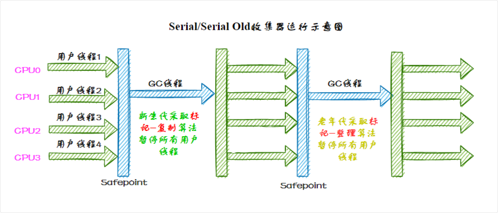
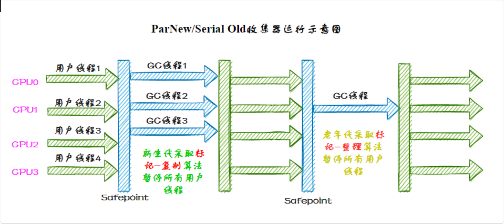
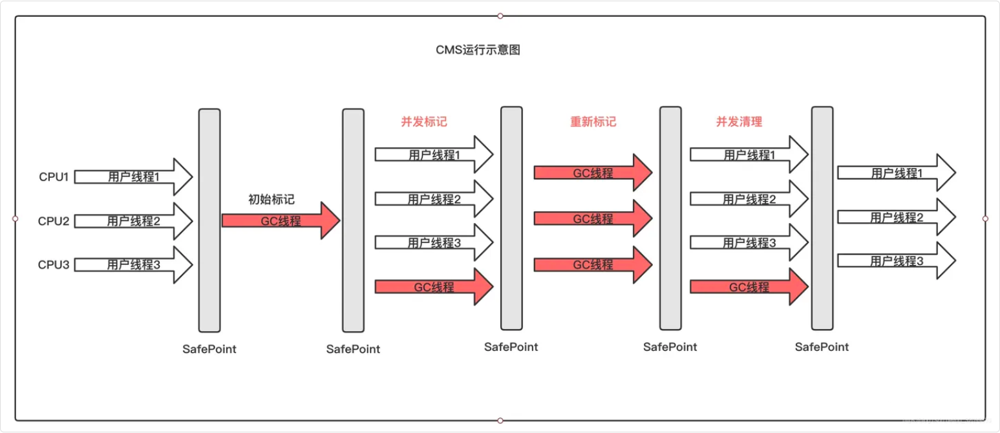
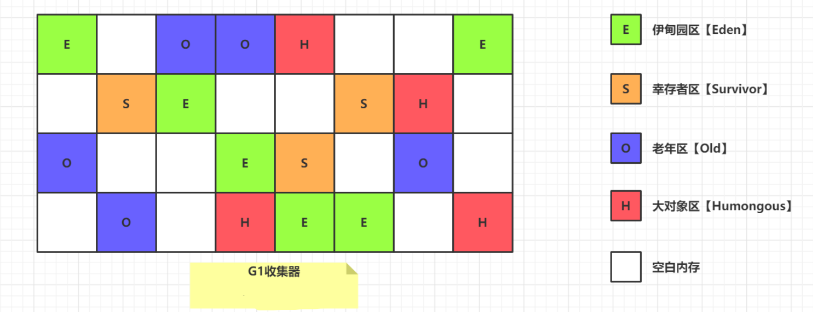
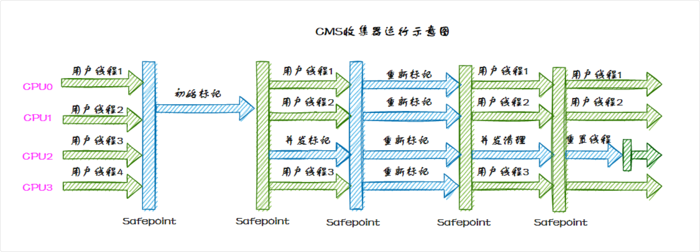

## 垃圾收集器

> 垃圾收集算法是理论基础，定义了如何识别和回收垃圾；垃圾收集器是算法的具体实现，一个收集器可以实现一种或多种算法

JVM 的垃圾收集器主要分为两大类：分代收集器和分区收集器

分代收集器的代表是 CMS

分区收集器的代表是 G1 和 ZGC

> 分代是按对象年龄划分（新生代/老年代），针对性回收；分区是把堆切成独立小区域（Region），可预测停顿时间。
>
> 现代收集器（如 G1）结合两者：逻辑上分代，物理上分区。

垃圾回收器的核心作用是自动管理 Java 应用程序的运行时内存。它负责识别哪些内存是不再被应用程序使用的，并释放这些内存以便重新使用。

这一过程减少了程序员手动管理内存的负担，降低了内存泄漏和溢出错误的风险。

### 分代收集器

新生代 (Serial): 标记-复制

老年代 (Serial Old): 标记-整理

主要是 Serial/old 以及多线程版本 Parallel new/Old

然后就是根据吞吐量可以动态调整清理时间的 Parallel Scavenge

JDK8 采用的就是这种 Parallel Scavenge + Parallel Old 的垃圾回收方案

#### Serial 收集器

Serial 收集器是最基础、历史最悠久的收集器

如同它的名字（串行），它是一个**单线程工作的收集器**，使用一个处理器或一条收集线程去完成垃圾收集工作。

并且进行垃圾收集时，必须暂停其他所有工作线程，直到垃圾收集结束——这就是所谓的“Stop The World”

Serial/Serial Old 收集器的运行过程如图：



新生代 (Serial): 标记-复制

老年代 (Serial Old): 标记-整理

##### Serial Old 收集器

Serial Old 是 Serial 收集器的老年代版本，它同样是一个单线程收集器，使用标记-整理算法

#### ParNew 收集器

ParNew 收集器实质上是 Serial 收集器的多线程并行版本，使用多条线程进行垃圾收集



#### Parallel Old (老年代收集器)

Parallel Old 是 Parallel Scavenge 收集器的老年代版本

基于标记-整理算法实现，使用多条 GC 线程在 STW 期间同时进行垃圾回收

#### Parallel Scavenge (新生代收集器)

Parallel Scavenge 收集器是一款新生代收集器，基于标记-复制算法实现，也能够并行收集

和 ParNew 有些类似，但 Parallel Scavenge 主要关注的是垃圾收集的吞吐量——所谓吞吐量，就是 CPU 用于运行用户代码的时间和总消耗时间的比值，比值越大，说明垃圾收集的占比越小

$$
\text{吞吐量} = \frac{\text{运行用户代码的时间}}{\text{运行垃圾收集的时间}+\text{运行用户代码的时间}}
$$

它会根据吞吐量来决定每次垃圾回收的时间，这种自适应机制，能够很好地权衡当前机器的性能，根据性能选择最优方案。

目前 JDK8 采用的就是这种 Parallel Scavenge + Parallel Old 的垃圾回收方案

#### CMS 收集器 (老年代收集器)

CMS 在 JDK 1.5 时引入，JDK 9 时被标记弃用，JDK 14 时被移除

在分代收集架构中，CMS 专门负责 老年代 的垃圾回收

它不能独立工作，通常需要配合年轻代的收集器一起使用:

- 配合 ParNew： 这是最常见的组合（ParNew负责年轻代，CMS负责老年代）。
- 配合 Serial： 当 CMS 出现故障（Concurrent Mode Failure）时，会退化到使用 Serial Old 进行全量回收

CMS 是一种低延迟的垃圾收集器，采用标记-清除算法, 主要分为四个阶段：

- 初始标记（STW）：仅仅标记 GC Roots 能直接关联到的对象。速度非常快，但会触发 Stop The World (STW)（停止所有业务线程）
- 并发标记：从GC Roots的直接关联对象开始遍历整个对象图的过程，这个过程耗时较长但是不需要停顿用户线程，可以与垃圾收集线程一起并发运行。
- 重新标记（STW）：修正并发标记期间，因用户程序继续运作而导致标记产生变动的那一部分记录。这个阶段也会 STW，停顿时间比初始标记长，但远比并发标记短。
- 并发清除：清理掉标记阶段判断为死亡的对象。这个阶段也是并发执行的。

优点是垃圾回收线程和应用线程同时运行，停顿时间短，适合延迟敏感的应用，但容易产生内存碎片，可能触发 Full GC

会产生浮动垃圾，在并发清除阶段，用户线程还在运行，产生的垃圾无法在当次 GC 中清理，只能等下一次

> 这款收集器是HotSpot虚拟机中第一款真正意义上的并发（注意这里的并发和之前的并行是有区别的，并发可以理解为同时运行用户线程和GC线程，而并行可以理解为多条GC线程同时工作）收集器，它第一次实现了让垃圾收集线程与用户线程同时工作



### 分区收集器

#### G1 收集器 (主流)

G1 在 JDK 1.7 时引入，在 JDK 9 时取代 CMS 成为默认的垃圾收集器

G1 是一种面向大内存、高吞吐场景的垃圾收集器，它将堆划分为多个小的 Region，通过标记-整理算法，避免了内存碎片问题

优点是停顿时间可控，适合大堆场景，但调优较复杂

我们的垃圾回收分为Minor GC、Major GC 和Full GC，它们分别对应的是新生代，老年代和整个堆内存的垃圾回收



而G1收集器巧妙地绕过了这些约定，将整个Java堆划分成2048个大小相同的独立Region块，每个Region块的大小根据堆空间的实际大小而定，整体被控制在1MB到32MB之间，且都为2的N次幂

所有的Region大小相同，且在JVM的整个生命周期内不会发生改变

- 每一个Region都可以根据需要，自由决定扮演哪个角色（Eden、Survivor和老年代）
- 收集器会根据对应的角色采用不同的回收策略
- 此外，G1收集器还存在一个Humongous区域，它专门用于存放大对象（一般认为大小超过了Region容量一半的对象为大对象）
- 这样，新生代、老年代在物理上，不再是一个连续的内存区域，而是到处分布的

现在的主流是 G1 (Garbage First) 收集器（Java 9 后的默认设置），以及在高版本 Java 中出现的 ZGC 和 Shenandoah。它们在处理大内存和极低停顿方面比 CMS 表现得更加优秀。

### CMS 的垃圾收集过程

> 三色标记法

先 STW，快速把所有 GC Roots 直接关联的对象找到并标记，然后并发标记，从前面标记的对象出发，遍历并标记所有可达对象，最后再短暂 STW 修正并发期间的变动，然后并发清除垃圾。

CMS 使用标记-清除算法进行垃圾收集，分 4 大步：

- **初始标记 (STW)**：标记所有从 GC Roots 直接可达的对象，这个阶段需要 STW，但速度很快。
- **并发标记**：从初始标记的对象出发，遍历所有对象，标记所有可达的对象。这个阶段是并发进行的。
- **重新标记 (STW)**：完成剩余的标记工作，包括处理并发阶段遗留下来的少量变动，这个阶段通常需要短暂的 STW 停顿。
- **并发清除**：清除未被标记的对象，回收它们占用的内存空间。这个阶段是并发进行的。



#### 重新标记阶段

remark 阶段通常会结合三色标记法来执行，确保在并发标记期间所有存活对象都被正确标记。目的是修正并发标记阶段中可能遗漏的对象引用变化

在 remark 阶段，垃圾收集器会停止应用线程，以确保在这个阶段不会有引用关系的进一步变化。这种暂停通常很短暂。remark 阶段主要包括以下操作：

- 处理写屏障记录的引用变化：在并发标记阶段，应用程序可能会更新对象的引用（比如一个黑色对象新增了对一个白色对象的引用），这些变化通过写屏障记录下来。在 remark 阶段，GC 会处理这些记录，确保所有可达对象都正确地标记为灰色或黑色。
- 扫描灰色对象：再次遍历灰色对象，处理它们的所有引用，确保引用的对象正确标记为灰色或黑色。
- 清理：确保所有引用关系正确处理后，灰色对象标记为黑色，白色对象保持不变。这一步完成后，所有存活对象都应当是黑色的。

#### 什么是三色标记法

三色标记法用于标记对象的存活状态，它将对象分为三类：

- 白色（White）：尚未访问的对象。垃圾回收结束后，仍然为白色的对象会被认为是不可达的对象，可以回收。
- 灰色（Gray）：已经访问到但未标记完其引用的对象。灰色对象是需要进一步处理的。
- 黑色（Black）：已经访问到并且其所有引用对象都已经标记过。黑色对象是完全处理过的，不需要再处理。

> CMS 流程：初始标记，并发标记，重新标记，并发清理

##### 初始标记

从 GC Roots 开始，标记所有直接可达的对象为灰色

> 相当于把 GC Roots 所引用的对象都标记为灰色

##### 并发标记

在此阶段，标记所有灰色对象引用的对象为灰色，然后将灰色对象自身标记为黑色。

这个过程是并发的，和应用线程同时进行。

> 扫描灰色对象集合，依次遍历灰色对象，每个对象可能内部引用了别的，就把这些也放到灰色对象集合中，遍历了一个灰色对象，这个对象就放到黑色集合中

```plain
灰色对象集合 = 待处理队列

循环处理：
1. 从灰色集合拿出一个对象 X
2. 把 X 引用的所有对象标记为灰色（加入待处理队列）
3. X 自己标记为黑色（处理完成）
```

会出现:

- 漏标: 本该存活的对象被标记为白色(危险，会错误回收)
- 错标: 浮动垃圾，本该回收的对象被保留到下次 GC（无害，只是效率问题）

错标是至少是可以允许的，但是如果发生漏标，导致本不应该被回收的对象被回收了，就很严重，所以需要重新标记

##### 重新标记 (STW)

重新标记用增量更新或原始快照来防止漏标

为了确保所有存活对象都被正确标记，remark 需要在 STW 暂停期间执行。

> 使用写屏障（Write Barrier）来捕捉并发标记阶段应用线程对对象引用的更新
>
> 通过遍历这些更新的引用来修正标记状态，确保遗漏的对象不会被错误地回收。

在 CMS 中，并发标记期间，如果黑色对象A新增了一个指向白色对象B的引用，CMS写屏障会记录下来，然后把这些黑色对象作为GC Roots再重新扫描一次

> 把这些新增了对象引用的对象，重新扫描一次，来避免漏标

##### 并发清楚

最后把标记为垃圾的对象并发清除

### G1 收集器分析

G1 在 JDK 1.7 时引入，在 JDK 9 时取代 CMS 成为默认的垃圾收集器

G1 把 Java 堆划分为多个大小相等的独立区域 Region，每个区域都可以扮演新生代或老年代的角色。

同时，G1 还有一个专门为大对象设计的 Region，叫 Humongous 区。

> 大对象的判定规则是，如果一个大对象超过了一个 Region 大小的 50%，比如每个 Region 是 2M，只要一个对象超过了 1M，就会被放入 Humongous 中。

回收过程与CMS大体类似：

分为以下四个步骤：

- 初始标记（暂停用户线程）：仅仅只是标记一下GC Roots能直接关联到的对象，并且修改TAMS指针的值，让下一阶段用户线程并发运行时，能正确地在可用的Region中分配新对象。
  - 这个阶段需要停顿线程，但耗时很短，而且是借用进行Minor GC的时候同步完成的，所以G1收集器在这个阶段实际并没有额外的停顿。
- 并发标记：从GC Root开始对堆中对象进行可达性分析，递归扫描整个堆里的对象图，找出要回收的对象，这阶段耗时较长，但可与用户程序并发执行。
- 最终标记（暂停用户线程）：对用户线程做一个短暂的暂停，用于处理并发标记阶段漏标的那部分对象。
- 筛选回收：负责更新Region的统计数据，对各个Region的回收价值和成本进行排序，根据用户所期望的停顿时间来制定回收计划，可以自由选择任意多个Region构成回收集，然后把决定回收的那一部分Region的存活对象复制到空的Region中，再清理掉整个旧Region的全部空间。这里的操作涉及存活对象的移动，是必须暂停用户线程，由多个收集器线程并行完成的。
