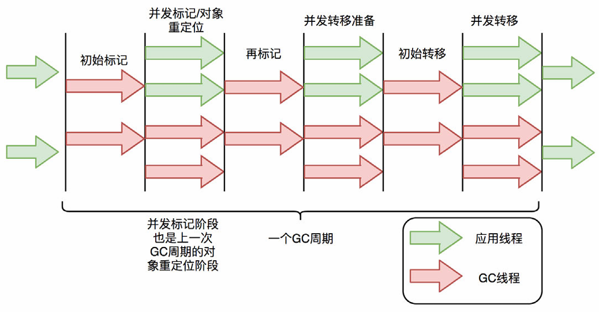
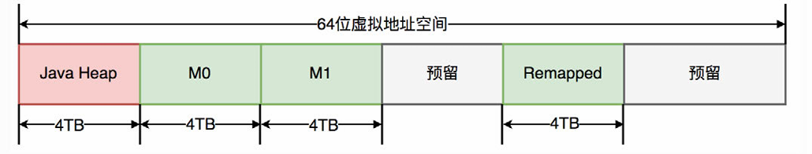
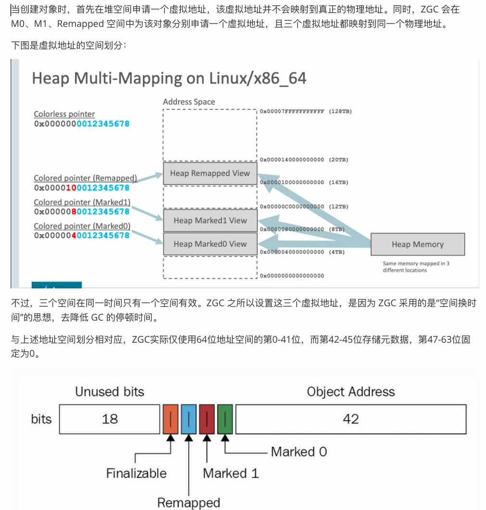
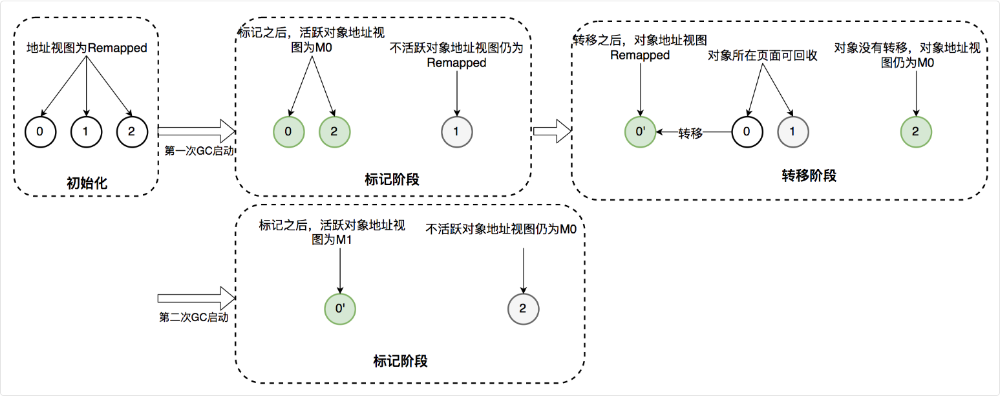

## 垃圾收集器

### ZGC

ZGC 是 JDK 11 时引入的一款低延迟的垃圾收集器，最大特点是将垃圾收集的停顿时间控制在 10ms 以内，即使在 TB 级别的堆内存下也能保持较低的停顿时间。

ZGC 也采⽤了复制算法，只不过做了重⼤优化，ZGC 在标记、转移和重定位阶段⼏乎都是并发的，这是 ZGC 实现停顿时间⼩于 10ms 的关键所在

> 关键技术

#### 指针染色

在⼀个指针中，除了存储对象的实际地址外，还有额外的位被⽤来存储关于该对象的元数据信息。

这些信息可能包括：

- 对象是否被移动了（即它是否在回收过程中被移动到了新的位置）。
- 对象的存活状态。
- 对象是否被锁定或有其他特殊状态。

通过在指针中嵌⼊这些信息，ZGC 在标记和转移阶段会更快，因为通过指针上的颜⾊就能区分出对象状态，不⽤额外做内存访问。

ZGC 仅支持 64 位系统，把 64 位虚拟地址空间划分为多个子空间

其中，0-4TB 对应 Java 堆，4TB-8TB 被称为 M0 地址空间，8TB-12TB 被称为 M1 地址空间，12TB-16TB 预留未使用，16TB-20TB 被称为 Remapped 空间

由于仅⽤了第 0~43 位存储对象地址， 2^44 = 16TB，所以 ZGC 最⼤⽀持 16TB 的堆。

⾄于对象的存活信息，则存储在42-45位中，这与传统的垃圾回收并将对象存活信息放在对象头中完全不同。

三个虚拟地址映射同一物理内存 = 让对象可以"同时出现在两个地方"，读屏障负责选择正确的地址，从而实现并发移动对象无停顿。

#### 读屏障

当程序尝试读取⼀个对象时，读屏障会触发以下操作：

- 检查指针染⾊：读屏障⾸先检查指向对象的指针的颜⾊信息。
- 处理移动的对象：如果指针表示对象已经被移动（例如，在垃圾回收过程中），读屏障将确保返回对象的新位置。
- 确保⼀致性：通过这种⽅式，ZGC 能够在并发移动对象时保持内存访问的⼀致性，从⽽减少对应⽤程序停顿的需要。

### ZGC 的垃圾收集过程

ZGC 的垃圾收集过程分为 8 个阶段，其中只有 3 个阶段需要短暂 STW，其余阶段均与应用线程并发执行：

#### 阶段 1：初始标记（STW < 1ms）

- 标记所有从 GC Roots 直接可达的对象
- 修改染色指针的标记位（marked0/marked1）
- 停顿时间极短，因为只处理直接可达对象

#### 阶段 2：并发标记

- 与应用线程同时运行
- 从初始标记的对象出发，遍历整个对象图
- 标记所有存活对象，修改其染色指针

#### 阶段 3：初始暂停（STW < 1ms）

- 处理并发标记期间剩余的引用变化
- 完成标记状态的一致性检查

#### 阶段 4：并发预备重映射

- 选择存活对象最少的 Region 进行回收
- 为存活对象分配新的虚拟地址（Remapped 空间）
- 准备对象复制

#### 阶段 5：重新标记（STW < 1ms）

- 最终确认所有存活对象的标记状态
- 确保没有对象被遗漏

#### 阶段 6：并发重映射（对象复制）

- 将存活对象复制到新的物理地址
- 旧地址的染色指针标记为"已转发"
- 读屏障自动处理转发，应用线程无感知

#### 阶段 7：重映射引用（STW < 1ms）

- 更新所有 GC Roots 和对象引用指向新地址
- 这个停顿非常短暂，因为只需要更新指针

#### 阶段 8：并发释放

- 清空旧 Region，回收物理内存
- 为下一次 GC 做准备

> 提示：JDK 21 引入了分代 ZGC（Z Generational），将堆分为新生代和老年代，进一步提升了 GC 效率。
