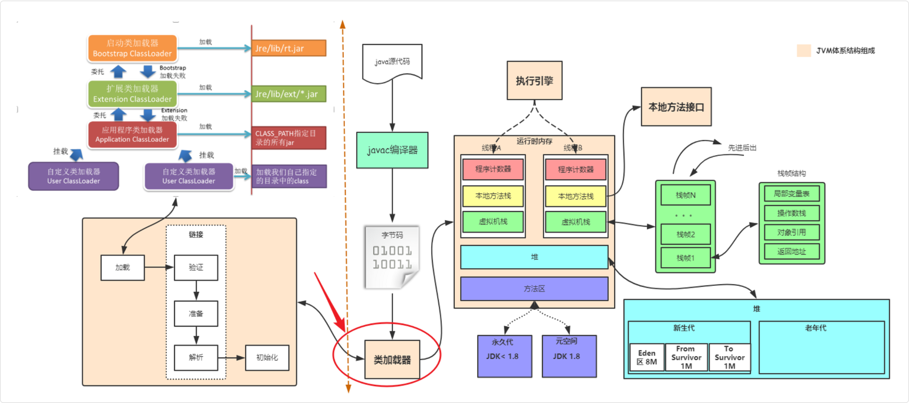
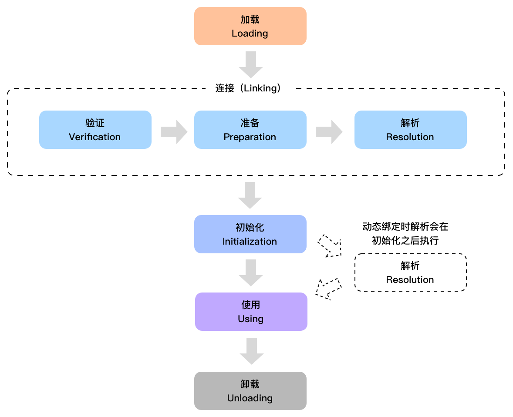
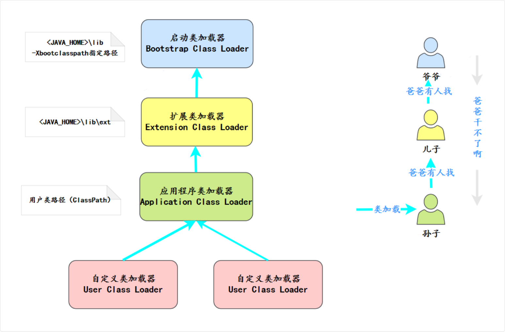
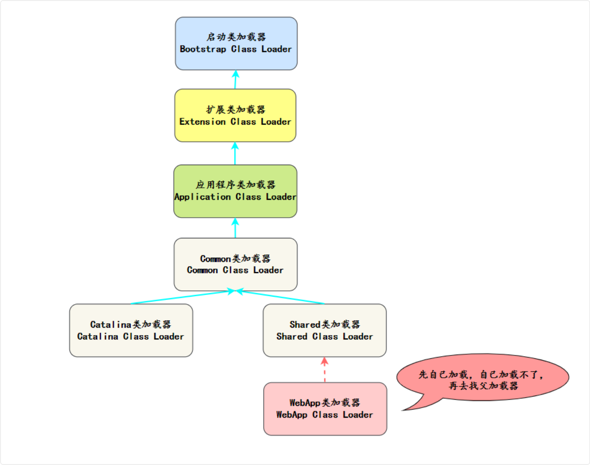

## 类加载机制

JVM 的操作对象是 Class 文件。JVM 把 Class 文件中描述类的数据结构加载到内存中，并对数据进行校验、解析和初始化，最终转化成可以被 JVM 直接使用的类型，这个过程被称为类加载机制。

> 类加载是**运行时**进行的，JVM 不会在启动时加载所有类，而是**按需加载**。
>
> 触发类加载的时机（主动引用）：
>
> - `new` 一个对象
> - 访问类的静态变量或静态方法
> - 使用反射（如 `Class.forName()`）
> - 初始化子类时（会先触发父类加载）
>
> 不触发类加载的情况（被动引用）：
>
> - 通过子类引用父类的静态变量
> - 定义类数组（如 `MyClass[] arr`）
> - 常量引用（如 `MyClass.CONST`）



其中最重要的三个概念就是：类加载器、类加载过程和双亲委派模型。

- **类加载器**：负责加载类文件，将类文件加载到内存中，生成 Class 对象。
- **类加载过程**：包括加载、验证、准备、解析和初始化等步骤。
- **双亲委派模型**：当一个类加载器接收到类加载请求时，它会把请求委派给父类加载器去完成，依次递归，直到最顶层的类加载器，如果父类加载器无法完成加载请求，子类加载器才会尝试自己去加载。

### 类的加载过程

类从被加载到 JVM 开始，到卸载出内存，整个生命周期分为七个阶段：**加载、验证、准备、解析、初始化、使用和卸载**。

其中验证、准备和解析这三个阶段统称为**连接**。

> 加载 → 连接（验证、准备、解析）→ 初始化 → 使用 → 卸载



除去使用和卸载，就是 Java 的类加载过程。

这 5 个阶段一般是顺序发生的，但在动态绑定的情况下，解析阶段发生在初始化阶段之后。

### 简化版本

类装载过程包括三个阶段：**加载、连接和初始化**。

- **加载**：将类的二进制字节码加载到内存中。
- **连接**可以细分为三个小的阶段：
  - **验证**：检查类文件格式是否符合 JVM 规范。
  - **准备**：为类的静态变量分配内存并设置默认值。
  - **解析**：将符号引用替换为直接引用。
- **初始化**：执行静态代码块和静态变量初始化。

在准备阶段，静态变量已经被赋过默认初始值了，在初始化阶段，静态变量将被赋值为代码期望赋的值。

比如说 `static int a = 1;`，在准备阶段，a 的值为 0，在初始化阶段，a 的值为 1。

> 初始化阶段是在执行类的构造方法，也就是 javap 中看到的 `<clinit>()`

### 加载过程

- 通过一个类的全限定名 (位置 + 类加载器) 来获取定义此类的二进制字节流。
- 将这个字节流所代表的静态存储结构转化为方法区的运行时数据结构。
- 在内存中生成一个代表这个类的 `java.lang.Class` 对象，作为这个类的访问入口。

> 对于任意一个类，都必须由加载它的类加载器和这个类本身一起共同确立其在 Java 虚拟机中的唯一性。

## 类加载器

类加载由类加载器来执行，JVM 有三个重要的类加载器：启动类加载器、扩展类加载器、应用类加载器。

它们遵循双亲委派机制。

类加载器是 JVM 内部的一个组件。

当 JVM 启动时，会在内存里创建几个类加载器实例，这些类加载器的作用就是根据类名去找到对应的 `.class` 文件，读取字节码内容，然后交给 JVM 进行解析和初始化。

### 类型

- **启动类加载器 (BootStrap Class Loader)**：负责加载 JVM 的核心类库，如 `rt.jar` 和其他核心库位于 `JAVA_HOME/jre/lib` 目录下的类。
- **扩展类加载器 (Extension Class Loader)**：负责加载 `JAVA_HOME/jre/lib/ext` 目录下，或者由系统属性 `java.ext.dirs` 指定位置的类库，由 `sun.misc.Launcher$ExtClassLoader` 实现。
- **应用程序类加载器 (Application Class Loader)**：负责加载 classpath 的类库，由 `sun.misc.Launcher$AppClassLoader` 实现。
- **用户自定义类加载器**：通常用于加载网络上的类、执行热部署（动态加载和替换应用程序的组件），或者为了安全考虑，从不同的源加载类。通过继承 `java.lang.ClassLoader` 类来实现。

## 双亲委派模型



双亲委派模型要求类加载器在加载类时，先委托父加载器尝试加载，只有父加载器无法加载时，子加载器才会加载。

这个过程会一直向上递归，也就是说，从子加载器到父加载器，再到更上层的加载器，一直到最顶层的启动类加载器。

启动类加载器会尝试加载这个类。如果它能够加载这个类，就直接返回；如果它不能加载这个类，就会将加载任务返回给委托它的子加载器。

子加载器尝试加载这个类。如果子加载器也无法加载这个类，它就会继续向下传递这个加载任务，依此类推。

直到某个加载器能够加载这个类，或者所有加载器都无法加载这个类，最终抛出 `ClassNotFoundException`。

### 原因

- **避免类的重复加载**：父加载器加载的类，子加载器无需重复加载。
- **保证核心类库的安全性**：如 `java.lang.*` 只能由 Bootstrap ClassLoader 加载，防止被篡改。

### 如何破坏双亲委派机制

通常情况下，如果我们自己写一个自定义类加载器并且想要遵循双亲委派，我们只需要重写 `findClass()` 方法。

如果我们想要破坏双亲委派机制，我们需要重写 `loadClass()` 方法，因为双亲委派的逻辑（先找缓存 -> 委托父类 -> 自己查找）正是写在 `ClassLoader.loadClass()` 的源码中的。

修改这个方法，就可以改变寻找类的优先顺序。

### 为什么要破坏双亲委派机制

#### SPI 机制

Java 的 SPI（Service Provider Interface）需要父加载器加载的类去使用子加载器加载的实现类。

**典型例子：JDBC**

Java 提供了一些核心接口（如 JDBC 的 `java.sql.Driver`），这些接口定义在核心类库中，由顶层的 Bootstrap ClassLoader 加载。

但是，这些接口的具体实现类（如 MySQL 的驱动 `mysql-connector-java`）是由第三方厂商提供的，放在项目的 classpath 下，只能由底层的 Application ClassLoader 加载。

> Bootstrap ClassLoader 看不到也加载不到 Application ClassLoader 路径下的类，这就导致核心接口无法实例化第三方实现类。
>
> Java 引入了**线程上下文类加载器（Thread Context ClassLoader, TCCL）**。核心类库（父加载器）可以通过 TCCL "拿到"底层的类加载器，去加载需要的实现类。

#### 实现类库的隔离与多版本共存

假设同一个 Tomcat 中部署了两个应用：App A 依赖了 Spring 4.0，App B 依赖了 Spring 5.0。

如果严格遵循双亲委派，当父加载器加载了 Spring 4.0 后，对于 App B 的加载请求它会直接返回，导致 App B 强行使用了不兼容的版本，从而引发冲突。

Tomcat 等 Web 容器为每个 Web 应用分配了独立的 `WebAppClassLoader`。

它重写了类加载逻辑：优先加载自身应用目录（WEB-INF/classes 和 WEB-INF/lib）下的类，如果找不到再去委托父类加载器（对于 Java 核心类除外）。

这样就实现了不同应用之间类库的隔离，打破了"优先交给父加载器"的规矩。

**如果遵循双亲委派：**

```plain
App A 加载 org.springframework.Context
  → 委托给父加载器
    → 父加载器加载了 spring-4.0 的 Context

App B 加载 org.springframework.Context
  → 委托给父加载器
    → 父加载器说"我加载过了"，直接返回 spring-4.0 的 Context
    → ❌ App B 被迫用了 spring-4.0，崩溃
```

**Tomcat 打破委派后：**

```plain
App A 加载 org.springframework.Context
  → WebAppClassLoader-A 优先从 WEB-INF/lib 加载
    → 返回 spring-4.0 的 Context ✓

App B 加载 org.springframework.Context
  → WebAppClassLoader-B 优先从 WEB-INF/lib 加载
    → 返回 spring-5.0 的 Context ✓
```

#### 实现代码的热部署与模块化

热部署是指在不重启服务器的情况下更新应用程序代码，需要替换旧版本的类，但旧版本的类可能由父加载器加载。

双亲委派机制下的类加载树一旦形成就非常稳定，如果一个类被加载了，在 JVM 生命周期内通常不会再被重新加载。

这就使得在不重启服务的情况下更新代码（热替换/热部署）变得极其困难。

热部署：为了实现代码热替换，系统会直接销毁旧的类加载器及其加载的类，并创建一个新的类加载器来重新加载最新的字节码。

## Tomcat 类加载机制

Tomcat 基于双亲委派模型进行了一些扩展，主要的类加载器有：

- **Bootstrap ClassLoader**：加载 Java 的核心类库；
- **Catalina ClassLoader**：加载 Tomcat 的核心类库；
- **Shared ClassLoader**：加载共享类库，允许多个 Web 应用共享某些类库；
- **WebApp ClassLoader**：加载 Web 应用程序的类库，支持多应用隔离和优先加载应用自定义的类库（破坏了双亲委派模型）。


