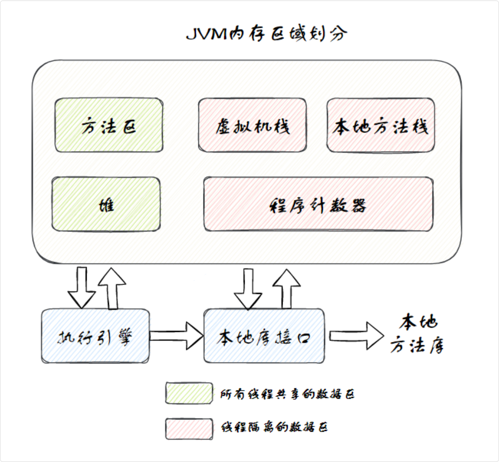
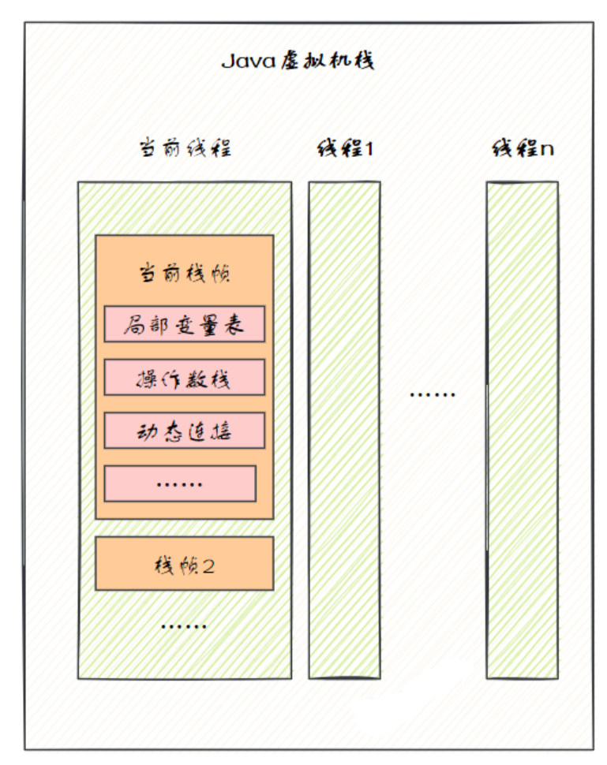
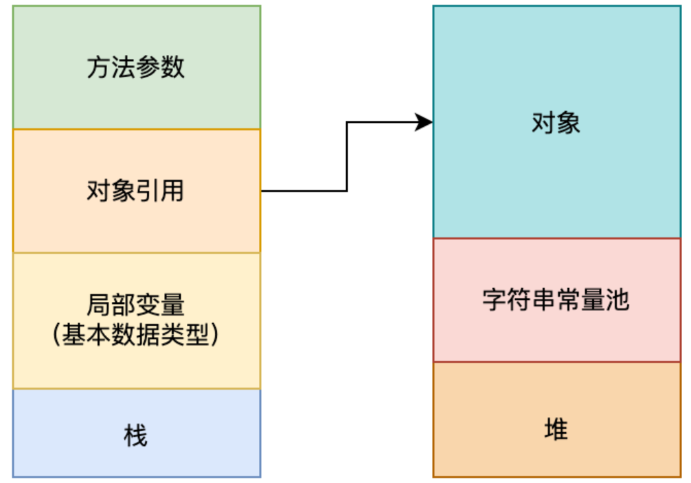
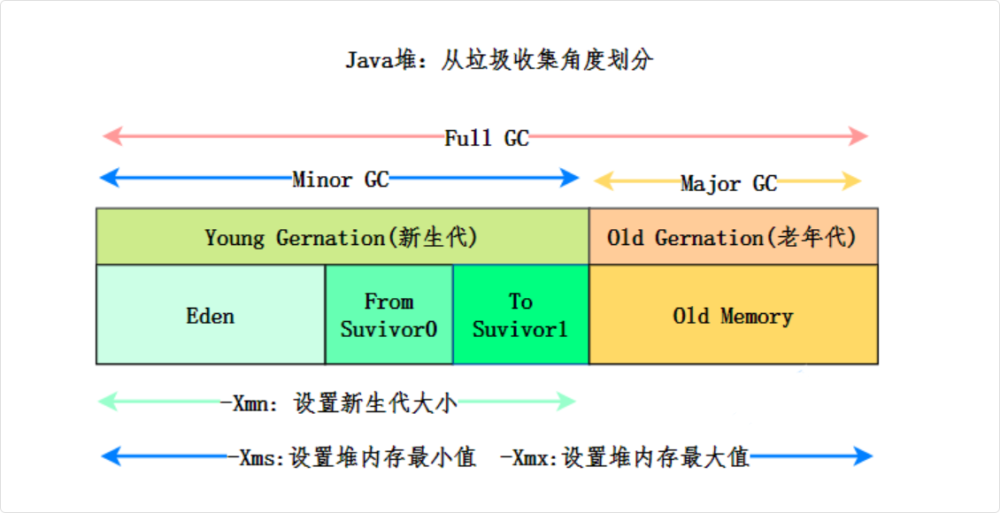

JVM 启动后，大致可以分为三个功能区：类加载器、运行时数据区以及执行引擎

## 内存管理

> 内存区其实是功能区中"运行时数据区"的具体细分

```plain
JVM（功能区视角）
│
├── 类加载器
│
├── 运行时数据区  ←──── 这部分就是"内存区"
│   ├── 程序计数器
│   ├── 虚拟机栈
│   ├── 本地方法栈
│   ├── 堆
│   └── 方法区
│
└── 执行引擎
    ├── JIT 编译器
    └── 垃圾回收器
```

JVM 运行后，按照 Java 虚拟机规范，JVM 的内存区域可以细分为`程序计数器`、`虚拟机栈`、`本地方法栈`、`堆`和`方法区`



其中方法区和堆是线程共享的，虚拟机栈、本地方法栈和程序计数器是线程私有的

- 方法区和堆：线程共享，随 JVM 创建和销毁
- 虚拟机栈、本地方法栈和程序计数器：线程隔离，随线程启动创建，结束后销毁

> JVM 本质是一个 C/C++ 程序，它向操作系统申请内存，然后自己管理这些内存，划分成不同区域给 Java 程序用

### 程序计数器

程序计数器也被称为 PC 寄存器，是一块较小的内存空间

它可以看作是当前线程所执行的字节码行号指示器

### 虚拟机栈

Java 虚拟机栈的生命周期与线程相同

当线程执行一个方法时，会创建一个对应的栈帧

用于存储局部变量表、操作数栈、动态链接、方法出口等信息，然后栈帧会被压入虚拟机栈中

> 栈帧里会保存一个方法执行时需要的核心信息：变量放哪、计算怎么做、调用其他方法时怎么定位、执行完后回到哪里

当方法执行完毕后，栈帧会从虚拟机栈中移除



#### 动态链接

指的是 Java 方法调用时，怎么从符号引用定位到实际方法，保存了对运行时常量池中方法符号引用的关联，方便在方法调用时把“符号引用”解析成“实际要执行的方法入口”

#### 操作数栈

是方法执行时做计算的临时工作区

比如：

```java
int c = a + b;
```

JVM 不是直接写成“把 a 和 b 相加赋值给 c”，而是类似这样执行

```java
iload_1   // 把 a 压入操作数栈
iload_2   // 把 b 压入操作数栈
iadd      // 弹出栈顶两个数，相加，再把结果压回栈
istore_3  // 把结果存到局部变量表的 c
```

#### 栈帧

栈帧是虚拟机栈中的基本单元，每个方法调用对应一个栈帧：

```plain
虚拟机栈（线程私有）
│
├── 栈帧3（方法C正在执行）  ←── 栈顶
│   ├── 局部变量表
│   ├── 操作数栈
│   ├── 动态链接
│   └── 方法返回地址
│
├── 栈帧2（方法B暂停中）
│   ├── 局部变量表
│   ├── 操作数栈
│   ├── 动态链接
│   └── 方法返回地址
│
└── 栈帧1（方法A暂停中）  ←── 栈底
    ├── 局部变量表
    ├── 操作数栈
    ├── 动态链接
    └── 方法返回地址
```

#### 一个什么都没有的空方法，空的参数都没有，那局部变量表里有没有变量

对于静态方法，由于不需要访问实例对象 this，因此在局部变量表中不会有任何变量。

对于非静态方法，即使是一个完全空的方法，局部变量表中也会有一个用于存储 this 引用的变量。this 引用指向当前实例对象，在方法调用时被隐式传入

### 本地方法栈

本地方法栈与虚拟机栈相似

区别在于虚拟机栈是为 JVM 执行 Java 编写的方法服务的

而本地方法栈是为 Java 调用本地 native 方法服务的，通常由 C/C++ 编写

在本地方法栈中，主要存放了 native 方法的局部变量、动态链接和方法出口等信息

当一个 Java 程序调用一个 native 方法时，JVM 会切换到本地方法栈来执行这个方法

#### 本地方法栈的运行场景

当 Java 应用需要与操作系统底层或硬件交互时，通常会用到本地方法栈。

比如调用操作系统的特定功能，如内存管理、文件操作、系统时间、系统调用等。

比如获取系统时间的 `System.currentTimeMillis()` 方法就是调用本地方法，来获取操作系统当前时间的

再比如 JVM 自身的一些底层功能也需要通过本地方法来实现。

像 Object 类中的 `hashCode()` 方法、`clone()` 方法等

### java 堆

堆是 JVM 中最大的一块内存区域，被所有线程共享，在 JVM 启动时创建，主要用来存储 new 出来的对象

> 存放 new 出来的对象
>
> “堆”至少有两个常见概念：一个是数据结构里的堆（通常是完全二叉树），一个是内存管理里的堆（动态分配内存的区域）；JVM 说的堆指的是后者
>
> 与规规矩矩、先进后出的“栈（Stack）”不同，堆内存是一大片相对杂乱的空间。你可以随时在里面申请一块内存，用完后再释放。它的分配和释放顺序是随意的

Java 中“几乎”所有的对象都会在堆中分配，堆也是垃圾收集器管理的目标区域



从内存回收的角度来看，由于垃圾收集器大部分都是基于分代收集理论设计的，所以堆又被细分为

- 新生代
  - Eden空间
  - From Survivor空间
  - To Survivor空间
- 老年代



> 从 JDK 7 开始，JVM 默认开启了逃逸分析，意味着如果某些方法中的对象引用没有被返回或者没有在方法体外使用，也就是未逃逸出去，那么对象可以直接在栈上分配内存

#### 堆与栈的区别

堆属于线程共享的内存区域，几乎所有 new 出来的对象都会堆上分配，生命周期不由单个方法调用所决定，可以在方法调用结束后继续存在，直到不再被任何变量引用，最后被垃圾收集器回收。

栈属于线程私有的内存区域，主要存储局部变量、方法参数、对象引用等，通常随着方法调用的结束而自动释放，不需要垃圾收集器处理。

### 方法区

方法区并不真实存在，属于 Java 虚拟机规范中的一个逻辑概念

用于存储已被 JVM 加载的类信息、常量、静态变量、即时编译器编译后的代码缓存等

在 HotSpot 虚拟机中

方法区的实现称为永久代 PermGen

但在 Java 8 及之后的版本中，已经被元空间 Metaspace 所替代

在Java虚拟机（JVM）中，类的元数据是存放在方法区的，而Class对象本身并不存放在方法区，而是存放在堆内存中

> 当类加载器（ClassLoader）将 .class 文件加载到内存后，JVM 会提取其中的类信息
>
> 并将其转化为 JVM 内部的数据结构（在 HotSpot 虚拟机中称为 Klass 模型，比如 InstanceKlass）存储在方法区中

当你执行 MyClass obj = new MyClass(); 时，发生了什么？

- 查找： JVM 首先去方法区查找是否有 MyClass 的信息。
- 加载： 如果没有，类加载器读取 MyClass.class 文件。
- 存入方法区： JVM 解析字节码，把类的结构信息（方法、字段等）塞进方法区。
- 生成 Class 对象： JVM 紧接着在堆区中创建一个 java.lang.Class 类型的对象，代表 MyClass，并让它指向方法区里的那些数据。
- 实例化： 最后，JVM 根据方法区里的内存布局信息，在堆区为 obj 分配内存，并完成初始化。

#### 作用

方法区是JVM内存模型的一部分，主要用于存储以下内容：

类的元数据：包括类的名称、父类、修饰符、接口列表等。

- 常量池：存储编译时的字面量和符号引用。
- 静态变量：类的静态字段。
- 方法字节码：类的方法代码和相关信息。

方法区是所有线程共享的区域，JVM在加载类时会将类的元数据存储到方法区中，以便在运行时使用。

#### Class 对象存储位置

当JVM加载一个类时，会在堆内存中创建一个对应的`java.lang.Class`对象

这个Class对象是类的运行时表示，开发者可以通过反射机制访问类的详细信息，例如字段、方法和注解等

> 方法区存储类的元数据，而Class对象是对这些元数据的引用。通过Class对象，开发者可以访问方法区中的类信息，例如字段、方法和常量池

### 变量的存放位置

对于局部变量，它存储在当前方法栈帧中的局部变量表中。

当方法执行完毕，栈帧被回收，局部变量也会被释放

对于静态变量来说，它存储在 Java 虚拟机规范中的方法区中，在 Java 7 中是永久带，在 Java8 及以后 是元空间

### JVM 如何执行一个 Java 方法

从 java Xxx 命令开始，操作系统会创建一个 JVM 进程；

JVM 进程中的线程执行 Java 方法时，每次方法调用都会在对应线程的虚拟机栈中创建一个栈帧，方法的参数、局部变量和计算过程都围绕这个栈帧展开

#### 方法执行和虚拟机栈的关系

- 每个线程都有自己的虚拟机栈
- 当线程调用一个方法时，会为该方法创建一个栈帧并压栈
- 方法执行结束后，栈帧出栈

#### 栈帧里有什么

- 局部变量表
- 操作数栈
- 动态链接
- 方法返回地址

#### 方法中的变量怎么访问

- 局部变量和参数存放在局部变量表中
- JVM 不是按变量名访问，而是按 slot 槽位访问
- 槽位数量对某个方法来说在编译后就基本确定了，且可能发生复用

#### 一次方法调用的本质

- 创建栈帧
- 参数入局部变量表
- 字节码指令操作局部变量表和操作数栈
- 执行结束后返回结果并弹出栈帧

#### 思考

方法执行时，JVM 总是操作当前线程虚拟机栈的栈顶栈帧；局部变量通过当前栈帧中的局部变量表按 slot 下标访问，而不是按变量名查找。

JVM 看的是 字节码

所以“找局部变量”这件事，本质是：

- 当前线程拿到栈顶栈帧
- JVM 执行当前字节码
- 字节码里写着访问哪个 slot
- 直接去局部变量表对应位置拿

“当前方法”怎么知道自己对应哪个栈帧

因为线程的虚拟机栈本来就是：

- 谁在执行，谁就在栈顶
- 当前正在执行的方法，对应的就是栈顶栈帧

当前方法不需要“满栈找自己的栈帧”，因为它本来就在栈顶，JVM 执行时天然就拿的是当前栈顶帧。

##### 例子

```java
public int add(int a, int b) {
  int c = a + b;
  return c;
}
```

这个方法执行时，栈帧里可能是这样：

```plain
当前栈帧
├── 局部变量表
│   ├── slot0 = this
│   ├── slot1 = a
│   ├── slot2 = b
│   └── slot3 = c
├── 操作数栈
├── 动态链接
└── 返回地址
```

然后字节码大概会做这种事：

```java
iload_1    // 取 slot1，也就是 a
iload_2    // 取 slot2，也就是 b
iadd       // 相加
istore_3   // 把结果放到 slot3，也就是 c
iload_3    // 取 c
ireturn    // 返回
```
