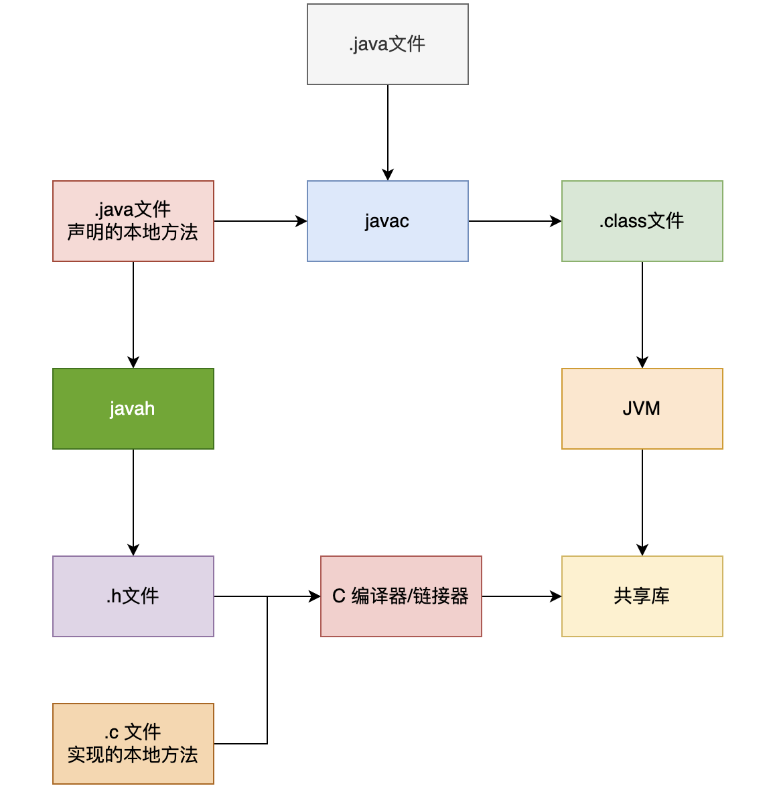

## JVM3

当 Java 应用需要与操作系统底层或硬件交互时，通常会用到本地方法栈。

### native 方法

native 方法是在 Java 中通过 native 关键字声明的，用于调用非 Java 语言，如 C/C++ 编写的代码。Java 可以通过 JNI，也就是 Java Native Interface 与底层系统、硬件设备、或者本地库进行交互

Java 的 native 方法本身没有 Java 代码实现，而是交给本地代码实现

```java
public native void test();
```

这个方法真正的逻辑可能写在 C/C++ 里，然后编译成一个 .dll。

Java 运行时通过：

```java
System.loadLibrary("xxxx");
```

把这个动态库加载进来，再去调用里面对应的本地函数

你可以把它想成：

- Java 代码：负责声明“我要调用这个方法”
- .dll：真正存放底层实现
- JVM：负责把 .dll 加载进来并完成调用

不同系统名字不一样：

- Windows：.dll
- Linux：.so
- macOS：.dylib

#### JNI (Java Native Interface)

一般情况下，我们完全可以使用 Java 语言编写程序，但某些情况下，Java 可能满足不了需求，或者不能更好的满足需求，比如：

- 标准的 Java 类库不支持。
- 我们已经用另一种语言，比如说 C/C++ 编写了一个类库，如何用 Java 代码调用呢？
- 某些运行次数特别多的方法，为了加快性能，需要用更接近硬件的语言（比如汇编）编写

上面这三种需求，说到底就是如何用 Java 代码调用不同语言编写的代码。那么 JNI 应运而生了。

从 Java 1.1 开始，Java Native Interface (JNI)标准就成为 Java 平台的一部分，它允许 Java 代码和其他语言编写的代码进行交互

JNI 一开始是为了本地已编译语言，尤其是 C 和 C++而设计的，但是它并不妨碍你使用其他语言，只要调用约定受支持就可以了

使用 Java 与本地已编译的代码交互，通常会**丧失平台可移植性**，但是，有些情况下这样做是可以接受的，甚至是必须的

比如，使用一些旧的库，与硬件、操作系统进行交互，或者为了提高程序的性能。JNI 标准至少保证本地代码能工作能在任何 Java 虚拟机实现下

通过 JNI，我们就可以通过 Java 程序（代码）调用到操作系统相关的技术实现的库函数，从而与其他技术和系统交互；同时其他技术和系统也可以通过 JNI 提供的相应原生接口调用 Java 应用系统内部实现的功能

##### 缺点

- 程序不再跨平台。要想跨平台，必须在不同的系统环境下重新编译本地语言部分。
- 程序不再是绝对安全的，本地代码的不当使用可能导致整个程序崩溃。一个通用规则是，你应该让本地方法集中在少数几个类当中。这样就降低了 Java 和 C/C++ 之间的耦合性。

#### 具体使用

- 编写带有 native 方法的 Java 类，生成.java 文件；
- 使用 javac 命令编译所编写的 Java 类，生成.class 文件；
- 使用 javah -jni java 类名 生成扩展名为 h 的头文件，也即生成 .h 文件；
- 使用 C/C++（或者其他编程想语言）实现本地方法，创建 .h 文件的实现，也就是创建 .cpp 文件实现.h 文件中的方法；
- 将 C/C++ 编写的文件生成动态连接库，生成 dll 文件；

> dll 是 Dynamic Link Library，中文一般叫 动态链接库。
>
> 在 Windows 里，它本质上是一个可被其他程序在运行时加载的二进制库文件，扩展名就是 .dll

```java
// 只要 Java 语法没问题，就能编译通过。
// 这时候 没有 hello.dll 也没关系。
public class HelloJNI {
  static {
      System.loadLibrary("hello"); // 加载名为 libhello.dylib 的动态链接库 (dylib 是 macOS 的动态链接库)
  }

  // 定义本地方法
  private native void helloJNI();

  public static void main(String[] args) {
      new HelloJNI().helloJNI(); // 调用本地方法
  }
}
```

- ative 方法声明：像是在 Java 里先留了个“接口”
- dll：真正的实现
- 编译时只检查声明
- 运行时才检查实现

##### 编译 `HelloJNI.java`

在命令行通过 `javac HelloJNI.java` 来编译源代码

执行完毕后，会在 `HelloJNI.java` 所在目录下生成一个名为 `HelloJNI.h` 的头文件

##### 使用 c语言实现本地方法

创建一个 C 文件 HelloJNI.c，实现本地方法 sayHello

```c
#include <stdio.h>
#include <jni.h>
#include "HelloJNI.h"

JNIEXPORT void JNICALL Java_HelloJNI_helloJNI(JNIEnv *env, jobject obj) {
    printf("Hello, JNI!\n");
    return;
}
```

注意，这里需要引入 JNI 头文件，并且实现的方法名称需要与在 Java 中声明的名称一致（HelloJNI_helloJNI HelloJNI 类的 helloJNI 方法）

##### 对应编译脚本

```shell
#!/bin/bash

# 编译 HelloJNI.c 文件
gcc -I"$JAVA_HOME/include" -I"$JAVA_HOME/include/darwin" -shared -o libhello.dylib HelloJNI.c

# 把生成的 libhello.dylib 文件拷贝到当前目录
cp libhello.dylib .
```

- $JAVA_HOME 是 JDK 的安装路径，需要根据实际情况修改。
- 在 macOS 上，动态链接库（hello）的后缀是 .dylib，而不是 Linux 上的 .so。

这里的 -I 选项是为了告诉编译器头文件的位置，$JAVA_HOME 是 Java 安装目录的路径

之后执行即可



### OOM 分析

JAVA OOM 后是抛出异常，如果没有自定义捕获，是被默认捕获，所以退出当前线程，那此时如果另一个线程尝试 new 会触发 OOM 吗

核心结论是：**不一定。另一个线程尝试 `new` 对象时，可能会成功，也可能会再次触发 OOM，这完全取决于导致 OOM 的内存是否随着前一个线程的退出而被释放。**

我们需要先纠正一个小细节：`OutOfMemoryError` 属于 `Error`，而不是 `Exception`，但它在发生时确实会像异常一样沿着调用栈向外抛出。如果一直没有被捕获（无论是 `try-catch` 还是线程的 `UncaughtExceptionHandler`），该线程就会终止退出。

以下是具体的场景分析：

#### 场景一：另一个线程 **不会** 触发 OOM（分配成功）

如果导致 OOM 的那个线程，是因为在自己的执行逻辑中创建了**大量局部对象**（例如读取了一个超大文件并存放在该线程方法内的 `List` 中）而把内存撑爆的。

- **发生什么：** 当这个线程因为 OOM 异常退出并结束后，它对应的虚拟机栈（VM Stack）会被销毁。
- **GC 的作用：** 这个线程持有的那些局部变量（GC Roots）将不复存在。这就意味着，它之前疯狂创建的那些占用大量内存的对象，变成了**不可达（Unreachable）**状态。
- **结果：** 此时如果有其他线程触发了垃圾回收（GC），或者 JVM 自动进行了 GC，这些庞大的内存就会被回收掉。因此，另一个线程再去 `new` 对象时，堆内存已经有了足够的空间，**不会触发 OOM**。

#### 场景二：另一个线程 **会** 再次触发 OOM

如果导致 OOM 的原因是一个**全局性的内存泄漏**，或者大量对象被长生命周期的对象（如静态变量、全局缓存、Spring 单例 Bean 等）所引用。

- **发生什么：** 那个不幸的线程仅仅是“压死骆驼的最后一根稻草”。它在尝试 `new` 一个很小的对象时，发现堆内存已经满了，于是抛出了 OOM 并退出了。
- **GC 的作用：** 即使这个线程死掉了，它所释放的局部变量内存微乎其微。真正霸占内存的那些对象依然被全局引用着（强引用），GC 根本无法回收它们。
- **结果：** 堆内存依然处于几乎被撑爆的状态。当另一个线程尝试 `new` 新对象时，依然没有足够的连续空间，于是**会再次触发 OOM**。

### 场景三：时间差（并发竞争）导致的 OOM

即使符合“场景一”（内存是可以被回收的），但如果另一个线程在第一个线程刚刚抛出 OOM 且**垃圾回收器（GC）还未来得及执行清理工作**的瞬间去 `new` 对象，它依然会因为当前时刻堆内存不足而触发 OOM。

---

#### 💡 核心总结与引申

很多开发者有一个误区，认为 **“发生 OOM 会导致整个 JVM 进程崩溃”**。其实并非如此。

1. **OOM 只会干掉触发它的那个线程**（如果没有捕获的话）。
2. JVM 进程本身会不会死，取决于死掉的那个线程是不是关键线程（比如影响了核心业务逻辑，或者所有的非守护线程都死光了）。
3. 如果一个后台定时任务线程 OOM 死掉了，并且它的垃圾被回收了，你的 Tomcat/Spring Boot 主力 Web 线程依然可以正常接收和处理请求。
