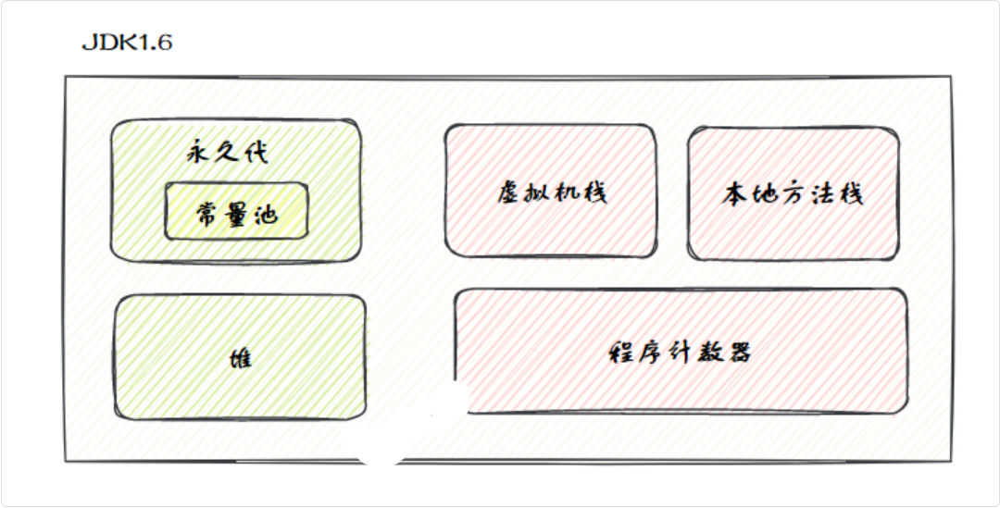
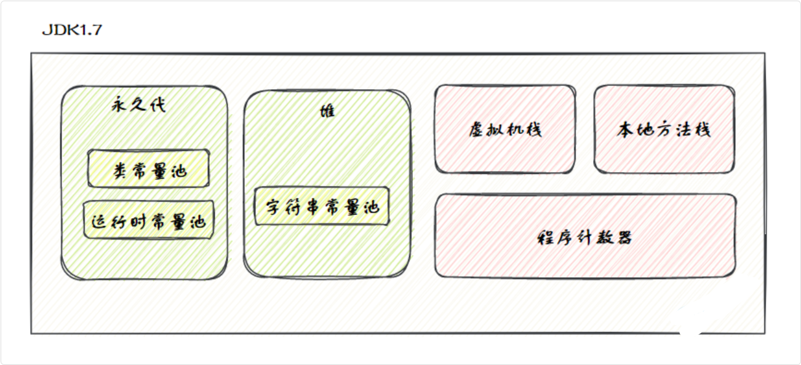
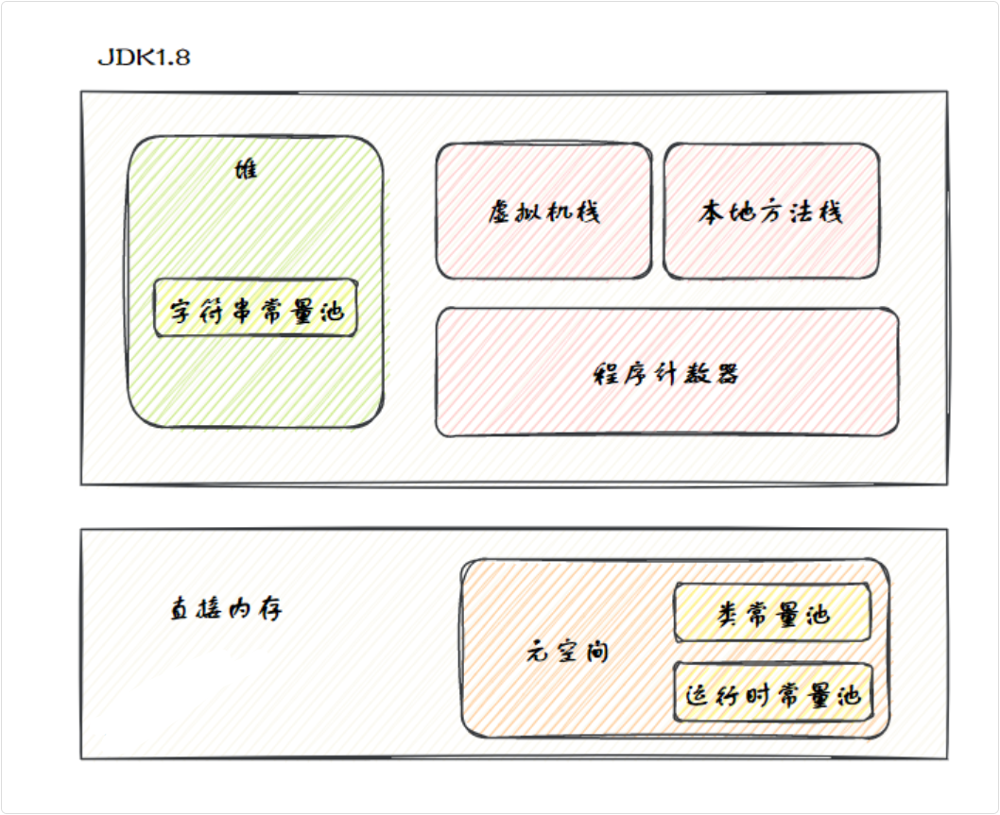
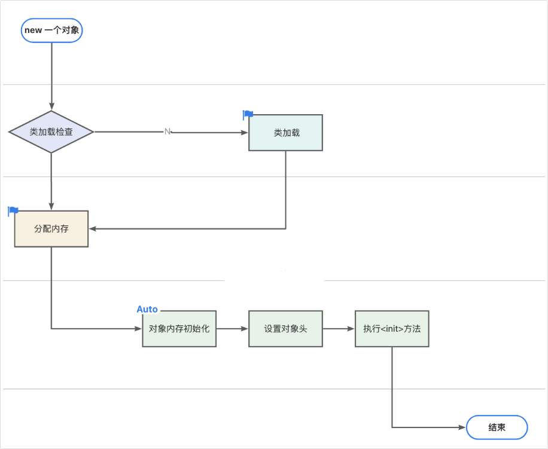

虚拟机栈、本地方法栈、程序计数器 | 堆、方法区

## 不同 JDK 下内存区域变化

主要是方法区实现的不同

> 方法区是 JVM 规范里的概念, JVM 需要有这么一块区域来存类相关信息
>
> HotSpot 实现层面：曾经用永久代、后来用元空间来实现

JDK 1.6 使用永久代来实现方法区：



JDK 1.7 时仍然是永久带，但发生了一些细微变化，比如将字符串常量池、静态变量存放到了堆上。



在 JDK 1.8 时，直接在内存中划出了一块区域，叫**元空间**，来取代之前放在 JVM 内存中的永久代，并将**运行时常量池**、**类常量池**都移动到了元空间



### 为什么使用元空间替代永久代

客观上，永久代会导致 Java 应用程序更容易出现内存溢出的问题，因为它要受到 JVM 内存大小的限制

HotSpot 虚拟机的永久代大小可以通过 -XX：MaxPermSize 参数来设置，32 位机器默认的大小为 64M，64 位的机器则为 85M

问题是类元数据这类东西的大小很难估计：

- 类多
- 动态生成类多
- 框架多（Spring、Hibernate、代理类、CGLIB）
- 热部署/类加载器反复创建

就很容易出现：`OutOfMemoryError: PermGen space`

此外

> 类元数据和 Java 对象放在一起不太合适

永久代属于 HotSpot 里一块比较特殊的 JVM 内存区域, 但类的元数据本质上和普通 Java 对象不是一类东西，把它们塞在同一套受限空间里，管理起来不够自然

元空间不再使用 JVM 的堆内存，而是直接使用操作系统的本地内存（Native Memory）

这意味着，只要你的服务器物理内存足够大，元空间就可以一直动态扩展，基本告别了类元数据塞满导致的 OOM 问题

> 降低调优困难

在过去，预估一个复杂的企业级应用到底需要多大的永久代是非常困难的。它不仅取决于项目本身的代码量，还取决于引入了多少第三方 Jar 包，以及运行时会动态生成多少类。设置小了容易 OOM，设置大了又浪费堆内存。

使用本地内存的元空间后，JVM 会根据应用程序的需要自动分配内存，大大降低了开发者对这部分内存管理的负担。当然，为了防止元空间无限扩张吞噬掉所有物理内存导致系统死机，也可以通过 `-XX:MaxMetaspaceSize` 来设置一个上限

> 提升垃圾回收（GC）的效率

永久代的垃圾回收效率一直很低。在永久代中进行 GC（通常伴随着 Full GC）去清理废弃的类和类加载器，条件非常苛刻，而且经常清理不干净，导致长时间的停顿（STW）

将元数据移到堆外的元空间后，简化了 JVM 堆内存的垃圾回收流程，也方便了对类元数据进行独立的、更高效的管理

#### 什么是本地内存

简单来说：

JVM 本质上就是一个由 C/C++ 编写的普通的操作系统进程。

当你在命令行敲下 java xxx 时，你其实是在启动一个名为 java 的 C++ 程序。

操作系统（如 Linux）会为这个进程分配一个巨大的虚拟内存地址空间, 在这个空间里，JVM 进程可以完全按照操作系统的规则来申请和使用内存

##### Java 堆内存

在 JVM 进程启动时，它会根据你设置的参数（比如 -Xms 和 -Xmx），通过底层 C++ 代码一次性向操作系统申请一大块连续的内存空间

- **机制**：在 JVM 进程启动时，它会根据你设置的参数（比如 `Xms` 和 `Xmx`），通过底层 C++ 代码**一次性**向操作系统申请一大块连续的内存空间。
- **角色**：JVM 就像是一个“二房东”，把这块大内存承包下来后，自己在内部建立了一套复杂的机制（比如年轻代、老年代、垃圾回收器 GC）来分配和管理这块土地。
- **用途**：你在 Java 代码里 `new` 出来的各种对象，都是由 JVM 这个二房东分配在这块“承包地”里的。

##### 本地内存 / 堆外内存

本地内存（Native Memory），也叫堆外内存，指的是 JVM 进程的虚拟内存空间中，没有被划分给 Java 堆的那部分内存

- **机制**：因为 JVM 底层是 C++ 写的，所以当它需要内存时，它完全可以绕过自己管理的“Java 堆”，直接调用 C/C++ 的标准库函数（比如 `malloc()`、`free()` 或者 `mmap()`）向操作系统（OS）动态申请内存。
- **操作方式**：当 JVM 需要加载一个新类时，底层的 C++ 代码会直接调用系统的内存分配接口，在 Java 堆之外的进程空间里切出一块内存，用来存放这个类的元数据（这就是**元空间**的由来）。
- **特点**：这部分内存**不受 Java 堆大小（`Xmx`）的限制**，也不由 Java 的常规垃圾回收器直接管理。它的上限主要受限于操作系统分配给该进程的物理内存和虚拟内存总大小。

##### 总结

当你启动 JVM 并加载大量类时，底层发生的事情是这样的：

1. **操作系统**：启动 `java` 进程，分配虚拟内存空间。
2. **JVM (C++层面)**：调用 `malloc` 申请一块大内存作为 **Java 堆**。
3. **程序运行**：需要加载一个新类（比如动态生成了一个代理类）。
4. **JVM (C++层面)**：发现是类元数据，不放进 Java 堆。再次调用 `malloc`，在堆外的**本地内存**中分配一块空间（即元空间 Metaspace），把类信息存进去。

所以，JVM 能够“直接操作本地内存”，是因为 JVM 本身是本地实现的用户态进程，可以通过操作系统提供的内存分配接口申请和管理进程地址空间内的内存

除了元空间，其实我们在写 Java 后端高并发应用时，Java 代码本身也可以主动去操作这块“本地内存”（堆外内存），这在提升网络 I/O 性能上非常有用

## 对象创建过程

当我们使用 new 关键字创建一个对象时，JVM 首先会检查 new 指令的参数是否能在常量池中定位到类的符号引用

然后检查这个符号引用代表的类是否已被加载、解析和初始化。

如果没有，就先执行类加载

如果已经加载，JVM 会为对象分配内存完成初始化，比如数值类型的成员变量初始值是 0，布尔类型是 false，对象类型是 null。

接下来会设置对象头，里面包含了对象是哪个类的实例、对象的哈希码、对象的 GC 分代年龄等信息。

最后，JVM 会执行构造方法 `<init>` 完成赋值操作，将成员变量赋值为预期的值，比如 int age = 18，这样一个对象就创建完成了。



### Gemini 解释流程

#### JVM 对象创建的第一步 —— 类加载检查

当程序执行到 `new` 关键字准备创建对象时

例如 `User user = new User();`

JVM 并不是立刻就在堆里划分一块内存，而是必须先经历一个**验明正身**的过程

具体分为以下三个逻辑步骤：

##### 1. 遇到 `new` 指令：拿着“号码牌”找线索

在 Java 编译后的字节码中，`new User()` 并不是直接写着“分配 User 对象的内存”，而是会被编译成类似这样的指令：

```Java
new #2
dup
invokespecial #3   // 调用构造方法 <init>`
```

这里的 `#2` 就像是一个号码牌

JVM 执行到 `new #2` 时，会拿着这个号码，去当前类的**运行时常量池**中查找它到底代表什么

##### 2. 解析符号引用：把“名字”翻译成“目标”

JVM 在常量池中找到 `#2` 对应的项后，会发现这只是一个**符号引用**。

- **什么是符号引用？**
  - 简单来说，它就是一个字符串字面量（比如记录着类名全路径：`com/example/User`）
  - 因为在编译成 `.class` 文件时，编译器根本不知道 `User` 这个类将来会被加载到内存的哪个物理地址，所以只能先用一个“名字”来占位。

##### 3. 核心检查：这个类真的准备好了吗？（触发类加载检查）

拿到 `com/example/User` 这个名字后，JVM 必须要确认一件事：**我要实例化的这个类，现在有没有被加载到内存（元空间）中？**

- **为什么一定要检查？** 因为 JVM 如果要给 `User` 对象分配内存，就必须提前知道这个对象到底需要占多大空间（比如它有几个 `int` 字段，几个引用字段）。而这些关于类结构的信息（元数据），只有在这个类被完整加载、解析后，才会存在于内存中。
- **检查的结果：**
  - **如果已加载：** 常量池里的那个符号引用（字符串）早就已经被替换成了直接指向元空间中该类元数据的**直接引用**（内存指针）。JVM 知道了对象大小，就可以顺利进入下一步——分配内存。
  - **如果未加载：** 说明这是程序第一次用到这个类。JVM 必须立刻暂停对象的创建，先触发这个类的**类加载过程**（加载 -> 链接 -> 初始化），把 `.class` 文件吃透，搞清楚类的结构，然后再回头继续对象的实例化。

##### 实际解析过程

> 阶段一：在常量池里的“套娃”解析

刚才说到 `new #2`，这个 `#2` 只是一个索引

在 `.class` 文件的结构里，它并不会直接把字符串塞在 `#2` 的位置。

1. **第一层寻找：** JVM 找到常量池的第 2 项（`#2`），发现这是一个专门用来表示类的结构（叫 `CONSTANT_Class_info`）。
2. **第二层寻找：** 这个结构里面本身没有存英文字母，而是存了另一个索引（假设是 `#15`），意思是“这个类的名字存在第 15 项那里”。
3. **拿到真名：** JVM 再顺着找到常量池的第 15 项（`CONSTANT_Utf8_info`），这才真正拔出了 `com/example/User` 这个标准的 UTF-8 字符串。

> 阶段二：拿着名字去“查字典” （核心机制）

拿到了 `com/example/User` 这个字符串后，JVM 怎么知道内存里有没有这个类呢？总不能把整个元空间遍历一遍吧？

这个时候，JVM 会去查一本它内部维护的“花名册”——这在底层被称为 **System Dictionary（系统字典）**

可以把它理解成一个巨大的全局哈希表（HashMap）。

这里有一个 JVM 领域非常重要的高级考点：

**JVM 查字典时，不能只靠字符串名字！**

- 在 Java 的世界里，判断一个类是不是唯一的，标准是：**“全限定类名 + 加载它的类加载器（ClassLoader）”**
- 为什么？因为 Tomcat 这样的容器里，可能会有不同的 Web 应用使用了同一个包名和类名的类，但它们是相互隔离的，靠的就是不同的 ClassLoader

**所以，真实的查找动作是这样的：**

1. JVM 拿着提取出来的字符串 `com/example/User`。
2. 抓取当前正在执行这段代码的类（比如在 `OrderService` 里 new 的 User，那就拿到 `OrderService` 的类加载器）。
3. 把这两者组合成一个 Key：`[com/example/User, AppClassLoader]`。
4. 去 System Dictionary 这个哈希表里查：
    - **查到了（命中）：** 返回一个指针，直接指向元空间（Metaspace）里该类的元数据地址。这就说明类已经加载好了，检查通过！
    - **没查到（Miss）：** 说明这个类在这个加载器的管辖范围内还没被加载过。JVM 就会挂起当前的 `new` 指令，触发双亲委派机制去磁盘里找 `.class` 文件，执行完整的类加载流程。

### 对象创建流程总结

| 步骤 | 做了什么 | 关键点 |
| ------ | ---------- | -------- |
| 1. 类加载检查 | 确认类已加载 | 符号引用 → 直接引用，System Dictionary 查找 |
| 2. 分配内存 | 在堆中划分空间 | 指针碰撞 vs 空闲列表，TLAB 解决并发问题 |
| 3. 初始化零值 | 成员变量设默认值 | 保证对象可用，无脏数据 |
| 4. 设置对象头 | 填充对象头信息 | Mark Word（哈希码、GC年龄、锁状态）+ 类型指针 |
| 5. 执行构造方法 | 执行 `<init>` | 显式赋值 → 构造代码块 → 构造方法体 |

## 销毁过程

当对象不再被任何引用指向时，就会变成垃圾

垃圾收集器会通过可达性分析算法判断对象是否存活，如果对象不可达，就会被回收

垃圾收集器通过标记清除、标记复制、标记整理等算法来回收内存，将对象占用的内存空间释放出来。

可以通过 java -XX:+PrintCommandLineFlags -version 和 java -XX:+PrintGCDetails -version 命令查看 JVM 的 GC 收集器。
