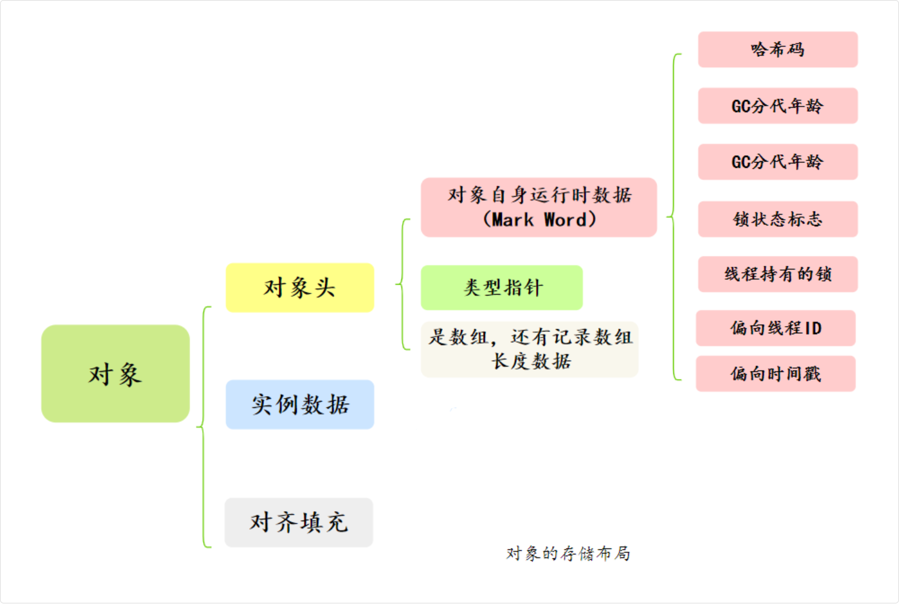
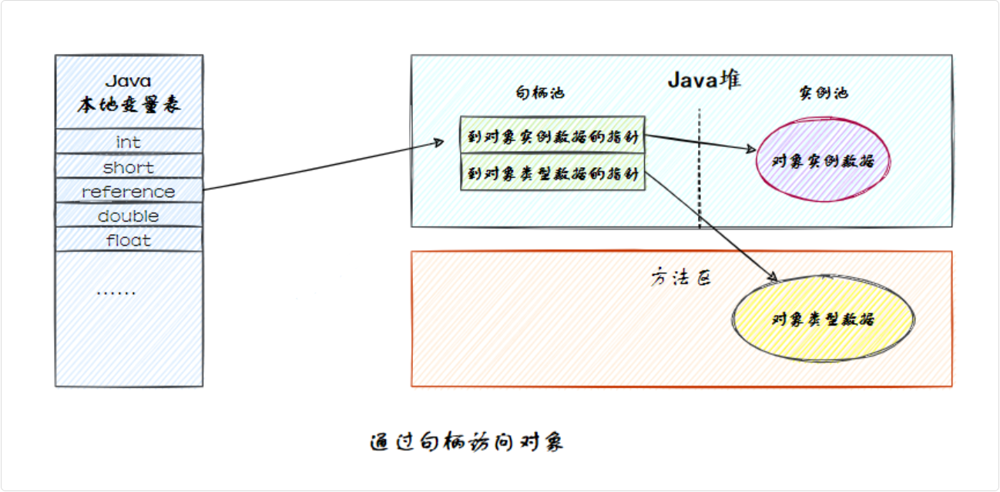
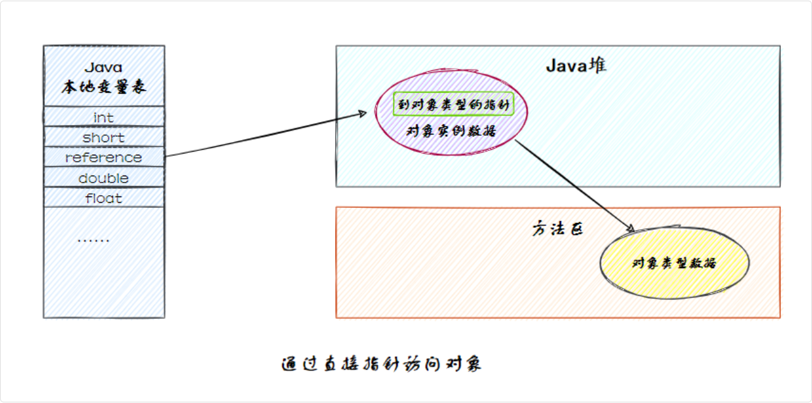
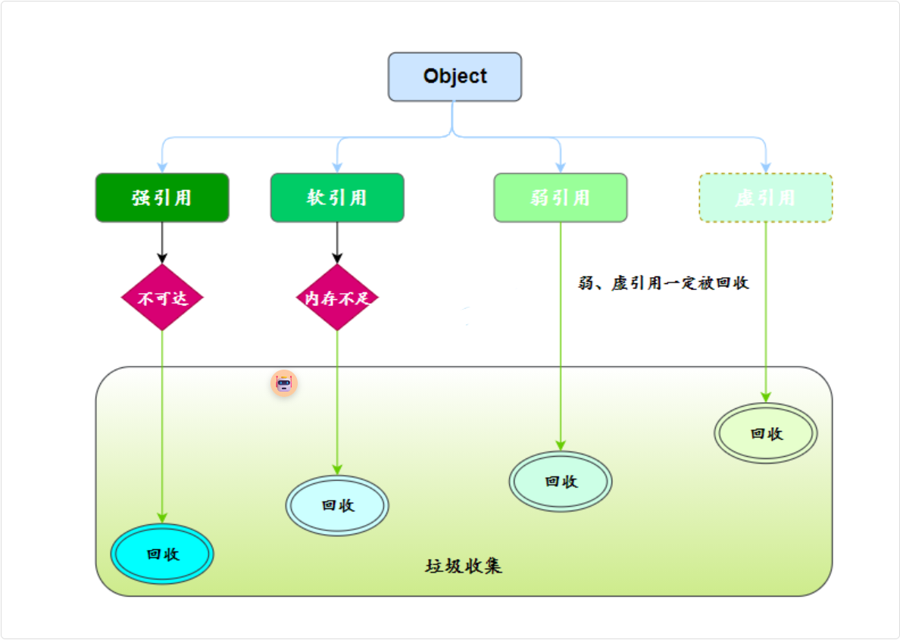

## 对象内存布局

对象的内存布局是由 Java 虚拟机规范定义的，但具体的实现细节各有不同，如 HotSpot 和 OpenJ9 就不一样

常用的 HotSpot 为例：

对象在内存中包括三部分：对象头、实例数据和对齐填充

> 对象头 (Mark World + 类型指针 (指向 Class 对象)) + 实例数据 + 对齐填充
>
> 对象头 (8字节 + 8字节 (压缩 4 字节)): 12字节 (指针压缩)
>
> 对齐填充必须是 8 的倍数 (64位)



### 对象头作用

对象头是对象存储在内存中的元信息，包含了Mark Word、类型指针等信息

Mark Word 存储了对象的运行时状态信息，包括锁、哈希值、GC 标记等。

在 64 位操作系统下占 8 个字节，32 位操作系统下占 4 个字节。

> Mark Word 的大小等于一个机器字长
>
> 32 位系统是 4 字节，64 位系统是 8 字节。

类型指针指向对象所属类的元数据，也就是 Class 对象，用来支持多态、方法调用等功能。

除此之外，如果对象是数组类型，还会有一个额外的数组长度字段。占 4 个字节。

#### 类型指针会被压缩吗

类型指针可能会被压缩，以节省内存空间。比如说在开启压缩指针的情况下占 4 个字节，否则占 8 个字节。

在 JDK 8 中，压缩指针默认是开启的

可以通过 `java -XX:+PrintFlagsFinal -version | grep UseCompressedOops` 命令来查看 JVM 是否开启了压缩指针

### 实例数据

实例数据是对象实际的字段值，也就是成员变量的值，按照字段在类中声明的顺序存储

JVM 会对这些数据进行对齐/重排，以提高内存访问速度

#### 对齐填充 (8 字节的倍数)

由于 JVM 的内存模型要求对象的起始地址是 8 字节对齐（64 位 JVM 中），因此对象的总大小必须是 8 字节的倍数。

如果对象头和实例数据的总长度不是 8 的倍数，JVM 会通过填充额外的字节来对齐。

比如说，如果对象头 + 实例数据 = 14 字节，则需要填充 2 个字节，使总长度变为 16 字节

> 因为 CPU 进行内存访问时，一次寻址的指针大小是 8 字节，正好是 L1 缓存行的大小。如果不进行内存对齐，则可能出现跨缓存行访问，导致额外的缓存行加载，CPU 的访问效率就会降低

### new Object() 对象内存大小是多少

> 目前的操作系统都是 64 位的，并且 JDK 8 中的压缩指针是默认开启的

在 64 位的 JVM 上，`new Object()` 的大小是 16 字节（12 字节的对象头 + 4 字节的对齐填充）。

对象头的大小是固定的

- 在 32 位 JVM 上是 8 字节
- 在 64 位 JVM 上是 16 字节
  - 如果开启了压缩指针，就是 12 字节。

实例数据的大小取决于对象的成员变量和它们的类型。对于new Object()来说，由于默认没有成员变量，因此我们可以认为此时的实例数据大小是 0

> 假如 MyObject 对象有三个成员变量，分别是 int、long 和 byte 类型，那么它们占用的内存大小分别是 4 字节、8 字节和 1 字节

考虑到对齐填充，MyObject 对象的总大小为 12（对象头） + 4（a） + 8（b） + 1（c） + 7（填充） = 32 字节

### JOL — 分析 JVM 对象工具

```xml
<dependency>
  <groupId>org.openjdk.jol</groupId>
  <artifactId>jol-core</artifactId>
  <version>0.9</version>
</dependency>
```

简单示例

```java
public class JOLSample {
  public static void main(String[] args) {
    // 打印JVM详细信息（可选）
    System.out.println(VM.current().details());

    // 创建Object实例
    Object obj = new Object();

    // 打印Object实例的内存布局
    String layout = ClassLayout.parseInstance(obj).toPrintable();
    System.out.println(layout);
  }
}
```

### 对象的引用大小

在 64 位 JVM 上，未开启压缩指针时，对象引用占用 8 字节；开启压缩指针时，对象引用会被压缩到 4 字节

HotSpot 虚拟机默认是开启压缩指针的。

## JVM 怎么访问对象

主流的方式有两种：句柄和直接指针

两种方式的区别在于：

- 句柄是通过一个中间的句柄表来定位对象的
- 而直接指针则是通过引用直接指向对象的内存地址

句柄的优点是，对象被移动时只需要修改句柄表中的指针，而不需要修改对象引用本身



在直接指针访问中，引用直接存储对象的内存地址；对象的实例数据和类型信息都存储在堆中固定的内存区域

优点是访问速度更快，因为少了一次句柄的寻址操作。缺点是如果对象在内存中移动，引用需要更新为新的地址

HotSpot 虚拟机主要使用直接指针来进行对象访问。



## 对象引用方式

四种，分别是强引用、软引用、弱引用和虚引用。



### 强引用

强引用是 Java 中最常见的引用类型

使用 new 关键字赋值的引用就是强引用，只要强引用关联着对象，垃圾收集器就不会回收这部分对象，即使内存不足

### 软引用

软引用于描述一些非必须对象，通过 SoftReference 类实现。软引用的对象在内存不足时会被回收

```java
// softRef 就是一个软引用
SoftReference<String> softRef = new SoftReference<>(new String("PPP"));
```

### 弱引用

弱引用用于描述一些短生命周期的非必须对象，如 ThreadLocal 中的 Entry，就是通过 WeakReference 类实现的

弱引用的对象会在下一次垃圾回收时会被回收，不论内存是否充足

### 虚引用

虚引用主要用来跟踪对象被垃圾回收的过程，通过 PhantomReference 类实现。虚引用的对象在任何时候都可能被回收
