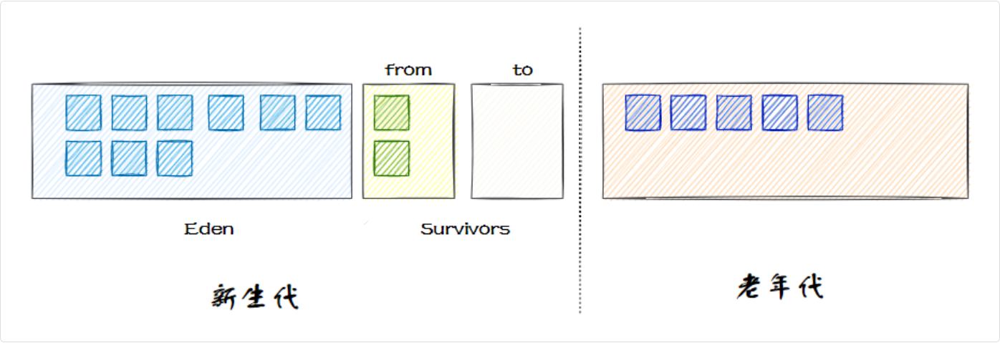
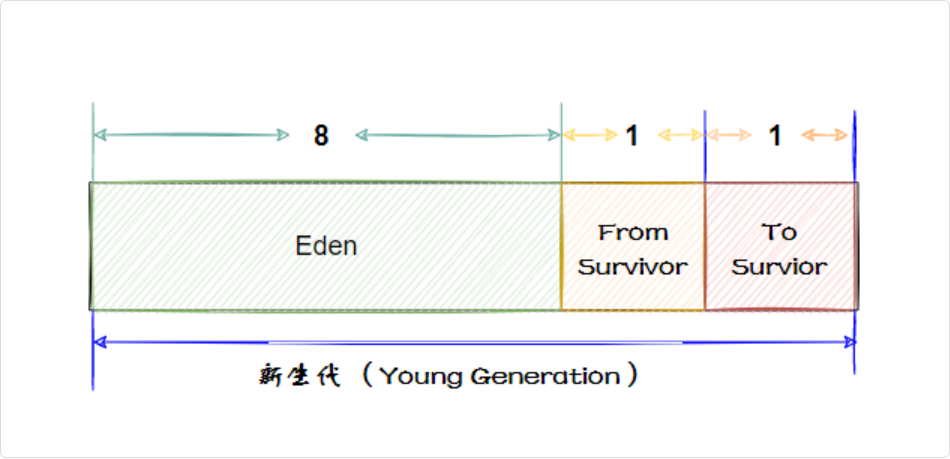
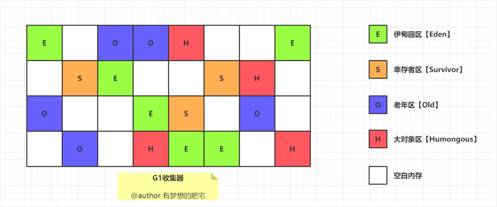
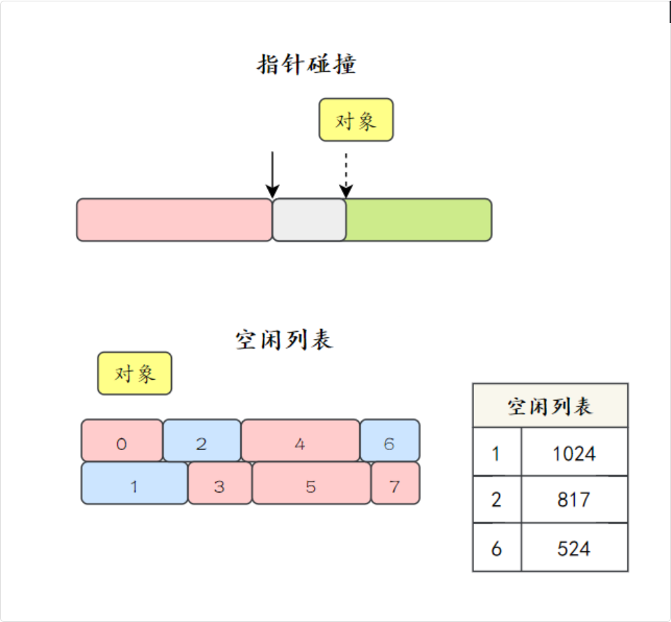

## Java 堆 (存放对象位置)

### 堆内存分区

Java 堆被划分为新生代和老年代两个区域

新生代又被划分为 Eden 空间和两个 Survivor 空间（From 和 To）

新创建的对象会被分配到 Eden 空间

当 Eden 区填满时，会触发一次 Minor GC，清除不再使用的对象

存活下来的对象会从 Eden 区移动到 Survivor 区。

对象在新生代中经历多次 GC 后，如果仍然存活，会被移动到老年代

当老年代内存不足时，会触发 Major GC，对整个堆进行垃圾回收



#### 新生代的区域划分

新生代的垃圾收集主要采用**标记-复制算法**，因为新生代的存活对象比较少，每次复制少量的存活对象效率比较高

基于这种算法，虚拟机将内存分为一块较大的 Eden 空间和两块较小的 Survivor 空间

每次分配内存只使用 Eden 和其中一块 Survivor

发生垃圾收集时，将 Eden 和 Survivor 中仍然存活的对象一次性复制到另外一块 Survivor 空间上

然后直接清理掉 Eden 和已用过的那块 Survivor 空间

默认 Eden 和 Survivor 的大小比例是 8∶1 (8:1:1)



#### 对象什么时候进入老年代

对象通常会在年轻代中分配，随着时间的推移和垃圾收集的进程，某些满足条件的对象会进入到老年代中，如长期存活的对象

进入老年代的对象(满足一个即可)：

- 长期存活的对象
- 大对象
- 动态年龄判断

##### 长期存活的对象判断

JVM 会为对象维护一个“年龄”计数器，记录对象在新生代中经历 Minor GC 的次数

每次 GC 未被回收的对象，其年龄会加 1

当超过一个特定阈值，默认值是 15，就会被认为老对象了，需要重点关照。

这个年龄阈值可以通过 JVM 参数-XX:MaxTenuringThreshold来设置。

可以通过 `jinfo -flag MaxTenuringThreshold $(jps | grep -i nacos | awk '{print $1}')` 来查看当前 JVM 的年龄阈值。

- 如果应用中的对象存活时间较短，可以适当调大这个值，让对象在新生代多待一会儿
- 如果对象存活时间较长，可以适当调小这个值，让对象更快进入老年代，减少在新生代的复制次数

##### 大对象判断

大对象是指占用内存较大的对象，如大数组、长字符串等

其大小由 JVM 参数 -XX:PretenureSizeThreshold 控制，但在 JDK 8 中，默认值为 0，也就是说默认情况下，对象仅根据 GC 存活的次数来判断是否进入老年代

> G1 垃圾收集器中，大对象会直接分配到 HUMONGOUS 区域。当对象大小超过一个 Region 容量的 50% 时，会被认为是大对象



##### 动态年龄判定

如果 Survivor 区中所有对象的总大小超过了一定比例，通常是 Survivor 区的一半，那么年龄较小的对象也可能会被提前晋升到老年代

### 堆内存如何分配

在堆中为对象分配内存时，主要使用两种策略：**指针碰撞**和**空闲列表**



这是因为如果年龄较小的对象在 Survivor 区中占用了较大的空间，会导致 Survivor 区中的对象复制次数增多，影响垃圾回收的效率

### 对象一定分配在堆中吗

默认情况下，Java 对象是在堆中分配的

但 JVM 会进行**逃逸分析**，来判断对象的**生命周期是否只在方法内部**，如果是的话，这个对象可以**在栈上分配**

举例来说，下面的代码中，对象 new Person() 的生命周期只在 testStackAllocation 方法内部，因此 JVM 会将这个对象分配在栈上

```java
public void testStackAllocation() {
  Person p = new Person();  // 对象可能分配在栈上
  p.name = "1111";
  p.age = 18;
  System.out.println(p.name);
}
```

#### 逃逸分析

逃逸分析是一种 JVM 优化技术，用来分析对象的作用域和生命周期，判断对象是否逃逸出方法或线程

可以通过**分析对象的引用流向**，判断对象是否被方法返回、赋值到全局变量、传递到其他线程等，来确定对象是否逃逸。

如果对象没有逃逸，就可以进行:

- 栈上分配 - 对象分配在栈上，方法结束自动回收
- 同步消除 - 去掉不必要的同步锁
- 标量替换 - 将对象拆解为标量直接使用

以提高程序的性能

可以通过 `java -XX:+PrintFlagsFinal 2>&1 | findStr Escape` 来确认 JVM 是否开启了逃逸分析

##### 什么是逃逸分析

根据对象逃逸的范围，可以分为方法逃逸和线程逃逸

当对象被方法外部的代码引用，**生命周期超出了方法的范围**，那么对象就必须分配在堆中，由垃圾收集器管理

```java
public Person createPerson() {
  return new Person(); // 对象逃逸出方法
}
```

比如说 new Person() 创建的对象被返回，那么这个对象就逃逸出当前方法了

再比如说，对象被另外一个线程引用，生命周期超出了当前线程，那么对象就必须分配在堆中，并且线程之间需要同步

```java
public void threadEscapeExample() {
  Person p = new Person(); // 对象逃逸到另一个线程
  new Thread(() -> {
      System.out.println(p);
  }).start();
}
```

##### 好处

- 如果确定一个对象不会逃逸，那么就可以考虑栈上分配，对象占用的内存随着栈帧出栈后销毁，这样一来，垃圾收集的压力就降低很多
- 线程同步需要加锁，加锁就要占用系统资源，如果逃逸分析能够确定一个对象不会逃逸出线程，那么这个对象就不用加锁，从而减少线程同步的开销
- 如果对象的字段在方法中独立使用，JVM 可以将对象分解为标量变量，避免对象分配

```java
public void scalarReplacementExample() {
  Point p = new Point(1, 2);
  System.out.println(p.getX() + p.getY());
}
```

如果 Point 对象未逃逸，JVM 可以优化为：

```java
int x = 1;
int y = 2;
System.out.println(x + y);
```
