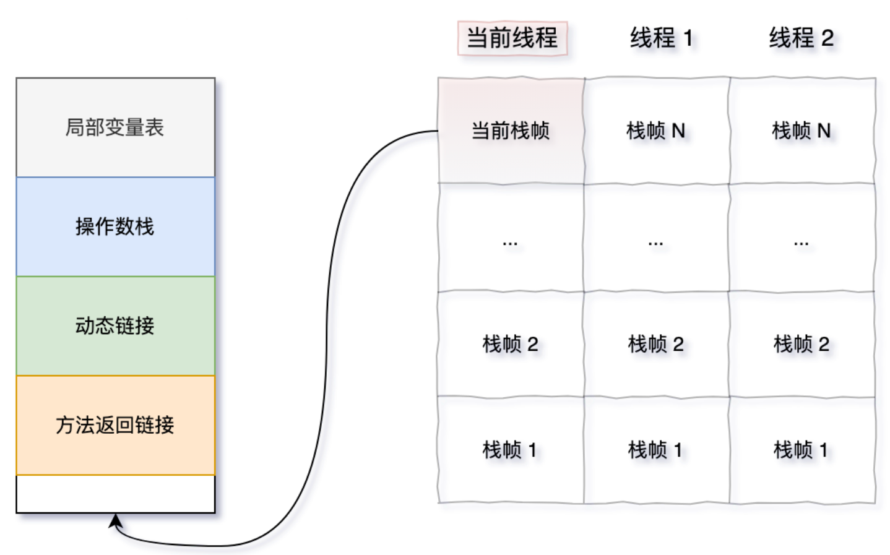

## 内存溢出和内存泄漏

### 内存溢出

内存溢出，俗称 OOM，是指当程序请求分配内存时，由于没有足够的内存空间，从而抛出 `OutOfMemoryError`

```java
List<String> list = new ArrayList<>();
while (true) {
  list.add("OutOfMemory".repeat(1000)); // 无限增加内存
}
```

可能是因为堆、元空间、栈或直接内存不足导致的。可以通过优化内存配置、减少对象分配来解决。

#### 例子

堆内存溢出：

```java
class HeapSpaceErrorGenerator {
  public static void main(String[] args) {
    // 第一步，创建一个大的容器
    List<byte[]> bigObjects = new ArrayList<>();
    try {
      // 第二步，循环写入数据
      while (true) {
        // 第三步，创建一个大对象，一个大约 10M 的数组
        byte[] bigObject = new byte[10 * 1024 * 1024];
        // 第四步，将大对象添加到容器中
        bigObjects.add(bigObject);
      }
    } catch (OutOfMemoryError e) {
      System.out.println("OutOfMemoryError 发生在 " + bigObjects.size() + " 对象后");
      throw e;
    }
  }
}
```

#### 是否处理过内存溢出

有，上传文件时，一开始是一次性上传，没有正确处理，导致一下子撑爆了内存，程序直接崩溃了

> 我记得是通过导出堆转储文件进行分析发现的

使用 jmap 命令手动生成 Heap Dump 文件：

```shell
jmap -dump:format=b,file=heap.hprof <pid>
```

然后使用 MAT、JProfiler 等工具进行分析，查看内存中的对象占用情况

### 内存泄露

内存泄漏是指程序在使用完内存后，未能及时释放，导致占用的内存无法再被使用。

随着时间的推移，内存泄漏会导致可用内存逐渐减少，最终导致内存溢出。

内存泄漏通常是因为**长期存活的对象持有短期存活对象的引用**，又没有及时释放，从而导致短期存活对象无法被回收而导致的

```java
class MemoryLeakExample {
  private static List<Object> staticList = new ArrayList<>();
  public void addObject() {
    staticList.add(new Object()); // 对象不会被回收
  }
}
```

> 以 ThreadLocal 为例，ThreadLocalMap 的 key 是 ThreadLocal 对象的弱引用
>
> 如果 key 使用强引用，当 ThreadLocal 引用被置为 null 后，Entry 中的 key 仍然持有引用，导致 ThreadLocal 对象无法被回收。

#### 原因

> 静态的集合中添加的对象越来越多，但却没有及时清理；静态变量的生命周期与应用程序相同，如果静态变量持有对象的引用，这些对象将无法被 GC 回收。

```java
class OOM {
 static List list = new ArrayList();

 public void oomTests(){
   Object obj = new Object();

   list.add(obj);
  }
}
```

> 单例模式下对象持有的外部引用无法及时释放；单例对象在整个应用程序的生命周期中存活，如果单例对象持有其他对象的引用，这些对象将无法被回收

```java
class Singleton {
  private static final Singleton INSTANCE = new Singleton();
  private List<Object> objects = new ArrayList<>();

  public static Singleton getInstance() {
    return INSTANCE;
  }
}
```

> 数据库、IO、Socket 等连接资源没有及时关闭
>
> ThreadLocal 的引用未被清理，线程退出后仍然持有对象引用；在线程执行完后，要调用 ThreadLocal 的 remove 方法进行清理

#### 是否处理过内存泄露

比如 ThreadLocal 没有及时清理导致出现了内存泄漏问题

- 先用 `jps -l` 查看运行的 Java 进程 ID
- 使用 `top -p [pid]` 查看进程使用 CPU 和内存占用情况
- 使用 `top -Hp [pid]` 查看进程下的所有线程占用 CPU 和内存情况
- 抓取线程栈：`jstack -F 29452 > 29452.txt`，可以多抓几次做个对比
  - 看看有没有线程死锁、死循环或长时间等待这些问题
- 可以使用 `jstat -gcutil [pid] 5000 10` 每隔 5 秒输出 GC 信息，输出 10 次，查看 YGC 和 Full GC 次数
- 生成 dump 文件，然后借助可视化工具分析哪个对象非常多，基本就能定位到问题根源了
  - `jmap -dump:format=b,file=heap.hprof 10025 `
- 使用图形化工具分析，如 JDK 自带的 VisualVM，从菜单 > 文件 > 装入 dump 文件

## 栈溢出

栈溢出发生在程序调用栈的深度超过 JVM 允许的最大深度时

栈溢出的本质是因为线程的栈空间不足，导致无法再为新的栈帧分配内存



当一个方法被调用时，JVM 会在栈中分配一个栈帧，用于存储该方法的执行信息。如果方法调用嵌套太深，栈帧不断压入栈中，最终会导致栈空间耗尽，抛出 StackOverflowError。

最常见的栈溢出场景就是递归调用，尤其是没有正确的终止条件下，会导致递归无限进行

另外，如果方法中定义了特别大的局部变量，栈帧会变得很大，导致栈空间更容易耗尽
