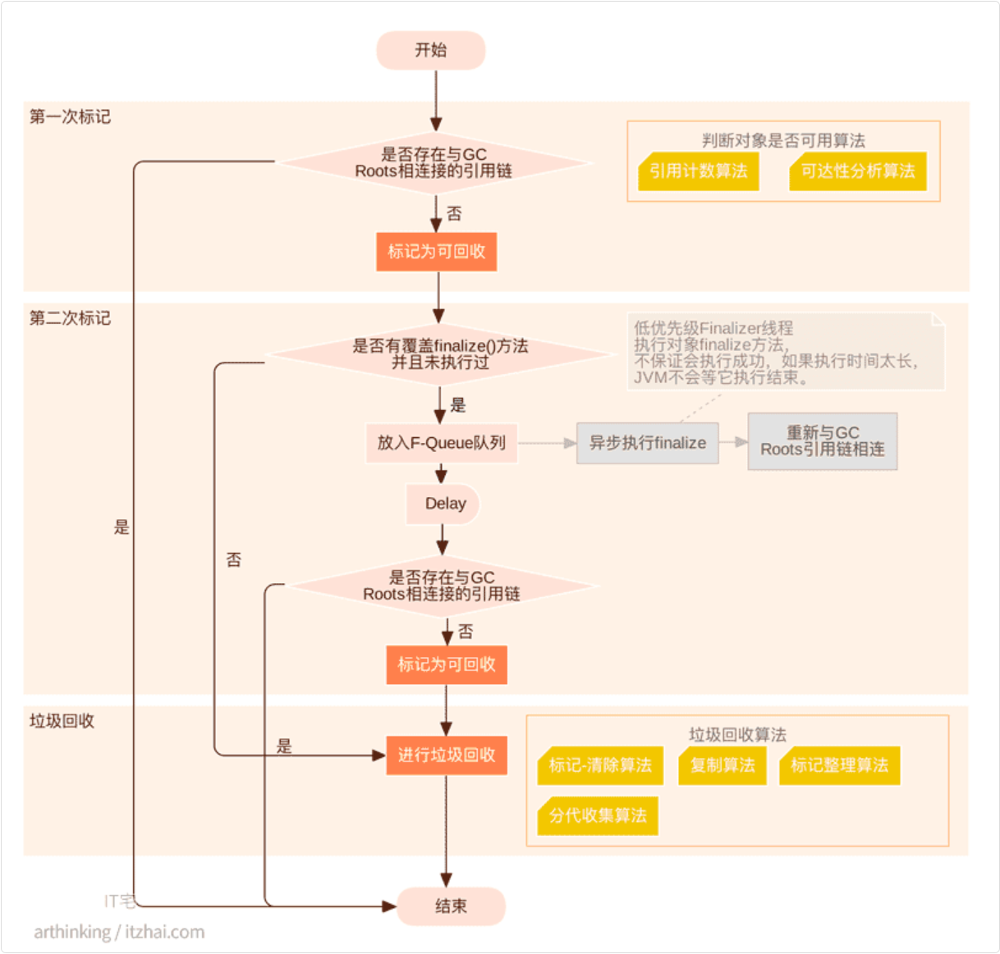
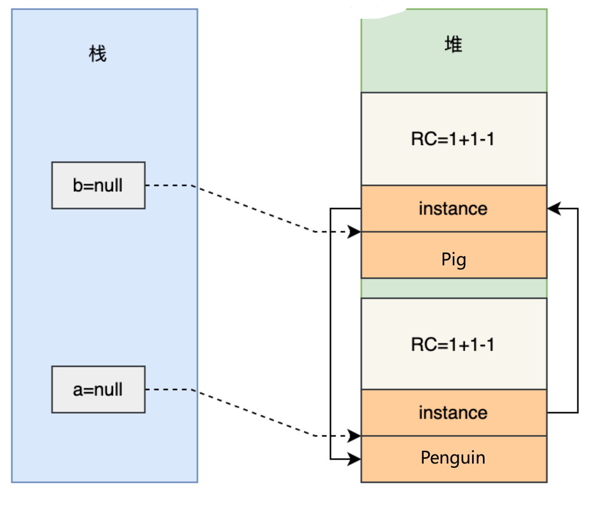
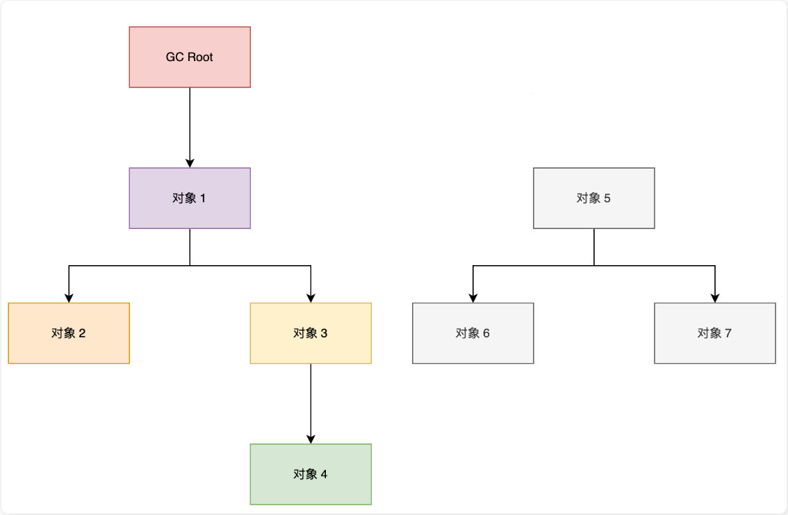
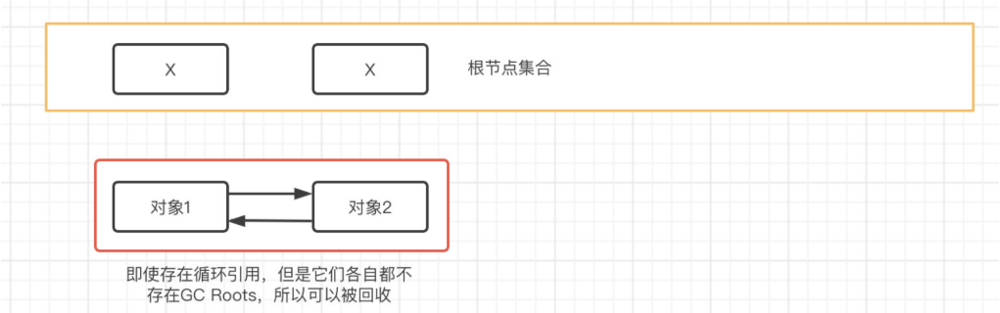

## 垃圾收集机制

垃圾回收就是对堆内存中不再被引用的（不可达的）对象进行清除或回收

JVM 在做 GC 之前，会先搞清楚什么是垃圾，什么不是垃圾，通常会通过**可达性分析**算法来判断对象是否存活

在确定了哪些垃圾可以被回收后

垃圾收集器（如 CMS、G1、ZGC）要做的事情就是进行垃圾回收

可以采用：

- 标记清除算法
- 复制算法
- 标记整理算法
- 分代收集算法等

> C++ 等语言创建对象要不断的去开辟空间，不用的时候又需要不断的去释放空间，既要写构造函数，又要写析构函数
>
> 于是，有人就提出，能不能写一段程序实现这块功能，每次创建对象、释放内存空间的时候复用这段代码
>
> 1960 年，John McCarthy 在设计 Lisp 语言时首次提出了垃圾回收的概念，用于自动管理内存，避免程序员手动释放内存带来的错误

### 垃圾回收的过程

Java 的垃圾回收过程主要分为标记存活对象、清除无用对象、以及内存压缩/整理三个阶段



#### `finalize()` 方法

如果对象在进行可达性分析后发现没有与 GC Roots 相连接的引用链，那它将会被第一次标记，随后进行一次筛选

筛选的条件是对象是否有必要执行 finalize()方法

如果对象在 finalize() 中成功拯救自己——只要重新与引用链上的任何一个对象建立关联即可。

譬如把自己 （this 关键字）赋值给某个类变量或者对象的成员变量，那在第二次标记时它就”逃过一劫“；但是如果没有抓住这个机会，那么对象就真的要被回收了

并且这个机会只有一次，之后就不能用

### 垃圾判断算法

既然 JVM 要做垃圾回收，就要搞清楚什么是垃圾，什么不是垃圾

- 引用计数算法 (无法解决循环依赖)
- 可达性分析算法

#### 引用计数法

引用计数算法（Reachability Counting）是通过在对象头中分配一个空间来保存该对象被引用的次数（Reference Count）

如果该对象被其它对象引用，则它的引用计数加 1，如果删除对该对象的引用，那么它的引用计数就减 1，当该对象的引用计数为 0 时，那么该对象就会被回收

引用计数算法将垃圾回收分摊到整个应用程序的运行当中，而不是集中在垃圾收集时

因此，采用引用计数的垃圾收集不属于严格意义上的"Stop-The-World"的垃圾收集机制

> 引用计数算法看似很美好，但实际上它存在一个很大的问题，那就是无法解决循环依赖的问题

```java
public class ReferenceCountingGC {

  public Object instance;  // 对象属性，用于存储对另一个 ReferenceCountingGC 对象的引用

  public ReferenceCountingGC(String name) {
    // 构造方法
  }

  public static void testGC() {
    // 创建两个 ReferenceCountingGC 对象
    ReferenceCountingGC a = new ReferenceCountingGC("沉默王二");
    ReferenceCountingGC b = new ReferenceCountingGC("沉默王三");

    // 使 a 和 b 相互引用
    a.instance = b;
    b.instance = a;

    // 将 a 和 b 设置为 null
    a = null;
    b = null;

    // 这个位置是垃圾回收的触发点
  }
}
```



#### 可达性分析算法

可达性分析算法（Reachability Analysis）的基本思路是：

通过 GC Roots 作为起点，然后向下搜索，搜索走过的路径被称为 Reference Chain（引用链）

当一个对象到 GC Roots 之间没有任何引用相连时，即从 GC Roots 到该对象节点不可达，则证明该对象是需要垃圾收集的。

> 目前比较主流的编程语言（包括Java），一般都会使用可达性分析算法来判断对象是否存活，它采用了类似于树结构的搜索机制



通过可达性算法，成功解决了引用计数无法解决的问题-“循环依赖”，只要你无法与 GC Root 建立直接或间接的连接，系统就会判定你为可回收对象



所谓的 GC Roots，就是一组必须活跃的引用，不是对象，它们是程序运行时的起点，是一切引用链的源头。在 Java 中，GC Roots 包括以下几种：

- 虚拟机栈中的引用（方法的参数、局部变量等）
- 本地方法栈中 JNI 的引用
- 类静态变量
- 运行时常量池中的常量（String 或 Class 类型）

##### 虚拟机栈中的引用（方法的参数、局部变量等）

```java
public class StackReference {
  public void greet() {
    Object localVar = new Object(); 
    // 这里的 localVar 是一个局部变量，存在于虚拟机栈中
    System.out.println(localVar.toString());
  }

  public static void main(String[] args) {
    new StackReference().greet();
  }
}
```

在 greet 方法中，localVar 是一个局部变量，存在于虚拟机栈中，可以被认为是 GC Roots

在 greet 方法执行期间，localVar 引用的对象是活跃的，因为它是从 GC Roots 可达的

当 greet 方法执行完毕后，localVar 的作用域结束，localVar 引用的 Object 对象不再由任何 GC Roots 引用（假设没有其他引用指向这个对象），因此它将有资格作为垃圾被回收掉

##### 本地方法栈中 JNI 的引用

##### 类静态变量

```java
public class StaticFieldReference {
  private static Object staticVar = new Object(); // 类静态变量

  public static void main(String[] args) {
    System.out.println(staticVar.toString());
  }
}
```

StaticFieldReference 类中的 staticVar 引用了一个 Object 对象，这个引用存储在元空间，可以被认为是 GC Roots

只要 StaticFieldReference 类未被卸载，staticVar 引用的对象都不会被垃圾回收

如果 StaticFieldReference 类被卸载（这通常发生在其类加载器被垃圾回收时），那么 staticVar 引用的对象也将有资格被垃圾回收（如果没有其他引用指向这个对象）

##### 运行时常量池中的常量

```java
public class ConstantPoolReference {
  public static final String CONSTANT_STRING = "Hello, World"; // 常量，存在于运行时常量池中
  public static final Class<?> CONSTANT_CLASS = Object.class; // 类类型常量

  public static void main(String[] args) {
    System.out.println(CONSTANT_STRING);
    System.out.println(CONSTANT_CLASS.getName());
  }
}
```

在 ConstantPoolReference 中，CONSTANT_STRING 和 CONSTANT_CLASS 作为常量存储在运行时常量池。它们可以用来作为 GC Roots。

这些常量引用的对象（字符串"Hello, World"和 Object.class 类对象）在常量池中，只要包含这些常量的 ConstantPoolReference 类未被卸载，这些对象就不会被垃圾回收

##### 如何识别 GC Root

```plain
┌────────────────────────────────────────────────────────┐
│                   GC 开始时                             │
├────────────────────────────────────────────────────────┤
│                                                        │
│   1. 暂停所有线程                  │
│                                                        │
│   2. 扫描所有线程栈                                     │
│      ┌─────────┐                                       │
│      │ 线程1栈  │ → 找到所有局部变量、参数 → 标记为 GC Root │
│      │ 线程2栈  │                                       │
│      │ ...     │                                       │
│      └─────────┘                                       │
│                                                        │
│   3. 扫描元空间                                         │
│      ┌─────────────────┐                               │
│      │ 类的静态变量      │ → 标记为 GC Root               │
│      │ 运行时常量池常量  │ → 标记为 GC Root               │
│      └─────────────────┘                               │
│                                                        │
│   4. 从 GC Root 开始遍历引用链                          │
│      GC Root → 对象A → 对象B → 对象C                    │
│              ↘ 对象D → 对象E                           │
│                                                        │
│   5. 标记所有可达对象 = 存活                            │
│      未被标记的对象 = 垃圾                              │
│                                                        │
└────────────────────────────────────────────────────────┘
```
