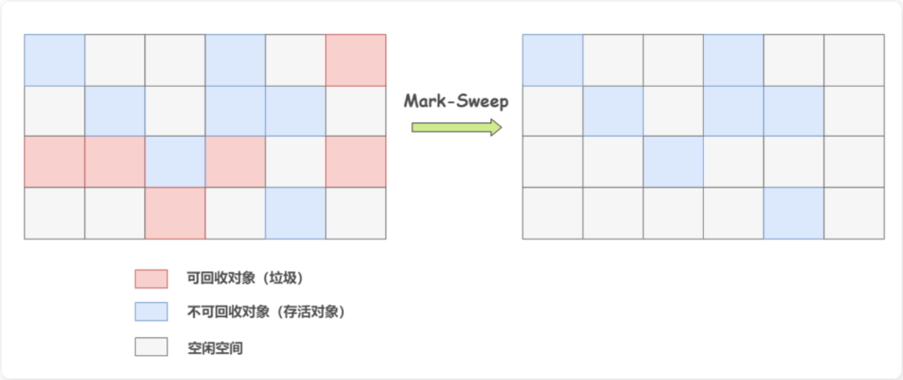
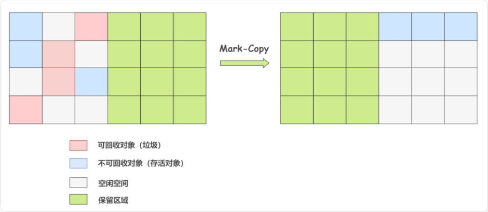
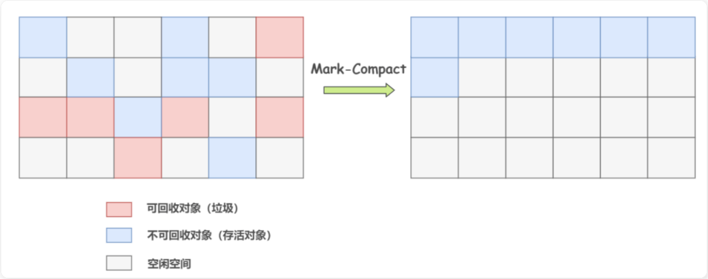
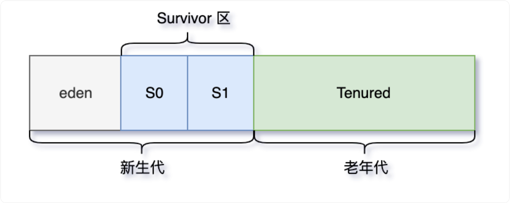

## STW

"Stop The World"是 Java 垃圾收集中的一个重要概念

在垃圾收集过程中，JVM 会暂停所有的用户线程，这种暂停被称为"Stop The World"事件

这么做的主要原因是为了防止在垃圾收集过程中，用户线程修改了堆中的对象，导致垃圾收集器无法准确地收集垃圾

值得注意的是，"Stop The World"事件会对 Java 应用的性能产生影响

如果停顿时间过长，就会导致应用的响应时间变长，对于对实时性要求较高的应用，如交易系统、游戏服务器等，这种情况是不能接受的。

因此，在选择和调优垃圾收集器时，需要考虑其停顿时间。Java 中的一些垃圾收集器，如 G1 和 ZGC，都会尽可能地减少了"Stop The World"的时间，通过并发的垃圾收集，提高应用的响应性能。

总的来说，"Stop The World"是 Java 垃圾收集中必须面对的一个挑战，其目标是在保证内存的有效利用和应用的响应性能之间找到一个平衡。

```plain
┌────────────────────────────────────────────────────────┐
│                   GC 开始时                             │
├────────────────────────────────────────────────────────┤
│                                                        │
│   1. 暂停所有线程                  │
│                                                        │
│   2. 扫描所有线程栈                                     │
│      ┌─────────┐                                       │
│      │ 线程1栈  │ → 找到所有局部变量、参数 → 标记为 GC Root │
│      │ 线程2栈  │                                       │
│      │ ...     │                                       │
│      └─────────┘                                       │
│                                                        │
│   3. 扫描元空间                                         │
│      ┌─────────────────┐                               │
│      │ 类的静态变量      │ → 标记为 GC Root               │
│      │ 运行时常量池常量  │ → 标记为 GC Root               │
│      └─────────────────┘                               │
│                                                        │
│   4. 从 GC Root 开始遍历引用链                          │
│      GC Root → 对象A → 对象B → 对象C                    │
│              ↘ 对象D → 对象E                           │
│                                                        │
│   5. 标记所有可达对象 = 存活                            │
│      未被标记的对象 = 垃圾                              │
│                                                        │
└────────────────────────────────────────────────────────┘
```

## 垃圾收集算法

> 垃圾收集算法是理论基础，定义了如何识别和回收垃圾；垃圾收集器是算法的具体实现，一个收集器可以实现一种或多种算法

在确定了哪些垃圾可以被回收后，垃圾收集器要做的事情就是进行垃圾回收，但是这里面涉及到一个问题是：如何高效地进行垃圾回收

由于 JVM 规范并没有对如何实现垃圾收集器做出明确的规定，因此各个厂商的虚拟机可以采用不同的方式来实现垃圾收集器

### 标记-清除算法

> 内存碎片问题

标记清除算法（Mark-Sweep）是最基础的一种垃圾回收算法

分为 2 部分，先把内存区域中的这些对象进行标记，哪些属于可回收的标记出来（用前面提到的可达性分析法），然后把这些垃圾拎出来清理掉



就像上图一样，清理掉的垃圾就变成可使用的空闲空间，等待被再次使用。

逻辑清晰，并且也很好操作，但它存在一个很大的问题，那就是**内存碎片**

碎片太多可能会导致当程序运行过程中需要分配较大对象时，因无法找到足够的连续内存而不得不提前触发新一轮的垃圾收集

### 标记-复制算法

> 新生代中 Survior 区的 From 和 to

复制算法（Copying）是在标记清除算法上演化而来的，用于解决标记清除算法的内存碎片问题

将可用内存按容量划分为大小相等的两块，每次只使用其中的一块

当这一块的内存用完了，就将还存活着的对象复制到另外一块上面，然后再把已使用过的内存空间一次清理掉。这样就保证了内存的连续性，逻辑清晰，运行高效

在标记-复制算法 中，标记阶段和复制阶段都会触发STW。

- 标记阶段停顿是为了保证对象的引用关系不被修改。
- 复制阶段停顿是防止对象在复制过程中被修改。



但复制算法也存在一个很明显的问题，规定的内存空间只能用一半

### 标记-整理算法

标记整理算法（Mark-Compact），标记过程仍然与标记清除算法一样，但后续步骤不是直接对可回收对象进行清理，而是让所有存活的对象都向一端移动，再清理掉端边界以外的内存区域



标记整理算法一方面在标记-清除算法上做了升级，解决了内存碎片的问题，也规避了复制算法只能利用一半内存区域的弊端

看起来很美好，但**内存变动更频繁**，需要**整理所有存活对象的引用地址**，在效率上比复制算法差很多

### 分代收集算法

分代收集算法（Generational Collection）严格来说并不是一种思想或理论，而是融合上述 3 种基础的算法思想，而产生的针对不同情况所采用不同算法的一套组合拳

根据对象存活周期的不同会将内存划分为几块，一般是把 Java 堆分为新生代和老年代，这样就可以根据各个年代的特点采用最适当的收集算法



在新生代中，每次垃圾收集时都发现有大批对象死去，只有少量存活，那就选用复制算法，只需要付出少量存活对象的复制成本就可以完成收集。

老年代中因为对象存活率高、没有额外空间对它进行分配担保，就必须使用标记清理或者标记整理算法来进行回收

## GC 类型

| GC 类型 | 对应的收集器 | 使用的算法 |
| --- | --- | --- |
| **Minor GC** | Serial/ParNew/Parallel Scavenge/G1/ZGC | 新生代：复制算法 |
| **Major GC** | CMS/Serial Old | 老年代：标记 - 清除/标记 - 整理 |
| **Mixed GC** | **仅 G1** | 分区复制 + 标记 - 整理 |
| **Full GC** | 所有收集器（退化场景） | 通常是标记 - 整理 |

Minor GC 也称为 Young GC，是指发生在年轻代的垃圾收集。年轻代包含 Eden 区以及两个 Survivor 区

Major GC 也称为 Old GC，主要指的是发生在老年代的垃圾收集。是 CMS 的特有行为

Mixed GC 是 G1 垃圾收集器特有的一种 GC 类型，它在一次 GC 中同时清理年轻代和部分老年代

Full GC 是最彻底的垃圾收集，涉及整个 Java 堆和方法区。它是最耗时的 GC，通常在 JVM 压力很大时发生

### FULL gc怎么去清理的

Full GC 会从 GC Root 出发，标记所有可达对象。

新生代使用复制算法，清空 Eden 区。

老年代使用标记-整理算法，回收对象并消除碎片

#### 什么时候会触发 Full GC

在进行 Young GC 的时候，如果发现老年代可用的连续内存空间 < 新生代历次 Young GC 后升入老年代的对象总和的平均大小，说明本次 Young GC 后升入老年代的对象大小，可能超过了老年代当前可用的内存空间，就会触发 Full GC。

执行 Young GC 后老年代没有足够的内存空间存放转入的对象，会立即触发一次 Full GC

#### 空间分配担保

空间分配担保是指在进行 Minor GC 前，JVM 会确保老年代有足够的空间存放从新生代晋升的对象。如果老年代空间不足，可能会触发 Full GC

### Young GC 什么时候触发

如果 Eden 区没有足够的空间时，就会触发 Young GC 来清理新生代
