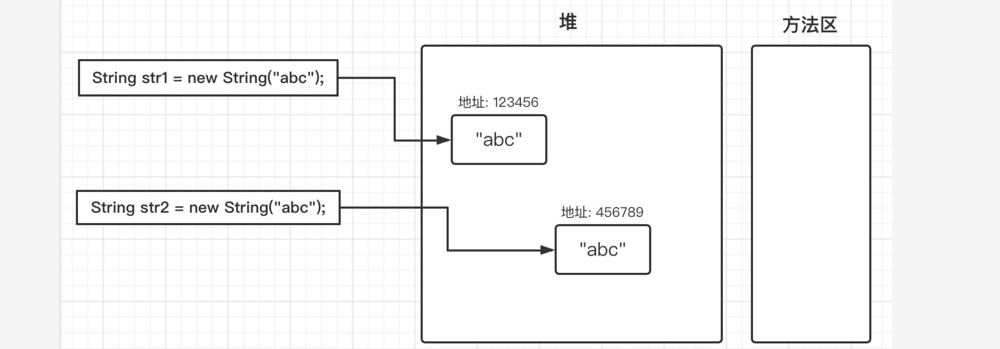

## JVM内存管理

### 区域划分

#### 堆

堆是整个Java应用程序共享的区域，也是整个虚拟机**最大的一块内存空间**

此区域的职责就是**存放和管理对象和数组**，而我们马上要提到的垃圾回收机制也是主要作用于这一部分内存区域。

#### 方法区

方法区也是整个Java应用程序共享的区域，它用于存储所有的类信息、常量、静态变量、动态编译缓存等数据

可以大致分为两个部分，一个是**类信息表**，一个是**运行时常量池**。

方法区也是我们要重点介绍的部分。


**类信息表**中存放的是**当前应用程序加载的所有类信息**，包括类的版本、字段、方法、接口等信息，同时会将编译时**生成的常量池数据全部存放到运行时常量池中**。

当然，常量也并不是只能从类信息中获取，在程序运行时，也有可能会**有新的常量进入到常量池**。

##### String分析

其实我们的String类正是利用了常量池进行优化，这里我们编写一个测试用例：

```java
public static void main(String[] args) {
    String str1 = new String("abc");
    String str2 = new String("abc");

    System.out.println(str1 == str2);
    System.out.println(str1.equals(str2));
}
```

得到的结果也是显而易见的，由于`str1`和`str2`是单独创建的两个对象，那么这两个对象实际上会**在堆中存放**，保存在**不同的地址**：



所以当我们使用`==`判断时，得到的结果`false`，而使用`equals`时因为比较的是值，所以得到`true`。

现在我们来稍微修改一下：

```java
public static void main(String[] args) {
    String str1 = "abc";
    String str2 = "abc";

    System.out.println(str1 == str2);
    System.out.println(str1.equals(str2));
}
```

现在我们没有使用new的形式，而是直接使用双引号创建，那么这时得到的结果就变成了两个`true`

这其实是因为我们直接使用双引号赋值，会**先在常量池中查找是否存在相同的字符串**，若存在，则将引用直接指向该字符串；若不存在，则在常量池中生成一个字符串，再将引用指向该字符串：


实际上两次调用String类的`intern()`方法，和上面的效果差不多，也是第一次调用会将堆中字符串复制并放入常量池中，第二次通过此方法获取字符串时，会查看常量池中是否包含，如果包含那么会直接返回常量池中字符串的地址：

```java
public static void main(String[] args) {
  //不能直接写"abc"，双引号的形式，写了就直接在常量池里面吧abc创好了
  String str1 = new String("ab")+new String("c");
  String str2 = new String("ab")+new String("c");

  System.out.println(str1.intern() == str2.intern());
  System.out.println(str1.equals(str2));
}
```


首先常量池会存在 "ab" 和 "c"，但是并没有 "abc", 在创建str1时就会发现常量池里没有"abc"，所以会将堆中字符串复制并放入常量池中，第二次通过此方法获取字符串时，会查看常量池中是否包含，如果包含那么会直接返回常量池中字符串的地址

所以上述结果中得到的依然是两个`true`。

###### `Intern()`方法

在JDK1.7之后，稍微有一些区别，在调用`intern()`方法时，当常量池中没有对应的字符串时，**不会再进行复制操作**，而是将其直接修改为**指向当前字符串堆中的的引用**：


```java
public static void main(String[] args) {
   //不能直接写"abc"，双引号的形式，写了就直接在常量池里面吧abc创好了
    String str1 = new String("ab")+new String("c");
    System.out.println(str1.intern() == str1);
}
```

```java
public static void main(String[] args) {
    String str1 = new String("ab")+new String("c");
    String str2 = new String("ab")+new String("c");

    System.out.println(str1 == str1.intern());
    System.out.println(str2.intern() == str1);
}
```

所以最后我们会发现，`str1.intern()`和`str1`都是同一个对象，结果为`true`。

值得注意的是，在JDK7之后，字符串常量池从方法区移动到了堆中。

最后我们再来进行一个总结，各个内存区域的用途：

- （线程独有）程序计数器：保存当前程序的执行位置。
- （线程独有）虚拟机栈：通过栈帧来维持方法调用顺序，帮助控制程序有序运行。
- （线程独有）本地方法栈：同上，作用与本地方法。
- 堆：所有的对象和数组都在这里保存。
- 方法区：类信息、即时编译器的代码缓存、运行时常量池。

当然，这些内存区域划分仅仅是概念上的，具体的实现过程我们后面还会提到。

### 爆内存和爆栈

#### 爆内存

实际上，在Java程序运行时，内存容量不可能是无限制的，当我们的对象创建过多或是数组容量过大时，就会导致我们的堆内存不足以存放更多新的对象或是数组，这时就会出现错误，比如：

```java
public static void main(String[] args) {
    int[] a = new int[Integer.MAX_VALUE];
}
```

这里我们申请了一个容量为21亿多的int型数组，显然，如此之大的数组不可能放在我们的堆内存中，所以程序运行时就会这样：

```java
Exception in thread "main" java.lang.OutOfMemoryError: Requested array size exceeds VM limit
 at com.test.Main.main(Main.java:5)
```

这里得到了一个`OutOfMemoryError`错误，也就是我们常说的内存溢出错误。我们可以通过参数来控制堆内存的最大值和最小值：

```
-Xms最小值 -Xmx最大值
```

比如我们现在限制堆内存为固定值1M大小，并且在抛出内存溢出异常时保存当前的内存堆转储快照

注意堆内存不要设置太小，不然连虚拟机都不足以启动，接着我们编写一个一定会导致内存溢出的程序：

```java
public class Main {
    public static void main(String[] args) {
        List<Test> list = new ArrayList<>();
        while (true){
            list.add(new Test());    //无限创建Test对象并丢进List中
        }
    }

    static class Test{ }
}
```

在程序运行之后：

```
java.lang.OutOfMemoryError: Java heap space
Dumping heap to java_pid35172.hprof ...
Heap dump file created [12895344 bytes in 0.028 secs]
Exception in thread "main" java.lang.OutOfMemoryError: Java heap space
  at java.util.Arrays.copyOf(Arrays.java:3210)
  at java.util.Arrays.copyOf(Arrays.java:3181)
  at java.util.ArrayList.grow(ArrayList.java:267)
  at java.util.ArrayList.ensureExplicitCapacity(ArrayList.java:241)
  at java.util.ArrayList.ensureCapacityInternal(ArrayList.java:233)
  at java.util.ArrayList.add(ArrayList.java:464)
  at com.test.Main.main(Main.java:10)
```

可以看到错误出现原因正是`Java heap space`，也就是堆内存满了，并且根据我们设定的VM参数，堆内存保存了快照信息。我们可以在IDEA内置的Profiler中进行查看：


可以很明显地看到，在创建了360146个Test对象之后，堆内存蚌埠住了，于是就抛出了内存溢出错误。

#### 栈溢出

我们接着来看栈溢出，我们知道，虚拟机栈会在方法调用时插入栈帧，那么，设想如果出现无限递归

```java
public class Main {
    public static void main(String[] args) {
        test();
    }

    public static void test(){
        test();
    }
}
```

这很明显是一个永无休止的程序，并且会不断继续向下调用test方法本身，那么按照我们之前的逻辑推导，无限地插入栈帧那么一定会将虚拟机栈塞满，所以，当栈的深度已经不足以继续插入栈帧时，就会这样：

```
Exception in thread "main" java.lang.StackOverflowError
 at com.test.Main.test(Main.java:12)
 at com.test.Main.test(Main.java:12)
 at com.test.Main.test(Main.java:12)
 at com.test.Main.test(Main.java:12)
 at com.test.Main.test(Main.java:12)
 at com.test.Main.test(Main.java:12)
 ....以下省略很多行
```

这也是我们常说的栈溢出，它和堆溢出比较类似，也是由于容纳不下才导致的，我们可以使用`-Xss`来设定栈容量。

### 申请堆外内存

除了堆内存可以存放对象数据以外，我们也可以申请堆外内存（直接内存），也就是**不受JVM管控的内存区域**，这部分区域的内存需要我们自行去申请和释放

实际上本质就是JVM通过C/C++调用`malloc`函数申请的内存，当然得我们自己去释放了

不过虽然是直接内存，不会受到堆内存容量限制，但是依然会受到本机最大内存的限制，所以还是有可能抛出`OutOfMemoryError`异常。

#### `Unsafe`

这里我们需要提到一个堆外内存操作类：`Unsafe`

就像它的名字一样，虽然Java提供堆外内存的操作类，但是实际上它是不安全的，只有你完全了解底层原理并且能够合理控制堆外内存，才能安全地使用堆外内存。

注意这个类不让我们new，也没有直接获取方式（压根就没想让我们用）：

```java
public final class Unsafe {

    private static native void registerNatives();
    static {
        registerNatives();
        sun.reflect.Reflection.registerMethodsToFilter(Unsafe.class, "getUnsafe");
    }

    private Unsafe() {}

    private static final Unsafe theUnsafe = new Unsafe();
  
    @CallerSensitive
    public static Unsafe getUnsafe() {
        Class<?> caller = Reflection.getCallerClass();
        if (!VM.isSystemDomainLoader(caller.getClassLoader()))
            throw new SecurityException("Unsafe");   //不是JDK的类，不让用。
        return theUnsafe;
    }
}
```

所以我们这里就通过反射：

```java
public static void main(String[] args) throws IllegalAccessException {
  Field unsafeField = Unsafe.class.getDeclaredFields()[0];
  unsafeField.setAccessible(true);
  Unsafe unsafe = (Unsafe) unsafeField.get(null);
}
```

成功拿到Unsafe类之后，我们就可以开始申请堆外内存了，比如我们现在想要申请一个int大小的内存空间，并在此空间中存放一个int类型的数据：

```java
public static void main(String[] args) throws IllegalAccessException {
  Field unsafeField = Unsafe.class.getDeclaredFields()[0];
  unsafeField.setAccessible(true);
  Unsafe unsafe = (Unsafe) unsafeField.get(null);

  //申请4字节大小的内存空间，并得到对应位置的地址
  long address = unsafe.allocateMemory(4);
  //在对应的地址上设定int的值
  unsafe.putInt(address, 6666666);
  //获取对应地址上的Int型数值
  System.out.println(unsafe.getInt(address));
  //释放申请到的内容
  unsafe.freeMemory(address);

  //由于内存已经释放，这时数据就没了
  System.out.println(unsafe.getInt(address));
}
```

我们可以来看一下`allocateMemory`底层是如何调用的，这是一个native方法，我们来看C++源码：

```cpp
UNSAFE_ENTRY(jlong, Unsafe_AllocateMemory0(JNIEnv *env, jobject unsafe, jlong size)) {
  size_t sz = (size_t)size;

  sz = align_up(sz, HeapWordSize);
  void* x = os::malloc(sz, mtOther);   //这里调用了os::malloc方法

  return addr_to_java(x);
} UNSAFE_END
```

接着来看：

```cpp
void* os::malloc(size_t size, MEMFLAGS flags) {
  return os::malloc(size, flags, CALLER_PC);
}

void* os::malloc(size_t size, MEMFLAGS memflags, const NativeCallStack& stack) {
 ...
  u_char* ptr;
  ptr = (u_char*)::malloc(alloc_size);   //调用C++标准库函数 malloc(size)
 ....
  // we do not track guard memory
  return MemTracker::record_malloc((address)ptr, size, memflags, stack, level);
}
```

所以，我们上面的Java代码转换为C代码，差不多就是这个意思：

```c
#include <stdlib.h>
#include <stdio.h>

int main(){
    int * a = malloc(sizeof(int));
    *a = 6666666;
    printf("%d\n", *a);
    free(a);
    printf("%d\n", *a);
}
```

所以说，直接内存实际上就是**JVM申请的一块额外的内存空间**，但是它并不在受管控的几种内存空间中，当然这些内存依然属于是JVM的

由于JVM提供的堆内存会进行垃圾回收等工作，效率不如直接申请和操作内存来得快，一些比较追求极致性能的框架会用到堆外内存来提升运行速度，如nio框架。

当然，Unsafe类不仅仅只是这些功能，在其他系列课程中，我们还会讲到它
