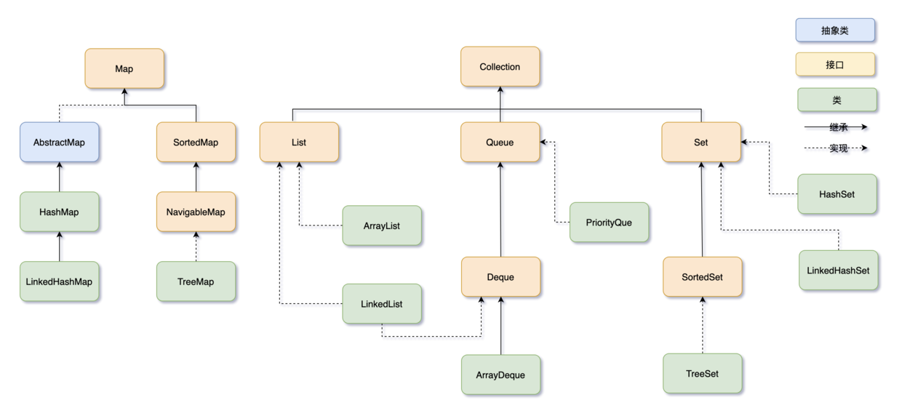

## Java 集合



集合框架可以分为两条大的支线：

1. Collection 接口, 主要由 List、Set、Queue 组成
   - List 接口
     - 代表有序、可重复的集合
       - 封装了动态数组的 ArrayList
       - 封装了链表的 LinkedList
   - Set 接口
     - 代表无序、不可重复的集合
       - HashSet
       - LinkedHashSet
       - TreeSet
   - Queue 接口
     - 代表队列
       - PriorityQueue
       - ArrayDeque
2. Map 接口
   - 代表键值对的集合
   - 键不能重复，每个键只能对应一个值
   - 典型代表就是 HashMap

### 基本概念

#### 常用集合

List：ArrayList LinkedList

Queue：PriorityQuee ArrayDeque

Set: HashSet TreeSet LinkedHashSet

Map: HashMap LinkedHashMap TreeMap

- ArrayList： 动态数组，实现了List接口，支持动态增长。
- LinkedList： 双向链表，也实现了List接口，支持快速的插入和删除操作。
- HashMap： 基于哈希表的Map实现，存储键值对，通过键快速查找值。
- HashSet： 基于HashMap实现的Set集合，用于存储唯一元素。
- TreeMap： 基于红黑树实现的有序Map集合，可以按照键的顺序进行排序。
- LinkedHashMap： 基于哈希表和双向链表实现的Map集合，保持插入顺序或访问顺序。
- PriorityQueue： 优先队列，可以按照比较器或元素的自然顺序进行排序

##### 套话

我常用的集合类有 ArrayList、LinkedList、HashMap、LinkedHashMap

- ArrayList 可以看作是一个动态数组，可以在需要时**动态扩容数组的容量**，只不过需要**复制元素到新的数组**。优点是**访问速度快**，可以通过索引直接查找到元素。缺点是**插入和删除元素可能需要移动或者复制元素**。

- LinkedList 是一个双向链表，适合**频繁的插入和删除操作**。优点是插入和删除元素的时候只需要改变节点的前后指针，缺点是访问元素时需要遍历链表。

- HashMap 是一个基于哈希表的键值对集合。优点是可以根据键的哈希值快速查找到值，但有可能会发生哈希冲突，并且不保留键值对的插入顺序

- LinkedHashMap 在 HashMap 的基础上增加了一个双向链表来保持键值对的插入顺序

#### 常用工具类

集合框架位于 java.util 包下，提供了两个常用的工具类：

- Collections：提供了一些对集合进行排序、二分查找、同步的静态方法。
- Arrays：提供了一些对数组进行排序、打印、和 List 进行转换的静态方法。

#### 线程安全的集合

在 java.util 包中的线程安全的类主要 2 个，其他都是非线程安全的

- `Vector`：线程安全的动态数组，其内部方法基本都经过s`ynchronized`修饰，如果不需要线程安全，并不建议选择，毕竟同步是有额外开销的。Vector 内部是使用对象数组来保存数据，可以根据需要自动的增加容量，当数组已满时，会创建新的数组，并拷贝原有数组数据。
- `Hashtable`：线程安全的哈希表，`HashTable` 的加锁方法是给每个方法加上 `synchronized` 关键字，这样锁住的是整个 Table 对象，不支持 null 键和值，由于同步导致的性能开销，所以已经很少被推荐使用，如果要保证线程安全的哈希表，可以用`ConcurrentHashMap`

`java.util.concurrent` 包提供的都是线程安全的集合：

并发Map：

- ConcurrentHashMap
- ConcurrnetSkipListMap

并发Set：

- ConcurrentSkipListSet
- CopyOnWriteArraySet

并发List：

- CopyOnWriteArrayList

并发 Queue：

- ConcurrentLinkedQueue
- BlockingQueue

并发 Deque：

- LinkedBlockingDeque
- ConcurrentLinkedDeque

#### Collections 与 Collection 区别

Collection 继承了 Iterable 接口，这意味着所有实现 Collection 接口的类都必须实现 iterator() 方法，之后就可以使用增强型 for 循环遍历集合中的元素了

- Collection是Java集合框架中的一个接口，它是所有集合类的基础接口。它定义了一组通用的操作和方法，如添加、删除、遍历等，用于操作和管理一组对象。Collection接口有许多实现类，如List、Set和Queue等。
- Collections（注意有一个s）是Java提供的一个工具类，位于java.util包中。它提供了一系列静态方法，用于对集合进行操作和算法。Collections类中的方法包括排序、查找、替换、反转、随机化等等。这些方法可以对实现了Collection接口的集合进行操作，如List和Set

#### 集合遍历方法

> 普通 for 循环： 可以使用带有索引的普通 for 循环来遍历 List

```java
List<String> list = new ArrayList<>();
list.add("A");
list.add("B");
list.add("C");

for (int i = 0; i < list.size(); i++) {
  String element = list.get(i);
  System.out.println(element);
}
```

> 增强 for 循环（for-each循环）

```java
for (String element : list) {
  System.out.println(element);
}
```

> 使用 forEach 方法

Java 8引入了 forEach 方法，可以对集合进行快速遍历

```java
list.forEach(element -> System.out.println(element));
```

> Stream API

```java
list.stream().forEach(element -> System.out.println(element));
```

> Iterator 迭代器

可以使用迭代器来遍历集合，特别适用于需要删除元素的情况

```java
Iterator<String> iterator = list.iterator();
while(iterator.hasNext()) {
  String element = iterator.next();
  System.out.println(element);
}
```
