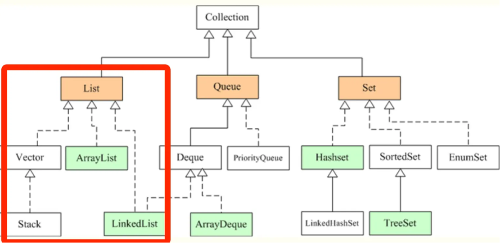

## Java 集合


### 获取长度的不同对应函数

- (集合类) Collection 和 Map：size()
- 数组：length（属性）
- String：length()（方法）

### List

- Vector
- ArrayList
- LinkedList
- CopyOnWrtieArrayList

#### 常用方法

##### 获取元素

```java
E get(int index);
```

##### 增加元素

```java
boolean add(E e)                    // 尾部添加
void add(int index, E element)      // 指定位置插入
boolean addAll(Collection<? extends E> c)  // 批量添加
```

##### 删除元素

```java
E remove(int index)                 // 按索引删除
boolean remove(Object o)            // 按对象删除
void clear()                        // 清空列表
boolean removeAll(Collection<?> c)  // 批量删除
```

##### 修改元素

```java
E set(int index, E element)         // 替换指定位置元素
```

##### 列表信息

```java
int size()                          // 元素个数
boolean isEmpty()                   // 是否为空
```

##### 转换

```java
Object[] toArray()                  // 转为数组
<T> T[] toArray(T[] a)              // 转为指定类型数组
```

##### 迭代器

```java
Iterator<E> iterator()              // 获取迭代器
ListIterator<E> listIterator()      // 获取列表迭代器（支持双向遍历）
```

#### Java List 的常用实现



在Java中，List接口是最常用的集合类型之一，用于存储元素的有序集合

- Vector 是 Java 早期提供的**线程安全**的动态数组，如果不需要线程安全，并不建议选择，毕竟同步是有额外开销的
  - Vector 内部是使用对象数组来保存数据，可以根据需要自动的增加容量，当数组已满时，会创建新的数组，并拷贝原有数组数据。
- ArrayList 是应用更加广泛的动态数组实现，它本身**不是线程安全**的，所以性能要好很多
  - 与 Vector 近似，ArrayList 也是可以根据需要调整容量，不过两者的调整逻辑有所区别，Vector 在扩容时会提高 1 倍，而 ArrayList 则是增加 50%。
- LinkedList 顾名思义是 Java 提供的双向链表，所以它不需要像上面两种那样调整容量，它也**不是线程安全**的

> 这几种实现具体在什么场景下应该用哪种

一般不用 vector，如果不频繁地改动列表位置或仅在列表后面插入元素或删除，就用 ArrayList，如果涉及频繁删除，用LinkedList

- Vector 和 ArrayList 作为动态数组，其内部元素以数组形式顺序存储的，所以非常适合**随机访问**的场合。除了尾部插入和删除元素，往往性能会相对较差，比如我们在中间位置插入一个元素，需要移动后续所有元素。
- 而 LinkedList 进行节点插入、删除却要高效得多，但是随机访问性能则要比动态数组慢

#### ArrayList 与 Vector 区别

Vector 属于 JDK 1.0 时期的遗留类，不推荐使用，仍然保留着是因为 Java 希望向后兼容

ArrayList 是在 JDK 1.2 时引入的，用于替代 Vector 作为主要的非同步动态数组实现。因为 Vector 所有的方法都使用了 synchronized 关键字进行同步，所以单线程环境下效率较低。

#### ArrayList 与 LinkedList

> 区别

ArrayList 是基于数组实现的，LinkedList 是基于链表实现的

> 用途

多数情况下，ArrayList 更利于查找，LinkedList 更利于增删

- 由于 ArrayList 是基于数组实现的，所以 get(int index) 可以直接通过数组下标获取，时间复杂度是 O(1)；LinkedList 是基于链表实现的，get(int index) 需要遍历链表，时间复杂度是 O(n)
- ArrayList 如果增删的是数组的尾部，时间复杂度是 O(1)；如果 add 的时候涉及到**扩容**，时间复杂度会上升到 O(n)
  - 但如果插入的是中间的位置，就需要把插入位置后的元素向前或者向后移动，甚至还有可能触发扩容，效率就会低很多，变成 O(n)
- LinkedList 因为是链表结构，插入和删除只需要改变前置节点、后置节点和插入节点的引用，因此不需要移动元素
  - 如果是在链表的头部插入或者删除，时间复杂度是 O(1)；如果是在链表的中间插入或者删除，时间复杂度是 O(n)，因为需要遍历链表找到插入位置；如果是在链表的尾部插入或者删除，时间复杂度是 O(1)

##### 随机访问

- ArrayList 是基于数组的，也实现了 RandomAccess 接口，所以它支持随机访问，可以通过下标直接获取元素
- LinkedList 是基于链表的，所以它没法根据下标直接获取元素，不支持随机访问

##### 内存占用

ArrayList 是基于数组的，是一块连续的内存空间，所以它的内存占用是比较紧凑的；但如果涉及到扩容，就会重新分配内存，空间是原来的 1.5 倍

LinkedList 是基于链表的，每个节点都有一个指向下一个节点和上一个节点的引用，于是每个节点占用的内存空间比 ArrayList 稍微大一点

#### ArrayList 扩容机制

当往 ArrayList 中添加元素时，会先检查是否需要扩容，**如果当前容量+1 超过数组长度**，就会进行扩容

- 计算新的容量：一般情况下，新的容量会扩大为原容量的1.5倍（在JDK 10之后，扩容策略做了调整），然后检查是否超过了最大容量限制。
- 创建新的数组：根据计算得到的新容量，创建一个新的更大的数组。
- 将元素复制：将原来数组中的元素逐个复制到新数组中。
- 更新引用：将ArrayList内部指向原数组的引用指向新数组。
- 完成扩容：扩容完成后，可以继续添加新元素。

```java
// ArrayList<E>
private void ensureExplicitCapacity(int minCapacity) {
  modCount++;

  // overflow-conscious code
  if (minCapacity - elementData.length > 0)
      grow(minCapacity);
}

private void grow(int minCapacity) {
  // overflow-conscious code
  int oldCapacity = elementData.length;
  int newCapacity = oldCapacity + (oldCapacity >> 1);
  if (newCapacity - minCapacity < 0)
      newCapacity = minCapacity;
  if (newCapacity - MAX_ARRAY_SIZE > 0)
      newCapacity = hugeCapacity(minCapacity);
  // minCapacity is usually close to size, so this is a win:
  elementData = Arrays.copyOf(elementData, newCapacity);
}
```

扩容后的新数组长度是原来的 1.5 倍，然后再把原数组的值拷贝到新数组中

之所以扩容是 1.5 倍，是因为 1.5 可以充分利用移位操作，减少浮点数或者运算时间和运算次数

```java
int newCapacity = oldCapacity + (oldCapacity >> 1);
```

> Java 10 后的改变

本质上 1.5 倍的扩容策略没变，但增强了对极端情况的处理，使代码更健壮

```java
public void ensureCapacity(int minCapacity) {
  // 排除空数组且需求容量 ≤ 默认容量的情况（避免不必要的扩容）
  if (minCapacity > elementData.length
    && !(elementData == DEFAULTCAPACITY_EMPTY_ELEMENTDATA
          && minCapacity <= DEFAULT_CAPACITY)) {
    // 记录结构性修改次数，用于 fail-fast 机制（迭代时检测并发修改）
    modCount++;
    grow(minCapacity);
  }
}

 private Object[] grow(int minCapacity) {
  int oldCapacity = elementData.length;
  if (oldCapacity > 0 || elementData != DEFAULTCAPACITY_EMPTY_ELEMENTDATA) {
      int newCapacity = ArraysSupport.newLength(oldCapacity,
              minCapacity - oldCapacity, /* minimum growth */
              oldCapacity >> 1           /* preferred growth */);
      return elementData = Arrays.copyOf(elementData, newCapacity);
  } else {
    //默认空数组首次扩容
    return elementData = new Object[Math.max(DEFAULT_CAPACITY, minCapacity)];
  }
}
```

#### ArrayList 序列化

在 ArrayList 中，writeObject 方法被重写了，用于自定义序列化逻辑：只序列化有效数据，因为 elementData 数组的容量一般大于实际的元素数量，声明的时候也加了 transient 关键字

> transient 关键字

用于修饰类的成员变量，表示该字段不参与序列化

当对象被序列化时（如通过 ObjectOutputStream），被 transient 修饰的字段会被忽略，不会写入序列化流中

```java
transient Object[] elementData; // non-private to simplify nested class access

/**
 * The size of the ArrayList (the number of elements it contains).
 *
 * @serial
 */
private int size;
```

##### ArrayList 为什么不直接序列化元素数组

出于效率的考虑，数组可能长度 100，但实际只用了 50，剩下的 50 没用到，也就不需要序列化

```java
private void writeObject(java.io.ObjectOutputStream s)
  throws java.io.IOException {
  // 将当前 ArrayList 的结构进行序列化
  int expectedModCount = modCount;
  s.defaultWriteObject(); // 序列化非 transient 字段
  // 序列化数组的大小
  s.writeInt(size);
  // 序列化每个元素
  for (int i = 0; i < size; i++) {
      s.writeObject(elementData[i]);
  }
  // 检查是否在序列化期间发生了并发修改
  if (modCount != expectedModCount) {
      throw new ConcurrentModificationException();
  }
}
```

#### 快速失败fail-fast

fail-fast 是 Java 集合的一种错误检测机制

在用迭代器遍历集合对象时，如果线程 A 遍历过程中，线程 B 对集合对象的内容进行了修改，就会抛出 Concurrent Modification Exception

迭代器在遍历时直接访问集合中的内容，并且在遍历过程中使用一个 `modCount` 变量

集合在被遍历期间如果内容发生变化，就会改变modCount的值

每当迭代器使用 `hashNext()/next()`遍历下一个元素之前，都会检测 modCount 变量是否为 `expectedmodCount` 值，是的话就返回遍历；否则抛出异常，终止遍历

异常的抛出条件是检测到 `modCount！=expectedmodCount` 这个条件

如果集合发生变化时修改 modCount 值刚好又设置为了 expectedmodCount 值，则异常不会抛出

因此，不能依赖于这个异常是否抛出而进行并发操作的编程，这个异常只建议用于检测并发修改的 bug

java.util 包下的集合类都是快速失败的，不能在多线程下发生并发修改（迭代过程中被修改），比如 ArrayList 类

#### 安全失败 safe-fail

采用安全失败机制的集合容器，在遍历时不是直接在集合内容上访问的，而是**先复制原有集合内容，在拷贝的集合上进行遍历**

原理：由于迭代时是对原集合的拷贝进行遍历，所以在遍历过程中对原集合所作的修改并不能被迭代器检测到，所以不会触发 Concurrent Modification Exception

缺点：基于拷贝内容的优点是避免了 Concurrent Modification Exception，但同样地，迭代器并不能访问到修改后的内容，即：迭代器遍历的是开始遍历那一刻拿到的集合拷贝，在遍历期间原集合发生的修改迭代器是不知道的

类似快照？

场景：`java.util.concurrent` 包下的容器都是安全失败，可以在多线程下并发使用，并发修改，比如 CopyOnWriteArrayList 类

#### 实现 ArrayList 线程安全

##### 为什么不安全

在高并发添加数据下，ArrayList会暴露三个问题;

- 部分值为null（我们并没有add null进去）
- 索引越界异常
- size与我们add的数量不符

add 源码

```java
public boolean add(E e) {
  ensureCapacityInternal(size + 1);  // Increments modCount!!
  elementData[size++] = e;
  return true;
}
```

- 部分值为null：当线程1走到了扩容那里发现当前size是9，而数组容量是10，所以不用扩容，**这时候cpu让出执行权，线程2也进来了**，发现size是9，而数组容量是10，所以不用扩容，这时候线程1继续执行，将数组下标索引为9的位置set值了，还没有来得及执行size++，这时候线程2也来执行了，又把数组下标索引为9的位置set了一遍，这时候两个先后进行size++，导致下标索引10的地方就为null了。
- 索引越界异常：线程1走到扩容那里发现当前size是9，数组容量是10不用扩容，cpu让出执行权，线程2也发现不用扩容，这时候数组的容量就是10，而线程1 set完之后size++，这时候线程2再进来size就是10，数组的大小只有10，而你要**设置下标索引为10的就会越界**（数组的下标索引从0开始）；
- size与我们add的数量不符：这个基本上每次都会发生，这个理解起来也很简单，因为**size++本身就不是原子操作**，可以分为三步：**获取size的值，将size的值加1，将新的size值覆盖掉原来的**，线程1和线程2拿到一样的size值加完了同时覆盖，就会导致一次没有加上，所以肯定不会与我们add的数量保持一致的；

##### Collections.synchronizedList() 方法

```java
SynchronizedList list = Collections.synchronizedList(new ArrayList());
```

内部是通过 synchronized 关键字加锁来实现的

##### 直接使用 CopyOnWriteArrayList

是线程安全的 ArrayList，遵循写时复制的原则，每当对列表进行修改时，都会创建一个新副本，这个新副本会替换旧的列表，而对旧列表的所有读取操作仍然在原有的列表上进行

```java
CopyOnWriteArrayList list = new CopyOnWriteArrayList();
```

通俗的讲，CopyOnWrite 就是当我们往一个容器添加元素的时候，不直接往容器中添加，而是先复制出一个新的容器，然后在新的容器里添加元素，添加完之后，再将原容器的引用指向新的容器

多个线程在读的时候，不需要加锁，因为当前容器不会添加任何元素。这样就实现了线程安全

#### CopyOnWriteArrayList (保证线程安全)

CopyOnWriteArrayList 就是线程安全版本的 ArrayLis

> CopyOnWrite——写时复制

CopyOnWriteArrayList 采用了一种**读写分离的并发策略**

CopyOnWriteArrayList 容器允许并发读，读操作是无锁的

至于写操作，比如说向容器中添加一个元素，首先将**当前容器复制一份**，然后在新副本上执行写操作，结束之后再将原容器的引用指向新容器

> CopyOnWriteArrayList 的写操作是互斥的
>
> 写操作使用了 ReentrantLock 加锁，确保同一时刻只有一个线程能执行写操作

写操作是加锁的，即只有一个线程可以创建副本然后在该副本上写，然后再修改引用,最后完成了再释放锁

##### 底层分析

CopyOnWriteArrayList底层也是通过一个数组保存数据，使用volatile关键字修饰数组，保证当前线程对数组对象重新赋值后，其他线程可以及时感知到

```java
private transient volatile Object[] array;
```

在写入操作时，加了一把互斥锁ReentrantLock以保证线程安全

```java
public boolean add(E e) {
  //获取锁
  final ReentrantLock lock = this.lock;
  //加锁
  lock.lock();
  try {
    //获取到当前List集合保存数据的数组
    Object[] elements = getArray();
    //获取该数组的长度（这是一个伏笔，同时len也是新数组的最后一个元素的索引值）
    int len = elements.length;
    //将当前数组拷贝一份的同时，让其长度加1
    Object[] newElements = Arrays.copyOf(elements, len + 1);
    //将加入的元素放在新数组最后一位，len不是旧数组长度吗，为什么现在用它当成新数组的最后一个元素的下标？建议自行画图推演，就很容易理解。
    newElements[len] = e;
    //替换引用，将数组的引用指向给新数组的地址
    setArray(newElements);
    return true;
  } finally {
    //释放锁
    lock.unlock();
  }
}
```
