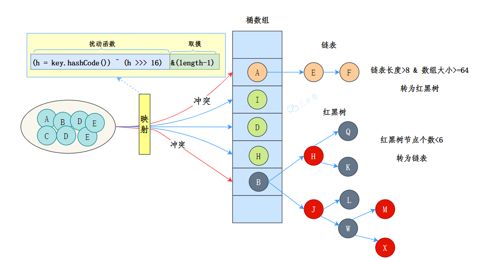
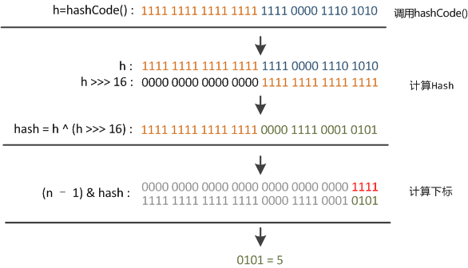

## Java 集合


### HashMap

#### 底层数据结构

JDK 8 中 HashMap 的数据结构是数组+链表+红黑树



数组用来存储键值对，每个键值对可以通过索引直接拿到，索引是通过对键的哈希值进行进一步的 hash() 处理得到的

当多个键经过哈希处理后得到相同的索引时，需要通过链表来解决哈希冲突——将具有相同索引的键值对通过链表存储起来

不过，链表过长时，查询效率会比较低，于是当链表的长度超过 8 时（且数组的长度大于 64），链表就会转换为红黑树

红黑树的查询效率是 O(logn)，比链表的 O(n) 要快

#### `put` 例子

当我们尝试将一个键值对存入hashmap时，对应的 `put` 源码

```java
public V put(K key, V value) {
  return putVal(hash(key), key, value, false, true);
}
```

HashMap 的底层是通过数组的形式实现的，初始大小是 16

那么我们要把 key 为 “penguin”，value 为“111” 的键值对放到这 16 个格子中的一个

首先需要确定的是如何确定索引，放哪里

具体就是通过 `hash & (length-1)` 来计算

本质还是通过取模来计算，即 key -> hash值 -> 对于数组长度len, hash % len 为其放的位置

但是为了追求效率，我们用与运算加速，只要满足数组长度是 2^n 时：

> 考虑二进制表示的本质

任何数都可以表示为：

```plain
hash = a_k × 2^k + a_(k-1) × 2^(k-1) + ... + a_n × 2^n + a_(n-1) × 2^(n-1) + ... + a_1 × 2^1 + a_0 × 2^0
```

我们可以重新分组:

```plain
hash = (a_k × 2^k + a_(k-1) × 2^(k-1) + ... + a_n × 2^n) + (a_(n-1) × 2^(n-1) + ... + a_1 × 2^1 + a_0 × 2^0)
```

即：

hash = 高位部分 × 2^n + 低位部分（第0位到第n-1位）

根据除法的定义：

- 商 = 高位部分
- 余数 = 低位部分

因此 hash % 2^n 的结果就是 hash 的最低 n 位。

而 2^n - 1 的二进制表示是 n 个连续的 1，当执行 `hash & (2^n-1)` 时，实际上是保留 hash 的最低 n 位，其他高位被清零。

这就是为什么：`hash % 2^n = hash & (2^n-1)`

- put 的时候计算下标，把键值对放到对应的桶上。
- get 的时候通过下标，把键值对从对应的桶上取出来

#### `hash()`获取哈希值

hash(Object key): 将 key 的 hashCode 值进行处理，得到最终的哈希值

目标是尽量减少哈希冲突，保证元素能够均匀地分布在数组的每个位置上

> 在HashMap中，最终的索引计算是 hash & (length-1)，这个操作只会保留hash值的低位部分

如果直接使用 `key.hashCode() & (length-1)`

- 只有hashCode的低位参与索引计算
- 高位信息完全丢失
- 容易产生哈希冲突

因此有了如下的改进：

```java
static final int hash(Object key) {
  int h;
  return (key == null) ? 0 : (h = key.hashCode()) ^ (h >>> 16);
}
```

- key 就是计算哈希码的键值
- `key == null ? 0 : (h = key.hashCode()) ^ (h >>> 16)`: 三目运算符，如果键值为 null，则哈希码为 0; 否则，通过调用hashCode()方法获取键的哈希码，并将其与右移 16 位的哈希码进行异或运算
- `^`: 异或运算符是 Java 中的一种位运算符，它用于将两个数的二进制位进行比较，如果相同则为 0，不同则为 1
- `h >>> 16`：将哈希码向右移动 16 位，相当于将原来的哈希码分成了两个 16 位的部分



由于混合了原来哈希值的高位和低位，所以低位的随机性加大了（掺杂了部分高位的特征，高位的信息也得到了保留）

`(h = key.hashCode()) ^ (h >>> 16)`

这个操作将：

- 高16位 与 低16位 进行异或
- 让高位的特征"渗透"到低位中
- 增加了低位的随机性和区分度

> 为什么右移16位

- int是32位，分成两个16位部分
- 既保留了高位信息，又不会过度复杂化
- 是性能和效果的平衡点

#### 扩容机制

HashMap 的初始容量是 16，随着元素的不断添加，HashMap 就需要进行扩容，阈值是`capacity * loadFactor`，capacity 为容量，loadFactor 为负载因子，默认为 0.75

扩容后的数组大小是原来的 2 倍，然后把原来的元素重新计算哈希值，放到新的数组中

- 如果当前桶中只有一个元素，那么直接通过键的哈希值与数组大小取模锁定新的索引位置：e.hash & (newCap - 1)
- 如果当前桶是红黑树，那么会调用 split() 方法分裂树节点，以保证树的平衡
- 如果当前桶是链表，会通过旧键的哈希值与旧的数组大小取模 (e.hash & oldCap) == 0 来作为判断条件，如果条件为真，元素保留在原索引的位置；否则元素移动到原索引 + 旧数组大小的位置

如果 HashMap 容量不变，随着元素数量增加就会发生哈希冲突，这就意味着，要采用拉链法（后面会讲）将他们放在同一个索引的链表上

查询的时候，就不能直接通过索引的方式直接拿到（时间复杂度为 O(1)），而要通过遍历的方式（时间复杂度为 O(n)）

##### JDK 7 与 8 的不同

JDK 7 在扩容的时候使用头插法来重新插入链表节点，这样会导致链表无法保持原有的顺序

JDK 8 改用了尾插法，并且当 (e.hash & oldCap) == 0 时，元素保留在原索引的位置；否则元素移动到原索引 + 旧数组大小的位置

##### resize 方法

HashMap 的扩容是通过 resize 方法来实现的，JDK 8 中融入了红黑树（链表长度超过 8 的时候，会将链表转化为红黑树来提高查询效率

来看 Java7 的 resize 方法源码 (没有红黑树，只有数组+链表)

```java
// newCapacity为新的容量
void resize(int newCapacity) {
  // 小数组，临时过度下
  Entry[] oldTable = table;
  // 扩容前的容量
  int oldCapacity = oldTable.length;
  // MAXIMUM_CAPACITY 为最大容量，2 的 30 次方 = 1<<30
  if (oldCapacity == MAXIMUM_CAPACITY) {
      // 容量调整为 Integer 的最大值 0x7fffffff（十六进制）=2 的 31 次方-1
      threshold = Integer.MAX_VALUE;
      return;
  }

  // 初始化一个新的数组（大容量）
  Entry[] newTable = new Entry[newCapacity];
  // 把小数组的元素转移到大数组中
  transfer(newTable, initHashSeedAsNeeded(newCapacity));
  // 引用新的大数组
  table = newTable;
  // 重新计算阈值
  threshold = (int)Math.min(newCapacity * loadFactor, MAXIMUM_CAPACITY + 1);
}
```

##### 新容量 newCapacity

那 newCapacity 是如何计算的呢 (Java 7)

```java
// 新容量 newCapacity 被初始化为原容量 oldCapacity 的两倍
int newCapacity = oldCapacity * 2;
if (newCapacity < 0 || newCapacity >= MAXIMUM_CAPACITY) {
  // 最大容量设置
  newCapacity = MAXIMUM_CAPACITY;
} else if (newCapacity < DEFAULT_INITIAL_CAPACITY) {
  // 小于容量设置
  newCapacity = DEFAULT_INITIAL_CAPACITY;
}
```

新容量 newCapacity 被初始化为原容量 oldCapacity 的两倍

在 Java 8 稍微改动， `*2` 变成 `<<1`，提高效率

```java
int newCapacity = oldCapacity << 1;
if (newCapacity >= DEFAULT_INITIAL_CAPACITY && oldCapacity >= DEFAULT_INITIAL_CAPACITY) {
  if (newCapacity > MAXIMUM_CAPACITY)
      newCapacity = MAXIMUM_CAPACITY;
} else {
  if (newCapacity < DEFAULT_INITIAL_CAPACITY)
      newCapacity = DEFAULT_INITIAL_CAPACITY;
}
```

##### transfer 方法

每个元素的存储结构:

```java
static class Node<K,V> implements Map.Entry<K,V> {
  final int hash;
  final K key;
  V value;
  Node<K,V> next;

  Node(int hash, K key, V value, Node<K,V> next) {
      this.hash = hash;
      this.key = key;
      this.value = value;
      this.next = next;
  }
  ...
}
```

接下来，来说 transfer 方法，该方法用来转移，将旧的小数组元素拷贝到新的大数组中

```java
void transfer(Entry[] newTable, boolean rehash) {
  // 新的容量
  int newCapacity = newTable.length;
  // 遍历小数组
  for (Entry<K,V> e : table) {
    while(null != e) {
      // 拉链法，相同 key 上的不同值
      Entry<K,V> next = e.next;
      // 是否需要重新计算 hash
      if (rehash) {
          e.hash = null == e.key ? 0 : hash(e.key);
      }
      // 根据大数组的容量，和键的 hash 计算元素在数组中的下标
      int i = indexFor(e.hash, newCapacity);

      // 同一位置上的新元素被放在链表的头部
      e.next = newTable[i];

      // 放在新的数组上
      newTable[i] = e;

      // 链表上的下一个元素
      e = next;
    }
  }
}
```

> 拉链法 (头插)

注意，`e.next = newTable[i]`，也就是使用了单链表的头插入方式，同一位置上新元素总会被放在链表的头部位置；这样先放在一个索引上的元素最终会被放到链表的尾部，这就会导致在旧数组中同一个链表上的元素，通过重新计算索引位置后，有可能被放到了新数组的不同位置上

##### Java8的扩容

```java
final Node<K,V>[] resize() {
  Node<K,V>[] oldTab = table; // 获取原来的数组 table
  int oldCap = (oldTab == null) ? 0 : oldTab.length; // 获取数组长度 oldCap
  int oldThr = threshold; // 获取阈值 oldThr
  int newCap, newThr = 0;
  // 如果原来的数组 table 不为空
  if (oldCap > 0) {
    // 超过最大值就不再扩充了，就只好随你碰撞去吧
    if (oldCap >= MAXIMUM_CAPACITY) { 
        threshold = Integer.MAX_VALUE;
        return oldTab;
    }
    // 没超过最大值，就扩充为原来的2倍
    else if ((newCap = oldCap << 1) < MAXIMUM_CAPACITY && 
              oldCap >= DEFAULT_INITIAL_CAPACITY)
        newThr = oldThr << 1; // double threshold
  }
  // 否则说明 oldCap < 0 改一下
  // initial capacity was placed in threshold
  else if (oldThr > 0) 
      newCap = oldThr;
  // 如果 cap 和 阈值 都小于0
  // 初始化
  else { 
    // zero initial threshold signifies using defaults
    newCap = DEFAULT_INITIAL_CAPACITY;
    newThr = (int)(DEFAULT_LOAD_FACTOR * DEFAULT_INITIAL_CAPACITY);
  }
  // 计算新的 resize 上限
  if (newThr == 0) {
    float ft = (float)newCap * loadFactor;
    newThr = (newCap < MAXIMUM_CAPACITY && ft < (float)MAXIMUM_CAPACITY ? (int)ft : Integer.MAX_VALUE);
  }
  ///////////////////////////////////////////////////////////
  
  threshold = newThr; // 将新阈值赋值给成员变量 threshold
  @SuppressWarnings({"rawtypes","unchecked"})
    Node<K,V>[] newTab = (Node<K,V>[])new Node[newCap]; 
    // 创建新数组 newTab
  table = newTab; // 将新数组 newTab 赋值给成员变量 table

  // 如果旧数组 oldTab 不为空
  // 需要扩容+转移
  if (oldTab != null) {
    // 遍历旧数组的每个元素
    for (int j = 0; j < oldCap; ++j) { 
      Node<K,V> e;
      if ((e = oldTab[j]) != null) { 
        // 如果该元素不为空
        oldTab[j] = null; 
        // 将旧数组中该位置的元素置为 null，以便垃圾回收
        if (e.next == null) // 如果该元素没有冲突
            newTab[e.hash & (newCap - 1)] = e; 
            // 直接将该元素放入新数组
        
        // 如果该元素是树节点
        // 将该树节点分裂成两个链表
        else if (e instanceof TreeNode)
            ((TreeNode<K,V>)e).split(this, newTab, j, oldCap);
        
        // 如果该元素是链表
        else { 
            Node<K,V> loHead = null, loTail = null;
            // 低位链表的头结点和尾结点
            Node<K,V> hiHead = null, hiTail = null;
            // 高位链表的头结点和尾结点
            Node<K,V> next;
            do { // 遍历该链表
                next = e.next;
                if ((e.hash & oldCap) == 0) { // 如果该元素在低位链表中
                    if (loTail == null) // 如果低位链表还没有结点
                        loHead = e; // 将该元素作为低位链表的头结点
                    else
                        loTail.next = e; // 如果低位链表已经有结点，将该元素加入低位链表的尾部
                    loTail = e; // 更新低位链表的尾结点
                }
                else { // 如果该元素在高位链表中
                    if (hiTail == null) // 如果高位链表还没有结点
                        hiHead = e; // 将该元素作为高位链表的头结点
                    else
                        hiTail.next = e; // 如果高位链表已经有结点，将该元素加入高位链表的尾部
                    hiTail = e; // 更新高位链表的尾结点
                }
            } while ((e = next) != null); //
            if (loTail != null) { // 如果低位链表不为空
                loTail.next = null; // 将低位链表的尾结点指向 null，以便垃圾回收
                newTab[j] = loHead; // 将低位链表作为新数组对应位置的元素
            }
            if (hiTail != null) { // 如果高位链表不为空
                hiTail.next = null; // 将高位链表的尾结点指向 null，以便垃圾回收
                newTab[j + oldCap] = hiHead; // 将高位链表作为新数组对应位置的元素
            }
        }
      }
    }
  }
  return newTab; // 返回新数组
}
```

- 获取原来的数组 table、数组长度 oldCap 和阈值 oldThr。
- 如果原来的数组 table 不为空，则根据扩容规则计算新数组长度 newCap 和新阈值 newThr，然后将原数组中的元素复制到新数组中。
- 如果原来的数组 table 为空但阈值 oldThr 不为零，则说明是通过带参数构造方法创建的 HashMap，此时将阈值作为新数组长度 newCap。
- 如果原来的数组 table 和阈值 oldThr 都为零，则说明是通过无参数构造方法创建的 HashMap，此时将默认初始容量 DEFAULT_INITIAL_CAPACITY（16）和默认负载因子 DEFAULT_LOAD_FACTOR（0.75）计算出新数组长度 newCap 和新阈值 newThr
- 计算新阈值 threshold，并将其赋值给成员变量 threshold
- 创建新数组 newTab，并将其赋值给成员变量 table
- 如果旧数组 oldTab 不为空，则遍历旧数组的每个元素，将其复制到新数组中
- 返回新数组 newTab

##### 扩容的时候每个节点都要进行位运算吗

当HashMap从容量 oldCap 扩容到 2 * oldCap 时，元素的新位置只有两种可能：

- 保持原位置：newIndex = oldIndex
- 移动到新位置：newIndex = oldIndex + oldCap

e.hash & oldCap 实际上是在检查hash值在 oldCap 对应位置上的bit

因为都是 2^n ，如果是1那么必然大于 old_cap, 扩容了要移位置

这样就避免了重新计算hash，直接通过一次位运算就能确定新位置，非常高效

假设 oldCap = 16 = 0001 0000： 情况1：hash = 5 = 0000 0101

hash & oldCap = 0000 0101 & 0001 0000 = 0000 0000 = 0

扩容前：5 & 15 = 5
扩容后：5 & 31 = 5

结论：位置不变

情况2：hash = 21 = 0001 0101

hash & oldCap = 0001 0101 & 0001 0000 = 0001 0000 ≠ 0

扩容前：21 & 15 = 5

扩容后：21 & 31 = 21 = 5 + 16

结论：位置 = 原位置 + oldCap

##### 负载因子

负载因子（load factor）是一个介于 0 和 1 之间的数值，用于衡量哈希表的填充程度

它表示哈希表中已存储的元素数量与哈希表容量之间的比例

- 负载因子过高（接近 1）会导致哈希冲突增加，影响查找、插入和删除操作的效率。
- 负载因子过低（接近 0）会浪费内存，因为哈希表中有大量未使用的空间。

默认的负载因子是 0.75，这个值在时间和空间效率之间提供了一个良好的平衡

> Java 8 中，当链表的节点数超过一个阈值（8）时，链表将转为红黑树（节点为 TreeNode），红黑树（在讲TreeMap时会细说）是一种高效的平衡树结构，能够在 O(log n) 的时间内完成插入、删除和查找等操作。这种结构在节点数很多时，可以提高 HashMap 的性能和可伸缩性
>
> 因为TreeNode（红黑树的节点）的大小大约是常规节点（链表的节点 Node）的两倍，所以只有当桶内包含足够多的节点时才使用红黑树（参见TREEIFY_THRESHOLD「阈值，值为8」，节点数量较多时，红黑树可以提高查询效率）
>
> 理想情况下，在随机hashCode下，节点在桶中的频率遵循泊松分布, 平均缩放阈值为0.75，忽略方差，列表大小k的预期出现次数为（exp（-0.5）* pow（0.5，k）/ factorial（k））
>
> 在负载因子为0.75的情况下，各个链表长度的概率：
>
> 前几个值是：
> 0: 0.60653066
> 1: 0.30326533
> 2: 0.07581633
> 3: 0.01263606
> 4: 0.00157952
> 5: 0.00015795
> 6: 0.00001316
> 7: 0.00000094
> 8: 0.00000006
>
> 更多：小于一千万分之一

所以超过8，才用红黑树，这样基本不会有更多元素，可能性小于一千万分之一

#### 线程不安全

三方面原因：

- 多线程下扩容会死循环
- 多线程下 put 会导致元素丢失
- put 和 get 并发时会导致 get 到 nul

##### 多线程扩容死循环

众所周知，HashMap 是通过拉链法来解决哈希冲突的，也就是当哈希冲突时，会将相同哈希值的键值对通过链表的形式存放起来。

JDK 7 时，采用的是头部插入的方式来存放链表的，也就是下一个冲突的键值对会放在上一个键值对的前面（讲扩容的时候讲过了）。扩容的时候就有可能导致出现环形链表，造成死循环
