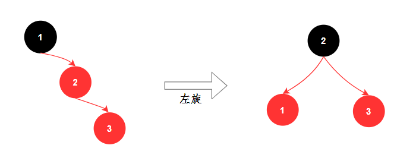
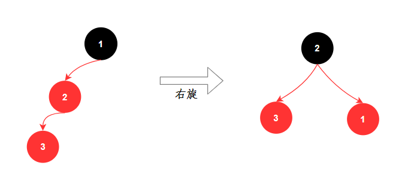
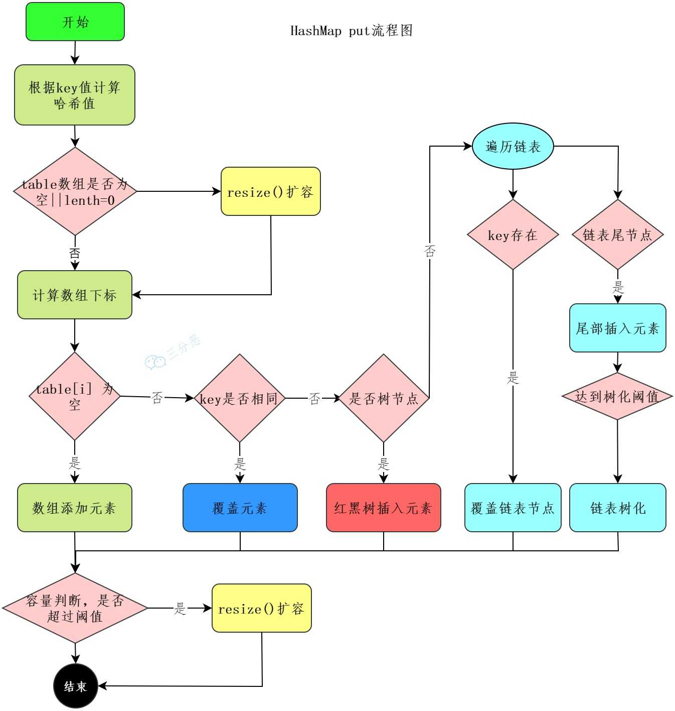
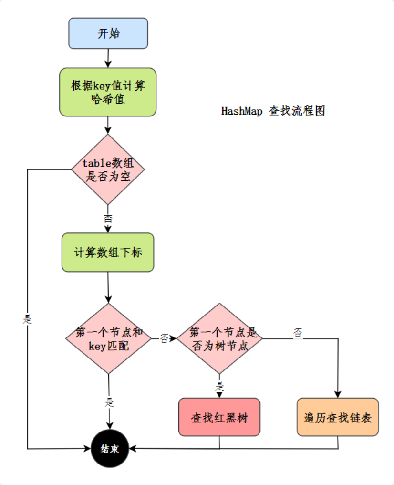
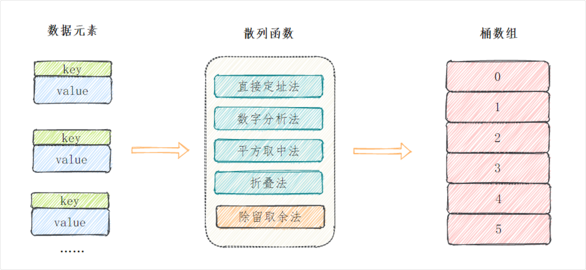

## Java 集合

### HashMap

#### 红黑树

红黑树是一种自平衡的二叉查找树

特点：节点设置颜色(红/黑) | 根+叶子节点是黑色 | 叶子节点是 null 节点 |

| 红色节点不能连着 | 最长路径不会超过最短路径两倍

关键：所有节点到其每个叶子的所有简单路径都包含相同数目的黑色节点 (最长路径不会超过最短路径两倍)

- 每个节点要么是红色，要么是黑色；
- 根节点永远是黑色；
- 所有的叶子节点都是黑色的（下图中的 NULL 节点）；
- 红色节点的子节点一定是黑色的 (红色节点不能连着)；
- 从任一节点到其每个叶子的所有简单路径都包含相同数目的黑色节点

第4点和第5点保证了红黑树最长路径不会超过最短路径两倍, 且不会退化成链表

红黑树是一种折中的方案，查找、插入、删除的时间复杂度都是 O(log n)

> 为什么不用二叉树 (普通二叉树有几率会退化成链表)

二叉树是最基本的树结构，每个节点最多有两个子节点，但是二叉树容易出现极端情况，比如插入的数据是有序的，那么**二叉树就会退化成链表**，查询效率就会变成 O(n)

> 为什么不用平衡二叉树 (要求过高，维护麻烦)

平衡二叉树比红黑树的要求更高，每个节点的左右子树的高度最多相差 1，这种高度的平衡保证了极佳的查找效率，但在进行插入和删除操作时，可能需要频繁地进行旋转来维持树的平衡，维护成本更高

> 为什么用红黑树

链表的查找时间复杂度是 O(n)，当链表长度较长时，查找性能会下降。红黑树是一种折中的方案，查找、插入、删除的时间复杂度都是 O(log n)

##### 红黑树保持平衡

> 二叉搜索树

对于任意节点 X：

左子树的所有节点 < X
右子树的所有节点 > X

旋转 + 染色

- 通过左旋和右旋来调整树的结构，避免某一侧过深
  - 左旋：该节点变成其右节点的左孩子，其右节点的左孩子放到该节点右孩子
    - 先将节点右连接断了，连；然后将右节点的左连接断了，连
  - 右旋：该节点变成其左节点的右孩子，其左节点的右孩子放到该节点下





- 染色，修复红黑规则，从而保证树的高度不会失衡

#### put 流程



第一步，通过 `hash()` 进一步扰动哈希值，以减少哈希冲突，得到 key 转换的hash值

第二步，进行数组扩容检测 (如果是第一次初始化，要扩容)，然后使用哈希值和数组长度进行取模运算，确定索引位置

```java
if ((tab = table) == null || (n = tab.length) == 0)
  n = (tab = resize()).length;

if ((p = tab[i = (n - 1) & hash]) == null)
  tab[i] = newNode(hash, key, value, null);
```

如果当前位置为空，直接将键值对插入该位置

否则判断当前位置的第一个节点是否与新节点的 key 相同，如果相同直接覆盖 value，如果不同，说明发生哈希冲突

先看看节点是什么结构 (链表 | 树)，然后开始对应的遍历，如果中间节点key相同，覆盖

如果是链表，将新节点添加到链表的尾部；如果链表长度大于等于 8，则将链表转换为红黑树

```java
public V put(K key, V value) {
    return putVal(hash(key), key, value, false, true);
}

final V putVal(int hash, K key, V value, boolean onlyIfAbsent, boolean evict) {
  Node<K,V>[] tab; Node<K,V> p; int n, i;
  // 如果 table 为空，先进行初始化
  if ((tab = table) == null || (n = tab.length) == 0)
      n = (tab = resize()).length;
  
  // 计算索引位置，并找到对应的桶
  if ((p = tab[i = (n - 1) & hash]) == null)
      tab[i] = newNode(hash, key, value, null); 
      // 如果桶为空，直接插入
  // 否则说明有哈希冲突，先看看节点是什么结构 (链表 | 树)
  else {
      Node<K,V> e; K k;
      // 检查第一个节点是否匹配
      if (p.hash == hash && ((k = p.key) == key || (key != null && key.equals(k))))
          e = p; // 覆盖
      // 如果是树节点，放入树中
      else if (p instanceof TreeNode)
          e = ((TreeNode<K,V>)p).putTreeVal(this, tab, hash, key, value);
      // 如果是链表，遍历插入到尾部
      // 或者如果中间找到了，就覆盖
      else {
          for (int binCount = 0; ; ++binCount) {
              if ((e = p.next) == null) {
                  p.next = newNode(hash, key, value, null);
                  // 如果链表长度达到阈值，转换为红黑树
                  if (binCount >= TREEIFY_THRESHOLD - 1)
                      treeifyBin(tab, hash);
                  break;
              }
              if (e.hash == hash && ((k = e.key) == key || (key != null && key.equals(k))))
                  break; // 覆盖
              p = e;
          }
      }
      if (e != null) { // 如果找到匹配的 key，则覆盖旧值
          V oldValue = e.value;
          if (!onlyIfAbsent || oldValue == null)
              e.value = value;
          afterNodeAccess(e);
          return oldValue;
      }
  }
  ++modCount; // 修改计数器
  if (++size > threshold)
      resize(); // 检查是否需要扩容
  afterNodeInsertion(evict);
  return null;
}
```

每次插入新元素后，检查是否需要扩容，如果当前元素个数大于阈值（capacity * loadFactor），则进行扩容，扩容后的数组大小是原来的 2 倍；并且重新计算每个节点的索引，进行数据重新分布

##### 只重写元素的 equals 方法没重写 hashCode，put 的时候会发生什么

如果只重写 equals 方法，没有重写 hashCode 方法，那么会导致 equals 相等的两个对象，hashCode 不相等，这样的话，两个对象会被 put 到数组中不同的位置

> 没有重写 hashCode 这导致计算的 hash 不同，那么位置必然不同

导致 get 的时候，无法获取到正确的值

> 理论上确实不会报错，只是会出现逻辑错误

put 操作

- 两个 equals 相等的对象会被放到不同的桶中
- HashMap 会认为它们是不同的 key
- 都能成功存储，不会报错

get 操作

- 用其中一个对象去 get，只能找到自己对应的 value
- 找不到另一个"相等"对象的 value
- 返回 null，但不会抛异常

#### get 流程

通过哈希值定位索引 → 定位桶 → 检查第一个节点 → 遍历链表或红黑树查找 → 返回结果



#### 为什么 hashmap 的容量刚好是 2 的幂次方

HashMap 是通过 `hash & (n-1)` 来定位元素下标的，n 为数组的大小，也就是 HashMap 底层数组的容量

因为本质定位元素下标是 `hash % len`, 但是这样效率不高，当强制给 `len=2^n`, 这样就保证了

$$
hash \% len = hash \% 2^n = hash & (n-1)
$$

从二进制的角度 `hash % 2^n` 就是获取 hash n 个低位，所以直接用 `hash & (n-1)`

> 此外，在扩容时，不会所有在同一个slot里的元素都要重新算hash

- (e.hash & oldCap) == 0：该bit为0，元素留在原位置
- (e.hash & oldCap) != 0：该bit为1，元素移动到 原位置 + oldCap

这样就避免了重新计算hash，直接通过一次位运算就能确定新位置，非常高效

#### 如果初始化 HashMap，传一个 17 的容量，它会怎么处理

HashMap 会将容量调整到大于等于 17 的最小的 2 的幂次方，也就是 32

在 HashMap 的初始化构造方法中，有这样⼀段代码

```java
public HashMap(int initialCapacity, float loadFactor) {
 ...
 this.loadFactor = loadFactor;
 this.threshold = tableSizeFor(initialCapacity);
}
```

阀值 threshold 会通过⽅法tableSizeFor() 进⾏计算

目标：找到大于等于 cap 的最小的2的幂次方 原理：

- 通过不断右移和或运算，把最高位1右边的所有位都变成1
- 最后 n + 1 就得到了下一个2的幂次方

```java
static final int tableSizeFor(int cap) {
  int n = cap - 1;
  n |= n >>> 1;
  n |= n >>> 2;
  n |= n >>> 4;
  n |= n >>> 8;
  n |= n >>> 16;
  return (n < 0) ? 1 : (n >= MAXIMUM_CAPACITY) ? MAXIMUM_CAPACITY : n + 1;
}
```

每次右移的位数都在翻倍，这样可以保证32位整数的所有位都被覆盖到

- int n = cap - 1; 避免刚好是 2 的幂次方时，容量直接翻倍
- 接下来通过不断右移（>>>）并与自身进行或运算（|=），将 n 的二进制表示中的所有低位设置为 1
- n |= n >>> 1; 将最高位的 1 扩展到下一位
- n |= n >>> 2; 扩展到后两位
- 依此类推，直到 n |= n >>> 16;，扩展到后十六位，这样从最高位的 1 到最低位，就都变成了 1
- 如果 n 小于 0，说明 cap 是负数，直接返回 1

否则，返回 n + 1，这是因为 n 的所有低位都是 1，所以 n + 1 就是大于 cap 的最小的 2 的幂次方

#### 哈希函数的构造方法

- 除留取余法：H(key)=key%p(p<=N)，关键字除以一个不大于哈希表长度的正整数 p，所得余数为地址，当然 HashMap 里进行了优化改造，效率更高，散列也更均衡
- 直接定址法：直接根据key来映射到对应的数组位置，例如 1232 放到下标 1232 的位置
- 数字分析法：取key的某些数字（例如十位和百位）作为映射的位置
- 平方取中法：取key平方的中间几位作为映射的位置
- 将key分割成位数相同的几段，然后把它们的叠加和作为映射的位置



#### 解决哈希冲突的方法

再哈希法、开放地址法和拉链法

##### 再哈希法

准备两套哈希算法，当发生哈希冲突的时候，使用另外一种哈希算法，直到找到空槽为止。对哈希算法的设计要求比较高

##### 开放地址法

遇到哈希冲突的时候，就去寻找下一个空的槽。有 3 种方法：

- 线性探测：从冲突的位置开始，依次往后找，直到找到空槽。
- 二次探测：从冲突的位置 x 开始，第一次增加 个位置，第二次增加 ，直到找到空槽。
- 双重哈希：和再哈希法类似，准备多个哈希函数，发生冲突的时候，使用另外一个哈希函数

##### 拉链法

链地址法，当发生哈希冲突的时候，使用链表将冲突的元素串起来。HashMap 采用的正是拉链法

#### 怎么判断 key 相等

依赖于key的equals()方法和hashCode()方法

```java
if (e.hash == hash &&
((k = e.key) == key || (key != null && key.equals(k))))
```

- hashCode() ：使用key的hashCode()方法计算key的哈希码
- equals() ：当两个key的哈希码相同时，HashMap还会调用key的equals()方法进行精确比较。只有当equals()方法返回true时，两个key才被认为是完全相同的

#### JDK8 对 HashMap 优化

- 底层数据结构由数组 + 链表改成了数组 + 链表或红黑树的结构
- 链表的插入方式由头插法改为了尾插法。头插法在扩容后容易改变原来链表的顺序
- 扩容的时机由插入时判断改为插入后判断，这样可以避免在每次插入时都进行不必要的扩容检查，因为有可能插入后仍然不需要扩容

### 自己设计 HashMap

就尝试用 数组+链表

散列函数：hashCode()+除留余数法

冲突解决：链地址法

- 第一步，实现一个 hash 函数，对键的 hashCode 进行扰动
- 第二步，实现一个拉链法的方法来解决哈希冲突
- 第三步，扩容后，重新计算哈希值，将元素放到新的数组中

```java
public class TestHashMap<K,V>{
  /**
   * 节点类
   *
   * @param <K>
   * @param <V>
   */
  class Node<K, V> {
      //键值对
      private K key;
      private V value;

      //链表，后继
      private Node<K, V> next;

      public Node(K key, V value) {
          this.key = key;
          this.value = value;
      }

      public Node(K key, V value, Node<K, V> next) {
          this.key = key;
          this.value = value;
          this.next = next;
      }
  }

  //默认容量
  final int DEFAULT_CAPACITY = 16;
  //负载因子
  final float LOAD_FACTOR = 0.75f;
  //HashMap的大小
  private int size;
  //桶数组
  Node<K, V>[] buckets;

  /**
   * 无参构造器，设置桶数组默认容量
   */
  public ThirdHashMap() {
    buckets = new Node[DEFAULT_CAPACITY];
    size = 0;
  }

  /**
   * 有参构造器，指定桶数组容量
   *
   * @param capacity
   */
  public ThirdHashMap(int capacity) {
    buckets = new Node[capacity];
    size = 0;
  }

   /**
   * 哈希函数，获取地址
   *
   * @param key
   * @return
   */
  private int getIndex(K key, int length) {
    //获取hash code
    int hashCode = key.hashCode();
    //和桶数组长度取余
    int index = hashCode % length;
    return Math.abs(index);
  }

  /**
   * put方法
   *
   * @param key
   * @param value
   * @return
   */
  public void put(K key, V value) {
    //判断是否需要进行扩容
    if (size >= buckets.length * LOAD_FACTOR) resize();
    putVal(key, value, buckets);
  }

  /**
   * 将元素存入指定的node数组
   *
   * @param key
   * @param value
   * @param table
   */
  private void putVal(K key, V value, Node<K, V>[] table) {
    //获取位置
    int index = getIndex(key, table.length);
    Node node = table[index];
    //插入的位置为空
    if (node == null) {
        table[index] = new Node<>(key, value);
        size++;
        return;
    }
    //插入位置不为空，说明发生冲突，使用链地址法,遍历链表
    while (node != null) {
        //如果key相同，就覆盖掉
        if ((node.key.hashCode() == key.hashCode())
                && (node.key == key || node.key.equals(key))) {
            node.value = value;
            return;
        }
        node = node.next;
    }
    //当前key不在链表中，插入链表头部
    Node newNode = new Node(key, value, table[index]);
    table[index] = newNode;
    size++;
  }

   /**
   * 扩容
   */
  private void resize() {
    //创建一个两倍容量的桶数组
    Node<K, V>[] newBuckets = new Node[buckets.length * 2];
    //将当前元素重新散列到新的桶数组
    rehash(newBuckets);
    buckets = newBuckets;
  }

  /**
   * 重新散列当前元素
   *
   * @param newBuckets
   */
  private void rehash(Node<K, V>[] newBuckets) {
    //map大小重新计算
    size = 0;
    //将旧的桶数组的元素全部刷到新的桶数组里
    for (int i = 0; i < buckets.length; i++) {
      //为空，跳过
      if (buckets[i] == null) {
          continue;
      }
      Node<K, V> node = buckets[i];
      while (node != null) {
          //将元素放入新数组
          putVal(node.key, node.value, newBuckets);
          node = node.next;
      }
  }

  /**
     * 获取元素
     *
     * @param key
     * @return
     */
  public V get(K key) {
    //获取key对应的地址
    int index = getIndex(key, buckets.length);
    if (buckets[index] == null) return null;
    Node<K, V> node = buckets[index];
    //查找链表
    while (node != null) {
      if ((node.key.hashCode() == key.hashCode())
              && (node.key == key || node.key.equals(key))) {
          return node.value;
      }
      node = node.next;
    }
    return null;
  }
}
```
