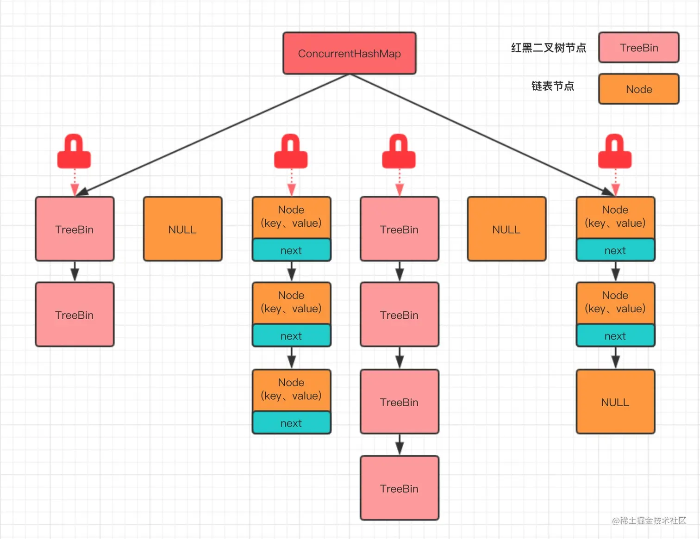
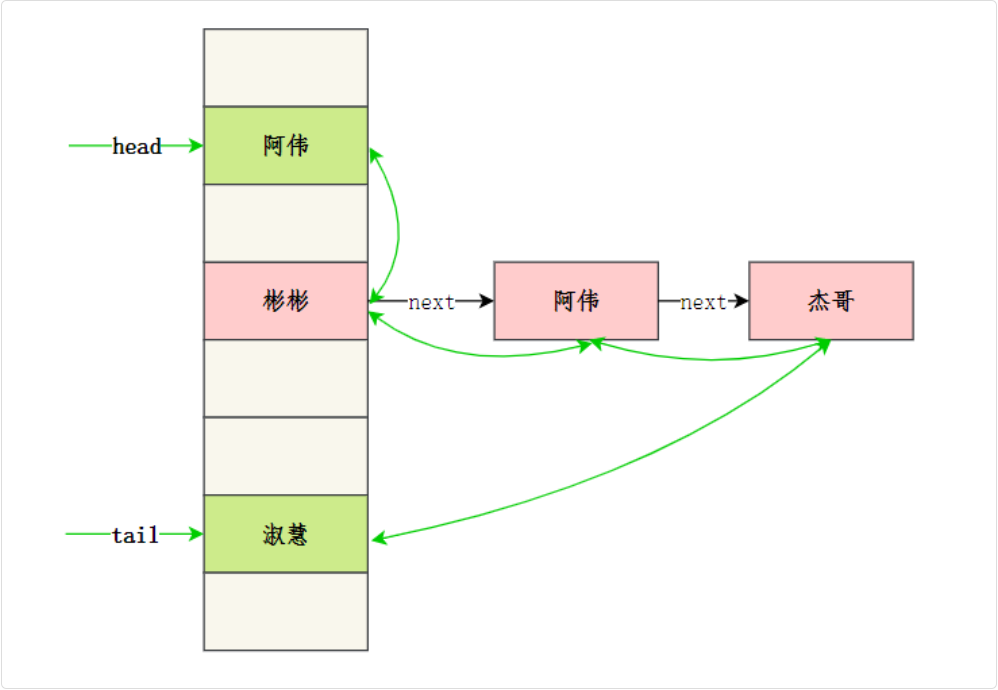

## Java 集合

### HashMap

#### 怎么解决 HashMap 线程不安全

在早期的 JDK 版本中，可以用 Hashtable 来保证线程安全。Hashtable 在方法上加了 synchronized 关键字

另外，可以通过 Collections.synchronizedMap 方法返回一个线程安全的 Map，内部是通过 synchronized 对象锁来保证线程安全的，比在方法上直接加 synchronized 关键字更轻量级

更好的解决方案是

> 使用并发工具包下的 ConcurrentHashMap，使用了CAS+ synchronized 关键字来保证线程安全



### LinkedHashMap 怎么实现有序

LinkedHashMap 在 HashMap 的基础上维护了一个双向链表，通过 before 和 after 标识前置节点和后置节点，从而实现插入的顺序或访问顺序

```java
public class LinkedHashMap<K,V>
    extends HashMap<K,V>
    implements Map<K,V>
{
   static class Entry<K,V> extends HashMap.Node<K,V> {
        Entry<K,V> before, after;
        Entry(int hash, K key, V value, Node<K,V> next) {
            super(hash, key, value, next);
        }
    }

    transient LinkedHashMap.Entry<K,V> head;

    transient LinkedHashMap.Entry<K,V> tail;

    ...
}
```



### TreeMap 怎么实现有序

TreeMap 通过 key 的比较器来决定元素的顺序，如果没有指定比较器，那么 key 必须实现 Comparable 接口

TreeMap 的底层是红黑树，红黑树是一种自平衡的二叉查找树，每个节点都大于其左子树中的任何节点，小于其右子节点树种的任何节点

插入或者删除元素时通过旋转和染色来保持树的平衡。

查找的时候从根节点开始，利用二叉查找树的特点，逐步向左子树或者右子树递归查找，直到找到目标元素

#### TreeMap 结构 (红黑树)

红黑树特性：

红黑两色 | 根节点黑色 | 红色节点要间隔 | 所有根节点到叶子节点的路径中黑色节点数量一致 | 所有叶子节点均是黑色 (叶子节点为null节点)

##### 节点

在 TreeMap 的内部 节点类

除了记录左右子节点，还要记录自己的父节点

```java
// Red-black mechanics
private static final boolean RED   = false;
private static final boolean BLACK = true;

static final class Entry<K,V> implements Map.Entry<K,V> {
  K key;
  V value;
  Entry<K,V> left;
  Entry<K,V> right;
  Entry<K,V> parent;
  boolean color = BLACK;

  /**
   * Make a new cell with given key, value, and parent, and with
   * {@code null} child links, and BLACK color.
   */
  Entry(K key, V value, Entry<K,V> parent) {
    this.key = key;
    this.value = value;
    this.parent = parent;
  }

  /**
   * Returns the key.
   *
   * @return the key
   */
  public K getKey() {
    return key;
  }

  /**
   * Returns the value associated with the key.
   *
   * @return the value associated with the key
   */
  public V getValue() {
    return value;
  }

  /**
   * Replaces the value currently associated with the key with the given
   * value.
   *
   * @return the value associated with the key before this method was
   *         called
   */
  public V setValue(V value) {
    V oldValue = this.value;
    this.value = value;
    return oldValue;
  }

  public boolean equals(Object o) {
    return o instanceof Map.Entry<?, ?> e
            && valEquals(key,e.getKey())
            && valEquals(value,e.getValue());
  }

  public int hashCode() {
    int keyHash = (key==null ? 0 : key.hashCode());
    int valueHash = (value==null ? 0 : value.hashCode());
    return keyHash ^ valueHash;
  }

  public String toString() {
    return key + "=" + value;
  }
}
```

##### get 操作

内部逻辑在 `getEntry`, 就是一个二叉搜索树的逻辑

```java
public V get(Object key) {
  Entry<K,V> p = getEntry(key);
  return (p==null ? null : p.value);
}

final Entry<K,V> getEntry(Object key) {
  // Offload comparator-based version for sake of performance
  if (comparator != null)
      return getEntryUsingComparator(key);
  Objects.requireNonNull(key);
  @SuppressWarnings("unchecked")
      Comparable<? super K> k = (Comparable<? super K>) key;
  Entry<K,V> p = root;
  while (p != null) {
      int cmp = k.compareTo(p.key);
      if (cmp < 0)
          p = p.left;
      else if (cmp > 0)
          p = p.right;
      else
          return p;
  }
  return null;
}
```

##### put 操作

```java
public V put(K key, V value) {
  return put(key, value, true);
}

private V put(K key, V value, boolean replaceOld) {
  Entry<K,V> t = root;
  // 空树处理
  if (t == null) {
      addEntryToEmptyMap(key, value);
      return null;
  }
  int cmp;
  Entry<K,V> parent;
  // split comparator and comparable paths
  Comparator<? super K> cpr = comparator;

  // 有自定义比较器
  // 使用比较器比较key
  if (cpr != null) {
      do {
          parent = t;
          cmp = cpr.compare(key, t.key);
          if (cmp < 0)
              t = t.left;
          else if (cmp > 0)
              t = t.right;
          else {
              V oldValue = t.value;
              if (replaceOld || oldValue == null) {
                  t.value = value;
              }
              return oldValue;
          }
      } while (t != null);
  } else {
      // 无比较器（使用key的自然排序）
      Objects.requireNonNull(key);
      @SuppressWarnings("unchecked")
      Comparable<? super K> k = (Comparable<? super K>) key;
      do {
          parent = t;
          cmp = k.compareTo(t.key);
          if (cmp < 0)
              t = t.left;
          else if (cmp > 0)
              t = t.right;
          else {
              V oldValue = t.value;
              if (replaceOld || oldValue == null) {
                  t.value = value;
              }
              return oldValue;
          }
      } while (t != null);
  }
  addEntry(key, value, parent, cmp < 0);
  return null;
}
```

要么就是已经在树里了，直接改value；要么最终找到了一个叶子节点(null)，插入位置

最终对于插入的 key valuee 找到了 父节点 parent 后开始add `addEntry(key, value, parent, cmp < 0);`

`cmp < 0`：决定插入到父节点的左边还是右边

```java
private void addEntry(K key, V value, Entry<K, V> parent, boolean addToLeft) {
  Entry<K,V> e = new Entry<>(key, value, parent);
  if (addToLeft)
    parent.left = e;
  else
    parent.right = e;
  fixAfterInsertion(e);
  size++;
  modCount++;
}
```

##### 修复插入后的红黑逻辑

首先，默认插入来的节点颜色必然是红色 (这样保证不会破坏所有路径的黑色节点数量一致)

但是这样可能出现了另外的矛盾 (红色节点颜色连续了 父子节点都为红色)

> 触发修复的条件 `x != null && x != root && x.parent.color == RED`
>
> 自底向上修复

分为两个对称的分支（父节点是祖父的左子还是右子），红黑树节点还记录了自己的 parent

```java
/** From CLR */
private void fixAfterInsertion(Entry<K,V> x) {
  x.color = RED;

  while (x != null && x != root && x.parent.color == RED) {
    // 当前节点的父节点 是祖父的左子
    if (parentOf(x) == leftOf(parentOf(parentOf(x)))) {
        // 获取叔叔节点 (祖父右子)
        Entry<K,V> y = rightOf(parentOf(parentOf(x)));
        // 祖父右子 红
        if (colorOf(y) == RED) {
            setColor(parentOf(x), BLACK);
            setColor(y, BLACK);
            setColor(parentOf(parentOf(x)), RED);
            x = parentOf(parentOf(x));
        } else {
            if (x == rightOf(parentOf(x))) {
                x = parentOf(x);
                rotateLeft(x);
            }
            setColor(parentOf(x), BLACK);
            setColor(parentOf(parentOf(x)), RED);
            rotateRight(parentOf(parentOf(x)));
        }
    } else {
        Entry<K,V> y = leftOf(parentOf(parentOf(x)));
        if (colorOf(y) == RED) {
            setColor(parentOf(x), BLACK);
            setColor(y, BLACK);
            setColor(parentOf(parentOf(x)), RED);
            x = parentOf(parentOf(x));
        } else {
            if (x == leftOf(parentOf(x))) {
                x = parentOf(x);
                rotateRight(x);
            }
            setColor(parentOf(x), BLACK);
            setColor(parentOf(parentOf(x)), RED);
            rotateLeft(parentOf(parentOf(x)));
        }
    }
  }
  root.color = BLACK;
}
```

### TreeMap 和 HashMap 的区别

- HashMap 是基于数组+链表+红黑树实现的，put 元素的时候会先计算 key 的哈希值，然后通过哈希值计算出元素在数组中的存放下标，然后将元素插入到指定的位置，如果发生哈希冲突，会使用链表来解决，如果链表长度大于 8，会转换为红黑树
- TreeMap 是基于红黑树实现的，put 元素的时候会先判断根节点是否为空，如果为空，直接插入到根节点，如果不为空，会通过 key 的比较器来判断元素应该插入到左子树还是右子树

即 TreeMap 就是一个红黑树，插入判断大小根据 key 设置的比较器来进行比较

在没有发生哈希冲突的情况下，HashMap 的查找效率是 O(1)。适用于查找操作比较频繁的场景。

TreeMap 的查找效率是 O(logn)。并且保证了元素的顺序，因此适用于需要大量范围查找或者有序遍历的场景
