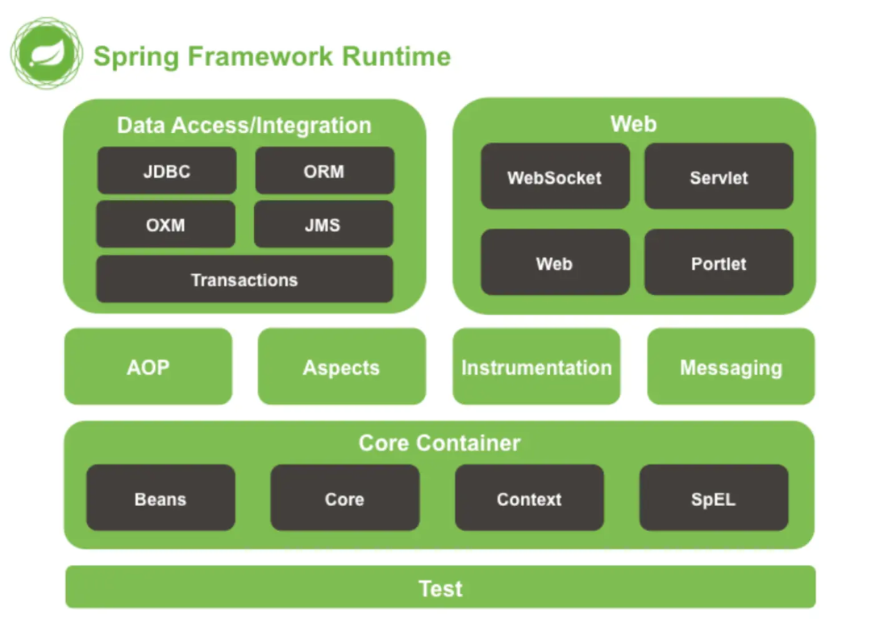
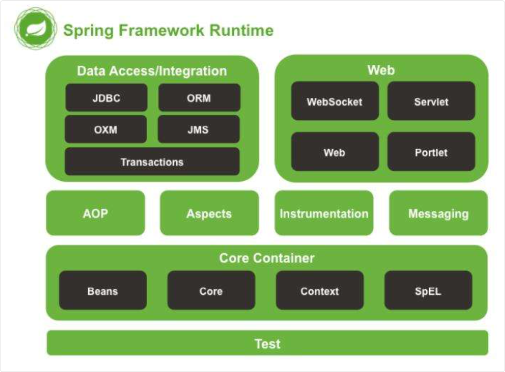
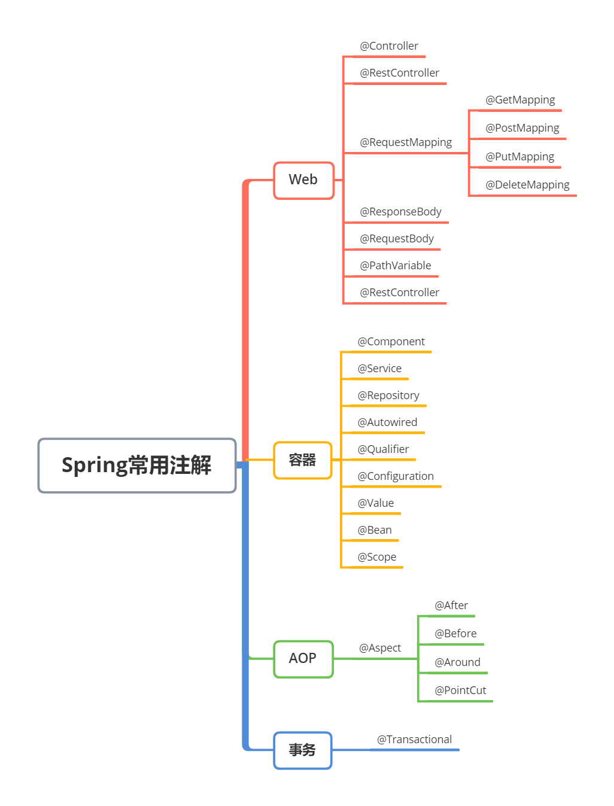

## Spring基础

### 什么是 Spring

Spring 是一个 Java 后端开发框架，其最核心的作用是帮我们管理 Java 对象

其最重要的特性就是 IoC，也就是控制反转。以前我们要使用一个对象时，都要自己先 new 出来。但有了 Spring 之后，我们只需要告诉 Spring 我们需要什么对象，它就会自动帮我们创建好并注入到 Spring 容器当中

另外，Spring 还提供了 AOP，也就是面向切面编程，在我们需要做一些通用功能的时候特别有用，比如说日志记录、权限校验、事务管理这些，我们不用在每个方法里都写重复的代码，直接用 AOP 就能统一处理

Spring 的生态也特别丰富，像 Spring Boot 能让我们快速搭建项目，Spring MVC 能帮我们处理 web 请求，Spring Data 能帮我们简化数据库操作，Spring Cloud 能帮我们做微服务架构等等



#### 特性

| **核心思想** | **解决的问题** | **实现手段** | **典型应用场景** |
| --- | --- | --- | --- |
| **IOC** | 对象创建与依赖管理的高耦合 | 容器管理Bean生命周期 | 动态替换数据库实现、服务组装 |
| **DI** | 依赖关系的硬编码问题 | Setter/构造器/注解注入 | 注入数据源、服务层依赖DAO层 |
| **AOP** | 横切逻辑分散在业务代码中 | 动态代理与切面配置 | 日志、事务、权限校验统一处理 |

最核心的就是 IoC 控制反转和 DI 依赖注入，让 Spring 有能力帮我们管理对象的创建和依赖关系

> DI 是 IoC（控制反转）的具体实现方式，Spring 通过 DI 实现 IoC

第二个就是 AOP 面向切面编程。这个在我们处理一些横切关注点的时候特别有用，比如说我们要给某些 Controller 方法都加上权限控制，如果没有 AOP 的话，每个方法都要写一遍加权代码，维护起来很麻烦。

用了 AOP 之后，我们只需要写一个切面类，定义好切点和通知，就能统一处理了。事务管理也是同样的道理，加个 @Transactional 注解就搞定了。

还有就是 Spring 对各种企业级功能的集成支持也特别好。比如数据库访问，不管我们用 JDBC、MyBatis-Plus 还是 Hibernate，Spring 都能很好地集成。消息队列、缓存、安全认证这些， Spring 都有对应的模块来支持。

#### 模块



首先是 Spring Core 模块，这是整个 Spring 框架的基础，包含了 IoC 容器和依赖注入等核心功能。还有 Spring Beans 模块，负责 Bean 的配置和管理。这两个模块基本上是其他所有模块的基础，不管用 Spring 的哪个功能都会用到

然后是 Spring Context 上下文模块，它在 Core 的基础上提供了更多企业级的功能，比如国际化、事件传播、资源加载这些。ApplicationContext 就是在这个模块里面的

Spring AOP 模块提供了面向切面编程的支持，我们用的 @Transactional、自定义切面这些都是基于这个模块。

Web 开发方面，Spring Web 模块提供了基础的 Web 功能，Spring WebMVC 就是我们常用的 MVC 框架，用来处理 HTTP 请求和响应。现在还有 Spring WebFlux，支持响应式编程。

数据访问方面，Spring JDBC 简化了 JDBC 的使用

Spring ORM 提供了对 MyBatis-Plus 等 ORM 框架的集成支持

Spring Test 模块提供了测试支持，可以很方便地进行单元测试和集成测试。我们写测试用例的时候经常用 @SpringBootTest 这些注解。

还有一些其他的模块，比如 Spring Security 负责安全认证，Spring Batch 处理批处理任务等等。

现在我们基本都是用 Spring Boot 来开发，它把这些模块都整合好了，用起来更方便。

### IOC 与 AOP 介绍

#### IOC

IoC 控制反转是一种设计思想，它的主要作用是将对象的创建和对象之间的调用过程交给 Spring 容器来管理

> DI 是 IoC（控制反转）的具体实现方式，Spring 通过 DI 实现 IoC

```java
// 传统方式：对象自己创建依赖
public class UserService {
  private UserDao userDao = new UserDao(); // 硬编码依赖
}

// DI方式：依赖从外部注入
public class UserService {
  private UserDao userDao;
  
  // 构造器注入
  public UserService(UserDao userDao) {
      this.userDao = userDao;
  }
}
```

##### DI

DI 要求对象通过构造函数、方法参数或属性来声明它们需要的依赖，而不是自己去寻找

在 Java（尤其是 Spring 框架）中，主要有三种注入方式：

- 构造器注入（Constructor Injection）： 依赖关系在对象创建时就确定，官方最推荐。
- Setter 方法注入（Setter Injection）： 对象创建后，通过 Setter 方法设置依赖。
- 字段注入（Field Injection）： 使用注解（如 @Autowired）直接注入，代码最简洁但不利于解耦。

#### AOP

AOP 面向切面编程，简单点说就是把一些通用的功能从业务代码里抽取出来，统一处理

### 常用注解



#### Bean 管理相关的注解

@Component 是最基础的，用来标识一个类是 Spring 组件。

像 `@Service、@Repository、@Controller` 这些都是 `@Component` 的特化版本，分别用在服务层、数据访问层和控制器层

#### 依赖注入方面

`@Autowired` 是用得最多的，可以标注在字段、setter 方法或者构造方法上

`@Qualifier` 在有多个同类型 Bean 的时候用来指定具体注入哪一个。`@Resource` 和 `@Autowired` 功能差不多，不过它是按名称注入的

#### 配置相关的注解

`@Configuration` 标识配置类，`@Bean` 用来定义 Bean，`@Value` 用来注入配置文件中的属性值。

我们项目里的数据库连接信息、Redis 配置这些都是用 `@Value` 来注入的。`@PropertySource` 用来指定配置文件的位置

#### Web 开发的注解

`@RestController` 相当于 `@Controller` 加 `@ResponseBody`，用来做 RESTful 接口

`@RequestMapping` 及其变体 `@GetMapping、@PostMapping、@PutMapping、@DeleteMapping` 用来映射 HTTP 请求

`@PathVariable` 获取路径参数，`@RequestParam` 获取请求参数，`@RequestBody` 接收 JSON 数据

#### AOP 相关的注解 (Transactional)

`@Aspect` 定义切面，`@Pointcut` 定义切点，`@Before、@After、@Around` 这些定义通知类型

不过我们用得最多的还是 `@Transactional`，基本上 Service 层需要保证事务原子性的方法都会加上这个注解

#### 生命周期相关

`@PostConstruct` 在 Bean 初始化后执行，`@PreDestroy` 在 Bean 销毁前执行。测试的时候 `@SpringBootTest` 也经常用到

还有一些 Spring Boot 特有的注解，比如 `@SpringBootApplication` 这个启动类注解，`@ConditionalOnProperty` 做条件装配，`@EnableAutoConfiguration` 开启自动配置等等
