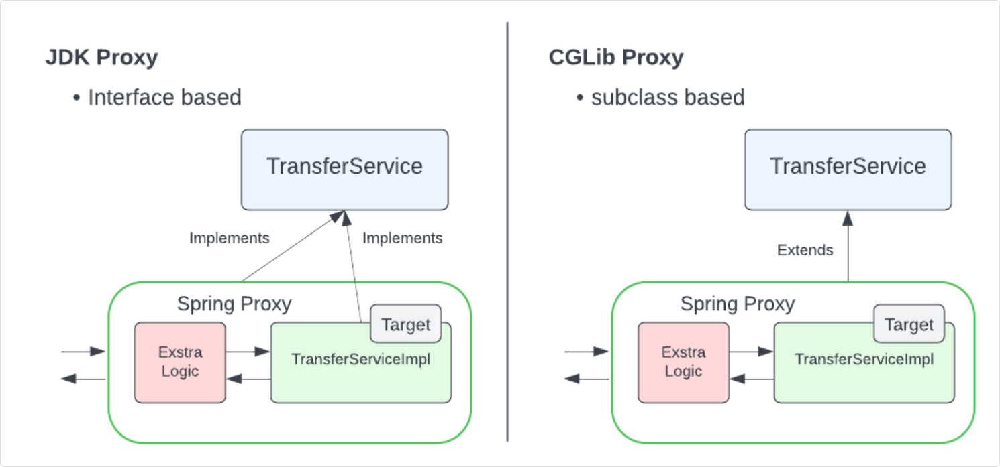
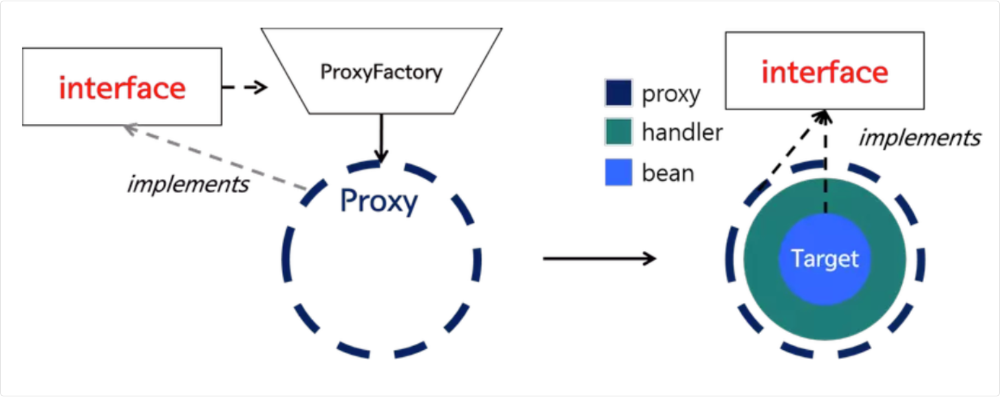
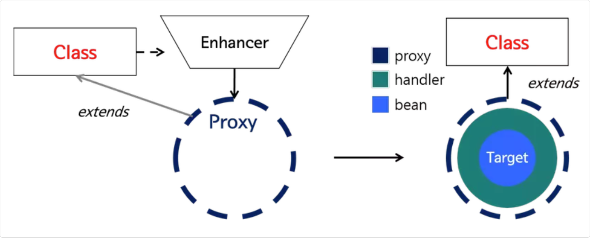
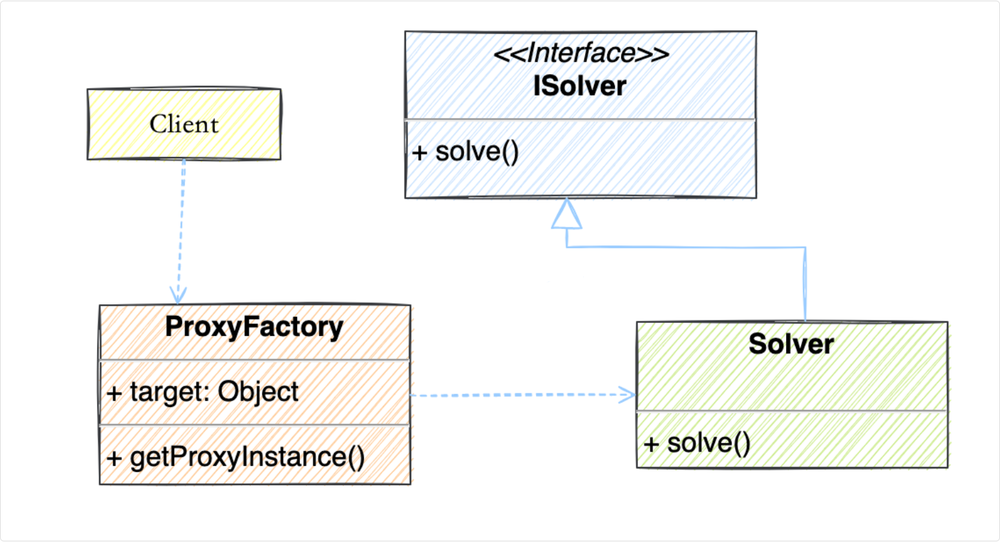

## AOP4

### AOP 和反射的区别

反射主要是为了让程序能够检查和操作自身的结构，比如获取类的信息、调用方法、访问字段等等

而 AOP 则是为了在不修改业务代码的前提下，动态地为方法添加额外的行为，比如日志记录、事务管理等

从技术实现来说，反射是 Java 语言本身提供的功能，通过 `java.lang.reflect` 包下的 API 来实现

而 AOP 通常需要框架支持，比如 Spring AOP 是通过动态代理实现的，而动态代理又是基于反射实现的

### JDK动态代理和CGLIB代理

JDK 动态代理和 CGLIB 代理是 Spring AOP 用来创建代理对象的两种方式



从使用条件来说，JDK 动态代理要求目标类必须**实现至少一个接口**，因为它是基于接口来创建代理的

而 CGLIB 代理**不需要目标类实现接口**，它是通过**继承目标类**来创建代理的

这是两者最根本的区别

比如我们有一个 `TransferService` 接口和 `TransferServiceImpl` 实现类

如果用 JDK 动态代理，创建的代理对象会实现 `TransferService` 接口



如果用 CGLIB，代理对象会继承 `TransferServiceImpl` 类



#### 实现原理区别

从实现原理来说，JDK 动态代理是 Java 原生支持的

它通过反射机制在运行时动态创建一个实现了指定接口的代理类

当我们调用代理对象的方法时，会被转发到 `InvocationHandler` 的 `invoke` 方法中，我们可以在这个方法里插入切面逻辑，然后再通过反射调用目标对象的真实方法

```java
public class JdkProxyExample {
  public static void main(String[] args) {
    UserService target = new UserServiceImpl();
    
    UserService proxy = (UserService) Proxy.newProxyInstance(
      target.getClass().getClassLoader(),
      target.getClass().getInterfaces(),
      (proxy1, method, args1) -> {
          System.out.println("Before method: " + method.getName());
          Object result = method.invoke(target, args1);
          System.out.println("After method: " + method.getName());
          return result;
      }
    );
    
    proxy.findUser(1L);
  }
}
```

CGLIB 则是一个第三方的字节码生成库，它通过 **ASM 字节码框架动态生成目标类的子类**，然后**重写父类的方法**来插入切面逻辑

```java
public class CglibProxyExample {
  public static void main(String[] args) {
    Enhancer enhancer = new Enhancer();
    enhancer.setSuperclass(UserController.class);
    enhancer.setCallback(new MethodInterceptor() {
      @Override
      public Object intercept(Object obj, Method method, Object[] args, MethodProxy proxy) throws Throwable {
        System.out.println("Before method: " + method.getName());
        Object result = proxy.invokeSuper(obj, args);
        System.out.println("After method: " + method.getName());
        return result;
      }
    });
    
    UserController proxy = (UserController) enhancer.create();
    proxy.getUser(1L);
  }
}
```

#### 如何选择

如果目标对象没有实现任何接口，就只能使用 CGLIB 代理，就比如说 Controller 层的类

如果目标对象实现了接口，通常首选 JDK 动态代理，比如说 Service 层的类，一般都会先定义接口，再实现接口

在 Spring Boot 2.0 之后，Spring AOP 默认使用 CGLIB 代理。这是因为 Spring Boot 作为一个追求“约定优于配置”的框架，选择 CGLIB，可以简化开发者的心智负担，避免因为忘记实现接口而导致 AOP 不生效的问题

### JDK 动态代理

JDK 动态代理的核心是通过反射机制在运行时创建一个实现了指定接口的代理类



#### 对应接口对象

```java
public interface ISolver {
  void solve();
}
```

#### 对应实现类

```java
public class Solver implements ISolver {
  @Override
  public void solve() {
    System.out.println("Penguin");
  }
}
```

#### 构建代理对象

使用用反射生成目标对象的代理，这里用了一个匿名内部类方式重写 `InvocationHandler`方法

```java
public class ProxyFactory {

  // 维护一个目标对象
  private Object target;

  public ProxyFactory(Object target) {
    this.target = target;
  }

  // 为目标对象生成代理对象
  public Object getProxyInstance() {
    return Proxy.newProxyInstance(target.getClass().getClassLoader(), target.getClass().getInterfaces(),
        new InvocationHandler() {
            @Override
            public Object invoke(Object proxy, Method method, Object[] args) throws Throwable {
                System.out.println("请问有什么可以帮到您？");

                // 调用目标对象方法
                Object returnValue = method.invoke(target, args);

                System.out.println("问题已经解决啦！");
                return null;
            }
        });
  }
}
```

##### Proxy 类

Proxy 是 JDK 提供的一个工具类，它的主要作用就是在程序运行期间（内存中）动态地生成一个全新的类（代理类）

```java
Proxy.newProxyInstance(ClassLoader loader, Class<?>[] interfaces, InvocationHandler h)
```

- **参数一：`ClassLoader loader` (类加载器)**
  - 负责将类的字节码（`.class`文件）加载到 JVM 内存中的工具。
  - 平时我们写的 Java 类是在编译时由编译器生成 `.class` 文件的
  - 但是，代理类是在**代码运行的时候凭空捏造（动态生成字节码）**出来的
  - 既然在内存里写好了一段新的字节码，就需要一个类加载器把它正式加载到 JVM 里变成一个能用的类。通常我们直接借用目标对象的类加载器（`target.getClass().getClassLoader()`）。
- **参数二：`Class<?>[] interfaces` (目标对象实现的接口列表)**
  - 目标类实现的所有接口
  - 代理对象必须要长得跟目标对象“一模一样”（拥有相同的方法），调用者才能把它当成真实对象来使用
  - 怎么保证长得一样？就是**让代理对象也去实现目标对象的所有接口**。通过传入这个接口列表，`Proxy` 类就知道自己生成的这个“假对象”需要拥有哪些方法了。
  - **⚠️ 致命限制：** 这也是 JDK 动态代理最大的特点和限制——**目标对象必须至少实现了一个接口**
  - 如果目标对象是一个没有任何接口的普通类，JDK 动态代理就无能为力了（这时候需要用到另一种技术叫 CGLIB）。
- 参数三：`InvocationHandler h` (调用处理器)
  - 是你刚才手写的那个匿名内部类。
  - 代理对象虽然按照接口生成了所有的方法，但这些方法里面是空的。当别人调用代理对象的这些方法时，到底该执行什么逻辑
  - 代理对象会把所有的调用，全部统一转发给 `InvocationHandler`去处理。

##### `InvocationHandler` 接口

`InvocationHandler` 只有一个方法：`invoke`

当你调用代理对象身上的任何一个方法时，实际上执行的都是这个 invoke 方法

```java
public Object invoke(Object proxy, Method method, Object[] args) throws Throwable
```

它的工作流程： 拦截请求 -> 执行前置增强（如打印日志） -> 通过 method.invoke(target, args) 调用真实对象的真实方法 -> 执行后置增强 -> 将真实返回值原路返回

#### 生成代理对象实例

```java
public class Client {
  public static void main(String[] args) {
    //目标对象:程序员
    ISolver developer = new Solver();
    //代理：客服小姐姐
    ISolver csProxy = (ISolver) new ProxyFactory(developer).getProxyInstance();
    //目标方法：解决问题
    csProxy.solve();
  }
}
```

### CGLIB 代理

第一步：定义目标类 Solver，定义 solve 方法，模拟解决问题的行为。目标类不需要实现任何接口，这与 JDK 动态代理的要求不同

```java
public class Solver {
  public void solve() {
    System.out.println("疯狂掉头发解决问题……");
  }
}
```

第二步：创建代理工厂 ProxyFactory，使用 CGLIB 的 Enhancer 类来生成目标类的子类（代理对象）

CGLIB 允许我们在运行时动态创建一个继承自目标类的代理类，并重写目标方法。

```java
public class ProxyFactory implements MethodInterceptor {

  //维护一个目标对象
  private Object target;

  public ProxyFactory(Object target) {
    this.target = target;
  }

  //为目标对象生成代理对象
  public Object getProxyInstance() {
    //工具类
    Enhancer en = new Enhancer();
    //设置父类
    en.setSuperclass(target.getClass());
    //设置回调函数
    en.setCallback(this);
    //创建子类对象代理
    return en.create();
  }

  @Override
  public Object intercept(Object obj, Method method, Object[] args, MethodProxy proxy) throws Throwable {
    System.out.println("请问有什么可以帮到您？");
    // 执行目标对象的方法
    Object returnValue = method.invoke(target, args);
    System.out.println("问题已经解决啦！");
    return null;
  }

}
```
