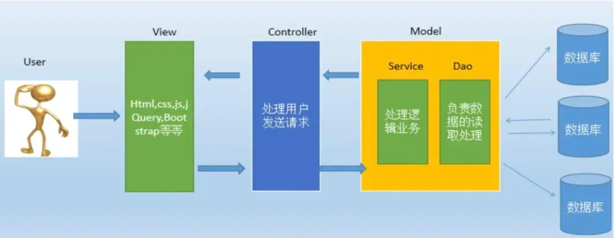

## MVC

### MVC 分层介绍

MVC 全名是 Model View Controller，是模型(model)－视图(view)－控制器(controller)的缩写，一种软件设计典范

用一种业务逻辑、数据、界面显示分离的方法组织代码，将业务逻辑聚集到一个部件里面，在改进和个性化定制界面及用户交互的同时，不需要重新编写业务逻辑

- 视图(view)： 为用户提供使用界面，与用户直接进行交互。
- 模型(model)： 代表一个存取数据的对象或 JAVA POJO（Plain Old Java Object，简单java对象）
  - 它也可以带有逻辑，主要用于承载数据，并对用户提交请求进行计算的模块，模型分为两类
  - 一类称为数据承载 Bean
    - 所谓数据承载 Bean 是指实体类（如：User类），专门为用户承载业务数据的
  - 一类称为业务处理 Bean
    - 业务处理 Bean 是指 Service 或 Dao 对象，专门用于处理用户提交请求的。
- 控制器(controller)： 用于将用户请求转发给相应的 Model 进行处理，并根据 Model 的计算结果向用户提供相应响应。它使视图与模型分离



流程步骤：

- 用户通过View 页面向服务端提出请求，可以是表单请求、超链接请求、AJAX 请求等；
- 服务端 Controller 控制器接收到请求后对请求进行解析，找到相应的Model，对用户请求进行处理Model 处理；
- 将处理结果再交给 Controller（控制器其实只是起到了承上启下的作用）；
根据处理结果找到要作为向客户端发回的响应View 页面，页面经渲染后发送给客户端

#### DAO 层（Data Access Object）

DAO 层是数据访问层，负责封装所有与数据库（或其他持久化存储）的交互逻辑

> 在分层架构中的位置

```
Controller 层（接收请求）
      ↓
Service 层（业务逻辑）
      ↓
DAO 层（数据访问）  ← 在这里
      ↓
Database（数据库）
```

> 典型代码示例

```java
public interface UserDao {
  User findById(Long id);
  void insert(User user);
  void update(User user);
  void deleteById(Long id);
}
```

Service 层只调用 `userDao.findById(id)`，完全不写 SQL，这就是 DAO 的价值所在。

##### 常见实现方式

- **MyBatis** → 手写 SQL，灵活可控
- **Spring Data JPA / Hibernate** → 自动生成 SQL，快速开发
- **JdbcTemplate** → 轻量级，接近原生 JDBC

| | **Mapper** | **Repository** |
| --- | --- | --- |
| **来自** | MyBatis | Spring Data JPA / Hibernate |
| **操作方式** | 手写 SQL | 自动生成 SQL |
| **灵活性** | ★★★★★ | ★★★ |
| **开发速度** | 慢（要写SQL） | 快（方法名即查询） |
| **复杂查询** | 擅长 | 较麻烦 |

##### Mapper 风格（MyBatis）

```java
@Mapper
public interface UserMapper {
  @Select("SELECT * FROM user WHERE id = #{id}")
  User selectById(Long id);
}
```

##### Repository 风格（Spring Data JPA）

```java
public interface UserRepository extends JpaRepository<User, Long> {
  // 不用写 SQL，框架自动实现
  User findByUsername(String username);
  List<User> findByAgeGreaterThan(int age);
}
```

##### 常用注解

| 注解 | 来自 | 是否必须 | 作用 |
| --- | --- | --- | --- |
| `@Mapper` | MyBatis | ✅ 必须 | 标注接口为 MyBatis Mapper，Spring 自动扫描注册 |
| `@Repository` | Spring | ❌ 可选 | 将数据库原生异常统一转译为 Spring 的 `DataAccessException` |

> - 用 **MyBatis**：只需 `@Mapper`，不需要 `@Repository`
> - 用 **JPA**：继承 `JpaRepository` 后 Spring Data 自动识别，也不需要 `@Repository`
> - `@Repository` 唯一的实际价值是**异常转译**，加不加都不影响功能

##### Service 调用 DAO 示例

Service 层通过注入 DAO 对象来操作数据库，自身不编写任何 SQL：

```java
@Service
public class UserService {
    @Autowired
    private UserMapper userMapper;  // 注入 Mapper（DAO 层）

    public User getUser(Long id) {
        return userMapper.selectById(id);  // 只关心业务，不碰 SQL
    }

    public void createUser(User user) {
        userMapper.insert(user);
    }
}
```

完整调用链路：

```
请求 → Controller → Service.getUser(id)
                         ↓
                   UserMapper.selectById(id)
                         ↓
                       Database
```
