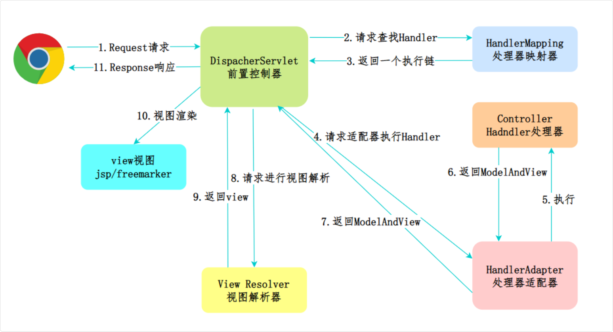
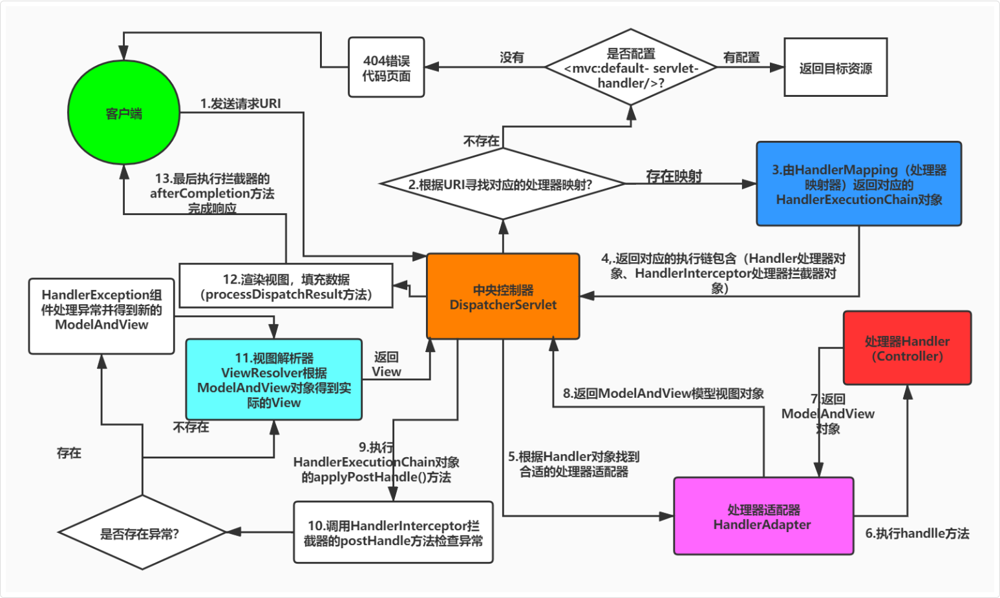

## MVC

Spring MVC 是 Spring 框架对 MVC 模式的具体实现，专门用于构建 Web 应用

```
MVC        →  一种设计思想（模式）
Spring MVC →  Spring 对这个思想的落地实现
```

### 核心组件

```
请求进来
   ↓
DispatcherServlet（前端控制器，所有请求的入口）
   ↓
HandlerMapping（找到对应的 Controller）
   ↓
Controller（处理请求，调用 Service）
   ↓
返回 ModelAndView / JSON
   ↓
响应给客户端
```

在 Spring Boot 项目中，`DispatcherServlet` 的启动是通过自动配置完成的

Spring Boot 会自动注册一个默认的 `DispatcherServlet`，并将其映射到 /

```java
@Bean
public ServletRegistrationBean<DispatcherServlet> dispatcherServletRegistration(DispatcherServlet dispatcherServlet) {
    ServletRegistrationBean<DispatcherServlet> registration = new ServletRegistrationBean<>(dispatcherServlet, "/"); // 默认映射路径为 "/"
    registration.setName("dispatcherServlet");
    return registration;
}
```

处理器映射 `HandlerMapping`，当一个请求进来时，前端控制器会询问处理器映射：“这个 URL 应该由哪个 Controller 的哪个方法来处理？”然后它就会根据 @RequestMapping、@GetMapping 这些注解来匹配请求

处理器 `Handler`，实际上就是我们写的 Controller 方法，这是真正处理业务逻辑的地方

处理器适配器 `HandlerAdapter`，负责调用该处理器的方法，并处理参数绑定、类型转换等

因为处理器可能有不同的类型，比如注解方式、实现接口方式等，处理器适配器就是为了统一调用方式

视图解析器 `ViewResolver`，处理完业务逻辑后，如果需要渲染视图，ViewResolver 会根据返回的视图名称解析实际的视图对象，比如 Thymeleaf

在前后端分离的项目中，这个组件更多用于返回 JSON 数据

异常处理器 `HandlerExceptionResolver`，捕获并处理请求处理过程中抛出的异常

通常，我们可以通过 `@ControllerAdvice` 和 `@ExceptionHandler` 来自定义异常处理逻辑，确保返回友好的错误响应

除此之外，还有文件上传解析器 `MultipartResolver`，用于处理文件上传请求；拦截器 `HandlerInterceptor`, 用于在请求处理前后执行一些额外的逻辑，比如权限校验、日志记录等

### Spring MVC 的工作流程

简单来说，Spring MVC 是一个基于 Servlet 的请求处理框架

核心流程可以概括为：请求接收 → 路由分发 → 控制器处理 → 视图解析





用户发起的 HTTP 请求，首先会被 `DispatcherServlet` 捕获，这是 Spring MVC 的“前端控制器”，负责拦截所有请求，起到统一入口的作用

`DispatcherServlet` 接收到请求后，会根据 URL、请求方法等信息，交给 `HandlerMapping` 进行路由匹配，查找对应的处理器，也就是 Controller 中的具体方法

找到对应 Controller 方法后，`DispatcherServlet` 会委托给处理器适配器 `HandlerAdapter` 进行调用

处理器适配器负责执行方法本身，并处理参数绑定、数据类型转换等

在注解驱动开发中，常用的是 `RequestMappingHandlerAdapter`

这一层会把请求参数自动注入到方法形参中，并调用 `Controller` 执行实际的业务逻辑

`Controller` 方法最终会返回结果，比如视图名称、`ModelAndView` 或直接返回 JSON 数据

当 `Controller` 方法返回视图名时，`DispatcherServlet` 会调用 `ViewResolver` 将其解析为实际的 View 对象，比如 Thymeleaf 页面

在前后端分离的接口项目中，这一步则**通常是返回 JSON 数据**

最后，由 View 对象完成渲染，或者将 JSON 结果直接通过 DispatcherServlet 返回给客户端

#### 速记

1. 用户发送请求至前端控制器 `DispatcherServlet`
2. `DispatcherServlet` 收到请求调用处理器映射器 `HandlerMapping`
3. 处理器映射器根据请求url找到具体的处理器，生成处理器执行链`HandlerExecutionChain` (包括处理器对象和处理器拦截器) 一并返回给`DispatcherServlet`
4. `DispatcherServlet`根据处理器`Handler`获取处理器适配器 `HandlerAdapter` 执行 `HandlerAdapter` 处理一系列的操作，如：参数封装，数据格式转换，数据验证等操作
5. 执行处理器 `Handler` (`Controller`，也叫页面控制器)。
6. `Handler` 执行完成返回 `ModelAndView`
7. `HandlerAdapter` 将 `Handler` 执行结果 `ModelAndView` 返回到`DispatcherServlet`
8. `DispatcherServlet` 将 `ModelAndView` 传给 `ViewReslover` 视图解析器
9. `ViewReslover` 解析后返回具体 `View`
10. `DispatcherServlet` 对 `View` 进行渲染视图（即将模型数据model填充至视图中）。
11. `DispatcherServlet` 响应用户

#### 为什么不直接调用，要通过 HandlerAdapte

因为 Controller 的写法不止一种，DispatcherServlet 不知道该怎么调用：

```java
// 写法1：最常见的注解方式
@RestController
public class UserController {
    @GetMapping("/user")
    public User getUser() { ... }
}

// 写法2：实现接口方式（老写法）
public class UserController implements Controller {
    public ModelAndView handleRequest(...) { ... }
}

// 写法3：实现 HttpRequestHandler
public class UserController implements HttpRequestHandler {
    public void handleRequest(...) { ... }
}
```

##### HandlerAdapter 的作用

相当于一个适配器/翻译官：

```
DispatcherServlet
      ↓ 我只会说："帮我调用这个 Controller"
HandlerAdapter
      ↓ 我来判断它是哪种类型，用对应的方式调用
Controller（不管是哪种写法，我都能处理）
```

每种 HandlerAdapter 认识一种 Controller：

```java
// RequestMappingHandlerAdapter 认识注解方式
// 它知道要用反射找 @GetMapping 的方法来调用
method.invoke(controller, args...);  // 反射调用 getUser()

// SimpleControllerHandlerAdapter 认识接口方式  
// 它知道直接调 handleRequest
controller.handleRequest(request, response);
```

DispatcherServlet 只需要说：

```java
// DispatcherServlet 只跟 HandlerAdapter 说话，不管 Controller 长什么样
handlerAdapter.handle(request, response, handler);  // 统一接口
```

> 就是不同 Controller 方法名、参数都不一样，Java 没法用同一行代码调用它们，HandlerAdapter 负责"认出"是哪种 Controller 再用对应的方式去调它

#### 如果混合有继承接口的，也有注解的呢

Spring 会注册多个 HandlerAdapter，按顺序逐个尝试，谁能处理谁上：

```java
// Spring 默认注册的适配器（有优先级顺序）
RequestMappingHandlerAdapter      // 处理注解方式 @Controller
SimpleControllerHandlerAdapter    // 处理实现 Controller 接口方式
HttpRequestHandlerAdapter         // 处理实现 HttpRequestHandler 接口方式
```

##### 处理流程

```
DispatcherServlet 拿到请求
        ↓
遍历所有 HandlerAdapter，挨个问：
        ↓
RequestMappingHandlerAdapter：    "这个我能处理吗？" 
  → 是注解 Controller？能 ✅ → 直接调用
  → 是接口 Controller？不能 ❌ → 下一个

SimpleControllerHandlerAdapter：  "这个我能处理吗？"
  → 实现了 Controller 接口？能 ✅ → 直接调用
```

##### 代码角度

每个 Adapter 都实现了 supports() 方法来判断自己能不能处理

```java
// RequestMappingHandlerAdapter
public boolean supports(Object handler) {
    return handler instanceof HandlerMethod;  // 注解方式才是 HandlerMethod
}

// SimpleControllerHandlerAdapter
public boolean supports(Object handler) {
    return handler instanceof Controller;  // 实现接口才是 Controller
}
```

DispatcherServlet 就是遍历调 supports()，谁返回 true 谁来处理
