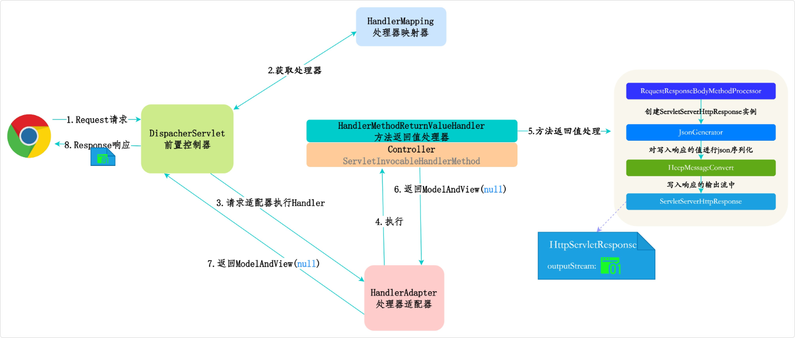

## MVC4

### RESTful

RESTful（Representational State Transfer，表现层状态转化）本身并不是一种标准、协议或技术，而是一种软件架构风

当一个 Web 服务（API）的设计符合 REST 架构风格时，我们就称它为 RESTful API

简单来说，RESTful 提倡用 URL 定位资源，用 HTTP 动词（GET, POST, PUT, DELETE 等）描述操作

#### 1. Resource（资源）

在 REST 理念中，网络上的所有事物都被抽象为“资源”。一个资源可以是一个实体（如用户、订单、文章），也可以是一个集合（如用户列表）。

- **非 RESTful 风格的 URL（动词驱动）：** 通常会在 URL 里写明动作，比如 `/getUser?id=1`、`/createUser`、`/deleteUser?id=1`。
- **RESTful 风格的 URL（名词驱动）：** URL 仅仅用来标识资源的位置，不包含动词。比如 `/users/1`、`/orders/123`。

#### 2. Representational（表现层）

资源在服务器端有一个具体的形态（比如数据库里的一条记录），但当它传输给客户端时，需要一种“表现形式”。
目前主流的 Web 开发中，这种表现形式通常是 **JSON**，早期也常用 XML。也就是说，客户端和服务器之间传递的是资源的 JSON 格式的数据。

#### 3. State Transfer（状态转化）

HTTP 协议本身是无状态的（Stateless），这意味着所有的状态都保存在服务器端。如果客户端想要操作服务器端的资源，就必须通过某种手段让资源发生“状态转化”（比如创建、修改、删除）。
这种转化是通过 **HTTP 动词** 来实现的。在实际的后端开发中（例如使用 Spring Boot），这恰好完美对应了各种请求映射注解：

- **GET（查询）：** 获取资源。
  - `GET /api/users` -> 获取所有用户列表
  - `GET /api/users/1` -> 获取 ID 为 1 的用户
- **POST（创建）：** 新建资源。
  - `POST /api/users` -> 创建一个新用户（数据放在请求体 Body 中）
- **PUT（全量更新）：** 更新资源的全部属性。
  - `PUT /api/users/1` -> 更新 ID 为 1 的用户的全部信息
- **PATCH（局部更新）：** 更新资源的部分属性。
  - `PATCH /api/users/1` -> 仅更新 ID 为 1 的用户的某个字段（如密码）
- **DELETE（删除）：** 删除资源。
  - `DELETE /api/users/1` -> 删除 ID 为 1 的用户

---

#### RESTful 风格在实际代码中的体现

如果你在编写控制器接口，RESTful 的设计会让代码语义变得极其清晰：

```Java
@RestController
@RequestMapping("/api/users")
public class UserController {

    // 获取特定用户
    @GetMapping("/{id}")
    public User getUser(@PathVariable Long id) {
        // ...
    }

    // 创建新用户
    @PostMapping
    public User createUser(@RequestBody User user) {
        // ...
    }

    // 删除用户
    @DeleteMapping("/{id}")
    public void deleteUser(@PathVariable Long id) {
        // ...
    }
}
```

在这个设计中，路径`/api/users`统一了资源入口，而具体执行什么业务逻辑，完全由 HTTP 请求的方法（GET/POST/DELETE）决定。

#### 总结

1. **语义清晰，见名知意：** 前端看到 `GET /articles/1` 就知道是查文章，看到 `DELETE /articles/1` 就知道是删文章，沟通成本极低。
2. **规范统一：** 避免了每个人起名风格不同带来的混乱（比如有人叫 `/add_user`，有人叫 `/createUser`，有人叫 `/insertUser`）。
3. **充分利用 HTTP 协议特性：** 结合 HTTP 状态码（如 200 成功，201 创建成功，404 资源不存在，500 服务器错误），可以非常优雅地进行错误处理和响应。

### Spring MVC Restful 风格的接口流程

在传统的 MVC 中，Controller 方法通常返回一个视图名称或者 ModelAndView 对象，然后由视图解析器 ViewResolver 解析并渲染成 HTML 页面

但在 RESTful 架构中，通常返回的是 JSON 或 XML，不再是一个完整的页面

其中很重要的两个注解：`@RestController` 相当于 `@Controller` 和 `@ResponseBody` 的结合

当在一个类上使用 `@RestController` 时，它会告诉 Spring 这个类中所有方法的返回值都应该被直接写入 HTTP 响应体中，而不再被解析为视图

`@ResponseBody` 可以用在方法级别，作用相同

它标志着该方法的返回值将作为响应体内容，Spring 会跳过视图解析的步骤。

`HttpMessageConverter` 是实现 RESTful 风格的关键

当 Spring 检测到 `@ResponseBody` 注解时，它会使用 `HttpMessageConverter` 来将 `Controller` 方法返回的 Java 对象序列化成指定的格式，如 JSON

默认情况下，如果类路径下有 Jackson 库，Spring Boot 会自动配置 `MappingJackson2HttpMessageConverter` 来处理 JSON 的转换

相应的，对于带有 `@RequestBody` 注解的方法参数，它也会用这个转换器将请求体中的 JSON 数据反序列化成 Java 对象。

所以，RESTful 接口的流程可以概括为：请求到达前端控制器 DispatcherServlet → 通过 HandlerMapping 找到对应的 Controller 方法 → 执行方法并返回数据 → 使用 HttpMessageConverter 将数据转换为 JSON 或 XML 格式 → 直接写入 HTTP 响应体。



总结来说，RESTful 接口的流程通过 `@RestController` 和 `HttpMessageConverter` “抄了近道”，省略了 ViewResolver 和 View 的渲染过程，直接将数据转换为指定的格式返回，非常适合前后端分离的应用场景。
