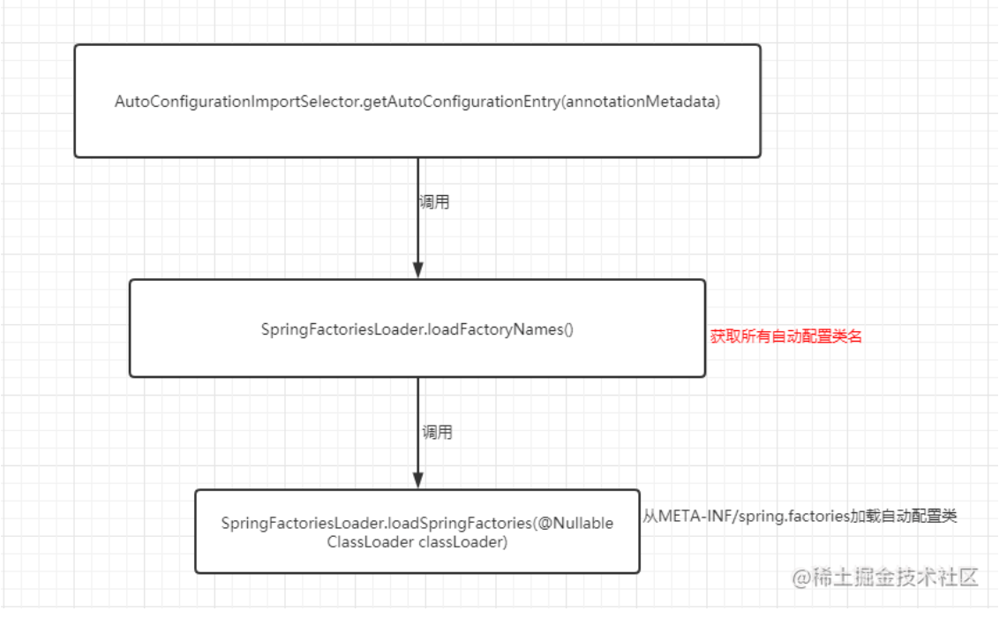

## SpringBoot

Spring Boot 可以说是 Spring 生态的一个重大突破，它极大地简化了 Spring 应用的开发和部署过程

以前我们用 Spring 开发项目的时候，需要配置一大堆 XML 文件，包括 Bean 的定义、数据源配置、事务配置等等，非常繁琐

而且还要手动管理各种 jar 包的依赖关系，很容易出现版本冲突的问题, 部署的时候还要单独搭建 Tomcat 服务器，整个过程很复杂

Spring Boot 就是为了解决这些痛点而生的

> “约定大于配置”是 Spring Boot 最核心的理念

它预设了很多默认配置，比如默认使用内嵌的 Tomcat 服务器，默认的日志框架是 Logback 等等。这样，我们开发者就只需要关注业务逻辑，不用再纠结于各种配置细节

> 自动装配也是 Spring Boot 的一大特色

它会根据项目中引入的依赖自动配置合适的 Bean

比如说，我们引入了 Spring Data JPA，Spring Boot 就会自动配置数据源；比如说，我们引入了 Spring Security，Spring Boot 就会自动配置安全相关的 Bean。

Spring Boot 还提供了很多开箱即用的功能，比如 Actuator 监控、DevTools 开发工具、Spring Boot Starter 等等。Actuator 可以让我们轻松监控应用的健康状态、性能指标等；DevTools 可以加快开发效率，比如自动重启、热部署等；Spring Boot Starter 则是一些预配置好的依赖集合，让我们可以快速引入某些常用的功能

优点：

- 简化开发
- 快速启动
- 自动化配置

### 常用注解

- `@SpringBootApplication`：这是 Spring Boot 的核心注解，它是一个组合注解，包含了 `@Configuration`、`@EnableAutoConfiguration` 和 `@ComponentScan`。它标志着一个 Spring Boot 应用的入口
- `@SpringBootTest`：用于测试 Spring Boot 应用的注解，它会加载整个 Spring 上下文，适合集成测试

### 自动装配

在 Spring Boot 中，开启自动装配的注解是`@EnableAutoConfiguration`

这个注解会告诉 Spring 去扫描所有可用的自动配置类

Spring Boot 为了进一步简化，把这个注解包含到了 `@SpringBootApplication` 注解中

也就是说，当我们在主类上使用 `@SpringBootApplication` 注解时，实际上就已经开启了自动装配

#### 理解

SpringBoot 定义了一套接口规范，这套规范规定：

SpringBoot 在启动时会扫描外部引用 jar 包中的 `META-INF/spring.factories` 文件，将文件中配置的类型信息加载到 Spring 容器（此处涉及到 JVM 类加载机制与 Spring 的容器知识），并执行类中定义的各种操作

对于外部 jar 来说，只需要按照 SpringBoot 定义的标准，就能将自己的功能装置进 SpringBoot

通俗来讲，自动装配就是通过注解或一些简单的配置就可以在 SpringBoot 的帮助下开启和配置各种功能，比如数据库访问、Web 开发

#### 原理

首先点进 `@SpringBootApplication` 注解的内部

```java
@Target({ElementType.TYPE})
@Retention(RetentionPolicy.RUNTIME)
@Documented
@Inherited
@SpringBootConfiguration
@EnableAutoConfiguration
@ComponentScan(
    excludeFilters = {@Filter(
    type = FilterType.CUSTOM,
    classes = {TypeExcludeFilter.class}
), @Filter(
    type = FilterType.CUSTOM,
    classes = {AutoConfigurationExcludeFilter.class}
)}
)
public @interface SpringBootApplication {
  ..
}
```

- `@Target({ElementType.TYPE})`: 该注解指定了这个注解可以用来标记在类上。在这个特定的例子中，这表示该注解用于标记配置类。
- `@Retention(RetentionPolicy.RUNTIME)`: 这个注解指定了注解的生命周期，即在运行时保留。这是因为 Spring Boot 在运行时扫描类路径上的注解来实现自动配置，所以这里使用了 RUNTIME 保留策略。
- `@Documented`: 该注解表示这个注解应该被包含在 Java 文档中。它是用于生成文档的标记，使开发者能够看到这个注解的相关信息。
- `@Inherited`: 这个注解指示一个被标注的类型是被继承的。在这个例子中，它表明这个注解可以被继承，如果一个类继承了带有这个注解的类，它也会继承这个注解。
- `@SpringBootConfiguration`: 这个注解表明这是一个 Spring Boot 配置类。如果点进这个注解内部会发现与标准的 `@Configuration` 没啥区别，只是为了表明这是一个专门用于 SpringBoot 的配置。
- `@EnableAutoConfiguration`: 这个注解是 Spring Boot 自动装配的核心。它告诉 Spring oot 启用自动配置机制，根据项目的依赖和配置自动配置应用程序的上下文。通过这个注解，SpringBoot 将尝试根据类路径上的依赖自动配置应用程序。
- `@ComponentScan`: 这个注解用于配置组件扫描的规则。在这里，它告诉 SpringBoot 在指定的包及其子包中查找组件，这些组件包括被注解的类、@Component 注解的类等。其中的 excludeFilters 参数用于指定排除哪些组件，这里使用了两个自定义的过滤器，分别是 TypeExcludeFilter 和 AutoConfigurationExcludeFilte

> SpringBoot 利用 @ComponentScan 扫描当前项目（主类所在包及其子包）中标注了 @Component、@Service、@Controller 等注解的类，将其注册为 Bean
>
> 利用 @EnableAutoConfiguration 触发自动装配：借助 SpringFactoriesLoader 读取 classpath 各依赖 jar 包中 META-INF/spring.factories
>
> Spring Boot 3.x 后改为 META-INF/spring/org.springframework.boot.autoconfigure.AutoConfiguration.imports）里预定义的自动配置类
>
> 再配合 @Conditional 系列注解按条件将 Bean 注册到容器

| | `@ComponentScan` | `@EnableAutoConfiguration` |
| --- | --- | --- |
| 扫描对象 | 你自己写的类 | 第三方预定义的配置类 |
| 发现机制 | 包路径扫描 | `spring.factories` / `.imports` 文件 |
| 注册条件 | 有对应注解即注册 | `@ConditionalOnClass` 等条件满足才注册 |

##### `@EnableAutoConfiguration`

这个注解是实现自动装配的核心注解

```java
@Target({ElementType.TYPE})
@Retention(RetentionPolicy.RUNTIME)
@Documented
@Inherited
@AutoConfigurationPackage
@Import({AutoConfigurationImportSelector.class})
public @interface EnableAutoConfiguration {
    String ENABLED_OVERRIDE_PROPERTY = "spring.boot.enableautoconfiguration";

    Class<?>[] exclude() default {};

    String[] excludeName() default {};
}
```

- `@AutoConfigurationPackage`，将项目src中main包下的所有组件注册到容器中，例如标注了`Component`注解的类等
- `@Import({AutoConfigurationImportSelector.class})`，是自动装配的核心，接下来分析一下这个注解

`AutoConfigurationImportSelector` 是 Spring Boot 中一个重要的类，它实现了 `ImportSelector` 接口，用于实现自动配置的选择和导入

具体来说，它通过分析项目的类路径和条件来决定应该导入哪些自动配置类

Spring 容器启动时会调用它的 `selectImports()` 方法，该方法会：

1. **扫描** `META-INF/spring.factories`（Spring Boot 2.x）或 `META-INF/spring/org.springframework.boot.autoconfigure.AutoConfiguration.imports`（3.x）中列出的所有自动配置类的全限定名。
2. **过滤** — 根据 `@ConditionalOnClass`、`@ConditionalOnBean`、`@ConditionalOnProperty` 等条件注解，排除不满足条件的配置类。
3. **注册** — 把筛选后的配置类作为 Bean 定义导入到 Spring 容器中

```
@SpringBootApplication
  └─ @EnableAutoConfiguration
       └─ @Import(AutoConfigurationImportSelector.class)
            └─ selectImports()
                 ├─ 读取 spring.factories
                 ├─ 去重 & 排除
                 ├─ 条件过滤（@Conditional*）
                 └─ 返回要加载的配置类列表
```

##### 分析

`AutoConfigurationImportSelector` 类实现了 `ImportSelector` 接口，也就实现了这个接口中的 `selectImports` 方法，该方法主要用于获取所有符合条件的类的全限定类名，这些类需要被加载到 IoC 容器中

```java
private static final String[] NO_IMPORTS = new String[0];

public String[] selectImports(AnnotationMetadata annotationMetadata) {
    // <1>.判断自动装配开关是否打开
    if (!this.isEnabled(annotationMetadata)) {
        return NO_IMPORTS;
    } else {
        //<2>.获取所有需要装配的bean
        AutoConfigurationMetadata autoConfigurationMetadata = AutoConfigurationMetadataLoader.loadMetadata(this.beanClassLoader);
        // 关键
        AutoConfigurationImportSelector.AutoConfigurationEntry autoConfigurationEntry = this.getAutoConfigurationEntry(autoConfigurationMetadata, annotationMetadata);
        return StringUtils.toStringArray(autoConfigurationEntry.getConfigurations());
    }
}
```

重点关注一下 `getAutoConfigurationEntry()` 方法，这个方法主要负责加载自动配置类的



结合 `getAutoConfigurationEntry()` 的源码来详细分析一下：

```java
private static final AutoConfigurationEntry EMPTY_ENTRY = new AutoConfigurationEntry();

protected AutoConfigurationEntry getAutoConfigurationEntry(AnnotationMetadata annotationMetadata) {
    //<1>.
    if (!this.isEnabled(annotationMetadata)) {
        return EMPTY_ENTRY;
    } else {
        //<2>.
        AnnotationAttributes attributes = this.getAttributes(annotationMetadata);
        //<3>.
        List<String> configurations = this.getCandidateConfigurations(annotationMetadata, attributes);
        //<4>.
        configurations = this.<String>removeDuplicates(configurations);
        Set<String> exclusions = this.getExclusions(annotationMetadata, attributes);
        this.checkExcludedClasses(configurations, exclusions);
        configurations.removeAll(exclusions);
        configurations = this.getConfigurationClassFilter().filter(configurations);
        this.fireAutoConfigurationImportEvents(configurations, exclusions);
        return new AutoConfigurationEntry(configurations, exclusions);
    }
}
```

> 第一步

判断自动装配开关是否打开。默认 spring.boot.enableautoconfiguration=true，可在 application.properties 或 application.yml 中设置

> 第二步

用于获取 `EnableAutoConfiguration` 注解中的 exclude 和 excludeName

> 第三步

获取需要自动装配的所有配置类，读取 `META-INF/spring/org.springframework.boot.autoconfigure.AutoConfiguration.imports`

```java
protected List<String> getCandidateConfigurations(AnnotationMetadata metadata, @Nullable AnnotationAttributes attributes) {
    ImportCandidates importCandidates = ImportCandidates.load(this.autoConfigurationAnnotation, this.getBeanClassLoader());
    List<String> configurations = importCandidates.getCandidates();
    Assert.state(!CollectionUtils.isEmpty(configurations), "No auto configuration classes found in META-INF/spring/" + this.autoConfigurationAnnotation.getName() + ".imports. If you are using a custom packaging, make sure that file is correct.");
    return configurations;
}
```

`XXXAutoConfiguration` 的作用就是按需加载组件

不光是这个依赖下的 `META-INF/spring/org.springframework.boot.autoconfigure.AutoConfiguration.imports` 被读取到，所有 Spring Boot Starter 下的该文件都会被读取到

> 第 4 步

经历了一遍筛选，@ConditionalOnXXX 中的所有条件都满足，该类才会生效

```java
@Configuration
// 检查相关的类：RabbitTemplate 和 Channel是否存在
// 存在才会加载
@ConditionalOnClass({ RabbitTemplate.class, Channel.class })
@EnableConfigurationProperties(RabbitProperties.class)
@Import(RabbitAnnotationDrivenConfiguration.class)
public class RabbitAutoConfiguration {
}
```

##### 为什么可以跨越项目的界限，把所有 Starter（不管是谁写的 Jar 包）下的这个文件全都读取到

> 通过 类加载器，调用 `getResources(path)` 来找所有存在 `META-INF/spring/...imports` 这个文件，它就会把这个文件的绝对路径（URL）收集起来

巧妙地利用了 Java 底层自带的类加载器（ClassLoader）机制

> 所有的 Jar 包都在同一个“大池子”里 (Classpath)

当你的 Spring Boot 应用启动时（不管是在 IDEA 里运行，还是打成一个庞大的 fat-jar 运行），你通过 Maven 引入的所有 Starter（比如 `spring-boot-starter-web`、`mybatis-spring-boot-starter`），在 JVM 眼里都已经没有了原本的项目界限

它们所有的目录结构，都被合并展平到了一个叫做 **Classpath（类路径）** 的大池子里

> `getResources` 的全盘扫描

```java
protected List<String> getCandidateConfigurations(AnnotationMetadata metadata, @Nullable AnnotationAttributes attributes) {
    // 去classpath找所有的 
    ImportCandidates importCandidates = ImportCandidates.load(this.autoConfigurationAnnotation, this.getBeanClassLoader());
    List<String> configurations = importCandidates.getCandidates();
    Assert.state(!CollectionUtils.isEmpty(configurations), "No auto configuration classes found in META-INF/spring/" + this.autoConfigurationAnnotation.getName() + ".imports. If you are using a custom packaging, make sure that file is correct.");
    return configurations;
}
```

源码里的 `ImportCandidates.load(...)` 方法，继续往深处看，你会发现它最终调用了 Java 标准库的这个方法：

```java
// ImportCandidates.java
public static ImportCandidates load(Class<?> annotation, @Nullable ClassLoader classLoader) {
    Assert.notNull(annotation, "'annotation' must not be null");
    ClassLoader classLoaderToUse = decideClassloader(classLoader);
    String location = String.format("META-INF/spring/%s.imports", annotation.getName());
    Enumeration<URL> urls = findUrlsInClasspath(classLoaderToUse, location);
    List<String> importCandidates = new ArrayList();

    while(urls.hasMoreElements()) {
        URL url = (URL)urls.nextElement();
        importCandidates.addAll(readCandidateConfigurations(url));
    }

    return new ImportCandidates(importCandidates);
}

private static Enumeration<URL> findUrlsInClasspath(ClassLoader classLoader, String location) {
    try {
        return classLoader.getResources(location);
    } catch (IOException ex) {
        throw new IllegalArgumentException("Failed to load configurations from location [" + location + "]", ex);
    }
}
```

这里调用的方法名是复数的 **`getResources`**（带有 `s`），而不是单数的 `getResource`。

- **`getResource(path)`**：它很懒，在 Classpath 里只要找到**第一个**符合路径的文件，就直接返回并结束。
- **`getResources(path)`**：它非常勤奋。它会遍历 Classpath 里的**每一个 Jar 包**。只要这个 Jar 包里存在 `META-INF/spring/...imports` 这个文件，它就会把这个文件的绝对路径（URL）收集起来。

> 汇总成大名单

经过 `getResources` 的地毯式搜索，Java 会返回一个包含了许多 URL 的集合。比如：

- `jar:file:/E:/.../spring-boot-autoconfigure-4.0.5.jar!/META-INF/spring/...imports`
- `jar:file:/E:/.../mybatis-spring-boot-autoconfigure-3.0.3.jar!/META-INF/spring/...imports`
- `jar:file:/E:/.../druid-spring-boot-starter-1.2.20.jar!/META-INF/spring/...imports`

接着，Spring 会写一个 `while` 循环，挨个打开这些 URL 对应的文件，把里面写着的类名（比如 `RedisAutoConfiguration`、`JdbcTemplateAutoConfiguration`）一行一行地读取出来，最终合并成你源码里的那个 `List<String> configurations` 集合

##### 根绝 `spring.factories / .imports` 文件自动加载 Bean

```
你加了依赖 mybatis-spring-boot-starter
        ↓
这个 jar 里有：
META-INF/spring/...AutoConfiguration.imports

内容：
org.mybatis.spring.boot.autoconfigure.MybatisAutoConfiguration
        ↓
SpringFactoriesLoader 读出这个字符串
        ↓
反射加载这个类
        ↓
@Conditional 条件满足 → 注册进容器
```

##### 为什么都叫 XxxAutoConfiguration

这是 Spring Boot 官方的命名规范，第三方库为了融入生态都遵守这个约定：

名字里带 AutoConfiguration → 一眼看出这是自动配置类

Spring Boot 官方文档明确要求自动配置类必须放在独立包里，类名以 AutoConfiguration 结尾

但技术上你写进 .imports 文件的类叫 MyPotato 也能生效，只是没人这么做

```java
@AutoConfiguration                        // 标记这是自动配置类
@ConditionalOnClass(SqlSessionFactory.class)  // classpath 有这个类才生效
@EnableConfigurationProperties(MybatisProperties.class)
public class MybatisAutoConfiguration {

    @Bean
    @ConditionalOnMissingBean             // 用户没自己定义才注册
    public SqlSessionFactory sqlSessionFactory(...) {
        // 帮你创建好 Bean
    }
}
```

### 总结

#### 一、SpringBoot 解决了什么问题

传统 Spring 需要大量 XML 配置、手动管理 jar 依赖、手动搭建 Tomcat，SpringBoot 以 **"约定大于配置"** 的理念解决了这些痛点。

---

#### 二、核心入口：`@SpringBootApplication`

是个组合注解，关键的三个：

| 注解 | 作用 |
| --- | --- |
| `@SpringBootConfiguration` | 标记为配置类（本质是 `@Configuration`） |
| `@ComponentScan` | 扫描当前项目包下有注解的类注册为 Bean |
| `@EnableAutoConfiguration` | 触发自动装配核心逻辑 |

---

#### 三、自动装配核心链路

```
@EnableAutoConfiguration
  └─ @Import(AutoConfigurationImportSelector.class)
       └─ selectImports()
            └─ getAutoConfigurationEntry()
                 ├─ 1. 判断自动装配开关是否打开
                 ├─ 2. 获取 exclude / excludeName
                 ├─ 3. getCandidateConfigurations() → 读取 .imports 文件，收集所有候选配置类
                 ├─ 4. 去重
                 ├─ 5. 移除 exclusions
                 ├─ 6. getConfigurationClassFilter().filter() → 条件过滤
                 └─ 7. 返回最终配置类列表注册进容器`
```

---

#### 四、为什么能跨 Jar 读取

- 所有 jar 在启动时被展平进同一个 **Classpath 大池子**
- `ClassLoader.getResources(path)` 是**复数**，会遍历所有 jar，把每个 jar 里的 `.imports` 文件 URL 全部收集回来
- 挨个读取文件内的类名，合并成候选列表

---

#### 五、为什么都叫 `XxxAutoConfiguration`

纯粹是 **Spring Boot 命名约定**，开发者手动起名并登记进 `.imports` 文件，框架只是照单全收，类名本身对框架无特殊意义。

---

#### 六、条件装配 `@ConditionalOnXXX`

候选类不一定全部生效，需要满足条件（classpath 有某个类、容器没有某个 Bean 等）才最终注册，这也是自动装配"按需加载"的关键。
