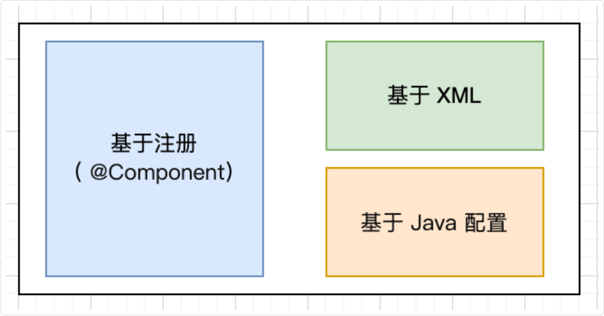
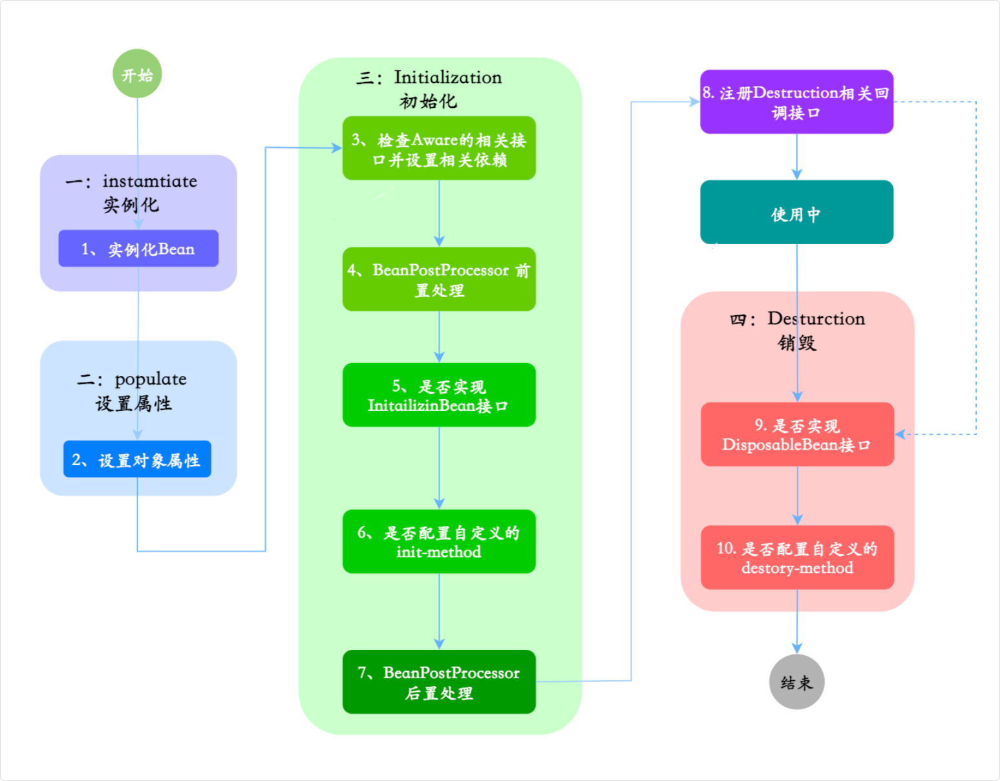
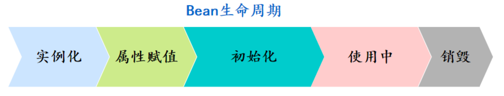
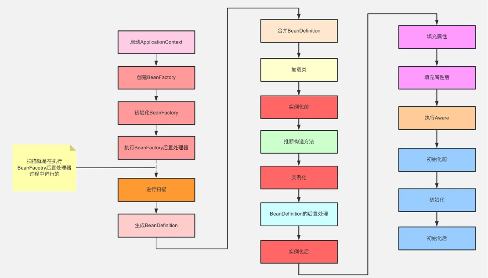

## Spring基础

### Bean

Bean 本质上就是由 Spring 容器管理的 Java 对象，但它和普通的 Java 对象有很大区别

普通的 Java 对象我们是通过 new 关键字创建的

而 Bean 是交给 Spring 容器来管理的，从创建到销毁都由容器负责。

从实际使用的角度来说，我们项目里的 Service、Dao、Controller 这些都是 Bean

比如 `UserService` 被标注了 `@Service` 注解，它就成了一个 Bean，Spring 会自动创建它的实例，管理它的依赖关系，当其他地方需要用到 `UserService` 的时候，Spring 就会把这个实例注入进去

这种依赖注入的方式让对象之间的关系变得松耦合

Spring 提供了多种 Bean 的配置方式，基于注解的方式是最常用的



#### @Component 和 @Bean 区别

首先从使用上来说，`@Component` 是标注在类上的，而 `@Bean` 是标注在方法上的

`@Component` 告诉 Spring 这个类是一个组件，请把它注册为 Bean，而 `@Bean` 则告诉 Spring 请将这个方法返回的对象注册为 Bean

```java
@Component  // Spring自动创建UserService实例
public class UserService {
  @Autowired
  private UserDao userDao;
}

@Configuration
public class AppConfig {
  @Bean  // 我们手动创建DataSource实例
  public DataSource dataSource() {
      HikariDataSource ds = new HikariDataSource();
      ds.setJdbcUrl("jdbc:mysql://localhost:3306/test");
      ds.setUsername("root");
      ds.setPassword("123456");
      return ds;  // 返回给Spring管理
  }
}
```

从控制权的角度来说，`@Component` 是由 Spring 自动创建和管理的

而 `@Bean` 则是由我们手动创建的，然后再交给 Spring 管理，我们对对象的创建过程有完全的控制权

> 因为 `@Bean` 是作用在方法上的，Spring 只是管理这个方法最终 return 的对象

#### Bean 生命周期



Bean 的生命周期可以分为 5 个主要阶段

实例化 -> 设置属性 -> 初始化 -> 使用中 -> 销毁



> 第一个阶段是实例化

Spring 容器会根据 `BeanDefinition`，通过反射调用 Bean 的构造方法创建对象实例

如果有多个构造方法，Spring 会根据依赖注入的规则选择合适的构造方法

> 第二阶段是属性赋值

这个阶段 Spring 会给 Bean 的属性赋值，包括通过 `@Autowired`、`@Resource` 这些注解注入的依赖对象，以及通过 `@Value` 注入的配置值

> 第三阶段是初始化

这个阶段会依次执行：

- `@PostConstruct` 标注的方法
- `InitializingBean` 接口的 `afterPropertiesSet` 方法
- 通过 `@Bean` 的 `initMethod` 指定的初始化方法

初始化后，Spring 还会调用所有注册的 BeanPostProcessor 后置处理方法。这个阶段经常用来创建代理对象，比如 AOP 代理

> 第四阶段是使用 Bean

比如我们的 Controller 调用 Service，Service 调用 DAO

> 最后是销毁阶段。

当容器关闭或者 Bean 被移除的时候，会依次执行：

- `@PreDestroy` 标注的方法
- `DisposableBean` 接口的 `destroy` 方法
- 通过 `@Bean` 的 `destroyMethod` 指定的销毁方法



#### Aware 类型的接口

Aware 接口在 Spring 中是一个很有意思的设计，它们的作用是让 Bean 能够感知到 Spring 容器的一些内部组件

从设计理念来说，Aware 接口实现了一种“回调”机制。正常情况下，Bean 不应该直接依赖 Spring 容器，这样可以保持代码的独立性。但有些时候，Bean 确实需要获取容器的一些信息或者组件，Aware 接口就提供了这样一个能力

我最常用的 Aware 接口是 ApplicationContextAware，它可以让 Bean 获取到 ApplicationContext 容器本身

```java
@Component
public class SpringUtil implements ApplicationContextAware, EnvironmentAware, ApplicationListener<ContextClosedEvent> {
  private volatile static ApplicationContext context;
  private volatile static Environment environment;

  private static Binder binder;

  @Override
  public void setApplicationContext(ApplicationContext applicationContext) throws BeansException {
      // 容器启动时自动注入，方便后续获取bean
      SpringUtil.context = applicationContext;
  }

  @Override
  public void setEnvironment(Environment environment) {
      SpringUtil.environment = environment;
      binder = Binder.get(environment);
  }

  @Override
  public void onApplicationEvent(ContextClosedEvent event) {
      if (context == event.getApplicationContext()) {
          context = null;
          environment = null;
          binder = null;
      }
  }

  /**
   * 获取ApplicationContext
   *
   * @return
   */
  public static ApplicationContext getContext() {
      return context;
  }

  /**
   * 获取bean
   *
   * @param bean
   * @param <T>
   * @return
   */
  public static boolean isActive() {
      return context instanceof ConfigurableApplicationContext
              ? ((ConfigurableApplicationContext) context).isActive()
              : context != null;
  }

  ...
}
```

#### init-method 和 destroy-method

init-method 指定的初始化方法会在 Bean 的初始化阶段被调用，具体的执行顺序是：

- 先执行 @PostConstruct 标注的方法
- 然后执行 InitializingBean 接口的 afterPropertiesSet() 方法
- 最后再执行 init-method 指定的方法

也就是说，init-method 是在所有其他初始化方法之后执行的

```java
@Component
public class MyService {
  @Autowired
  private UserDao userDao;
  
  @PostConstruct
  public void postConstruct() {
      System.out.println("1. @PostConstruct执行");
  }
  
  public void customInit() {  // 通过@Bean的initMethod指定
      System.out.println("3. init-method执行");
  }
}

@Configuration
public class AppConfig {
  @Bean(initMethod = "customInit")
  public MyService myService() {
      return new MyService();
  }
}
```

destroy-method 会在 Bean 销毁阶段被调用。

```java
@Component
public class MyService {
  @PreDestroy
  public void preDestroy() {
    System.out.println("1. @PreDestroy执行");
  }
  
  public void customDestroy() {  // 通过@Bean的destroyMethod指定
    System.out.println("3. destroy-method执行");
  }
}
```

不过在实际开发中，通常用 @PostConstruct 和 @PreDestroy 就够了，它们更简洁
