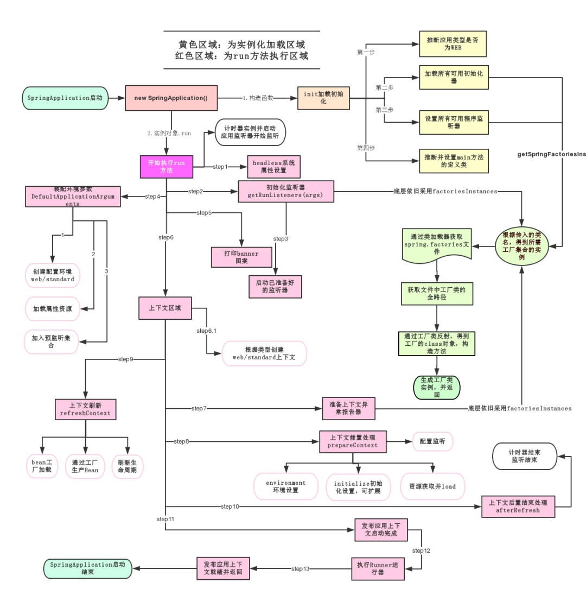
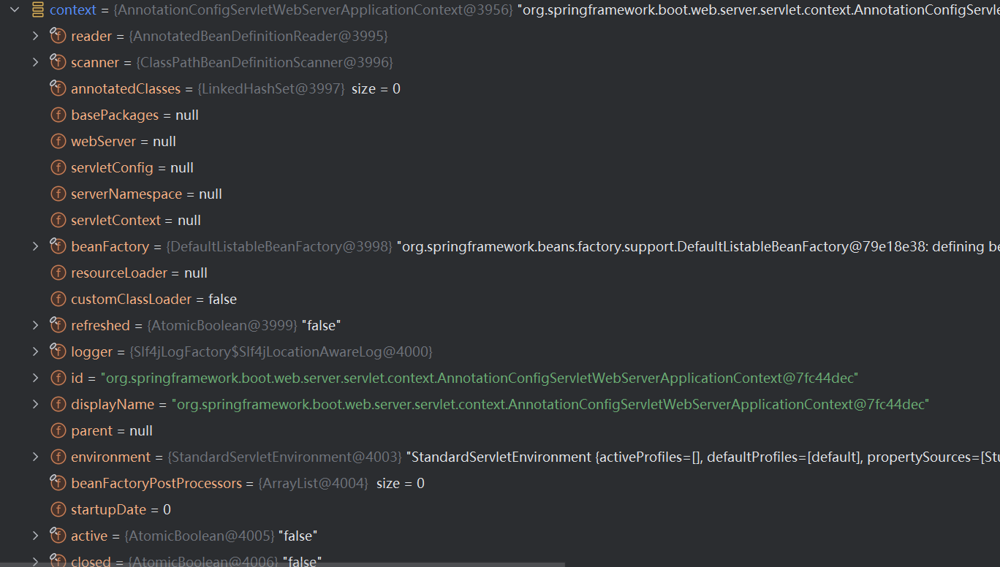
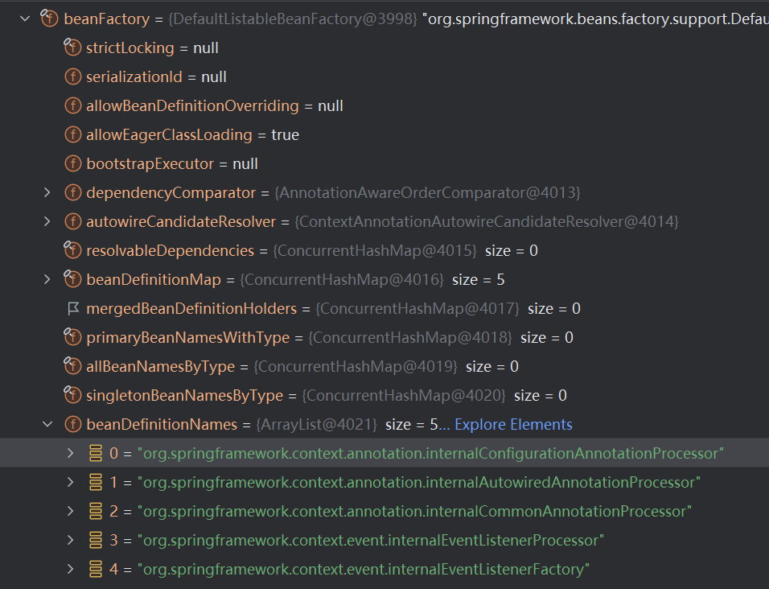
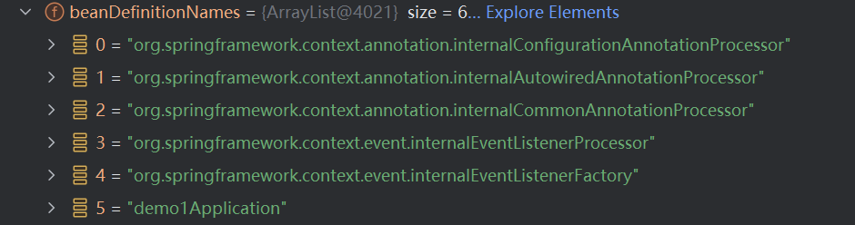
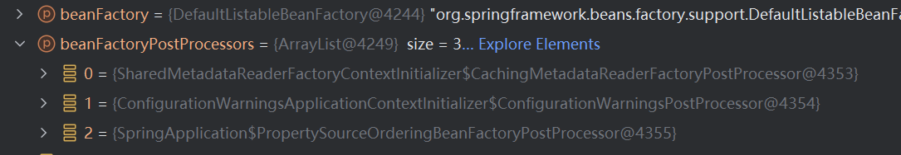

## SpringBoot



- 创建 SpringApplication 实例，并识别应用类型，比如说是标准的 Servlet Web 还是响应式的 WebFlux，然后准备监听器和初始化监听容器。
- 创建并准备 ApplicationContext，将主类作为配置源进行加载。
- 刷新 Spring 上下文，触发 Bean 的实例化，比如说扫描并注册 @ComponentScan 指定路径下的 Bean
- 触发自动配置，在 Spring Boot 2.7 及之前是通过 spring.factories 加载的，3.x 是通过读取 AutoConfiguration.imports，并结合 @ConditionalOn 系列注解依据条件注册 Bean
- 如果引入了 Web 相关依赖，会创建并启动 Tomcat 容器，完成 HTTP 端口监听

### Spring Boot 启动流程

可以把 Spring Boot 容器比作一个汽车制造厂：

- **BeanDefinition (Bean 定义)**：汽车的设计图纸。
- **BeanFactoryPostProcessor**：审阅和修改图纸的工程师（在真正造车之前，他们可以修改图纸，或者画新的图纸）。
- **Bean (实例)**：造出来的真正汽车

#### 源码分析

从启动类出发

```java
@SpringBootApplication
public class Demo1Application {
    public static void main(String[] args) {
        SpringApplication.run(Demo1Application.class, args);
    }
}
```

##### 编译阶段

```
src/main/java/
  ├── Demo1Application.java
  ├── controller/
  │    └── UserController.java
  ├── service/
  │    └── UserService.java
  └── entity/
       └── User.java

         ↓ mvn compile / 点击运行时 IDE 自动编译

target/classes/
  ├── Demo1Application.class
  ├── controller/
  │    └── UserController.class
  ├── service/
  │    └── UserService.class
  └── entity/
       └── User.class
```

所有 .java 文件都会被编译成对应的 .class 文件，注解也都带着

> 但 Spring 运行时是从入口类出发，通过 @ComponentScan 按需扫描加载，不是一股脑全读进来

```
src/ 下所有 .java  →  javac 编译  →  target/classes/ 下所有 .class
  - 普通注解（@Controller 等）：存入 .class 元数据
  - Lombok 注解（@Data 等）：APT 直接生成代码到 .class
  - 第三方包：检查类存不存在，仅此而已
```

##### `SpringApplication` 实例

JVM 启动，进入 main 方法

`primarySource`: 传入的启动类的 Class 对象

- 以这个类所在的包为根包，进行组件扫描
- 读取这个类上的注解 —— @SpringBootApplication、@EnableAutoConfiguration 等都标在它上面
- 作为第一张图纸 —— 它本身会被注册为一个配置类（@Configuration），是整个容器解析的起点

```java
public static ConfigurableApplicationContext run(Class<?> primarySource, String... args) {
    return run(new Class[]{primarySource}, args);
}

public static ConfigurableApplicationContext run(Class<?>[] primarySources, String[] args) {
    return (new SpringApplication(primarySources)).run(args);
}
```

最终以 入口类 `primarySource` 创建了 `SpringApplication` 实例，并执行了 run 方法

```java
public SpringApplication(Class<?>... primarySources) {
    this((ResourceLoader)null, primarySources);
}

public SpringApplication(@Nullable ResourceLoader resourceLoader, Class<?>... primarySources) {
    this.addCommandLineProperties = true;
    this.addConversionService = true;
    this.headless = true;
    this.initializers = new ArrayList();
    this.listeners = new ArrayList();
    this.additionalProfiles = Collections.emptySet();
    this.applicationContextFactory = ApplicationContextFactory.DEFAULT;
    this.applicationStartup = ApplicationStartup.DEFAULT;
    this.properties = new ApplicationProperties();
    this.resourceLoader = resourceLoader;
    Assert.notNull(primarySources, "'primarySources' must not be null");
    this.primarySources = new LinkedHashSet(Arrays.asList(primarySources));
    this.properties.setWebApplicationType(WebApplicationType.deduce());
    this.bootstrapRegistryInitializers = new ArrayList(this.getSpringFactoriesInstances(BootstrapRegistryInitializer.class));
    this.setInitializers(this.getSpringFactoriesInstances(ApplicationContextInitializer.class));
    this.setListeners(this.getSpringFactoriesInstances(ApplicationListener.class));
    this.mainApplicationClass = this.deduceMainApplicationClass();
}
```

后面在 `run()` 里创建容器时，Spring Boot 会根据应用类型自动创建对应的 `ResourceLoader`

> `this.applicationContextFactory = ApplicationContextFactory.DEFAULT;` 构建 applicationContext 的工厂

采用的是 `ApplicationContextFactory.DEFAULT`

即

```java
public interface ApplicationContextFactory {
    ApplicationContextFactory DEFAULT = new DefaultApplicationContextFactory();
    ...
}
```

> `WebApplicationType.deduce()` 自动推断应用类型

```java
this.properties.setWebApplicationType(WebApplicationType.deduce());`
```

Spring Boot 会根据 classpath 里有没有某些类，自动判断你是什么类型的应用

```
有 DispatcherServlet → SERVLET（普通 Web 应用）
有 DispatcherHandler → REACTIVE（响应式 Web 应用）
都没有             → NONE（纯后台应用，不启动 Tomcat）
```

这决定了后面创建的是哪种 ApplicationContext

> `deduceMainApplicationClass()` 通过堆栈推断主类

`this.mainApplicationClass = this.deduceMainApplicationClass();`

没有直接用 `primarySource`，而是通过**分析当前调用堆栈**，找到哪个类有 `main` 方法，用于后续打印日志：

```java
// 伪代码：
StackTraceElement[] stack = new RuntimeException().getStackTrace();
for (StackTraceElement element : stack) {
    if ("main".equals(element.getMethodName())) {
        return Class.forName(element.getClassName());  // 找到了
    }
}
```

##### 启动 `run`

最终是在 `SpringApplication` 类的 `run` 函数

```java
public ConfigurableApplicationContext run(String... args) {
  // 记录启动时间（用于最后算启动耗时）
  // 还会看有没有 CoRC 快照
  Startup startup = SpringApplication.Startup.create();

  // 注册 JVM 关闭钩子，确保应用关闭时能优雅释放资源（关闭数据库连接池等）
  if (this.properties.isRegisterShutdownHook()) {
      shutdownHook.enableShutdownHookAddition();
  }

  // 创建引导上下文（给 Bootstrapper 扩展用，一般用不到）
  DefaultBootstrapContext bootstrapContext = this.createBootstrapContext();

  // 注册了上下文
  ConfigurableApplicationContext context = null;

  // 设置 headless 模式（服务器环境没有显示器，告诉 JVM 不需要图形界面）
  this.configureHeadlessProperty();

  // 获取所有 SpringApplicationRunListener，准备广播启动事件
  SpringApplicationRunListeners listeners = this.getRunListeners(args);
  listeners.starting(bootstrapContext, this.mainApplicationClass);

  try {
      // 包装命令行参数（就是 main 方法的 args）
      ApplicationArguments applicationArguments = new DefaultApplicationArguments(args);

      // 准备环境：读取 application.properties / application.yml，处理 profile 等
      ConfigurableEnvironment environment = this.prepareEnvironment(listeners, bootstrapContext, applicationArguments);

      // 打印 Banner
      Banner printedBanner = this.printBanner(environment);

      // 创建一个空的 ApplicationContext 容器（只是 new 出来，还什么都没有）
      // 这里便会注册对应的 PostProcessBeanFactory
      context = this.createApplicationContext();

      // 把环境、Banner 等信息塞进容器，完成容器的预备工作
      context.setApplicationStartup(this.applicationStartup);
      this.prepareContext(bootstrapContext, context, environment, listeners, applicationArguments, printedBanner);

      // 上面是初始化工作
      this.refreshContext(context);

      // 扩展点，目前是空实现，留给子类重写用
      this.afterRefresh(context, applicationArguments);
      // 记录启动耗时
      Duration timeTakenToStarted = startup.started();

      // 打印启动日志，就是你控制台看到的那行：
      // Started MyApplication in 2.345 seconds (JVM running for 3.012)
      if (this.properties.isLogStartupInfo()) {
          (new StartupInfoLogger(this.mainApplicationClass, environment)).logStarted(this.getApplicationLog(), startup);
      }

      // 通知所有监听器"容器已启动"
      listeners.started(context, timeTakenToStarted);
      // 调用你自定义的 Runner
      this.callRunners(context, applicationArguments);
  } catch (Throwable ex) {
      throw this.handleRunFailure(context, ex, listeners);
  }

  try {
      if (context.isRunning()) {
          listeners.ready(context, startup.ready());
      }

      return context;
  } catch (Throwable ex) {
      throw this.handleRunFailure(context, ex, (SpringApplicationRunListeners)null);
  }
}
```

核心连接点：`this.refreshContext(context);`

- **在这行代码之前**：全是 Spring Boot 在做准备工作（准备环境、打印 Banner、实例化一个空的容器）。
- **在这行代码执行时**：正式拉起 Spring 的 IoC 容器，开始前面我们讲的“解析图纸、画图纸、造汽车”的宏大工程

##### 注册上下文 `ConfigurableApplicationContext context`

在初始化时，除了一些配置初始化以外，关键是在 `context` 的初始化

```java
ConfigurableApplicationContext context = null;
```

先实例化了一个 null 的 context

> BeanFactory 只是一个"Bean 仓库"，ApplicationContext 是加了事件、国际化、资源等能力的"增强版仓库"，ConfigurableApplicationContext 再加上了控制容器生命周期的能力（启动/关闭）

进一步，根据所获得的配置，来进行初始化一个当前没有注册任何 Bean 的容器

```java
context = this.createApplicationContext();
...
protected ConfigurableApplicationContext createApplicationContext() {
    ConfigurableApplicationContext context = this.applicationContextFactory.create(this.properties.getWebApplicationType());
    Assert.state(context != null, "ApplicationContextFactory created null context");
    return context;
}
```

这里的 `this.applicationContextFactory` 在初始化的时候是 `DefaultApplicationContextFactory` 这个类型

作用是根据之前推断出的 WebApplicationType 来决定创建哪种容器

```java
// DefaultApplicationContextFactory 内部逻辑（简化）：
public ConfigurableApplicationContext create(WebApplicationType webApplicationType) {
    return switch (webApplicationType) {
        case SERVLET   -> new AnnotationConfigServletWebServerApplicationContext();  // 普通 Web
        case REACTIVE  -> new AnnotationConfigReactiveWebServerApplicationContext(); // 响应式
        case NONE      -> new AnnotationConfigApplicationContext();                  // 非 Web
    };
}
```

一般都是 `AnnotationConfigServletWebServerApplicationContext`



```
AnnotationConfigServletWebServerApplicationContext
  │
  ├─ 实现了 ApplicationContext（对外提供增强能力）
  │    └─ ApplicationContext 继承了 BeanFactory 接口
  │         所以 context 本身可以当 BeanFactory 用
  │
  └─ 内部持有一个 DefaultListableBeanFactory beanFactory
       └─ 真正存放 BeanDefinition、管理 Bean 的地方
```

##### `context` 初始化塞入的 5 个 BeanDefinition

Spring 容器本身是一个“瞎子”，它不认识 @Autowired、@Bean 这些注解。 必须先注入这 5 个工具人（处理器），靠它们去解析你代码里的注解

internal 开头的名字是 Spring 故意起的"内部专用名"，和类名分开，为了防冲突 + 明确这是框架内部组件



> `internalConfigurationAnnotationProcessor` (绝对的核心)

- **真实类名：** `ConfigurationClassPostProcessor`
- **它的职责：** 这是 Spring 启动过程中最累的“包工头”。它负责解析所有的 `@Configuration` 配置类。
- **具体工作：** 当你在代码里写了 `@ComponentScan`、`@Import`、或者用 `@Bean` 声明了对象，都是由它负责扫描出来，并把它们也变成 `BeanDefinition` 塞进你现在看到的这个 Map 里。

> `internalAutowiredAnnotationProcessor` (依赖注入的灵魂)

- **真实类名：** `AutowiredAnnotationBeanPostProcessor`
- **它的职责：** 顾名思义，它负责处理依赖注入。
- **具体工作：** 只要你在属性、方法或构造器上写了 `@Autowired` 或者 `@Value` 注解，这个处理器就会在 Bean 实例化的过程中，自动帮你把需要的对象找出来并赋值进去。

> `internalCommonAnnotationProcessor` (生命周期管家)

- **真实类名：** `CommonAnnotationBeanPostProcessor`
- **它的职责：** 它负责处理 Java 标准（JSR-250）中的通用注解。
- **具体工作：** 如果你使用了 `@Resource`（按名称注入）、或者在方法上加了 `@PostConstruct`（初始化后执行）和 `@PreDestroy`（销毁前执行），就是由它来负责触发的。

> `internalEventListenerProcessor` (事件处理器)

- **真实类名：** `EventListenerMethodProcessor`
- **它的职责：** Spring 的事件驱动机制核心。
- **具体工作：** 它会扫描所有 Spring 管理的 Bean。如果在某个方法上发现了 `@EventListener` 注解，它就会把这个方法注册为一个事件监听器（ApplicationListener），等系统有对应事件发布时去调用它。

> `internalEventListenerFactory` (事件工厂)

- **真实类名：** `DefaultEventListenerFactory`
- **它的职责：** 它是第 4 个组件的“搭档”。
- **具体工作：** 配合 `EventListenerMethodProcessor` 工作，它的具体任务是将带有 `@EventListener` 注解的方法真正封装转换成 `ApplicationListener` 实例对象。

##### 注册入口Bean

```java
this.prepareContext(bootstrapContext, context, environment, listeners, applicationArguments, printedBanner);
```

```
prepareContext()
  │
  ├─ 把 environment 塞进 context
  ├─ 执行 ApplicationContextInitializer（初始化器，扩展点）
  ├─ 广播 contextPrepared 事件
  │
  ├─ 【关键】把 primarySource（Demo1Application）注册为第一张 BeanDefinition
  │    └─ 这是整个容器里第一张也是唯一一张"用户图纸"
  │         后面 refresh 里 ConfigurationClassPostProcessor 就从这里出发
  │
  └─ 广播 contextLoaded 事件
```



##### `refresh()`

```java
// SpringApplication.java
public ConfigurableApplicationContext run(String... args) {
    ...
    this.refreshContext(context);
    ...
}

private void refreshContext(ConfigurableApplicationContext context) {
    if (this.properties.isRegisterShutdownHook()) {
        shutdownHook.registerApplicationContext(context);
    }

    this.refresh(context);
}

protected void refresh(ConfigurableApplicationContext applicationContext) {
    applicationContext.refresh();
}
```

这里的 `context` 是 `AnnotationConfigServletWebServerApplicationContext`, 其继承了 `ServletWebServerApplicationContext`

对应的 `refresh`

```
AnnotationConfigServletWebServerApplicationContext
  └─ 继承 ServletWebServerApplicationContext
       └─ 继承 GenericWebApplicationContext
            └─ 继承 GenericApplicationContext
                 └─ 继承 AbstractApplicationContext   ← refresh() 定义在这里
```

```java
// ServletWebServerApplicationContext.java
public final void refresh() throws BeansException, IllegalStateException {
    try {
        super.refresh();
    } catch (RuntimeException var5) {
        WebServer webServer = this.webServer;
        if (webServer != null) {
            try {
                webServer.stop();
                webServer.destroy();
            } catch (RuntimeException stopOrDestroyEx) {
                var5.addSuppressed(stopOrDestroyEx);
            }
        }

        throw var5;
    }
}

// AbstractApplicationContext.java
public void refresh() {
  // 加锁，防止并发重复刷新容器
  this.startupShutdownLock.lock();

  try {
      // ━━━━━━━━━━━ 第一阶段：准备工作 ━━━━━━━━━━━

      // 1 刷新前的预处理：校验必填属性、初始化事件集合等
      this.prepareRefresh();

      // 2 获取 BeanFactory（DefaultListableBeanFactory）
      //    如果是 XML 配置，这里会解析 XML 加载 BeanDefinition
      //    注解驱动的话，这里拿到的是一个已存在的空工厂
      ConfigurableListableBeanFactory beanFactory = this.obtainFreshBeanFactory();

      // 3 给 BeanFactory 配置基础设施：
      //    - 注册 ClassLoader
      //    - 注册内置 Bean（如 environment、systemProperties）
      //    - 添加几个默认的 BeanPostProcessor
      this.prepareBeanFactory(beanFactory);

      try {
          // ━━━━━━━━━━━ 第二阶段：BeanDefinition 处理 ━━━━━━━━━━━

          // 4 扩展点：子类可以在这里对 BeanFactory 做额外处理（模板方法）
          //    Web 容器在这里注册了 request/session 作用域
          this.postProcessBeanFactory(beanFactory);

          // 5 【核心】执行所有 BeanFactoryPostProcessor
          //    ConfigurationClassPostProcessor 就在这里被调用！
          //    → 解析 @Configuration、@ComponentScan、@Import、@Bean
          //    → 所有图纸（BeanDefinition）在这一步全部注册完毕
          this.invokeBeanFactoryPostProcessors(beanFactory);

          // 6 注册所有 BeanPostProcessor（只是注册，还没执行）
          //    比如 AutowiredAnnotationBeanPostProcessor（处理 @Autowired）
          //    比如 AopAwareObjenesisCglibAopProxy（处理 AOP）
          this.registerBeanPostProcessors(beanFactory);

          // ━━━━━━━━━━━ 第三阶段：初始化各种基础组件 ━━━━━━━━━━━

          // 7 初始化国际化资源（i18n，MessageSource）
          this.initMessageSource();

          // 8 初始化事件广播器（ApplicationEventMulticaster）
          //    后面发布事件靠它
          this.initApplicationEventMulticaster();

          // 9 扩展点：子类在这里做特殊初始化
          //    SpringBoot Web 容器在这里启动内嵌 Tomcat！
          this.onRefresh();

          // 10 注册所有 ApplicationListener 监听器
          this.registerListeners();

          // ━━━━━━━━━━━ 第四阶段：实例化 Bean ━━━━━━━━━━━

          // 11 【核心】实例化所有非懒加载的单例 Bean
          //    @Autowired 注入、AOP 代理、@PostConstruct 都在这里执行
          this.finishBeanFactoryInitialization(beanFactory);

          // 12 收尾：清理缓存、发布 ContextRefreshedEvent 事件
          this.finishRefresh();

      } catch (Error | RuntimeException ex) {
          // 出错了：停掉 Lifecycle Bean，销毁已创建的 Bean，取消刷新
          this.destroyBeans();
          this.cancelRefresh(ex);
          throw ex;
      }
  } finally {
      this.startupShutdownLock.unlock();
  }
}
```

```
1 ~ 3  准备工作         → 配置好 BeanFactory 的基础设施
4 ~ 6  处理图纸         → 扫描注解，注册所有 BeanDefinition，登记 PostProcessor
7 ~ 10  初始化基础组件   → 国际化、事件广播、启动 Tomcat、注册监听器
11 ~ 12  造 Bean        → 按图纸实例化所有单例 Bean，完成注入和代理
```

处理图纸，会先根据初始的图纸，然后不断解析，又有新的图纸，不断循环

##### BeanPostProcessor 和 BeanFactoryPostProcessor 区别

| | `BeanFactoryPostProcessor` | `BeanPostProcessor` |
| --- | --- | --- |
| **操作对象** | BeanFactory（图纸工厂） | Bean 实例 (造好的对象) |
| **执行时机** | Bean **实例化之前** | Bean 实例化之后 |
| **能干什么** | 修改/新增 BeanDefinition（图纸） | 对 Bean 对象做增强处理 |
| **典型代表** | `ConfigurationClassPostProcessor` | `AutowiredAnnotationBeanPostProcessor` |

#### 后置处理器介绍

Spring 内部有非常多这样的处理器，但最核心、最常考的主要是以下两位“大佬”：

##### `ConfigurationClassPostProcessor`（绝对的核心）

- **类型**：实现了 `BeanDefinitionRegistryPostProcessor`（用来**注册新的**设计图纸）。
- **作用**：这哥们就是 Spring 纯注解驱动的灵魂！上一问提到的 `@Import` 的解析，以及 `@Configuration`、`@ComponentScan`、`@Bean` 等注解的扫描和解析，**全都是它干的**。它负责把这些注解扫描出来的类，变成一个个 `BeanDefinition` 注册到容器里。

##### `PropertySourcesPlaceholderConfigurer`

- **类型**：实现了普通的 `BeanFactoryPostProcessor`（用来**修改已有的**设计图纸）。
- **作用**：它负责处理配置文件中的占位符。比如你在类里写了 `@Value("${mysql.url}")`，或者 XML 里写了 `<property name="url" value="${mysql.url}"/>`。这个处理器会在 Bean 实例化之前，去 `application.properties` 里把 `${mysql.url}` 替换成真正的字符串

#### `refresh` 注册流程

当你启动容器，进入 `AbstractApplicationContext.refresh()`，并调用到 `invokeBeanFactoryPostProcessors()` 这一步时

内部的精准顺序是这样的：

**第 0 步：工厂刚开门（准备阶段）**

此时容器里只有极少数的图纸：一个是你的主类（`Demo1Application`），还有几个 Spring 内部偷偷塞进去的“基建图纸”（其中就包括 `ConfigurationClassPostProcessor` 这个画图员本身）


此外，还会放几个已经实例化好的，Spring Boot 在启动准备阶段（prepareContext），通过代码手动 .add() 塞进去的特殊处理器

```java
protected void invokeBeanFactoryPostProcessors(ConfigurableListableBeanFactory beanFactory) {
    PostProcessorRegistrationDelegate.invokeBeanFactoryPostProcessors(beanFactory, this.getBeanFactoryPostProcessors());
    if (!NativeDetector.inNativeImage() && beanFactory.getTempClassLoader() == null && beanFactory.containsBean("loadTimeWeaver")) {
        beanFactory.addBeanPostProcessor(new LoadTimeWeaverAwareProcessor(beanFactory));
        beanFactory.setTempClassLoader(new ContextTypeMatchClassLoader(beanFactory.getBeanClassLoader()));
    }
}
```



**第 1 步：大内总管下令开始处理图纸（进入 invoke 方法）**

Spring 大喊一声：“所有的工厂后置处理器，开始干活！”

**第 2 步：画图员先上（执行 RegistryPostProcessor）**
Spring 规定，**必须让造图纸的人先干活**。

于是，`ConfigurationClassPostProcessor` 第一个跳出来。它看到了 `AppConfig` 上的 `@ComponentScan`，立刻跑去扫包，把 Controller、Service 的图纸全画出来，塞进工厂

*（在这个阶段，工厂里原本只有 5 张图纸，等它干完活，可能变成了 500 张图纸。）*

**第 3 步：审核员再上（执行普通的 BeanFactoryPostProcessor）**

等图纸全部画完了，大内总管才让普通审核员上场。

这个时候，因为所有图纸（包括扫描出来的 Service 等等）都在了，普通的后置处理器就可以遍历这 500 张图纸，看看哪里有 `${}` 占位符，统一进行替换修改。

##### 源码分析

```java
public static void invokeBeanFactoryPostProcessors(
        ConfigurableListableBeanFactory beanFactory,
        List<BeanFactoryPostProcessor> beanFactoryPostProcessors) {

    // 记录已经处理过的处理器名字，避免重复执行
    Set<String> processedBeans = new HashSet();

    // ━━━━━━━━━━━━━━━━━━━━━━━━━━━━━━━━━━━━━━━━━━━━━━━━━
    // 第一大块：处理 BeanDefinitionRegistryPostProcessor
    // （比普通 BeanFactoryPostProcessor 更强，能注册新图纸）
    // ━━━━━━━━━━━━━━━━━━━━━━━━━━━━━━━━━━━━━━━━━━━━━━━━━
    if (beanFactory instanceof BeanDefinitionRegistry registry) {
        // 用来存放两种处理器：
        List<BeanFactoryPostProcessor> regularPostProcessors = new ArrayList();           // 普通的
        List<BeanDefinitionRegistryPostProcessor> registryProcessors = new ArrayList();  // 能注册图纸的

        // ── 第 0 轮：处理外部手动传入的处理器（编程式注册，不在图纸里）──
        for (BeanFactoryPostProcessor postProcessor : beanFactoryPostProcessors) {
            if (postProcessor instanceof BeanDefinitionRegistryPostProcessor registryProcessor) {
                // 注册额外图纸
                // 然后将功能给 internalConfigurationAnnotationProcessor
                // 通过 registry（注册中心），把我们在第一张截图中看到的那个排名第一的 internalConfigurationAnnotationProcessor（ConfigurationClassPostProcessor，也就是解析注解的核心包工头）的 BeanDefinition（图纸）给翻了出来
                // 把包工头默认的阅读器替换成了自己造的高级缓存阅读器
                registryProcessor.postProcessBeanDefinitionRegistry(registry);
                registryProcessors.add(registryProcessor);
            } else {
                // 普通的 → 先收集，最后再执行
                regularPostProcessors.add(postProcessor);
            }
        }

        List<BeanDefinitionRegistryPostProcessor> currentRegistryProcessors = new ArrayList();

        // ── 第 1 轮：从图纸里找 PriorityOrdered 的（最高优先级）──
        // ConfigurationClassPostProcessor 就在这里
        // 它实现了 PriorityOrdered
        String[] postProcessorNames = beanFactory.getBeanNamesForType(
                BeanDefinitionRegistryPostProcessor.class, true, false);
        for (String ppName : postProcessorNames) {
            if (beanFactory.isTypeMatch(ppName, PriorityOrdered.class)) {
                // getBean：实例化这个处理器（第一次真正造这个 Bean）
                currentRegistryProcessors.add(beanFactory.getBean(ppName, BeanDefinitionRegistryPostProcessor.class));
                processedBeans.add(ppName); // 标记已处理
            }
        }
        // 排序
        sortPostProcessors(currentRegistryProcessors, beanFactory); 
        registryProcessors.addAll(currentRegistryProcessors);
        
        // 执行！
        // ConfigurationClassPostProcessor 在这里扫描 @ComponentScan @Import 等
        // 新的 BeanDefinition 开始注册进来
        // 从 BeanDefinitionMap 里找有配置注解的图纸 → 解析它们 → 发现新图纸 → 注册进 BeanDefinitionMap → 循环，直到没有新图纸为止
        // 这段代码内部的流程其实非常纯粹，它就是一个带有性能监控的 for 循环
        // 会写一个 for 循环，挨个把 currentRegistryProcessors 集合里的包工头叫出来
        // 然后执行 postProcessor.postProcessBeanDefinitionRegistry(registry);
        // 当循环遍历到我们的主角 ConfigurationClassPostProcessor 时，前置条件全部满足，魔法开始生效
        invokeBeanDefinitionRegistryPostProcessors(currentRegistryProcessors, registry, beanFactory.getApplicationStartup());
        currentRegistryProcessors.clear();

        // ── 第 2 轮：从图纸里找 Ordered 的（次优先级）──
        // 注意：重新 getBeanNamesForType，因为第 1 轮可能注册了新的处理器图纸
        postProcessorNames = beanFactory.getBeanNamesForType(
                BeanDefinitionRegistryPostProcessor.class, true, false);
        for (String ppName : postProcessorNames) {
            if (!processedBeans.contains(ppName) && beanFactory.isTypeMatch(ppName, Ordered.class)) {
                currentRegistryProcessors.add(beanFactory.getBean(ppName, BeanDefinitionRegistryPostProcessor.class));
                processedBeans.add(ppName);
            }
        }
        sortPostProcessors(currentRegistryProcessors, beanFactory);
        registryProcessors.addAll(currentRegistryProcessors);
        invokeBeanDefinitionRegistryPostProcessors(currentRegistryProcessors, registry, beanFactory.getApplicationStartup());
        currentRegistryProcessors.clear();

        // ── 第 3 轮：while 循环处理剩余的（滚雪球！）──
        // 每执行一批处理器，可能又注册进来新的处理器图纸，所以要不断重新扫描
        boolean reiterate = true;
        while (reiterate) {
            reiterate = false; // 先假设没有新的
            postProcessorNames = beanFactory.getBeanNamesForType(
                    BeanDefinitionRegistryPostProcessor.class, true, false);
            for (String ppName : postProcessorNames) {
                if (!processedBeans.contains(ppName)) {
                    // 发现没处理过的新处理器！
                    currentRegistryProcessors.add(beanFactory.getBean(ppName, BeanDefinitionRegistryPostProcessor.class));
                    processedBeans.add(ppName);
                    reiterate = true; // 标记还要再循环一次
                }
            }
            sortPostProcessors(currentRegistryProcessors, beanFactory);
            registryProcessors.addAll(currentRegistryProcessors);
            invokeBeanDefinitionRegistryPostProcessors(currentRegistryProcessors, registry, beanFactory.getApplicationStartup());
            currentRegistryProcessors.clear();
        }

        // 所有 RegistryPostProcessor 的图纸注册完了之后
        // 再统一调用它们的 postProcessBeanFactory()（普通后置处理方法）
        invokeBeanFactoryPostProcessors(registryProcessors, beanFactory);
        // 外部手动传入的普通处理器，最后执行
        invokeBeanFactoryPostProcessors(regularPostProcessors, beanFactory);

    } else {
        // beanFactory 不支持注册图纸，直接执行传入的处理器
        invokeBeanFactoryPostProcessors(beanFactoryPostProcessors, beanFactory);
    }

    // ━━━━━━━━━━━━━━━━━━━━━━━━━━━━━━━━━━━━━━━━━━━━━━━━━
    // 第二大块：处理普通 BeanFactoryPostProcessor
    // （只能改图纸，不能注册新图纸）
    // 注意：上面已处理过的不再重复（processedBeans 过滤）
    // ━━━━━━━━━━━━━━━━━━━━━━━━━━━━━━━━━━━━━━━━━━━━━━━━━
    String[] postProcessorNames = beanFactory.getBeanNamesForType(BeanFactoryPostProcessor.class, true, false);

    // 按优先级分三组
    List<BeanFactoryPostProcessor> priorityOrderedPostProcessors = new ArrayList(); // PriorityOrdered
    List<String> orderedPostProcessorNames = new ArrayList();                       // Ordered
    List<String> nonOrderedPostProcessorNames = new ArrayList();                    // 普通

    for (String ppName : postProcessorNames) {
        if (!processedBeans.contains(ppName)) { // 跳过已处理的
            if (beanFactory.isTypeMatch(ppName, PriorityOrdered.class)) {
                priorityOrderedPostProcessors.add(beanFactory.getBean(ppName, BeanFactoryPostProcessor.class));
            } else if (beanFactory.isTypeMatch(ppName, Ordered.class)) {
                orderedPostProcessorNames.add(ppName);
            } else {
                nonOrderedPostProcessorNames.add(ppName);
            }
        }
    }

    // 按顺序依次执行三组：PriorityOrdered → Ordered → 普通
    sortPostProcessors(priorityOrderedPostProcessors, beanFactory);
    invokeBeanFactoryPostProcessors(priorityOrderedPostProcessors, beanFactory);

    List<BeanFactoryPostProcessor> orderedPostProcessors = new ArrayList(orderedPostProcessorNames.size());
    for (String postProcessorName : orderedPostProcessorNames) {
        orderedPostProcessors.add(beanFactory.getBean(postProcessorName, BeanFactoryPostProcessor.class));
    }
    sortPostProcessors(orderedPostProcessors, beanFactory);
    invokeBeanFactoryPostProcessors(orderedPostProcessors, beanFactory);

    List<BeanFactoryPostProcessor> nonOrderedPostProcessors = new ArrayList(nonOrderedPostProcessorNames.size());
    for (String postProcessorName : nonOrderedPostProcessorNames) {
        nonOrderedPostProcessors.add(beanFactory.getBean(postProcessorName, BeanFactoryPostProcessor.class));
    }
    invokeBeanFactoryPostProcessors(nonOrderedPostProcessors, beanFactory);

    // 清理元数据缓存（因为图纸都处理完了，缓存已过时）
    beanFactory.clearMetadataCache();
}
```

> 第一块：处理 BeanDefinitionRegistryPostProcessor（能注册新图纸的）

```java
// 第一轮：实现了 PriorityOrdered 的（最高优先级）
// ConfigurationClassPostProcessor 就在这里！它实现了 PriorityOrdered
String[] postProcessorNames = beanFactory.getBeanNamesForType(BeanDefinitionRegistryPostProcessor.class);
for (String ppName : postProcessorNames) {
    if (beanFactory.isTypeMatch(ppName, PriorityOrdered.class)) {
        // 实例化并执行 → ConfigurationClassPostProcessor 在这里被触发
        // → 开始扫描 @ComponentScan、@Import，注册新的图纸
    }
}

// 第二轮：实现了 Ordered 的（次优先级）
for (String ppName : postProcessorNames) {
    if (!processedBeans.contains(ppName) && isTypeMatch(ppName, Ordered.class)) { ... }
}

// 第三轮：while 循环 ← 就是"滚雪球"的核心！
while (reiterate) {
    reiterate = false;
    postProcessorNames = beanFactory.getBeanNamesForType(...); // 重新扫，有没有新的？
    for (String ppName : postProcessorNames) {
        if (!processedBeans.contains(ppName)) {
            // 有新的处理器图纸被注册进来了！继续执行
            reiterate = true;  // ← 标记还要再循环
        }
    }
}
```

> 第二块：处理普通 BeanFactoryPostProcessor（只能改图纸，不能加图纸

```java
// 按优先级分三组，依次执行：
// PriorityOrdered → Ordered → 普通
sortPostProcessors(priorityOrderedPostProcessors, beanFactory);
invokeBeanFactoryPostProcessors(priorityOrderedPostProcessors, beanFactory);

invokeBeanFactoryPostProcessors(orderedPostProcessors, beanFactory);

invokeBeanFactoryPostProcessors(nonOrderedPostProcessors, beanFactory);
```

##### 总结

```
BeanDefinitionRegistryPostProcessor（能加图纸）
  ├─ 1. 手动传入的（直接执行）
  ├─ 2. PriorityOrdered 的 → ConfigurationClassPostProcessor ← 最重要
  ├─ 3. Ordered 的
  └─ 4. while 循环处理剩余的（滚雪球）

BeanFactoryPostProcessor（只能改图纸）
  ├─ 5. PriorityOrdered 的
  ├─ 6. Ordered 的
  └─ 7. 普通的
```
