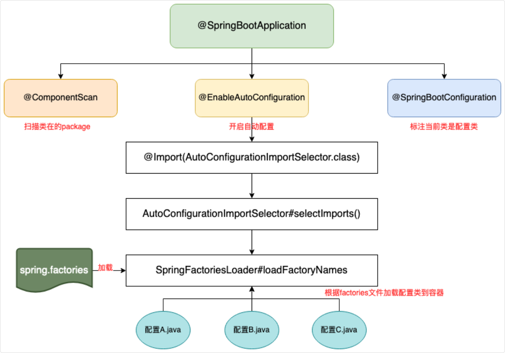

## Spring基础

### Autowired注解

#### 原理

`@Autowired` 是 Spring 实现依赖注入的核心注解，其实现原理基于反射机制和 BeanPostProcessor 接口

整个过程分为两个主要阶段

第一个阶段是**依赖收集**阶段，发生在 Bean 实例化之后、属性赋值之前

`Autowired` 的 `Processor` 会扫描 Bean 的所有字段、方法和构造方法，找出标注了 `@Autowired` 注解的地方，然后把这些信息封装成 `Injection` 元数据对象缓存起来

这个过程用到了大量的反射操作，需要分析类的结构、注解信息等等

第二个阶段是**依赖注入**阶段，Spring 会取出之前缓存的 Injection 元数据对象，然后逐个处理每个注入点

对于每个 `@Autowired` 标注的字段或方法，Spring 会**根据类型**去容器中查找匹配的 Bean

在具体的注入过程中，Spring 会使用反射来设置字段的值或者调用 setter 方法。比如对于字段注入，会调用 Field.set() 方法；对于 setter 注入，会调用 Method.invoke() 方法。

#### IDEA不推荐使用@Autowired注解原因

第一个是字段注入不利于单元测试。字段注入需要使用反射或 Spring 容器才能注入依赖，测试更复杂；而构造方法注入可以直接通过构造方法传入 Mock 对象，测试起来更简单

```java
// 字段注入的测试困难
@Test
public void testUserService() {
  UserService userService = new UserService();
  // 无法直接设置userRepository，需要反射或Spring容器
  // userService.userRepository = Mockito.mock(UserRepository.class);
  // 需要手动设置依赖，测试不方便
  ReflectionTestUtils.setField(userService, "userRepository", Mockito.mock(UserRepository.class));
  userService.doSomething();
  // ...
}

// 构造方法注入的测试简单
@Test
public void testUserService() {
  UserRepository mockRepository = Mockito.mock(UserRepository.class);
  UserService userService = new UserService(mockRepository); // 直接注入
}
```

第二个是字段注入会隐藏循环依赖问题，而构造方法注入会在项目启动时就去检查依赖关系，能更早发现问题。

第三个是构造方法注入可以使用 final 字段确保依赖在对象创建时就被初始化，避免了后续修改的风险。

### 自动装配

自动装配的本质就是让 Spring 容器自动帮我们完成 Bean 之间的依赖关系注入，而不需要我们手动去指定每个依赖

简单来说，就是“我们不用告诉 Spring 具体怎么注入，Spring 自己会想办法找到合适的 Bean 注入进来”。

自动装配的工作原理简单来说就是，Spring 容器在启动时自动扫描 `@ComponentScan` 指定包路径下的所有类

然后根据类上的注解，比如 `@Autowired、@Resource` 等，来判断哪些 Bean 需要被自动装配

之后分析每个 Bean 的依赖关系，在创建 Bean 的时候，根据装配规则自动找到合适的依赖 Bean，最后根据反射将这些依赖注入到目标 Bean 中

#### `@ComponentScan`

@ComponentScan 只是告诉 Spring 去哪里找，但只有带特定注解的类才会被注册为 Bean

```
阶段1：扫描 + 注册 Bean 定义
────────────────────────────
@ComponentScan 扫描 → 发现有 @Component 等注解 → 注册 Bean 定义


阶段2：创建实例 + 自动装配
────────────────────────────
创建 Bean 实例 → 发现 @Autowired → 找到依赖 Bean → 注入
```

##### 注册条件

```
@Component      // 通用组件
@Service        // 服务层
@Repository     // 数据访问层
@Controller     // 控制器层
@Configuration  // 配置类（内部的 @Bean 方法也会注册）
```

##### Spring Boot（通常不需要写）

`@SpringBootApplication` 已经内置了 `@ComponentScan`，默认扫描启动类所在包及其子包

```java
@SpringBootApplication  // 内含 @ComponentScan
public class Application {
  public static void main(String[] args) {
    SpringApplication.run(Application.class, args);
  }
}
```

```
com.example
├── Application.java      ← 启动类
├── controller/           ← 自动扫描到
├── service/              ← 自动扫描到
└── dao/                  ← 自动扫描到
```

> 想自定义扫描范围

```java
@SpringBootApplication
@ComponentScan(basePackages = {"com.example", "com.other"})  // 自定义
public class Application {}
```

##### 传统 Spring 项目（必须写）

没有 @ComponentScan，Spring 不会扫描注解，Bean 只能通过其他方式注册：

```java
// 方式一：XML 配置
<bean id="userService" class="com.example.UserService"/>

// 方式二：@Bean 方法
@Configuration
public class AppConfig {
  @Bean
  public UserService userService() {
    return new UserService();
  }
}

// 方式三：@Import
@Import(UserService.class)
```

#### 自动装配类型

Spring 的自动装配方式有好几种，在 XML 配置时代，主要有 byName、byType、constructor 和 autodetect 四种方式

到了注解驱动时代，用得最多的是 `@Autowired` 注解，默认按照类型装配

```java
@Service
public class UserService {
  @Autowired  // 按类型自动装配
  private UserRepository userRepository;
}
```

其次还有 `@Resource` 注解，它默认按照名称装配，如果找不到对应名称的 Bean，就会按类型装配

Spring Boot 的自动装配还有一套更高级的机制，通过 `@EnableAutoConfiguration` 和各种 `@Conditional` 注解来实现，这个是框架级别的自动装配，会根据 classpath 中的类和配置来自动配置 Bean


