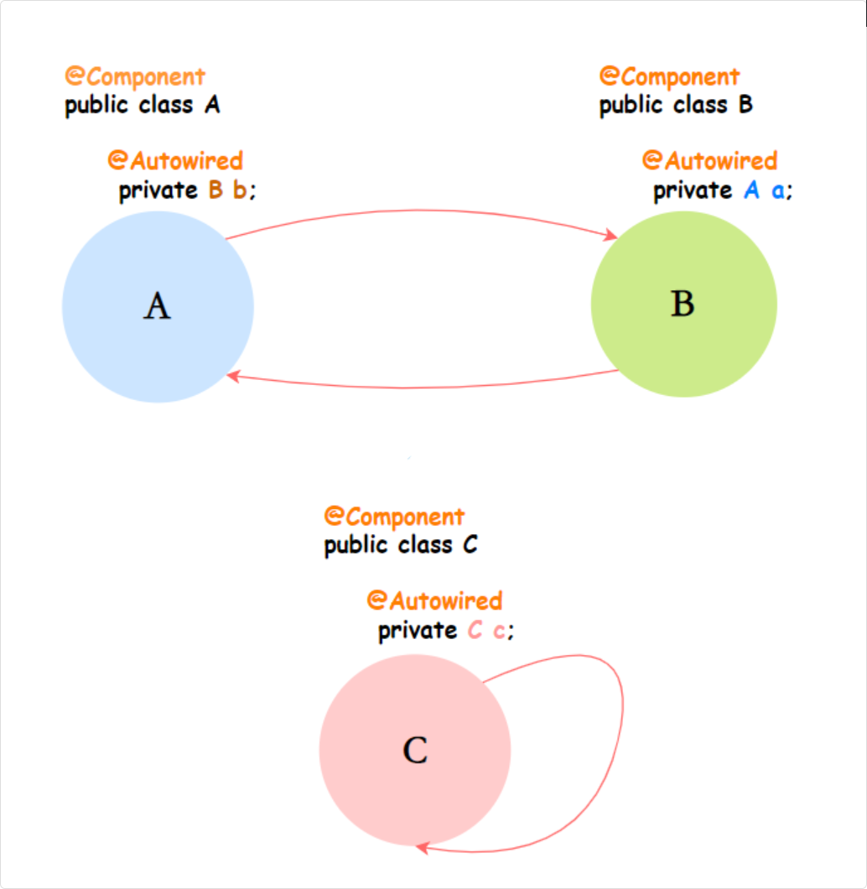
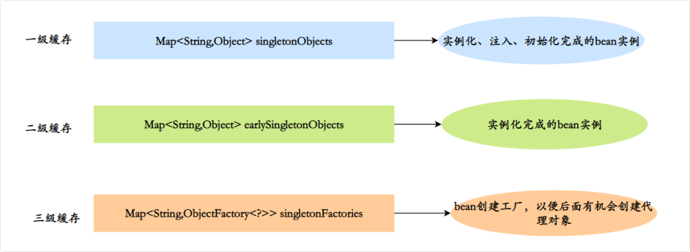
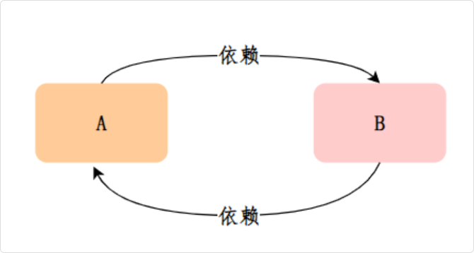

## Spring基础

### 设计模式

Spring 框架里面确实用了很多设计模式

工厂模式 (管理 Bean)、单例模式 (IOC)、代理模式 (AOP)

模版模式、观察者模式

涉及：

- 工厂模式
  - BeanFactory 就是一个典型的工厂，它负责创建和管理所有的 Bean 对象
  - 我们平时用的 ApplicationContext 其实也是 BeanFactory 的一个实现
  - 当我们通过 @Autowired 获取一个 Bean 的时候，底层就是通过工厂模式来创建和获取对象的。
- 单例模式
  - 单例模式也是 Spring 的默认行为。默认情况下，Spring 容器中的 Bean 都是单例的，整个应用中只会有一个实例
  - 这样可以节省内存，提高性能。当然我们也可以通过 @Scope 注解来改变 Bean 的作用域，比如设置为 prototype 就是每次获取都创建新实例。
- 代理模式
  - 代理模式在 AOP 中用得特别多。Spring AOP 的底层实现就是基于动态代理的，对于实现了接口的类用 JDK 动态代理，没有实现接口的类用 CGLIB 代理。比如我们用 @Transactional 注解的时候，Spring 会为我们的类创建一个代理对象，在方法执行前后添加事务处理逻辑。
- 模版模式
  - 模板方法模式在 Spring 里也很常见，比如 JdbcTemplate。它定义了数据库操作的基本流程：获取连接、执行 SQL、处理结果、关闭连接，但是具体的 SQL 语句和结果处理逻辑由我们来实现。
- 观察者模式
  - 观察者模式在 Spring 的事件机制中有所体现。我们可以通过 ApplicationEvent 和 ApplicationListener 来实现事件的发布和监听。比如用户注册成功后，我们可以发布一个用户注册事件，然后有多个监听器来处理后续的业务逻辑，比如发送邮件、记录日志等。
- 适配器模式
- 策略模式

#### Spring 如何实现单例模式

传统的单例模式是在类的内部控制只能创建一个实例，比如用 private 构造方法加 static getInstance() 这种方式

但是 Spring 的单例是**容器级别**的，同一个 Bean 在整个 Spring 容器中只会有一个实例。

具体的实现机制是这样的：

Spring 在启动的时候会把所有的 Bean 定义信息加载进来，然后在 `DefaultSingletonBeanRegistry` 这个类里面维护了一个叫 `singletonObjects` 的 `ConcurrentHashMap`，这个 Map 就是用来存储单例 Bean 的

key 是 Bean 的名称，value 就是 Bean 的实例对象。

当我们第一次获取某个 Bean 的时候，Spring 会先检查 singletonObjects 这个 Map 里面有没有这个 Bean，如果没有就会创建一个新的实例，然后放到 Map 里面。后面再获取同一个 Bean 的时候，直接从 Map 里面取就行了，这样就保证了单例。

还有一个细节就是 Spring 为了解决循环依赖的问题，还用了三级缓存。除了 singletonObjects 这个一级缓存，还有 earlySingletonObjects 二级缓存和 singletonFactories 三级缓存

这样即使有循环依赖，Spring 也能正确处理。

### 循环依赖问题

简单来说就是两个或多个 Bean 相互依赖，比如说 A 依赖 B，B 依赖 A，或者 C 依赖 C，就成了循环依赖



#### Spring 解决方案

Spring 通过三级缓存机制来解决循环依赖：

- 一级缓存：存放完全初始化好的单例 Bean
- 二级缓存：存放提前暴露的 Bean，实例化完成，但未初始化完成
- 三级缓存：存放 Bean 工厂，用于生成提前暴露的 Bean



##### 例子



第 1 步：开始创建 Bean A

- Spring 调用 A 的构造方法，创建 A 的实例。此时 A 对象已存在，但 b属性还是 null。
- 将 A 的对象工厂放入三级缓存。
- 开始进行 A 的属性注入。

第 2 步：A 需要注入 B，开始创建 Bean B

- 发现需要 B，但 B 还不存在，所以开始创建 B。
- 调用 B 的构造方法，创建 B 的实例。此时 B 对象已存在，但 a 属性还是 null。
- 将 B 的对象工厂放入三级缓存。
- 开始进行 B 的属性注入

第 3 步：B 需要注入 A，从缓存中获取 A。

- B 需要注入 A，先从一级缓存找 A，没找到。
- 再从二级缓存找 A，也没找到。
- 最后从三级缓存找 A，找到了 A 的对象工厂。
- 调用 A 的对象工厂得到 A 的实例。这时 A 已经实例化了，虽然还没完全初始化。
- 将 A 从三级缓存移到二级缓存。
- B 拿到 A 的引用，完成属性注入。

第 4 步：B 完成初始化。

- B 的属性注入完成，执行 @PostConstruct 等初始化逻辑。
- B 完全创建完成，从三级缓存移除，放入一级缓存。

第 5 步：A 完成初始化。

- 回到 A 的创建过程，A 拿到完整的 B 实例，完成属性注入。
- A 执行初始化逻辑，创建完成。
- A 从二级缓存移除，放入一级缓存。

用代码来模拟这个过程，是这样的：

```java
// 模拟Spring的解决过程
public class CircularDependencyDemo {
  // 三级缓存
  Map<String, Object> singletonObjects = new HashMap<>();
  Map<String, Object> earlySingletonObjects = new HashMap<>();
  Map<String, ObjectFactory> singletonFactories = new HashMap<>();
  
  public Object getBean(String beanName) {
    // 先从一级缓存获取
    Object bean = singletonObjects.get(beanName);
    if (bean != null) return bean;
    
    // 再从二级缓存获取
    bean = earlySingletonObjects.get(beanName);
    if (bean != null) return bean;
    
    // 最后从三级缓存获取
    ObjectFactory factory = singletonFactories.get(beanName);
    if (factory != null) {
      bean = factory.getObject();
      earlySingletonObjects.put(beanName, bean);  // 移到二级缓存
      singletonFactories.remove(beanName);        // 从三级缓存移除
    }
    
    return bean;
  }
}
```

##### 哪些情况下Spring无法解决循环依赖

第一种，构造方法的循环依赖，这种情况 Spring 会直接抛出 BeanCurrentlyInCreationException 异常

```java
@Component
public class A {
  private B b;
  
  public A(B b) {  // 构造方法注入
    this.b = b;
  }
}

@Component
public class B {
  private A a;
  
  public B(A a) {  // 构造方法注入
    this.a = a;
  }
}
```

因为构造方法注入发生在实例化阶段，创建 A 的时候必须先有 B，但创建 B又必须先有 A，这时候两个对象都还没创建出来，无法提前暴露到缓存中

第二种，prototype 作用域的循环依赖。prototype 作用域的 Bean 每次获取都会创建新实例，Spring 无法缓存这些实例，所以也无法解决循环依赖

#### 为什么需要三级缓存而不是两级 (*****)

Spring 三级缓存是为了解决循环依赖中 AOP 代理不一致的问题

> 三级缓存（singletonFactories）里面存放的，实际上是一个叫 ObjectFactory 的泛型接口对象

如果只有二级缓存：暴露的是原始对象，但其他 Bean 注入时可能需要代理对象，导致注入的是原始对象，破坏了代理语义

三级缓存存的是 ObjectFactory (本身就是一段 lamda 表达式)，在 getEarlyBeanReference() 中判断：

- 如果需要代理 → 提前创建代理对象，放入二级缓存并返回
- 如果不需要代理 → 直接返回原始对象

这样保证循环依赖中注入的都是"正确的对象"

##### ObjectFactory

在 Spring 的源码里，ObjectFactory 是一个非常简单的函数式接口，里面只有一个方法

```java
@FunctionalInterface
public interface ObjectFactory<T> {
  T getObject() throws BeansException;
}
```

通俗地理解，它就是一个“获取对象的钩子（回调函数）”。它本身不是对象，而是一段“教你怎么拿到对象”的代码逻辑

在 JDK 8 以后，它在源码里通常表现为一个 Lambda 表达式

##### 原因

要理解第三级缓存的精妙之处，我们必须结合 循环依赖 和 AOP（动态代理） 来看

假设有两个单例 Bean：ServiceA 和 ServiceB，它们互相 `@Autowired` 依赖了对方。

并且，ServiceA 上加了 `@Transactional` 注解（意味着最终放入容器的 ServiceA 必须是一个 AOP 代理对象，而不是原始对象）

如果没有第三级缓存，只有一、二级缓存，流程会是这样惨烈的状况：

1. **A 实例化**：Spring `new` 出了 A 的原始对象（半成品）。
2. **A 属性注入**：发现需要 B，于是去创建 B。
3. **B 实例化**：Spring `new` 出了 B 的原始对象（半成品）。
4. **B 属性注入**：发现需要 A。此时 B 去缓存里找 A。
5. **致命缺陷出现**：如果缓存里直接放的是 A 的半成品原始对象，B 就会把这个**原始 A** 注入到自己的属性里。但等 B 创建完，A 继续走生命周期，在最后一步（初始化后置处理）时，A 发现自己有事务注解，于是生成了一个 **A 的代理对象**。
6. **最终结果**：Spring 容器里最终保存的是 A 的代理对象，**但是 B 肚子里装的却是 A 的原始对象！** 两者不一致，事务全盘失效。

##### 作用

Spring 引入了存放 ObjectFactory 的第三级缓存。真实的源码流程是这样的：

- **A 实例化**：`new` 出 A 的原始对象（半成品）。
- **放入三级缓存**：此时，Spring 并不直接把半成品的 A 放入缓存，而是**构造了一个 Lambda 表达式（ObjectFactory），把它塞进了三级缓存**。
  - 这段 Lambda 的核心逻辑是：`() -> getEarlyBeanReference(beanName, mbd, bean)`。
  - *翻译成人话就是：“如果有人现在就要引用我，请执行这段逻辑来决定给他什么对象。”*
- **A 属性注入**：发现需要 B，去创建 B。
- **B 实例化与注入**：B 实例化后发现需要 A，于是去缓存找。一二级缓存没有，但在第三级缓存找到了 A 留下的那个 `ObjectFactory`（Lambda 表达式）。
- **调用钩子（见证奇迹的时刻）**：B 调用了 `ObjectFactory.getObject()`。此时触发了那段 Lambda 表达式的代码
  - 这段代码（`SmartInstantiationAwareBeanPostProcessor`）会进行判断：
    - 发现 A 需要被 AOP 增强！
    - 于是，**Spring 在这个时候（提前）为 A 创建了 AOP 代理对象**。
    - 把这个代理对象返回给了 B。
- **缓存升级**：为了防止后面还有 C、D 也来要 A 的引用，Spring 会把刚才生成的 A 的代理对象放入**第二级缓存**（`earlySingletonObjects`），并把 A 从**第三级缓存**中删掉。
- **B 顺利完工**：B 把 A 的代理对象注入到自己肚子里，完成创建，返回给 A。
- **A 顺利完工**：A 拿到 B，完成自己的属性注入。走到生命周期最后一步时，A 发现自己已经被提前代理过了，就不再重复代理，直接把代理对象放入**第一级缓存**（`singletonObjects`）

##### 总结

- **第三级缓存里放的“工厂”**：其实是一段 Lambda 回调逻辑（`ObjectFactory`），它手里攥着半成品的目标对象。
- **它的终极使命**：处理 AOP 代理的“提前暴露”问题。如果发生循环依赖，并且目标对象需要被代理，这个“工厂”就会在被调用时，临时把原始对象加工成代理对象返回出去，保证全局注入的都是同一个代理对象。如果没有循环依赖，这个第三级缓存里的工厂就永远不会被调用，默默地等待 Bean 创建完成后被清理掉。

#### 缺少二级缓存会怎么样

二级缓存 earlySingletonObjects 主要是用来存放那些已经通过三级缓存的对象工厂创建出来的早期 Bean 引用

假设我们有 A、B、C 三个 Bean，A 依赖 B 和 C，B 和 C 都依赖 A，形成了一个复杂的循环依赖。

在没有二级缓存的情况下，每次 B 或者 C 需要获取 A 的时候，都需要调用三级缓存中 A 的 `ObjectFactory.getObject()` 方法

这意味着如果 A 需要被代理的话，代理对象可能会被重复创建多次，这显然是不合理的。

举个具体的例子

比如 A 有 `@Transactional` 注解需要被 AOP 代理，B 在初始化的时候需要 A，会调用一次对象工厂创建 A 的代理对象

接着 C 在初始化的时候也需要 A，又会调用一次对象工厂，可能又创建了一个 A 的代理对象

这样 B 和 C 拿到的可能就是两个不同的 A 代理对象，这就违反了单例 Bean 的语义。

> 二级缓存就是为了解决这个问题。当第一次通过对象工厂创建了 A 的早期引用之后，就把这个引用放到二级缓存中，同时从三级缓存中移除对象工厂
>
> 后续如果再有其他 Bean 需要 A，就直接从二级缓存中获取，不需要再调用对象工厂了

#### 源码

当 B 在做属性注入，发现自己需要 A，去向 Spring 要 A 的时候，流程会走到 `DefaultSingletonBeanRegistry.java` 的 `getSingleton()` 方法：

```java
protected Object getSingleton(String beanName, boolean allowEarlyReference) {
  // 【第一道防线：成品区】
  // 尝试从第一级缓存（singletonObjects）中获取完整的成品 Bean。
  Object singletonObject = this.singletonObjects.get(beanName);

  // 如果一级缓存没有拿到，并且这个 Bean 当前正处于“正在创建中”的状态。
  // （注：判断“正在创建中”非常关键！这是循环依赖发生的唯一前提，比如 A 创建时触发了 B，B 又回头来找 A）
  if (singletonObject == null && this.isSingletonCurrentlyInCreation(beanName)) {
    // 【第二道防线：半成品区（无锁快查）】
    // 尝试从第二级缓存（earlySingletonObjects）中获取提前暴露的“半成品”或“代理对象”。
    // 这里没有加锁，是为了在绝大多数情况下追求极致的读取性能。
    singletonObject = this.earlySingletonObjects.get(beanName);
    // 如果二级缓存也没拿到，并且当前允许进行提前引用（通常都是 true）
    if (singletonObject == null && allowEarlyReference) {
        // 【进入加锁警戒区】
        // 接下来要动用三级缓存并修改 Map 结构了，为了防止多线程环境下的数据错乱，必须加全局锁。
        synchronized(this.singletonObjects) {
          // === DCL 双重检查锁（Double-Check Locking）开始 ===
          // 第 1 次复查：再查一次一级缓存。
          // （防范场景：当前线程在门外等锁的这短暂瞬间，可能别的线程已经彻底走完生命周期，把成品 Bean 放进一级缓存了）
          singletonObject = this.singletonObjects.get(beanName);
          if (singletonObject == null) {
              // 第 2 次复查：再查一次二级缓存。
              // （防范场景：刚才在门外等锁时，可能别的线程已经抢先触发了下面的三级缓存逻辑，把半成品提拔到二级缓存了）
              singletonObject = this.earlySingletonObjects.get(beanName);
              if (singletonObject == null) {
                // 【最终防线：图纸与工厂区】
                // 如果前两级缓存确实都没有，去第三级缓存（singletonFactories）里找那个 Lambda 表达式工厂。
                ObjectFactory<?> singletonFactory = (ObjectFactory)this.singletonFactories.get(beanName);
                
                if (singletonFactory != null) {
                  // 核心动作爆发：调用 getObject()，真正执行那段 Lambda 表达式！
                  // （如果在 AOP 环境下，就是在这里提前动态生成了代理对象）
                  singletonObject = singletonFactory.getObject();
                  
                  // 【缓存升级操作】
                  // 1. 把刚生成的对象放进第二级缓存。
                  // （意义重大：如果一会儿还有 C、D 也要依赖 A，它们在门外查第二级缓存就能直接拿到了，绝不能让 Lambda 被重复执行，保证单例唯一）
                  this.earlySingletonObjects.put(beanName, singletonObject);
                  
                  // 2. 过河拆桥：从第三级缓存中删掉这个工厂。
                  // （它已经生产出对象并放进二级缓存了，完成了历史使命，用完即焚）
                  this.singletonFactories.remove(beanName);
                }
              }
          }
          // === DCL 双重检查锁结束 ===
        }
    }
  }

  // 凯旋而归：返回最终找到的（或刚刚提前生成的）对象
  return singletonObject;
}
```
