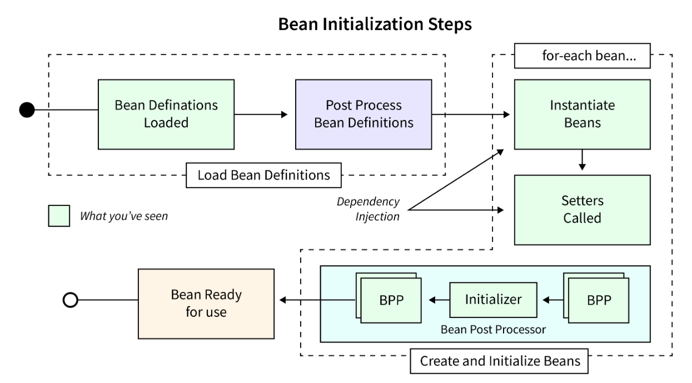
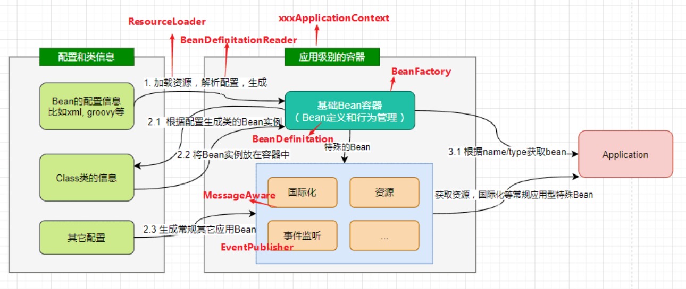
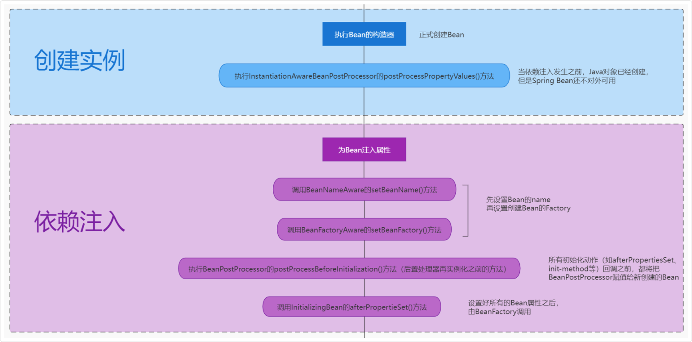

## IOC

### 介绍

IoC 的全称是 Inversion of Control，也就是控制反转

以前我们写代码的时候，如果 A 类需要用到 B 类，我们就在 A 类里面直接 new 一个 B 对象出来，这样 A 类就控制了 B 类对象的创建

有了 IoC 之后，这个控制权就“反转”了，不再由 A 类来控制 B 对象的创建，而是交给外部的容器来管理

> IoC 降低了对象之间的耦合度，让每个对象只关注自己的业务实现，不关心其他对象是怎么创建的

```java
@Service
public class UserServiceImpl implements UserService {
  @Autowired
  private UserDao userDao;
  
  // 不需要主动创建 UserDao，由 Spring 容器注入
  public BaseUserInfoDTO getAndUpdateUserIpInfoBySessionId(String session, String clientIp) {
    // 直接使用注入的 userDao
    return userDao.getBySessionId(session);
  }
}
```

### DI 与 IOC 区别

IoC 的思想是把对象创建和依赖关系的控制权由业务代码转移给 Spring 容器。这是一个比较抽象的概念，告诉我们应该怎么去设计系统架构

而 DI，也就是依赖注入，它是实现 IoC 这种思想的具体技术手段

> IOC 是思想，DI 是实现这个思想的手段

在 Spring 里，我们用 @Autowired 注解就是在使用 DI 的字段注入方式

```java
@Service
public class ArticleReadServiceImpl implements ArticleReadService {
  @Autowired
  private ArticleDao articleDao;  // 字段注入
  
  @Autowired
  private UserDao userDao;
}
```

从实现角度来看，DI 除了字段注入，还有构造方法注入和 Setter 方法注入等方式

```plain
IoC（控制反转）
├── DI（依赖注入）          ← 主要实现方式
│   ├── 构造器注入
│   ├── 字段注入
│   └── Setter注入
├── 服务定位器模式
├── 工厂模式
└── 其他实现方式
```

### 实现机制

第一步是加载 Bean 的定义信息

Spring 会扫描我们配置的包路径，找到所有标注了 @Component、@Service、@Repository 这些注解的类，然后把这些类的元信息封装成 BeanDefinition 对象

```java
// Bean定义信息
public class BeanDefinition {
  private String beanClassName;     // 类名
  private String scope;            // 作用域
  private boolean lazyInit;        // 是否懒加载
  private String[] dependsOn;      // 依赖的Bean
  private ConstructorArgumentValues constructorArgumentValues; // 构造参数
  private MutablePropertyValues propertyValues; // 属性值
}
```

第二步是 Bean 工厂的准备

Spring 会创建一个 `DefaultListableBeanFactory` 作为 Bean 工厂来负责 Bean 的创建和管理

第三步是 Bean 的实例化和初始化

这个过程比较复杂，Spring 会根据 BeanDefinition 来创建 Bean 实例



对于单例 Bean，Spring 会先检查缓存中是否已经存在，如果不存在就创建新实例。

创建实例的时候会通过反射调用构造方法，然后进行属性注入，最后执行初始化回调方法

```java
// 简化的Bean创建流程
public class AbstractBeanFactory {
  protected Object createBean(String beanName, BeanDefinition bd) {
    // 1. 实例化前处理
    Object bean = resolveBeforeInstantiation(beanName, bd);
    if (bean != null) {
      return bean;
    }
    // 2. 实际创建Bean
    return doCreateBean(beanName, bd);
  }
  
  protected Object doCreateBean(String beanName, BeanDefinition bd) {
    // 2.1 实例化
    Object bean = createBeanInstance(beanName, bd);
    // 2.2 属性填充（依赖注入）
    populateBean(beanName, bd, bean);
    // 2.3 初始化
    Object exposedObject = initializeBean(beanName, bean, bd);
    return exposedObject;
  }
}
```

#### 依赖注入实现

核心：反射 + BeanPostProcessor

依赖注入的实现主要是通过反射来完成的

比如我们用 @Autowired 标注了一个字段，Spring 在创建 Bean 的时候会扫描这个字段，然后从容器中找到对应类型的 Bean，通过反射的方式设置到这个字段上

> `@Autowired`

`AutowiredAnnotationBeanPostProcessor` 在 Bean 实例化之前就会扫描类结构，把所有打了 `@Autowired / @Value` 的字段和方法包装成 `InjectionMetadata`，并缓存起来

```plain
1. 拿到字段类型（如 UserDao）
       ↓
2. 调用 beanFactory.resolveDependency()
       ↓
3. 在容器里按类型匹配候选 Bean
   ├── 只有一个 → 直接用
   ├── 多个 → 看 @Primary / @Qualifier / 字段名 来决定
   └── 没有 → required=true 就抛异常
       ↓
4. field.setAccessible(true)
   field.set(bean, 找到的依赖对象)   ← 反射注入
```

`@Resource` 由 `CommonAnnotationBeanPostProcessor` 处理，优先按名称查找，找不到再按类型，而 `@Autowired` 是优先按类型

### 什么是 Spring IOC

IoC 本质上一个超级工厂，这个工厂的产品就是各种 Bean 对象

通过 `@Component`、`@Service` 这些注解告诉工厂：“我要生产什么样的产品，这个产品有什么特性，需要什么原材料”

然后工厂里各种生产线，在 Spring 中就是各种 BeanPostProcessor

比如 `AutowiredAnnotationBeanPostProcessor` 专门负责处理 `@Autowired` 注解。

工厂里还有各种缓存机制用来存放产品，比如说 `singletonObjects` 是成品仓库，存放完工的单例 Bean；`earlySingletonObjects` 是半成品仓库，用来解决循环依赖问题

最有意思的是，这个工厂还很智能，它知道产品之间的依赖关系。它会根据依赖关系来决定 Bean 的创建顺序。如果发现循环依赖，它还会用三级缓存机制来巧妙地解决

### 项目启动时Spring的IoC会做什么

#### 第一件事是扫描和注册 Bean

IoC 容器会根据我们的配置，比如 `@ComponentScan` 指定的包路径，去扫描所有标注了 `@Component、@Service、@Controller` 这些注解的类

然后把这些类的元信息包装成 `BeanDefinition` 对象，注册到容器的 `BeanDefinitionRegistry` 中

这个阶段只是收集信息，还没有真正创建对象



#### 第二件事是 Bean 的实例化和注入

这是最核心的过程，IoC 容器会按照依赖关系的顺序开始创建 Bean 实例

对于单例 Bean，容器会通过反射调用构造方法创建实例，然后进行属性注入，最后执行初始化回调方法

> 有了 BeanDefinition，通过反射创建实例，再填充属性（依赖注入），最后执行初始化回调，才得到一个完整可用的 Bean



在依赖注入时，容器会根据 `@Autowired、@Resource` 这些注解，把相应的依赖对象注入到目标 Bean 中

### Bean 实例化方式

Spring 提供了 4 种方式来实例化 Bean，以满足不同场景下的需求

#### 构造方法实例化

这是最常用的方式。当我们用 `@Component、@Service` 这些注解**标注类**的时候，Spring 默认通过**无参构造器**来创建实例的

如果类**只有一个有参构造方法**，Spring 会自动进行构造方法注入

#### 静态工厂方法实例化 (xxConfig)

有时候对象的创建比较复杂，我们会写一个静态工厂方法来创建，然后用 @Bean 注解来标注这个方法

Spring 会调用这个静态方法来获取 Bean 实例

```java
@Configuration
public class AppConfig {
  @Bean
  public static DataSource createDataSource() {
    // 复杂的DataSource创建逻辑
    return new HikariDataSource();
  }
}
```

#### 实例工厂方法实例化

这种方式是先创建工厂对象，然后通过工厂对象的方法来创建Bean

```java
@Configuration
public class AppConfig {
  @Bean
  public ConnectionFactory connectionFactory() {
    return new ConnectionFactory();
  }
  
  @Bean
  public Connection createConnection(ConnectionFactory factory) {
    return factory.createConnection();
  }
}
```

#### FactoryBean 接口实例化

这是 Spring 提供的一个特殊接口，当我们需要创建复杂对象的时候特别有用

```java
@Component
public class MyFactoryBean implements FactoryBean<MyObject> {
  @Override
  public MyObject getObject() throws Exception {
    // 复杂的对象创建逻辑
    return new MyObject();
  }
  
  @Override
  public Class<?> getObjectType() {
    return MyObject.class;
  }
}
```

在实际工作中，用得最多的还是构造方法实例化，因为简单直接。工厂方法一般用在需要复杂初始化逻辑的场景，比如数据库连接池、消息队列连接这些

FactoryBean 主要是在框架开发或者需要动态创建对象的时候使用。
